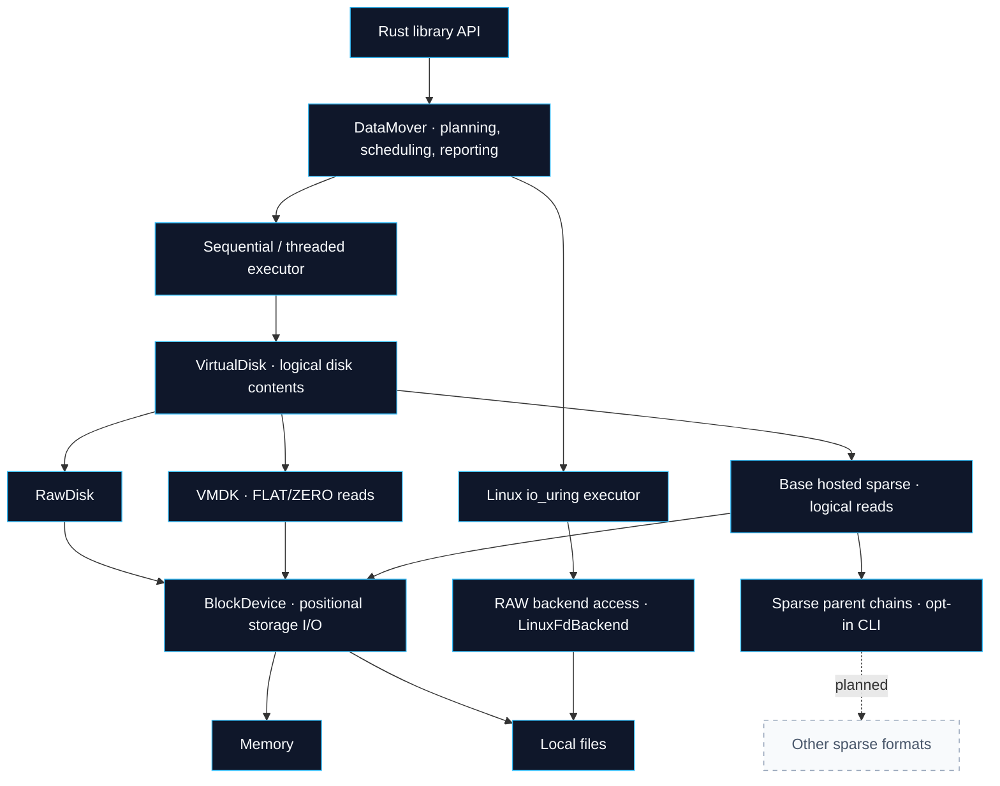

<div align="center">

# rvvdk

### Virtual disk access and data movement in Rust

A foundation for disk inspection, copying, and migration.<br>
Built toward independent VMware support, with reusable storage and format abstractions.


[](LICENSE)

[Get started](#get-started) · [Architecture](#architecture) · [Roadmap](docs/roadmap.md) · [Benchmarks](docs/benchmarks.md)

</div>

---

## The idea

Virtual disk tools need to understand both **what a disk means** and **how its
bytes are stored**. rvvdk separates logical disks, disk formats, backing storage,
and execution so each can evolve independently.

The current workspace provides a local RAW and read-only FLAT/ZERO, hosted sparse and sparse-parent VMDK copy engine,
with sparse source extent discovery, bounded concurrency, reusable aligned buffers, and Linux
io_uring execution. The longer-term goal is an independent Rust toolkit for
VMware disk access and migration, extensible to other platforms.

> [!IMPORTANT]
> **Active development.** The project exposes Rust libraries and a local disk CLI.
> A [bounded VMDK descriptor parser](docs/vmdk-descriptor.md) is available.
> [FLAT/ZERO](docs/vmdk-logical.md) and [base hosted sparse](docs/vmdk-sparse-disk.md)
> VMDK disks are readable through Rust APIs and [all four CLI commands](docs/cli-vmdk.md), with RAW output and
> [bounded terminal-padding support](docs/vmdk-padding.md). Hosted sparse parents are
> available through [explicit CLI opt-in](docs/cli-vmdk-parents.md).
> VMware remote access, CBT, and durable resume are planned.
> The [roadmap](docs/roadmap.md) tracks completed fixes and remaining work;
> the [dated review](docs/project-review-2026-09-28.md) records the starting assessment.

## At a glance

| Capability | Current state |
|:---|:---|
| **CLI** | [`rvddk inspect`/`plan`](docs/cli.md) and [copy/verify](docs/cli-transfer.md), human/JSON reports, private no-clobber publication, [progress/cancellation](docs/cli-progress.md) |
| **Logical disk model** | `BlockDevice`, `VirtualDisk`, checked ranges, geometry, and capabilities |
| **RAW disk access** | Memory devices and local regular files |
| **Sparse source discovery** | Linux Data/Hole extents with [safe dense fallback](docs/local-sparse-discovery.md) when discovery is unavailable |
| **Copy execution** | Sequential and bounded threaded execution; Linux io_uring path |
| **Memory management** | Aligned allocations and reusable buffer pools |
| **Concurrent file aliases** | [Cooperative admission](docs/local-file-concurrency.md) across local and native requests, including hard links and buffered fallbacks |
| **Direct I/O** | Local `O_DIRECT`, runtime alignment discovery, buffered fallback for unaligned backend requests |
| **Copy planning** | Portable plans with selection reasons, fresh execution preparation, and explicit Linux RAW adapters |
| **Copy preflight** | Access, flush support, live capacity, alias and native binding checks; shared fresh local FD inspections |
| **Progress reporting** | Intermediate updates on the single-worker threaded path |
| **Copy failures** | Operation/range/cause context and confirmed partial counters; [contract](docs/copy-errors.md) |
| **Sparse destination output** | Linux zeroing and hole punching with safe bounded fallback; [contract and allocation evidence](docs/local-sparse-output.md) |
| **Copy memory budget** | Configurable 256 MiB default for buffers, queue entries, and extent metadata; [scope and limits](docs/copy-memory.md) |
| **VMDK descriptors** | [Hosted base FLAT/ZERO metadata](docs/vmdk-descriptor.md), bounded parsing, [confined backing resolution](docs/vmdk-backing.md) and [logical reads](docs/vmdk-logical.md) |
| **Hosted sparse reads** | [Read-only base monolithic/split sparse](docs/vmdk-sparse-disk.md), bounded metadata and [CLI inspect/plan/copy/verify](docs/cli-vmdk.md) |
| **Parent chains** | [Read-only sparse parent fallback](docs/vmdk-chain-disk.md) with bounded metadata, whole-chain alias checks and [opt-in CLI support](docs/cli-vmdk-parents.md) |
| **Admission fuzzing** | [Four bounded libFuzzer targets](fuzz/README.md), authored seeds, sanitizer campaigns and retained corpora |
| **VMware access** | [Independent Rust authentication and inventory](crates/rvvdk-vsphere/README.md) qualified on ESXi 8.0.3; powered-off disk export and independent known-byte verification demonstrated; no VMware SDK/VDDK dependency |

The [endpoint contract](docs/architecture.md#copy-endpoint-preflight-r05) describes
preflight guarantees and custom-backend requirements. DataMover native request
compatibility and whole-plan Auto fallback are
[checked before execution](docs/native-request-compatibility.md). Native resources
are [prepared once per copy](docs/native-runtime-preparation.md), with observable
Auto fallback when ring setup is unavailable. Its direct-FD path
does not inherit the local backend's buffered fallback for unaligned requests.
See the [review findings](docs/project-review-2026-09-28.md#findings-requiring-action).

## Get started

Use Linux and a current stable Rust toolchain. The repository's
[`rust-toolchain.toml`](rust-toolchain.toml) selects stable with Rustfmt and Clippy.
Some tests require io_uring and filesystem support for sparse/direct I/O.

```bash
git clone https://github.com/arencloud/rvvdk.git
cd rvvdk
cargo build --workspace
cargo test --workspace
```

No ESXi host is needed for local development or these tests.

### Copy a disk in memory

This example uses the `rvvdk-core` and `rvvdk-datamover` workspace crates:

```rust
use rvvdk_core::{MemoryBlockDevice, RawDisk, Result, VirtualDisk};
use rvvdk_datamover::{CopyOptions, DataMover};

fn main() -> Result<()> {
    let source = RawDisk::new(MemoryBlockDevice::new(1024 * 1024)?);
    let destination = RawDisk::new(MemoryBlockDevice::new(1024 * 1024)?);

    source.write_all_at(0, b"hello, virtual disk")?;

    let mover = DataMover::new(CopyOptions::default());
    let plan = mover.plan_with_destination(&source, &destination)?;
    let report = mover.execute_plan(&plan, &source, &destination)?;

    let mut contents = [0_u8; 19];
    destination.read_exact_at(0, &mut contents)?;
    assert_eq!(&contents, b"hello, virtual disk");

    println!("Copied {} bytes", report.stats().bytes_written());
    Ok(())
}
```

For file-backed disks, wrap a `LocalFileBlockDevice` in `RawDisk`.
The destination must already exist and be at least as large as the source.
See the [local copy example in the integration tests](crates/rvvdk-datamover/tests/local_copy.rs).

The same planning and execution methods accept `&dyn VirtualDisk`, including
translated formats. Portable calls use logical disk methods: `Auto` selects
threaded execution, and explicit `IoUring` is rejected. For Linux RAW native
selection, use `plan_raw_with_destination`, `execute_raw_plan`,
`execute_raw_plan_with_observer`, or `copy_raw_with_report`. See the
[API migration and contract](docs/adr/0027-portable-planning.md).
`plan.execution_selection()` records the requested strategy, selected backend,
and reason. Execution rechecks current endpoints and configuration before progress
callbacks; native runtime setup can still fail afterward.

## Architecture

The core contracts are independent of an async runtime. Concurrency belongs to
the data mover; Linux execution capabilities live outside the logical disk traits.



Native acceleration currently serves Linux RAW backends. Future format readers
must resolve logical offsets before physical I/O; a container file descriptor
alone is not sufficient to bypass that mapping.

The io_uring engine uses owned buffers and retained file handles. See its
[ownership contract](docs/adr/0013-io-uring-buffer-ownership.md) for low-level API
migration and exceptional cleanup behavior.

### Workspace

| Crate | Responsibility |
|:---|:---|
| [`rvvdk-cli`](crates/rvvdk-cli) | `rvddk` RAW/VMDK inspect, plan, copy to RAW and bounded verify; human/JSON reports |
| [`rvvdk-core`](crates/rvvdk-core) | Disk contracts, ranges, extents, RAW/memory devices, and buffer ownership |
| [`rvvdk-vmdk`](crates/rvvdk-vmdk) | Bounded descriptors, backing resolution and read-only FLAT/ZERO and sparse parent disks |
| [`rvvdk-local`](crates/rvvdk-local) | Local regular-file access, sparse discovery, and direct-I/O handling |
| [`rvvdk-platform`](crates/rvvdk-platform) | Platform-specific backend capabilities |
| [`rvvdk-datamover`](crates/rvvdk-datamover) | Planning, execution strategies, scheduling, statistics, and progress |

Explore the [architecture notes](docs/architecture.md) and
[architectural decision records](docs/adr) for the design history.

## Where we are going

1. **Stabilize the engine** — validation parity, predictable worker shutdown, and io_uring resource lifetimes.
2. **Complete local workflows** — portable plans, sparse output, reliable native selection, and a RAW CLI.
3. **Read VMDK** — descriptors and flat extents, then sparse formats and parent chains.
4. **Prove VMware access** — an early lab feasibility check, followed by a supported full-copy workflow.
5. **Build recovery workflows** — CBT incrementals, durable resume, verification, and qualified restore.

The [implementation roadmap](docs/roadmap.md) contains work-package IDs,
dependencies, acceptance criteria, and the next implementation task.

## Development

Run the workspace checks:

```bash
cargo fmt --all -- --check
cargo clippy --workspace --all-targets -- -D warnings
cargo test --workspace
```

Inspect runtime io_uring support:

```bash
cargo run -p rvvdk-datamover --example io_uring_probe
```

### Benchmarks

Run the general copy benchmark:

```bash
cargo bench -p rvvdk-datamover --bench copy
```

Choose an explicit storage directory for direct-I/O measurements:

```bash
RVVDK_BENCH_DIR=/path/to/benchmark-storage \
cargo bench -p rvvdk-datamover --bench direct_io
```

Additional targets cover buffer pools, io_uring, direct io_uring, and sparse
workloads. Measurements depend on the filesystem, page cache, hardware, and
flush policy. See the [benchmark notes](docs/benchmarks.md) for historical results
and the [review](docs/project-review-2026-09-28.md) for measurement gaps.

See the [V0.2 Rust discovery plots](docs/benchmark-results/2026-10-01-v02/README.md)
for matched TLS connection-reuse latency, CPU and memory observations; these are
not disk-throughput benchmarks.
The [V0.3.1 export foundation and regression plots](docs/benchmark-results/2026-10-01-v031/README.md)
record the Rust lease workflow, local failure tests and observed ESXi license gate.
The [V0.3.2a probe correction](docs/benchmark-results/2026-10-01-v032a/README.md)
adds a powered-off guard and read-only task inspection. Live transfer qualification
continues on the existing host. The [V0.3.2b live attempt plots](docs/benchmark-results/2026-10-01-v032b/README.md)
record opaque-reference and disk-selection fixes, guest oracle preparation, and
real cancellation/deadline cleanup. The [V0.3.2c LAN qualification](docs/benchmark-results/2026-10-02-v032c/README.md)
adds completed exports and independently verified guest bytes; native compressed
VMDK decoding remains a separate step.
The [R5.10 metadata admission plots](docs/benchmark-results/2026-10-02-r510/README.md)
show bounded Rust streamOptimized envelope costs and all descriptor regression
pairs. The retained ESXi envelope passes; native compressed reads remain pending.
[R5.10p comparison tuning](docs/benchmark-results/2026-10-02-r510p/README.md)
recovers the measured small-descriptor cost; its plots retain adverse stream
timings and identical-binary controls.
[R5.11a grain-index validation](docs/vmdk-stream-map.md) now checks bounded record
ownership against QEMU fixtures and the retained ESXi export;
[benchmark plots](docs/benchmark-results/2026-10-02-r511a/README.md) track admission
costs. Native decompression and logical reads are next (R5.11b).
Explore the [R5.9 fuzz qualification charts](docs/benchmark-results/2026-09-30-r59/README.md)
for sanitizer execution rates, memory and feedback across repeated campaigns.
The [R5.8 CLI parent-chain timings](docs/benchmark-results/2026-09-30-r58/README.md)
retain paired changes and sample distributions. A
[reusable generator](scripts/benchmarks/README.md) exports SVG and PNG figures.

## Inspect, copy and verify from the command line

```bash
cargo build --release -p rvvdk-cli
target/release/rvddk inspect source.raw --format raw --json
target/release/rvddk plan source.raw destination.raw --format raw --backend auto
target/release/rvddk copy source.raw destination.raw --format raw --verify --progress
target/release/rvddk verify source.raw destination.raw --format raw
```

Planning creates and writes nothing. Existing destinations require `--overwrite`
to preview in-place changes; native selection and runtime readiness stay deferred.
Use `--allow-parents` with `--format vmdk` for [sparse parent chains](docs/cli-vmdk-parents.md).
Parent hints must be basenames in the source directory:

```bash
rvddk copy leaf.vmdk output.raw --format vmdk --allow-parents --backend auto --workers 4 --verify
```

Convert a supported base FLAT/ZERO or hosted sparse VMDK to RAW:

```bash
target/release/rvddk copy disk.vmdk output.raw --format vmdk --verify --progress
```

See the [VMDK CLI contract](docs/cli-vmdk.md) for supported layouts and confinement.
See the [CLI guide](docs/cli.md) for output fields, exit codes, and destination policy.
Copy publishes new output only after successful copy, flush and requested verification.
Explicit `--overwrite` modifies an existing file in place and preserves its tail.
See [transfer requirements and failure handling](docs/cli-transfer.md) before use.
Ctrl-C requests cooperative cancellation; [progress and cancellation details](docs/cli-progress.md)
explain partial output and the publication boundary.

## Documentation

| Start here | What you will find |
|:---|:---|
| [Implementation roadmap](docs/roadmap.md) | The sequence we will implement, with completion criteria |
| [Implementation log](docs/implementation-log.md) | Work-package status, validation evidence, and performance decisions |
| [Project review · September 2026](docs/project-review-2026-09-28.md) | Current capabilities, confirmed defects, and architectural gaps |
| [Architecture](docs/architecture.md) | Layering and the evolution of the execution model |
| [Decisions](docs/adr) | Rationale behind architectural changes |
| [Benchmarks](docs/benchmarks.md) | Performance gates, baseline policy, workloads, and recorded measurements |

---

<div align="center">

Licensed under [Apache 2.0](LICENSE).

</div>
