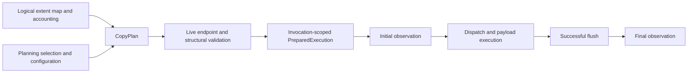

# rvvdk Architecture

## Purpose

rvvdk provides reusable abstractions and high-performance components
for accessing and moving virtual disk data.

The architecture separates four concerns:

1. logical virtual disks
2. disk formats
3. storage transports
4. data movement

This separation allows disk formats and storage transports to evolve
independently.

## Architectural layers

```text
+--------------------------------------------------+
|                    API / CLI                     |
+--------------------------------------------------+
                         |
                         v
+--------------------------------------------------+
|                   Data Mover                     |
|                                                  |
| scheduling | concurrency | buffers | statistics  |
+--------------------------------------------------+
                         |
                         v
+--------------------------------------------------+
|                  VirtualDisk                     |
+--------------------------------------------------+
                         |
              +----------+----------+
              |          |          |
             RAW        VMDK       QCOW2
              |          |          |
              +----------+----------+
                         |
                         v
+--------------------------------------------------+
|                  BlockDevice                     |
+--------------------------------------------------+
                         |
           +-------------+-------------+
           |             |             |
       Local File       NBD           SAN
```

## BlockDevice

`BlockDevice` represents random-access storage independently of the
logical disk format.

Examples include:

- regular files
- Linux block devices
- NBD exports
- SAN LUNs

The current core interface exposes:

```text
geometry
capabilities
read_at
write_at
flush
```

## I/O execution model

The initial `BlockDevice` API uses synchronous positional I/O.

This is an architectural decision rather than an assumption that rvvdk
will operate sequentially.

Concurrency belongs to the data-movement layer.

A future high-performance backend may expose a separate
completion-oriented interface for Linux mechanisms such as `io_uring`.

The core crate remains independent of any specific asynchronous runtime.

See:

```text
docs/adr/0002-io-execution-model.md
```

## MemoryBlockDevice

`MemoryBlockDevice` is the first concrete implementation of the
`BlockDevice` abstraction.

It stores device contents in process memory and exists primarily for:

- validating the `BlockDevice` contract
- unit testing
- testing higher-level virtual disk implementations
- testing the future DataMover without requiring physical storage
- reproducing I/O edge cases deterministically

The implementation supports configurable capabilities.

A default memory device exposes:

```text
READ
WRITE
FLUSH
```

## Local file backend

`rvvdk-local` provides block-device implementations backed by local
operating-system storage.

The first implementation is:

```text
LocalFileBlockDevice
```

## VirtualDisk

`VirtualDisk` represents a logical virtual disk independently of its
physical storage representation.

The interface currently provides:

```text
geometry
capabilities
read_at
write_at
flush
extents
```

## DataMover

`rvvdk-datamover` provides data movement between `VirtualDisk`
implementations.

The initial implementation is intentionally sequential and
correctness-focused.

```text
Source VirtualDisk
        |
        v
      read
        |
        v
   reusable buffer
        |
        v
      write
        |
        v
Destination VirtualDisk
```

## Exact positional I/O

`BlockDevice` and `VirtualDisk` expose two levels of positional I/O.

Primitive operations:

```text
read_at
write_at
```

## Zero ranges and discard

rvvdk distinguishes between logical zeroing and storage discard.

### write_zero_at

`write_zero_at(offset, length)` guarantees that subsequent reads of
the specified logical range return zeroes.

Backends advertise support using:

```text
WRITE_ZERO
```

### Logical Hole and discard guarantees (R2.1)

Both Zero and Hole extents guarantee logical zero reads. Hole prefers discard
only when the destination advertises **DISCARD and DISCARD_ZEROES**; ordinary
discard alone is insufficient. Otherwise use WRITE_ZERO, then bounded zero writes.
Layered disks must resolve parent contents before reporting logical Hole extents.

Default MemoryBlockDevice provides the guarantee by filling the range with zero;
explicit capability masks remain unchanged. RawDisk forwards capabilities. Local
file zeroing/hole punching and bounded fallback are implemented in R2.2. A successful discard must preserve surrounding
bytes and disk size, but does not promise physical reclamation or durability.
`bytes_discarded` counts logical operation bytes, not space released. Failures may
have partial effects and are never retried via a different sparse operation.
See the [contract and migration](adr/0026-logical-hole-guarantee.md).

## Extent-aware data movement

The DataMover consumes the source `VirtualDisk` extent map rather than
assuming that every logical byte must be read from the source.

Extent processing depends on `ExtentKind`.

### Data

Data extents are transferred using normal exact positional I/O:

```text
source read_exact_at
        |
        v
      buffer
        |
        v
destination write_all_at
```

## Linux sparse-file extent discovery

`LocalFileBlockDevice` supports sparse extent discovery on Linux using
`SEEK_DATA` and `SEEK_HOLE`. R2.3 returns a single Data extent for the complete
requested range when either selector is unsupported, even after partial discovery.
Fresh size checks bracket discovery; real I/O errors and invalid seek results
remain errors. No unsupported-discovery cache hides later errors or map changes.
The [discovery contract](local-sparse-discovery.md) defines errno handling,
source consistency, and stale-plan behavior.

The backend advertises:

```text
EXTENTS
SPARSE
```

## Aligned I/O buffers

rvvdk uses an explicit aligned buffer abstraction for DataMover I/O.

The initial implementation is:

```text
AlignedBuffer
```

## Buffer pool

rvvdk provides a bounded reusable buffer pool built from
`AlignedBuffer` allocations.

```text
BufferPool
   |
   +-- AlignedBuffer
   +-- AlignedBuffer
   +-- AlignedBuffer
```


## Concurrent DataMover

rvvdk supports a synchronous multi-worker DataMover execution path.

The source extent map is translated into block-sized work items.

```text
VirtualDisk extents
        |
        v
    Work planner
        |
        v
   bounded work
        |
   +----+----+----+
   |    |    |    |
   v    v    v    v
  W0   W1   W2   Wn
   |    |    |    |
   v    v    v    v
BufferPool buffers
   |    |    |    |
   +----+----+----+
        |
        v
Destination
```

## Streaming work scheduler

The concurrent DataMover does not materialize the complete block-level
work plan before copying.

Each source extent is converted lazily into `WorkItem` values using
`ExtentWorkIter`.

```text
VirtualDisk extents
        |
        v
 ExtentWorkIter
        |
        v
 bounded channel
        |
   +----+----+
   |         |
   v         v
 worker    worker
```

## Linux direct I/O

`LocalFileBlockDevice` supports an optional Linux direct-I/O mode using
`O_DIRECT`.

Direct I/O is explicitly selected when opening a local file and is not
the default behavior.

```text
LocalFileBlockDevice
        |
        +-- buffered
        |
        +-- direct
              |
              v
           O_DIRECT
```

## Hybrid direct-I/O fallback

A direct `LocalFileBlockDevice` maintains two descriptors for the same
logical file:

```text
O_DIRECT descriptor
        |
        +-- aligned requests

buffered descriptor
        |
        +-- unaligned requests
```

## Direct-I/O alignment discovery

Direct-I/O alignment is discovered at runtime rather than assumed to
be universally 4096 bytes.

The local Linux backend represents direct-I/O constraints as:

```text
DirectIoAlignment
    |
    +-- memory_alignment
    |
    +-- offset_alignment
```
Alignment metadata also records how the values were obtained.

```text
DirectIoAlignmentSource

Statx
Fallback
```

## io_uring execution foundation

rvvdk includes a Linux-specific `io_uring` integration layer.

The initial integration provides runtime capability probing only.

```text
DataMover
   |
   +-- sequential engine
   |
   +-- threaded engine
   |
   +-- io_uring foundation
            |
            v
        Linux kernel
```

## io_uring engine lifecycle

The Linux `IoUringEngine` owns an `io_uring` instance and tracks:

```text
queue depth
next user-data identifier
operations in flight
```

## io_uring buffer ownership

io_uring read and write operations contain pointers to userspace
buffers.

Those buffers must remain valid from SQE submission until the
corresponding CQE has been consumed.

The engine now accepts only owned buffer operations. The former borrowed-slice
compatibility methods were removed in R0.3 because error returns could end the
borrow before kernel access ended. Native range/extent APIs take `BorrowedFd`;
`LinuxFdBackend` requires `AsFd`.

Ownership-safe asynchronous operations transfer a `BufferGuard` into
an in-flight operation:

```text
BufferPool
    |
    v
BufferGuard
    |
    v
InFlightOperation
    |
    +-- user_data
    +-- operation kind
    +-- offset
    +-- length
    +-- owned BufferGuard
    +-- shared owned IoUringFile
    |
    v
io_uring SQE
    |
    v
Linux kernel
    |
    v
CQE
    |
    v
CompletedOperation
    |
    v
BufferGuard
```

Both owners enter the operation table before SQE publication. A matching final
CQE permits release, including a negative operation result. Interrupted waits
retry. Other errors stop new submissions while retaining pending resources.
Explicit `shutdown()` drains before closing the ring; copy functions call it
before returning. Drop uses the same protocol.

If cleanup cannot confirm completion, outstanding guards and FD references are
permanently retained and explicit shutdown reports their count. Ring close alone
is not treated as proof that buffer reuse is safe. This exceptional fallback can
also retain the guards' underlying pools; normal completion releases resources.
Shutdown can block on active synchronous I/O and does not provide rollback.
See [ADR-0013](adr/0013-io-uring-buffer-ownership.md) for the safety argument,
API migration, and limitations.

## Balanced io_uring pipeline scheduling

The initial io_uring copy pipeline correctly maintained buffer
ownership but could produce read/write waves.

For example, with a queue depth of eight, filling the complete queue
with reads could produce:

```text
R R R R R R R R
        |
        v
W W W W W W W W
        |
        v
R R R R R R R R
```
## DataMover execution strategy

DataMover execution policy is represented independently from storage
backend abstractions.

```text
ExecutionStrategy
    |
    +-- Threaded
    |
    +-- IoUring
            |
            +-- queue depth
            +-- read window
```

## Linux backend capability boundary

Linux-specific execution capabilities are separated from the generic
disk abstraction.

The generic `VirtualDisk` interface remains portable and does not
expose Linux file descriptors.

Platform-specific backend contracts are provided by the
`rvvdk-platform` crate.

```text
                    rvvdk-core
                        |
                portable disk model

                 rvvdk-platform
                        |
                 LinuxFdBackend
                    /       \
                   /         \
                  v           v
          rvvdk-local    rvvdk-datamover
               |              |
          implements       consumes
               |              |
               +------+-------+
                      |
                      v
             Linux execution path
```

## DataMover native execution dispatch

DataMover supports explicit selection of an execution strategy while
preserving the existing threaded behavior as the default.

```text
DataMover
    |
    +-- CopyOptions
    |
    +-- ExecutionStrategy
            |
            +-- Threaded
            |
            +-- IoUring
                    |
                    +-- queue depth
                    +-- read window
```

## Execution reporting and automatic native selection

DataMover execution results identify the backend that actually
performed the copy.

```text
NativeCopyReport
    |
    +-- ExecutionBackend
    |
    +-- NativeCopyStats
```

## Unified typed execution dispatch

The explicit Linux RAW adapters provide execution dispatch for raw disks whose
underlying block devices expose Linux native execution capabilities.

```text
RawDisk<S>                     RawDisk<D>
    |                              |
    v                              v
BlockDevice +                  BlockDevice +
LinuxFdBackend                LinuxFdBackend
        \                         /
         \                       /
          +---------------------+
                    |
                    v
        DataMover::copy_raw_with_report
                    |
                    v
            ExecutionStrategy
           /        |         \
          /         |          \
   Threaded      IoUring       Auto
      |             |            |
      |             |       capability
      |             |         evaluation
      |             |        /        \
      |             |      yes          no
      |             |       |            |
      v             v       v            v
  portable       io_uring io_uring    threaded
  DataMover
      \             |       |            /
       \            |       |           /
        +-----------+-------+----------+
                    |
                    v
                CopyReport
                    |
              +-----+-----+
              |           |
           backend      CopyStats
```

## Sparse-aware io_uring extent planning

The io_uring execution path is being extended from dense whole-disk
copying to execution based on the same logical extent model used by
the portable DataMover.

The source extent map is converted into a validated
`NativeExtentPlan` before native execution begins.

```text
VirtualDisk::extents()
        |
        v
validate_extents()
        |
        v
NativeExtentPlan
        |
        +-- Data
        +-- Zero
        +-- Hole
```
### Local backend extent reporting

`LocalFileBlockDevice` currently reports file-backed source ranges as
Data and Hole extents.

It does not currently synthesize Zero extents for allocated ranges whose
contents happen to be zero.

Native Zero handling is therefore validated at the generic
`NativeExtentPlan` execution layer.

The capability remains relevant to VirtualDisk backends that can
distinguish logical Zero extents from Data and Hole extents.

## Native entry-point validation (R0.4)

The exported native range and extent-copy functions validate block size and
alignment before allocation, io_uring setup, FD duplication, or destination
callbacks. This applies to empty ranges/plans and Zero/Hole-only plans too:

- Block size must be nonzero and fit the SQE's `u32` length field.
- Alignment must be a nonzero power of two, with a representable allocation
  layout for the configured block size.
- File offsets and the exclusive range end must fit the nonnegative `i64`
  domain. `RangeOverflow` also reports failure to represent a native file range.
  The owned engine validates each request before publishing its SQE; in
  particular, `u64::MAX` cannot become io_uring's current-file-position sentinel.
- The data-only `copy_extent_plan` scans for unsupported Zero/Hole extents
  before copying any Data extent. The destination-aware variant accepts all
  three kinds and validates the whole file range before calling the backend.

Queue depth and read window remain private, constructor-validated options; raw
queue depth arguments reject zero. Buffer capacity and request width checks in
the owned engine also precede publication. Invalid requests return their buffer
to the pool and leave a healthy engine available for subsequent valid requests.

This is configuration validation, not transactional execution. Backend failures
can still occur after earlier extents have completed. R2.5 prepares native rings,
pools, and descriptors before executing any extent. Endpoint access, capacity, identity, and durability
preflight are implemented in R0.5 below; DataMover direct-I/O request compatibility
is implemented in R2.4. Standalone low-level FD APIs still require caller-supplied
direct compatibility. Logical discard guarantees are implemented by R2.1. The
allocation layout check does not impose an aggregate memory budget or guarantee enough available memory. DataMover adds
the separate R1.6 payload budget described below; low-level native functions
retain the original allocation contract.

## Copy endpoint preflight (R0.5)

`BlockDevice::copy_endpoint` and `VirtualDisk::copy_endpoint` return current
capacity, capabilities, and optional backing identity. `RawDisk` forwards this
contract; memory devices identify the currently borrowed object, and Linux local
files refresh size/access using the open FD. File identity is `(device, inode)`,
so separately opened handles, hard links, and path aliases are detected without
reopening a path. Local direct/buffered handles must match at construction.
Memory addresses are process-local, borrow-scoped identities; never serialize
these values or treat them as content/snapshot identities.

Portable full copies require source READ, destination WRITE and FLUSH, enough
destination capacity, and unchanged current source size. Known aliases and the
same nonzero-sized backend object are rejected. Destination-aware RAW planning
and both plan executors additionally inspect the actual FDs, repeating preflight
at execution because state may change after planning. These checks precede extent
execution and observer notifications. Native Data plans must identify both RAW
backends and bind their identities to the supplied descriptors before selection
or dispatch. A custom RAW backend must override/forward `copy_endpoint` to enable
this native path; unknown identity is not accepted as a matching descriptor.

R1.3 shares the local RAW inspection through
`rvvdk-platform::FileInspection`: a private-field record of live FD facts tied to
a descriptor borrow. `LinuxFdBackend::copy_endpoint_from_inspection` defaults to
the independent logical `BlockDevice::copy_endpoint`. The local override checks
the exact descriptor and preserves logical capability restrictions while using
its current size/access/identity. RAW pair preflight now takes two fstat/F_GETFL
pairs instead of four. Portable local preflight uses the same conversion with a
new inspection. Custom implementations keep their original logical checks by
default; descriptors never implicitly grant logical capabilities.

The platform crate depends on core's portable endpoint types; core remains free
of platform dependencies and Linux disk-trait methods. Inspections are not kept
in plans or reused across execution calls, and are not atomic metadata snapshots.
Native lower layers retain separate preflight checks. See
[ADR-0028](adr/0028-endpoint-inspection.md) for binding, consistency, and durability
limits.

Nonempty low-level native range/extent copies require regular file sources,
readable source FDs, writable non-append destination FDs, sufficient current
capacity for the complete requested range, and distinct backing objects. Native
copy does not extend a short destination. Destination-aware native extent copies
validate the virtual destination's WRITE/capacity/identity before Zero/Hole calls;
Data-containing plans additionally require its known identity to match the native
destination FD. With no Data extents that destination FD is unused. A validated
private range dispatcher avoids re-querying FDs for every Data extent.

`copy_native`/`copy_native_with_report` are FD range APIs: they enforce actual
FD permissions and bounds. The RAW plan APIs additionally enforce the logical
BlockDevice capabilities and backend-to-FD binding.

Low-level native copies still do **not** flush. Their caller owns durability;
they do not require FLUSH from a virtual destination. Valid empty low-level
ranges/plans retain R0.4's no-op behavior after configuration validation, without
endpoint inspection. Full DataMover copies retain their final flush and require
FLUSH in preflight, including empty jobs. Success means that flush returned
successfully; capability claims cannot prove physical hardware behavior.

`EndpointPreflight` preserves source/destination role and its underlying error
chain. Missing capabilities, invalid endpoint modes, descriptor mismatches, and
aliasing have explicit errors. Existing cached-geometry bounds checks still
return their original `OutOfBounds` errors; live descriptor/backend failures have
endpoint context. R1.5 wraps execution errors with copy context and retains their
original causes; see the [failure contract](copy-errors.md).

This is a point-in-time check, not rollback, a snapshot, or a lock. Callers must
keep contents, capacity, open-file flags, and endpoint mappings stable throughout
the copy. Unknown custom-backend identities cannot prove absence of aliases;
wrappers must forward the identity of their backing object. Plans are still
structural and are not bound to a persisted source identity. R1 now provides
portable planning and failure counters. R2.1–R2.5 add safe sparse semantics,
direct-I/O request policy, and prepared native resources with runtime fallback. Device nodes/pipes are unsupported by the
native file-copy APIs; the owned engine remains a lower-level request interface.

## Native Zero extent execution

The native extent executor supports Data and Zero extents while
preserving their different storage semantics.

```text
NativeExtentPlan
        |
        +-- Data
        |     |
        |     v
        |  io_uring read/write pipeline
        |
        +-- Zero
        |     |
        |     +-- WRITE_ZERO available
        |     |       |
        |     |       v
        |     |  write_zero_at
        |     |
        |     +-- WRITE_ZERO unavailable
        |             |
        |             v
        |       zero-write fallback
        |
        +-- Hole
              |
              v
        unsupported
```
## Native Hole extent execution

Native extent execution supports all VirtualDisk extent kinds:

```text
NativeExtentPlan
        |
        +-- Data
        |     |
        |     v
        |  io_uring read/write
        |
        +-- Zero
        |     |
        |     +-- WRITE_ZERO
        |     |
        |     +-- zero-write fallback
        |
        +-- Hole
              |
              +-- DISCARD + DISCARD_ZEROES
              |
              +-- WRITE_ZERO
              |
              +-- zero-write fallback
```
## Execution semantic parity

Threaded and native execution are validated against the same
deterministic extent model:

```text
Data -> Zero -> Hole -> Data
```

## Copy planning

RVVDK separates copy planning from execution.

The destination-aware workflow is:

```text
source + destination
        |
        v
plan_with_destination()
        |
        v
     CopyPlan
        |
        v
execute_plan()
```

### Portable plan execution (R1.1)

The primary planning, execution, report, and observer APIs accept arbitrary
`VirtualDisk + ?Sized`. Memory, local RAW, and translated logical disks follow
the same lifecycle, with all payload access through logical methods. `Auto`
selects Threaded here; explicit IoUring or a native plan is rejected before
payload I/O or observer notification. The portable mover does not query native
traits, even if a logical disk implements them. A backend may inspect its own
storage through its logical endpoint contract.

Linux RAW callers use `plan_raw_with_destination`, `execute_raw_plan`,
`execute_raw_plan_with_observer`, and `copy_raw_with_report` to opt into native
selection. Their existing endpoint/descriptor binding checks remain in place.

Portable and RAW execution share structural validation and observation boundaries.
Both reject stale maps, mismatched configuration, invalid endpoints, or insufficient
capacity before notification. Successful flush precedes the final snapshot. Native
runtime preparation can still fail after initial notification. The canonical extent
validator is shared by plan construction and execution trust boundaries.

`CopyPlan` remains an in-memory structural record. Callers must stabilize source
contents and mappings. R1.3 shares descriptor inspections; R1.4 separates logical
intent and invocation preparation below. R1.5 adds contextual execution failures.
Complete native runtime preparation remains a future step. See
[ADR-0027](adr/0027-portable-planning.md) for migration and limits.

### Logical intent and execution preparation (R1.4)

`CopyPlan` contains separate logical and execution records. The private logical
record owns canonical extents, summary counters, and the topology fingerprint.
Selection records the requested strategy/options, selected backend, and reason.
Existing plan getters remain available; `plan.execution_selection()` exposes the
planning decision. That decision is not proof that a kernel or endpoint is ready.



Both observed and unobserved plan APIs use preparation. Its private result
borrows the exact plan/source/destination checked in that invocation. Threaded
preparation retains the portable checks. RAW preparation retains descriptor
checks and native binding; native selection also resolves current execution
options, constructs the native extent plan, and checks current descriptor/buffer
alignment before observation. Dispatch consumes this configuration instead of
rediscovering it after the initial callback. No inspection or preparation is
cached in a plan.

Reasons distinguish explicit Threaded/native requests, portable Auto, and RAW
descriptor acceptance/rejection. The current RAW evaluator accepts descriptor
pairs and combines their alignment claims. R2.4 additionally validates DataMover
request intent and records whole-plan Auto fallback for incompatible requests.
R2.5 prepares runtime resources before observation and reports defined ring
unavailability through CopyReport::runtime_fallback().
Successful reports continue to expose the actual backend. Plan selection remains
historical even if a different mover executes it; native execution uses that
mover's current native options, and a Threaded plan retains its chosen backend.

Preparation owns native resources as of R2.5; the structural plan does not hold
a resource lease. Native setup errors precede observation. Callers must keep endpoints stable,
including during observer callbacks. R1.5 adds contextual failures and confirmed
partial counters below. Snapshot consistency and terminal lifecycle events
remain separate work. The direct
portable `copy` API retains its existing single-pass fast path.
[ADR-0027](adr/0027-portable-planning.md) records the public contract and limits.

### Copy failure context and progress (R1.5)

Execution failures carry `Error::CopyExecution(Box<CopyFailure>)` with executor,
attempted operation/range, original cause, and `CopyProgress`. These portable
types live in core. Boxing occurs only on failure; successful report/stat APIs
remain unchanged. `Error::copy_failure()` also follows native cleanup wrappers.

Sequential counters include completed reads even if the corresponding write
fails. Worker counters survive failing workers and aggregate only after every
scoped worker joins; the first error is preserved. Native counters include
observed positive CQE bytes, including short transfers, and earlier completed
extents. Existing engine shutdown/ownership behavior is unchanged; work completed
during cleanup can remain uncounted and is marked uncertain.

Counters are lower bounds, not durable or contiguous progress. Opaque failed
backend calls can partially mutate their attempted range; native I/O can finish
during shutdown. Native completion errors without request identity retain a
range-level context rather than inventing an exact read/write offset. Flush
failure reports completed payload work but never successful copy durability.
No final success snapshot follows an error.

Configuration mismatches use InvalidCopyConfiguration, structural plan changes
use StaleCopyPlan, and live source capacity changes use EndpointChanged with
endpoint context. Malformed extent maps remain CorruptMetadata. Planning and
preflight rejections retain their typed forms without a copy-progress report.

See the [error contract](copy-errors.md) for counter definitions, source-chain
inspection, migration, and limits, and the
[R1.5 measurements](benchmark-results/2026-09-29-r15/README.md).

### Shared semantic execution (R1.2)

A private operation policy now selects the same action for sequential, worker,
and destination-aware native execution:

| Logical extent | Destination capability | Selected action |
|---|---|---|
| Data | Any | Read source and write destination |
| Zero | WRITE_ZERO | Backend zero operation |
| Zero | Otherwise | Write zero-filled buffers |
| Hole | DISCARD and DISCARD_ZEROES | Backend discard operation |
| Hole | WRITE_ZERO, without both discard flags | Backend zero operation |
| Hole | Otherwise | Write zero-filled buffers |

Capabilities are queried when selecting a sparse operation, once per extent for
sequential/native paths and once per work item for workers. Data selection does
not query them. A selected operation's failure propagates; it is not retried as a
fallback write. R2.1 requires an explicit zero-read guarantee before selecting
discard; see [ADR-0026](adr/0026-logical-hole-guarantee.md).

Direct copying and observed/unobserved sequential plan execution share one loop,
including buffer allocation, block/tail handling, statistics, and destination
flush. Compile-time progress hooks keep observer state out of unobserved copies.
Worker scheduling and native payload pipelines retain their own I/O mechanisms,
work-item sizes, and resource lifetimes while sharing policy selection.

Successful Data/fallback writes count as written bytes and copied blocks. Backend
zero/discard calls count only in their corresponding byte counters. Source payload
is never read for Zero/Hole. A full report follows successful flush; errors may
leave already-completed writes; R1.5 now carries confirmed partial statistics.

Observer cadence is preserved: initial after validation, byte thresholds every
64 MiB for Data/fallback writes, intermediate extent boundaries, and final after
successful flush. An exact byte threshold can emit 100% byte progress before the
last extent is counted or flushed. Progress snapshots have no lifecycle tag, so
100% is not a durability/completion event; callers must check the execution result.
Explicit terminal events remain future work. See the new contract tests and
[R1.2 benchmark report](benchmark-results/2026-09-28-r12/README.md).

## Concurrent worker shutdown

The coordinator releases its work-queue receiver before producing items. On a
worker or producer error, shared state retains the first recorded cause and stops
workers at work-item boundaries. Receiver destruction wakes a blocked producer;
sender destruction wakes idle workers. All scoped workers join before returning.
Successful copies still drain queued work and flush the destination.

Already-dispatched work can finish, and shutdown cannot interrupt a blocked
synchronous backend call. R1.5 retains partial failure counters after joining workers. Public cancellation remains
future work. The contract and tests are documented in
[ADR-0008](adr/0008-streaming-work-scheduler.md#shutdown-contract--r02-2026-09-28).

## Copy memory budget (R1.6)

DataMover checks a configurable 256 MiB default budget for the total accounted
buffer, queue/worker-entry, and extent storage. Preparation checks the retained
plan and live revalidation Vec together, then releases the latter before
executor allocation. Concurrent execution borrows extents; native execution
charges its additional plan Vec and uses the executing queue depth.

`execution_memory` exposes the execution breakdown without reserving resources.
Checks precede payload execution and observation. The Vec backend query allocates
before its returned capacity can be checked; allocator/container overhead,
thread stacks, backend/observer memory, kernel resources, and previous native
quarantine are external. This does not bound RSS or eliminate fragmentation
costs. See the [complete accounting contract](copy-memory.md).

## Local zeroing and hole punching (R2.2)

Writable Linux local files advertise WRITE_ZERO and zero-guaranteed DISCARD.
KEEP_SIZE range operations preserve the logical file size and exact boundaries.
Fresh primary/alias access and size checks precede every call. Unsupported
acceleration falls back to bounded writes from a shared 64 KiB zero array;
unsupported modes are cached separately per open file. Other errors propagate.

The [local sparse-output contract](local-sparse-output.md) defines error handling,
concurrency limits, operation counters, and storage-backed allocation evidence.
Fallback can allocate space; bytes_discarded counts logical operation bytes.
Source extent discovery fallback is implemented in R2.3; DataMover native request
compatibility is implemented in R2.4; runtime resource preparation in R2.5.

## Native request compatibility (R2.4)

RAW planning validates SQE width, signed file ranges, allocation layout, and
Data range/block alignment for each direct endpoint. Auto selects Threaded for
the complete incompatible plan with a structured reason; explicit native returns
NativeRequestIncompatible. Preparation rechecks native intent before cloning
native extents or notifying observers; changed compatibility rejects the plan
and requires replanning. Both RAW planning and preparation compare declared
modes with O_DIRECT captured in existing fresh descriptor inspections.

See the [contract and API boundaries](native-request-compatibility.md) for mixed
modes, exact tail/split policy, budget/observer parity, low-level FD limitations,
and concurrent alias limits. Runtime ownership is described below.

## Native runtime preparation (R2.5)

Preparation constructs the actual ring, bounded pool, and owned descriptor pair
before callbacks or sparse prefix writes. Dispatch consumes that ownership and
reuses it across all Data extents. Sparse write fallback borrows a zeroed pool
buffer; sparse-only jobs prepare scratch without a ring. Shutdown runs once per
job, preserves unconfirmed ownership retention, and precedes final flush.

Executing Auto may use Threaded only for recognized ring-construction
unavailability, after separate Threaded budget admission. CopyPlan keeps its
planning selection; CopyReport and all progress snapshots expose the actual
backend, with CopyReport::runtime_fallback() explaining runtime fallback.
Explicit native and all non-eligible setup errors reject before observation;
no post-mutation retry occurs. See the [runtime contract](native-runtime-preparation.md)
and [performance evidence](benchmark-results/2026-09-29-r25/README.md).

## Local concurrent aliases (R2.6)

A cooperative per-file coordinator in rvvdk-platform joins local backend calls and
native owned requests by device/inode identity. Short metadata locks admit
nonconflicting ranges without holding a mutex during I/O. Overlapping writers,
page-overlapping mixed payload modes, and whole-file flush conflicts fail before
submission with ConcurrentFileAccess. Sparse operations and extent discovery
retain admission for their complete call. A native operation owns its guard until
confirmed CQE or quarantines it with its descriptor and buffer on uncertain
shutdown. Completion-buffer lifetime does not extend the admission.

This preserves disjoint same-mode pipelines while bounding supported alias use.
It does not provide snapshots or coordinate raw FDs, mmap, or external processes.
See the [policy matrix, caller responsibilities, and costs](local-file-concurrency.md).

## Read-only RAW CLI (R3.1)

rvvdk-cli exposes the rvddk binary and owns command parsing and versioned report
serialization. It reuses local RAW discovery and DataMover logical plans without
adding CLI dependencies to the libraries. Inspect reports source facts; plan
previews destination intent without writable opens or creation. Actual RAW
native selection requires a writable destination and remains explicitly deferred.
The preview is not a serialized executable plan. New output defaults to no-clobber;
existing overwrite intent is in-place with tail preservation. Live execution and
publication are implemented in R3.2 below. See the [CLI contract](cli.md) and
[ADR-0030](adr/0030-read-only-cli-preview.md).


## RAW copy, verification and publication (R3.2)

The CLI owns output policy, pinned filesystem descriptors, metadata observations,
durability and versioned reports. LocalFileBlockDevice adopts an owned buffered
regular-file descriptor and derives capabilities without reopening paths.
DataMover continues to own planning, payload budgets, backend readiness and copy.
Its reusable Verifier performs full logical comparison with two bounded buffers;
CLI reserves those capacities from the same copy budget before mutation.

New output uses an anonymous inode until copy/flush/optional verification and file
sync succeed, then no-replace publication and directory sync. Explicit overwrite
preserves the opened inode and tail, with conservative partial-effect reports on
failure. Descriptor ownership protects I/O targets; concurrent external content
and namespace stability are still caller obligations. Progress and cancellation
are implemented in R3.3 below. See [the transfer contract](cli-transfer.md) and
[ADR-0031](adr/0031-local-copy-publication.md).


## Coordinator lifecycle and cancellation (R3.3)

Controlled DataMover entry points emit CopyEvent lifecycle states on the invoking
coordinator. Worker threads publish cumulative deltas to a fixed aggregate and
only inspect cancellation; native pipelines check between completions/refills and
retain existing owned shutdown/quarantine. Unobserved paths use generic no-op
checkpoints. Legacy snapshot APIs keep their cadence. Verification adds block
checkpoints and matching-prefix callbacks.

The CLI maps engine completion to copy_flushed and completes only after its
verification/publication protocol. JSON progress is opt-in stderr JSON lines,
leaving success stdout unchanged. Binary SIGINT/SIGTERM handlers only set an atomic
request. Publication followed by cancellation completes directory durability and
reports the published state; no visible destination is removed. Blocking calls
and callbacks can delay stopping. See [the lifecycle contract](cli-progress.md)
and [ADR-0032](adr/0032-copy-lifecycle-cancellation.md).

## Bounded VMDK descriptors (R4.1)

`rvvdk-vmdk` now provides a portable descriptor-only layer. It has no local-storage
dependency and does not implement `VirtualDisk` yet. Immutable parsed extents
contain access flags, checked logical byte ranges, and either an untrusted borrowed
filename/backing offset or ZERO. Header/metadata interpretation follows an explicit
allowlist; unsupported format features fail. Limits bound text, line length,
extents, metadata and filename bytes before collection growth.

The [subset contract](vmdk-descriptor.md) and [ADR-0033](adr/0033-bounded-vmdk-descriptors.md)
define accepted shapes and errors. Parsing validates offset arithmetic, not file
lengths, path confinement, backing identity or decoded bytes. R4.2 resolves
references through caller-supplied backing contracts; R4.3 maps logical reads over
resolved FLAT/ZERO extents. Native RAW adapters cannot treat a VMDK container FD as
logical disk data. The CLI supports explicit [VMDK sources](cli-vmdk.md).

## Owned VMDK backing resolution (R4.2)

The format crate now depends on core BlockDevice contracts; its Linux-only local
resolver also uses rvvdk-local and libc. Portable descriptor loading and resolver
interfaces remain available without local filesystem dependencies on other targets.
`DescriptorText` owns bounded validated bytes; borrowed parsing avoids self-references.
`ResolvedDescriptor` owns extents and read-only source wrappers, deduplicates exact
references, and bounds source count before resolver calls. Live endpoint checks
validate physical ends/read access and retain known identities for revalidation.

The Linux local resolver pins the descriptor parent directory, confines lookup with
openat2, rejects nonregular O_PATH objects before I/O adoption, and reopens retained
regular objects through procfs with identity comparison. Existing local cooperative
admission remains in use. Directory/entry rename cannot redirect a retained source;
content stability is not promised. [Contract](vmdk-backing.md) and
[ADR-0034](adr/0034-confined-vmdk-backing-resolution.md) define limits and trust boundaries.
R4.3 supplies the logical `VirtualDisk`; R4.4 integrates it into the CLI.

## Read-only VMDK logical disks (R4.3)

`VmdkDisk` consumes resolved FLAT/ZERO metadata and retained sources, revalidates
at construction/endpoint inspection, and implements portable `VirtualDisk`.
Binary search plus sequential traversal maps arbitrary byte reads directly into
the caller buffer. FLAT uses the retained physical offset; ZERO performs no I/O.
Extent discovery clips and coalesces Data/Zero without physical-hole inference.
There is no native RAW/FD implementation or writable capability.

`VirtualDisk::validate_destination_identity` extends copy/verification preflight
for composite sources. Existing RAW identity checks remain; VMDK compares every
backing against the fresh destination identity and fails closed for unknowns.
Wrappers must forward this hook. Endpoint checks are observations, not snapshots.
See the [logical contract](vmdk-logical.md), [ADR-0035](adr/0035-read-only-vmdk-logical-mapping.md),
and [reference evidence](benchmark-results/2026-09-29-r43/reference.json) for
interoperability limits. [R4.4](cli-vmdk.md) provides CLI source-format selection.


## CLI logical sources (R4.4)

An owned source enum selects typed RawDisk native planning/execution or portable
VmdkDisk planning/execution. The source loader retains descriptor-bound identity,
size and timestamp observations for every file; target policy uses logical capacity
and rejects aliases to the descriptor or any backing. No pathname is reopened for
source checks. LocalResolver exposes confined file acquisition without weakening
its namespace policy. VMDK has no native FD endpoint; explicit io-uring rejects
before destination opening. Existing publication, verification and cancellation
remain in the shared lifecycle. See [ADR-0036](adr/0036-cli-vmdk-sources.md).


## Bounded descriptor padding (R4.5)

DescriptorText owns original acquired bytes, including a permitted terminal NUL
run, under the existing total-byte ceiling. After EOF it caches the strict-text
boundary once. Parsing borrows this prefix; original bytes remain available for
provenance. Direct Descriptor parsers retain strict NUL rejection. LocalResolver
and the CLI inherit the acquisition policy without format mapping or execution
changes. See [ADR-0037](adr/0037-bounded-vmdk-padding.md).


## Hosted sparse header admission (R5.1)

SparseHeader provides allocation-free first-sector validation, separate from
Descriptor and VmdkDisk. It bounds declared geometry and metadata work, validates
advertised metadata regions against overhead and observed extent length, and
rejects unsupported version/flags/state. A 512-byte stack acquisition helper reads
no referenced regions. Private checked regions do not prove directory/table or
descriptor contents: R5.2 owns that validation. Existing FLAT/ZERO mapping and CLI
support remain unchanged. See [ADR-0038](adr/0038-bounded-hosted-sparse-header.md).


## Hosted sparse metadata validation (R5.2)

An explicit SparseDescriptor parser shares bounded syntax with Descriptor while
keeping existing FLAT/ZERO acceptance unchanged. Sparse text admits one to eight
hexadecimal CID digits as a 32-bit value, including QEMU's unpadded output.
SparseMetadata resolves and retains one selected backing, binds its header capacity
and embedded text to the external descriptor, then eagerly validates directories,
table placement, redundant copies and complete data-grain ranges. Split empty
reserved descriptor regions require the supplied external descriptor.

Independent per-extent memory/read budgets precede variable allocation and metadata
offset reads. The loader retains an immutable logical-order grain map and endpoint,
rechecks the header and endpoint, and exposes no VirtualDisk or raw native handle.
Unknown identity and same-size concurrent content changes are not qualified;
callers must keep sources quiescent. R5.3 owns aggregate admission, alias protection
and logical reads. See [contract](vmdk-sparse-metadata.md) and
[ADR-0039](adr/0039-bounded-sparse-metadata.md).


## Base sparse logical mapping (R5.3)

SparseDisk loads an explicit base sparse descriptor through SparseMetadata, charging
all extents against aggregate payload/read limits and a handle count before exposing
VirtualDisk. It owns validated maps and sources independently of input text/resolver
lifetimes. Final acquisition revalidates earlier sources as well as the last one.

A shared allocation-free run traversal maps reads through physically adjacent grain
runs and fills unallocated base ranges with zeros. Logical extent queries merge
Data/Zero kinds across backing boundaries, count before allocation and obey an output
limit. Portable DataMover/Verifier consume the read-only composite through normal
preflight; all backing identities participate in destination alias checks. No native
RAW endpoint, writes, parent inference or automatic snapshot is exposed. Sources
must stay quiescent. Public CLI integration is R5.4. See the
[contract](vmdk-sparse-disk.md) and [ADR-0040](adr/0040-read-only-base-sparse-mapping.md).


## Sparse CLI acquisition and lifecycle (R5.4)

Explicit VMDK mode dispatches the opened source's bounded first chunk to text or
hosted sparse header admission. External text admits FLAT/ZERO or split sparse;
binary input must bind a monolithic embedded descriptor to the opened container's
inode. The observing confined resolver rejects a different inode before reading its
metadata. No RAW autodetection or fallback to unconfined lookup is introduced.

Source owns SparseDisk plus timestamp/identity observations for the descriptor and
all loaded extents. Existing preview, alias checks, portable execution, verification,
cancellation and private publication apply. Sparse sources never enter the RAW
native adapter. Defaults bound source metadata independently of execution payload;
sparse preview counters report loader reservations/read work, excluding entry
acquisition. See [CLI contract](cli-vmdk.md) and
[ADR-0041](adr/0041-sparse-cli-source-acquisition.md).

## Sparse qualification and measured resource boundaries (R5.5)

[Deterministic adversarial and scaling qualification](vmdk-sparse-qualification.md)
adds no production behavior. Virtual backing devices allow 64 GiB capacity tests
without allocating payload storage. Eager-map reservations can reject a 1 TiB
header at the default budget; full queries scan grains even with one output, and
65,537 alternating outputs exceed the separate query limit. Retain bounded eager
mapping and two-pass output admission pending an independently measured change.
R5.6 will admit parent-chain metadata under explicit resolver/CID/identity/cycle/
depth/budget policy before introducing parent fallback reads.

## Bounded sparse parent metadata (R5.6)

`SparseLayerDescriptor` accepts parent syntax without widening base `SparseDescriptor`.
`SparseChain` retains leaf-to-base maps under 16-layer, 128-extent, 8 MiB descriptor,
128 MiB reservation and 256 MiB read-payload defaults. Parent resolution is an
explicit caller policy returning each layer's owned descriptor and backing namespace.
CID/capacity checks precede parent backing reads; identity-cycle/alias checks precede
repeated-source reads. Embedded monolithic entry must resolve the same container.
All sources are reobserved at completion; quiescence remains caller responsibility.

No VirtualDisk interface is exposed yet. Metadata zero entries remain unallocated;
R5.7 will add logical fallback and whole-chain alias protection. Parent CLI support
follows separately. [Contract](vmdk-parent-chain.md);
[ADR-0042](adr/0042-bounded-parent-chain-metadata.md).

## Logical sparse parent fallback (R5.7)

`SparseChainDisk` owns admitted `SparseChain` metadata and implements read-only
VirtualDisk. Iterative lookup clips at every consulted child/ancestor grain
boundary, resolving the nearest allocated layer or base-confirmed zero. Reads
use constant auxiliary space and coalesce adjacent physical bytes within a backing.
Two-pass Data/Zero queries bound output separately from loader resources.
Copy preflight revalidates and rejects all descriptor/backing destination aliases,
including hidden ancestors. Quiescence remains the caller's responsibility.
[Contract](vmdk-chain-disk.md); [ADR-0043](adr/0043-read-only-sparse-parent-fallback.md).
CLI parent acquisition/lifecycle integration is R5.8.

## Confined CLI parent-chain acquisition (R5.8)

`--format vmdk --allow-parents` selects `SparseChainDisk` for all four public
commands. A pinned source directory resolves basename-only parent hints; every
layer's backing references use that same confined directory. The CLI retains
identity/size/timestamp observations for every descriptor/backing and integrates
whole-chain aliases with existing threaded copy, verification and publication.
Default base-only acquisition is unchanged. Successful chain reports expose
leaf-to-base identities/CIDs, aggregate loader counts and separate entry probes.
See [ADR-0044](adr/0044-confined-cli-parent-chains.md), [contract](cli-vmdk-parents.md)
and [qualification](benchmark-results/2026-09-30-r58/README.md). R5.9 adds
coverage-guided fuzzing; live VMware access remains gated by V0 lab qualification.

## Bounded admission fuzz qualification (R5.9)

A standalone fuzz workspace exercises unchanged descriptor, sparse-header, metadata
and parent-chain admission through four memory-only targets. Raw parser/prefix
inputs and structured graph mutations use authored fixtures. Independent read and
resolver counters check aggregate limits on both success and rejection. Accepted
results also check extent arithmetic, metadata bounds, chain linkage and endpoint
revalidation. Smaller per-target limits complement deterministic production-default
boundary tests. No fuzz-only branches or dependencies enter shipping crates.

Sanitizer execution rates, peak RSS and whole-target feedback are recorded with
separate corpus archives for every campaign; no source coverage percentage or
runtime disk speedup is inferred. See [ADR-0045](adr/0045-bounded-admission-fuzzing.md),
[harness contract](../fuzz/README.md) and [R5.9 evidence](benchmark-results/2026-09-30-r59/README.md).
V0.1 defines the independently implemented remote workflow and lab proof;
local hosted-sparse support does not establish VMware transport compatibility.

## Independent VMware access candidate (V0.1)

Read-only standalone ESXi discovery is qualified with an isolated SDK-free Python
probe. Shipping Rust crates are unchanged. [ADR-0046](adr/0046-independent-export-feasibility.md)
selects powered-off HTTP NFC export as a candidate, pending actual Rust bytes and
lease-cleanup evidence. V0.2 introduces a bounded `rvvdk-vsphere` session/inventory
foundation; V0.3 adds owned export leases and sequential artifact transfer.

An `ExportStream` carries encoded container bytes, with explicit endpoint/TLS
policy, buffer limits, checksums and publication. It does not implement positional
logical-block reads. Compressed streamOptimized decoding remains a separate gate.
The local DataMover and portable format crates do not acquire network dependencies.
See the [component contracts, lifecycle and lab checklist](vmware-access-plan.md).


## Bounded Rust vSphere discovery (V0.2)

`rvvdk-vsphere` now provides direct-host authentication and inventory through a
scoped async `discover` API. Pinned Rustls verification precedes HTTP, endpoint
policy rejects redirects/proxies, and response/XML/object/deadline budgets bound
control work. Default persistent HTTP/1.1 is qualified against matched fresh-TLS
sessions. No network dependency enters the existing disk crates or public CLI.

Primary failure, pagination cursor cleanup and explicit Logout are independent
outcomes. Even malformed Login content retains a received cookie for cleanup.
Dropping the future or process termination cannot promise remote release; callers
must await completion. License availability is reported separately from unresolved
active assignment/operation eligibility. Private VM identities are omitted from
serialized reports. Export leases, artifacts and compressed decoding remain V0.3
and later gates. [Contract](../crates/rvvdk-vsphere/README.md),
[ADR-0047](adr/0047-bounded-rust-vsphere-discovery.md),
[qualification](benchmark-results/2026-10-01-v02/README.md).
