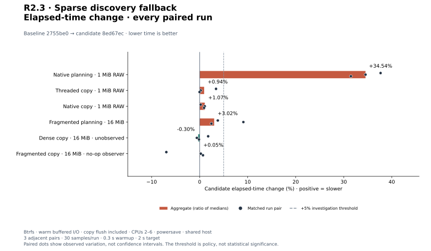
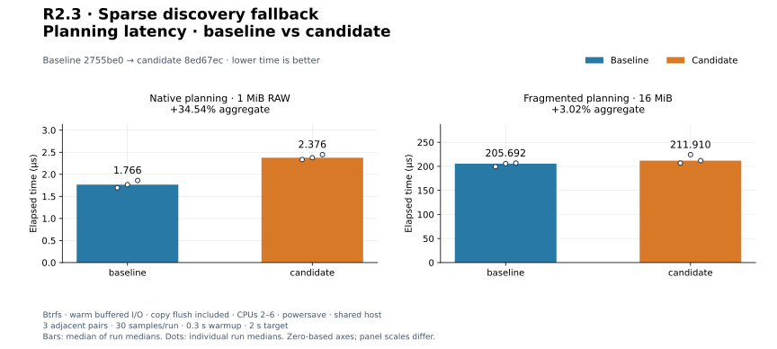
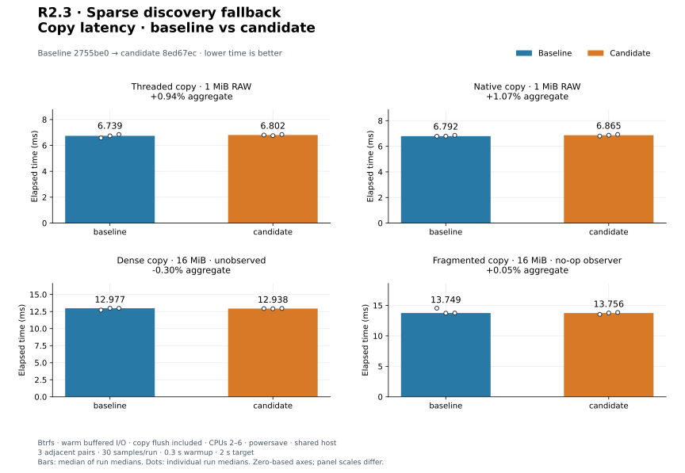
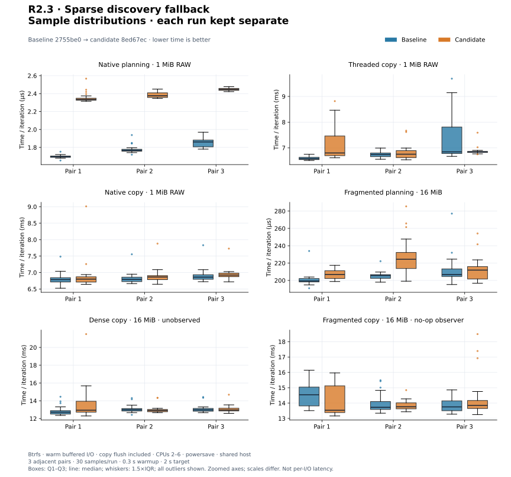
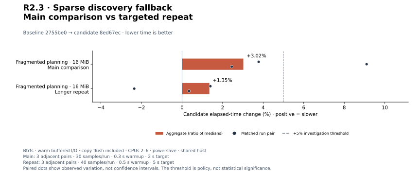
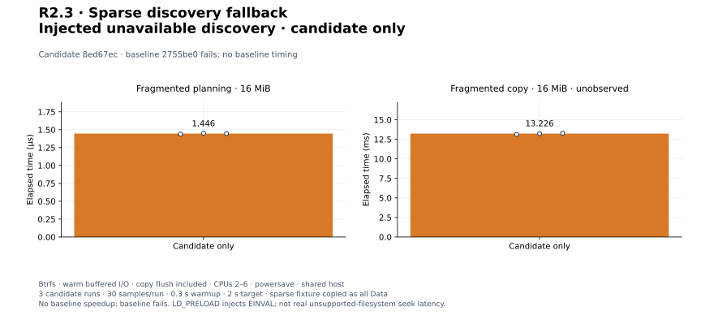

# R2.3 — Dense fallback for unavailable sparse discovery

Baseline: `2755be0` (R2.2), plus [matched-harness.patch](matched-harness.patch).
Candidate: that commit plus [candidate.patch](candidate.patch).
[Environment and source/binary hashes](environment.json) identify the measured
builds. No worker, queue, block size, memory budget, native read window, or
host governor defaults changed.

## Visual results

Added after R2.3 from the original saved evidence; no new benchmark runs.
Positive elapsed-time changes mean slower. Bars use medians of run medians;
points retain individual runs or matched pairs. These plots do not change the
performance disposition below.

[PNG copy](plots/relative-change.png). The +5% line is an investigation threshold,
not a statistical confidence bound. Native small-plan cost remains +34.54%.

[Planning PNG](plots/planning-latency.png). Zero-based axes; each panel has its
own scale. The native-planning increase is approximately 0.610 µs.

[Copy PNG](plots/copy-latency.png). Final flush is timed; reset and readback are
outside the timer. RAW copies include planning; progress copies revalidate a
prebuilt plan. Small differences remain provisional on this shared host.

Sample distributions — all outliers retained

[Distribution PNG](plots/sample-distributions.png). Samples are elapsed time
normalized by iterations, not individual I/O latency. Boxes show Q1–Q3 and the
median; whiskers use 1.5×IQR. Runs are kept separate. Axes are zoomed and vary
between panels; no outliers are removed.

[Repeat PNG](plots/followup-change.png). Both the original +9.10% pair and the
longer repeat remain visible. The repeat is not a historical performance trend.

Injected unsupported discovery — candidate only

[Fallback PNG](plots/unsupported-discovery.png). The baseline fails this workload,
so there is no before/after speedup. The interposer does not model actual failed
filesystem seek latency; the source's logical holes are read/written as Data.

Regenerate with the [plotting guide](../../../scripts/benchmarks/README.md).
[Configuration](plot-config.json), [plotted values](plots/computed.json), and
[generator/input/output hashes and tool versions](plots/manifest.json) preserve
plot provenance. [Plot validation](plots/validation.json) records checks. Original raw evidence
and the original R2.3 audit are unchanged.

## Validation

**323 tests pass; one existing allocation test is gated** in the workspace run
(324 distinct tests in the inventory). Formatting, strict all-target Clippy, and
core/datamover wasm32 library compilation pass. See [commands](validation.json),
[test output](tests.txt), and [inventory](test-inventory.txt). The portable result
is compilation, not runtime qualification. The unchanged physical allocation
test was exercised on storage in [R2.2](../2026-09-29-r22/README.md); no renewed
allocation result is claimed here.

Ten new deterministic tests cover first/late unsupported queries, both seek
selectors, discarded partial maps, complete logical readback with holes and
nonzero data, subranges, interruption, real errors, invalid/empty ranges,
malformed seek results, truncation, and subsequent queries after unsupported
results. See the [discovery contract](../../local-sparse-discovery.md).

## Method

Separate absolute Cargo targets build optimized baseline/candidate binaries.
Six profiles run as adjacent candidate/baseline, baseline/candidate, and
candidate/baseline pairs on CPUs 2–6. Each process requests 30 flat samples,
300 ms warmup, and a 2 s measurement target, with a fresh Criterion directory.
The only matched harness change permits an explicit dense-map expectation for
the separately injected unsupported-discovery experiment. Normal comparisons
do not set that flag or preload the interposer.

- Native planning and complete RAW copies: 1 MiB, 64 KiB blocks, one-worker
  Threaded or native QD8/read-window4. Public copy includes planning and flush.
- Fragmented planning and observed copies: 16 MiB, alternating 64 KiB Data/Hole
  extents. Copy executes a prebuilt plan and revalidates its source map.
- Dense unobserved copy: 16 MiB, 64 KiB blocks, one worker, prebuilt plan.

Files use deterministic incompressible Data and destination prefill on the
recorded Btrfs storage mount. Warm buffered reads, no global cache drops.
Complete copies include final flush; reset/flush and full byte comparison are
untimed. Every iteration asserts operation counters and complete readback.
The development host uses powersave and has uncontrolled background load.
GNU time CPU/RSS records include setup/readback and adaptive iteration counts;
they are not per-copy resource estimates or memory-cap qualification.

## Main comparison

Aggregates are medians of three run medians; positive changes mean slower.

| Workload | Baseline | Candidate | Change | Paired changes |
|---|---:|---:|---:|---|
| `preflight/plan_native` | 1.766 µs | 2.376 µs | +34.54% | +37.67%, +34.54%, +31.49% |
| `preflight_copy/threaded` | 6.739 ms | 6.802 ms | +0.94% | +3.41%, +0.23%, -0.02% |
| `preflight_copy/native` | 6.792 ms | 6.865 ms | +1.07% | +0.22%, +1.07%, +0.92% |
| `progress_plan/fragmented50/plan` | 205.692 µs | 211.910 µs | +3.02% | +3.78%, +9.10%, +2.45% |
| `progress_copy/dense/unobserved` | 12.977 ms | 12.938 ms | -0.30% | +1.77%, -0.58%, -0.13% |
| `progress_copy/fragmented50/noop` | 13.749 ms | 13.756 ms | +0.05% | -6.94%, +0.24%, +0.70% |

[Raw samples, estimates, commands, and outliers](measurements.json) and
[summary](summary.json) retain all 36 runs. Per-run console/resource logs are
named `pair*-*.txt` and `pair*-*-resources.txt`.

Small native planning increases **34.54%**, from **1.766 to 2.376 µs** (about
0.610 µs). All three pairs are slower. Accept this as a measured correctness
cost, not noise: successful discovery now brackets seeks with fresh size
inspections and validates returned offsets. This is an implementation-based
explanation, not syscall-level attribution. Avoiding repeated inspections through
future prepared-state sharing requires preserving the same freshness guarantees.

Complete RAW Threaded/native aggregates are **+0.94%/+1.07%**. Dense unobserved
and fragmented no-op aggregates are **−0.30%/+0.05%**. These host observations do
not prove a universal absence of regression; fragmented no-op pairs include a
−6.94% outlier. Earlier R2.2 fragmented-output costs are still present in both
builds and are not resolved by this comparison.

## Targeted fragmented-planning repeat

The main fragmented-planning aggregate is **+3.02%**, with a **+9.10%** pair.
That concern triggered three longer adjacent pairs (B/C, C/B, B/C), 40 flat
samples, 500 ms warmup, and a 5 s target. No source or binary changed.

Repeat baseline **203.492 µs**, candidate
**206.233 µs**, aggregate **+1.35%**;
pairs **+1.40%, -2.36%, +0.35%**.
[Raw repeat](followup-measurements.json), [summary](followup-summary.json), and
`followup*-*.txt` preserve the results. No same-binary control was run in this
step. Retain both comparisons and the cost concern for controlled-runner
qualification; do not discard the +9.10% pair or claim its cause is established.

## Injected unsupported-discovery experiment

[unsupported-seek.c](unsupported-seek.c) is a process-local LD_PRELOAD interposer
returning EINVAL for SEEK_DATA/SEEK_HOLE. Other lseek operations delegate to libc.
It is compiled outside the repository; [build command](shim-build.txt) and
[compiler, environment, and shim/source hashes](unsupported-environment.json)
identify it. Set RVVDK_BENCH_DENSE_DISCOVERY=1 for the matched progress harness.
This forces unavailable discovery on the same Btrfs fixture; it does **not**
model the latency of a real unsupported filesystem or its failed kernel seeks.
There are no production environment switches or fault hooks.

[Smoke records](unsupported-smoke.json) retain the expected baseline planning
failure (Io/EINVAL, exit 101), successful candidate complete RAW Threaded/native
checks, and all eight dense/fragmented progress planning/copy profiles. The
fragmented fixture still contains real holes, but its map becomes one Data
extent: 16 MiB read/written, zero discarded, compared byte-for-byte against the
complete expected output on a nonzero-prefilled destination. Observation modes
include unobserved, no-op, and counter callbacks.

Candidate-only measurements use three runs per case with the main sampling
configuration. Medians of run medians:

| Injected candidate workload | Time |
|---|---:|
| `progress_plan/fragmented50/plan` | 1.446 µs |
| `progress_copy/fragmented50/unobserved` | 13.226 ms |

[All six raw runs](unsupported-measurements.json) and `unsupported-*-*.txt`
retain commands, samples, estimates, output, and process resources. These are
functional/performance characterization of the fallback, **not before/after
speedups**: baseline cannot complete the unsupported workload, and a dense map
performs different I/O from sparse discovery. It reads/writes logical hole bytes
and can allocate more output storage.

## Disposition

Accept R2.3 functionality with the explicit small-plan cost and provisional
fragmented-planning results. Preserve fresh-size checks, full-range Data fallback,
real errors, and unchanged stale-plan validation. General performance
qualification and prior PERF.0 investigations remain open. ESXi is not needed.
The [final audit](audit.json) checks source/patch identities, matching harnesses,
binary hashes, sample counts, validation, and documentation links.
