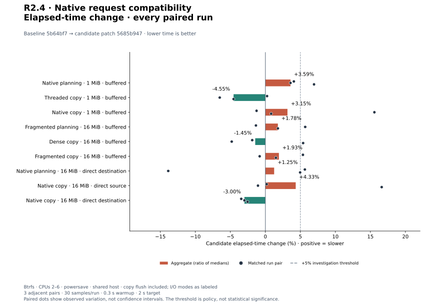
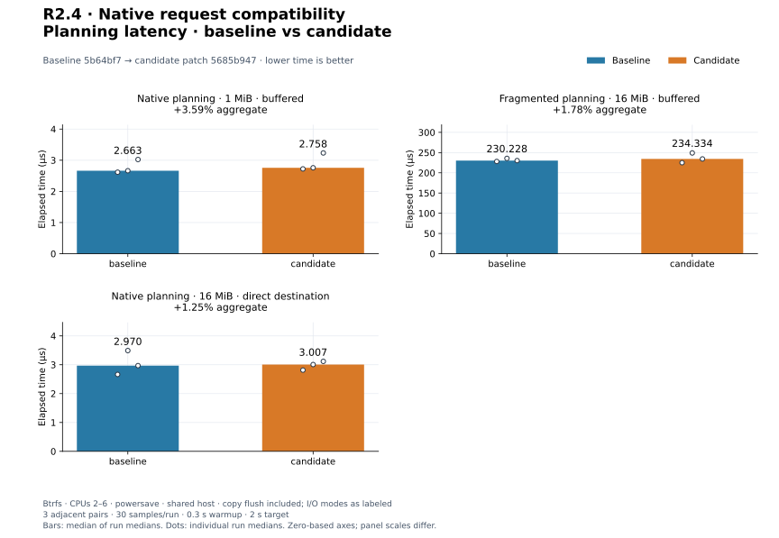
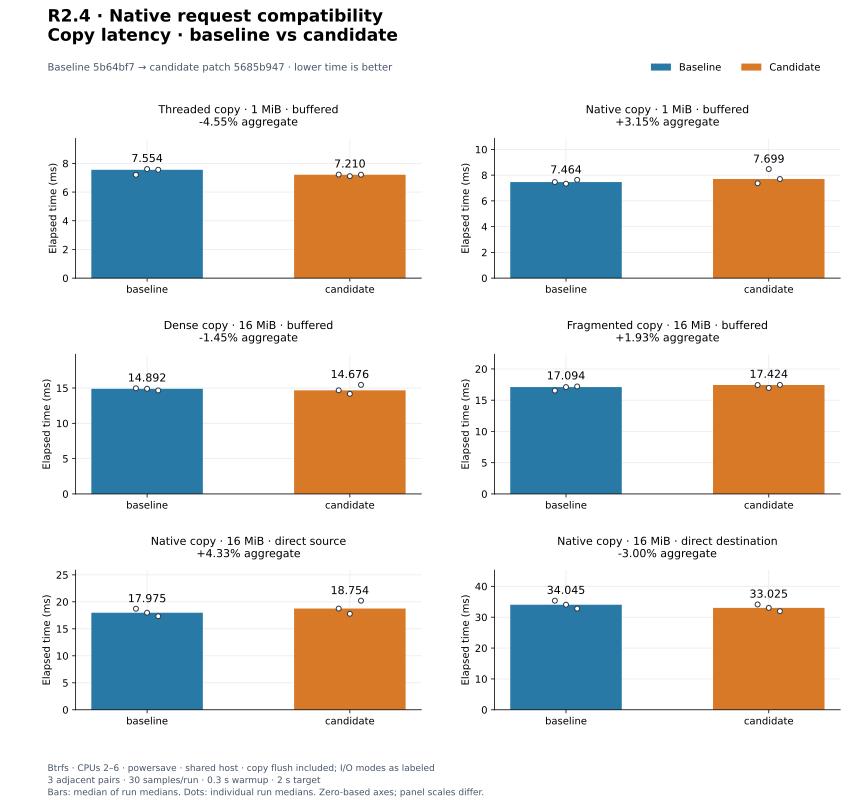
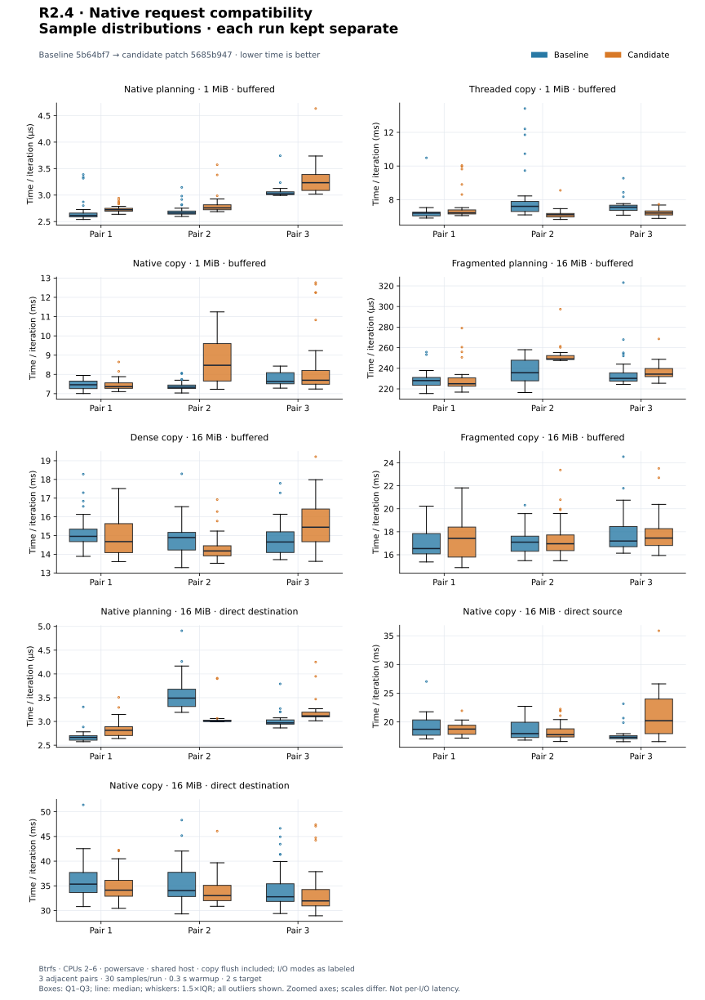
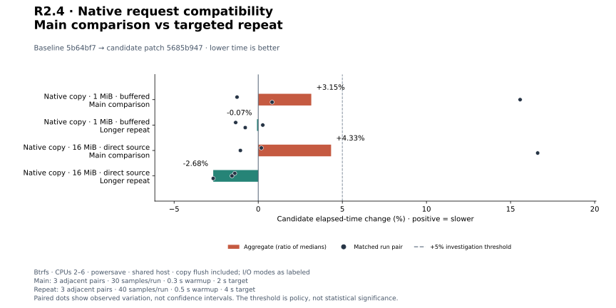
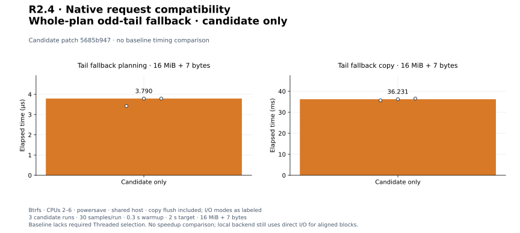

# R2.4 — Native request compatibility

Baseline: `5b64bf7` (R2.3 plus plots), with [matched benchmark harness](matched-harness.patch).
Final candidate: that source plus [candidate.patch](candidate.patch), SHA-256
`5685b947450bc974ebfd37b58446a9e8c81a4a8006876fed75a7e29dc5ca6413`.
[Environment, source, harness, and binary identities](environment.json) identify
the measured builds. No block, queue, worker, read-window, budget, or governor
default was tuned.

## Outcome and validation

Auto now selects Threaded for a complete incompatible RAW request plan and
records a structured reason. Explicit native rejects it. Fresh preparation
rejects a native plan that becomes incompatible before callbacks or sparse
prefix writes. [The contract](../../native-request-compatibility.md) defines
alignment, mode checks, changed-plan handling, and API limits. Runtime resource
preparation and general concurrent alias policy remain open.

**334 tests pass**, one unchanged allocation test is gated (335 distinct tests).
Formatting, strict all-target Clippy, and core/datamover wasm32 library compilation
pass. All six new integration tests also pass on the recorded Btrfs mount.
[Validation commands](validation.json), [workspace output](tests.txt),
[inventory](test-inventory.txt), and [storage output](storage-tests.txt) preserve
the checks. Storage command, with RVVDK_TEST_DIR set to the recorded storage path:

```text
cargo test -p rvvdk-datamover --test native_requests
```

Five mathematical tests and six integration tests cover typed incompatibility,
Data alignment after sparse prefixes, odd/tiny sizes, used/unused block splits,
mixed modes, fresh flags/declarations, observer parity, replanning, and budgets.
The main integration matrix executes 48 copies across endpoint modes, one/four
workers, and observed/unobserved paths. This is not broad runtime portability or
physical-allocation qualification. Plot tests and provenance checks also pass.

## Method

Optimized baseline and final candidate use separate absolute Cargo targets.
Nine workloads run in adjacent C/B, B/C, C/B pairs: 30 flat samples per process,
300 ms warmup, 2 s target, CPUs 2–6, and a fresh Criterion directory per run.
Deterministic incompressible source data and nonzero prefill use the recorded
Btrfs storage mount. No global cache drops; powersave and uncontrolled host load
limit qualification. Buffer/readback setup may warm data; direct descriptors still
bypass the page cache for native payload operations.

- Existing preflight: 1 MiB RAW, 64 KiB blocks, buffered endpoints, one-worker
  Threaded or io_uring QD8/read-window4. Complete copy times planning and flush.
- Existing progress: 16 MiB, buffered, 64 KiB blocks. Fragmented source alternates
  64 KiB Data/Hole extents. Copies execute/revalidate a prebuilt plan and flush.
- New native_requests: 16 MiB dense RAW, 64 KiB blocks, Auto QD8/read-window4.
  One endpoint is direct and the other buffered; both directions are measured.
  Complete copy includes fresh planning and flush. The direct-destination
  planning profile measures the request-check path without payload I/O.
- New tail fallback: 16 MiB + 7 bytes, buffered source/direct destination,
  same options. Auto selects one-worker Threaded before mutation.

Every copy resets and flushes a nonzero destination outside the timer, then
asserts selected backend, read/write counters, and full logical readback after
the timed public call. In particular, reset can use the local buffered alias
before direct payload execution; this is a matched API workload, not sustained
cold-storage throughput. New mixed-mode profiles are dense, not a qualification
of highly fragmented direct-I/O planning. GNU time CPU/RSS includes setup,
readback, and adaptive iteration counts, not per-copy resource consumption.

## Final comparison

Aggregates are medians of three run medians; positive changes mean slower.

| Workload | Baseline | Final candidate | Change | Paired changes |
|---|---:|---:|---:|---|
| `preflight/plan_native` | 2.663 µs | 2.758 µs | +3.59% | +4.06%, +3.59%, +6.95% |
| `preflight_copy/threaded` | 7.554 ms | 7.210 ms | -4.55% | +0.24%, -6.52%, -4.55% |
| `preflight_copy/native` | 7.464 ms | 7.699 ms | +3.15% | -1.26%, +15.57%, +0.82% |
| `progress_plan/fragmented50/plan` | 230.228 µs | 234.334 µs | +1.78% | -1.35%, +5.69%, +1.78% |
| `progress_copy/dense/unobserved` | 14.892 ms | 14.676 ms | -1.45% | -1.88%, -4.81%, +5.39% |
| `progress_copy/fragmented50/noop` | 17.094 ms | 17.424 ms | +1.93% | +5.36%, -0.82%, +1.50% |
| `native_requests_plan/direct_destination` | 2.970 µs | 3.007 µs | +1.25% | +5.64%, -13.88%, +4.96% |
| `native_requests_copy/direct_source` | 17.975 ms | 18.754 ms | +4.33% | +0.18%, -1.06%, +16.61% |
| `native_requests_copy/direct_destination` | 34.045 ms | 33.025 ms | -3.00% | -3.45%, -3.00%, -2.54% |

[All 54 runs](measurements.json), [summary](summary.json), and per-run
`pair*-*.txt`/resource logs retain commands, raw samples, estimates, and outliers.
Native small-plan aggregate increases **3.59%**, about **0.096 µs**. Mixed
native planning is **+1.25%**. Complete buffered RAW Threaded/native are
**−4.55%/+3.15%**; dense/fragmented progress copies **−1.45%/+1.93%**;
mixed direct-source/direct-destination copies **+4.33%/−3.00%**.

Do not infer a clean performance pass from those aggregates. Native RAW has a
**+15.57%** pair, and mixed direct-source has **+16.61%**. Other positive pairs
include native planning +6.95%, fragmented planning +5.69%, dense progress
+5.39%, fragmented no-op +5.36%, and mixed planning +5.64%. All remain visible.


[PNG](plots/relative-change.png).


[PNG](plots/planning-latency.png).


[PNG](plots/copy-latency.png).

<details>
<summary>Per-run sample distributions, with every outlier</summary>


[PNG](plots/sample-distributions.png). Samples are time divided by iterations,
not individual I/O latencies. Boxes show Q1–Q3, the median, 1.5×IQR whiskers, and
all outliers. Runs remain separate; panel axes are zoomed and have different units.

</details>

## Targeted final-candidate repeats

The two largest adverse copy pairs triggered three longer adjacent comparisons
for native RAW and mixed direct-source: B/C, C/B, B/C, 40 flat samples, 500 ms
warmup, and 4 s target. Source and binaries stayed fixed.

| Workload | Baseline | Final candidate | Change | Paired changes |
|---|---:|---:|---:|---|
| `preflight_copy/native` | 7.482 ms | 7.477 ms | -0.07% | -1.34%, +0.27%, -0.77% |
| `native_requests_copy/direct_source` | 19.149 ms | 18.636 ms | -2.68% | -1.40%, -1.56%, -2.68% |

[All 12 repeat runs](followup-measurements.json), [summary](followup-summary.json),
and `followup*-*.txt` retain the evidence. The [first collection attempt](followup-collection-failure.txt)
reused an old Criterion directory and failed its single-result assertion after
the benchmark completed. Its console/resource logs are retained separately;
these repeats use fresh directories. Repeat variability does not invalidate
the original adverse pairs or prove a particular cause.


[PNG](plots/followup-change.png).

## Same-binary mixed-I/O control

Run the **same baseline native_requests binary** twice in each of three adjacent
pairs for each mixed direction, using main-run sampling and the same storage.
First/second are execution slots, not different implementations. Every record
includes the identical executable hash; no candidate runs enter this control.

| Workload | First slot | Second slot | Change | Paired changes |
|---|---:|---:|---:|---|
| `native_requests_copy/direct_source` | 25.550 ms | 26.476 ms | +3.63% | +2.52%, +5.16%, -0.46% |
| `native_requests_copy/direct_destination` | 36.016 ms | 37.716 ms | +4.72% | +9.40%, -2.14%, +9.82% |

[All 12 control runs](control-measurements.json), [summary](control-summary.json),
and `control*-*.txt` record observations. Controls help characterize storage/host
variation; they do not rule out candidate effects or causally explain a specific
adverse pair. General performance qualification remains open.

## Candidate-only odd-tail fallback

[Smoke checks](tail-smoke.json) show the baseline fails the harness's expected
Threaded-selection assertion because it still chooses IoUring. This is **not**
a claim that every filesystem would reject its unaligned copy; that baseline
copy is not timed here. Candidate planning and complete-copy smoke checks pass.

Three final-candidate runs per profile use main sampling and assert complete
read/write byte equality for 16 MiB + 7 bytes. The threaded executor may still
use O_DIRECT for aligned backend requests and the buffered alias for the tail.
There is no native-io_uring bulk/tail hybrid or before/after speedup claim.

| Workload | Candidate median of run medians |
|---|---:|
| `native_requests_plan/tail_fallback` | 3.790 µs |
| `native_requests_copy/tail_fallback` | 36.231 ms |

[All six runs](candidate-only-measurements.json) and `tail-*.txt` retain samples,
commands, counters/readback checks, and process resources.


[PNG](plots/candidate-only.png).

## Error layout and retained initial measurements

An initial implementation stored NativeRequestIssue inline in core Error,
increasing its x86_64 size from 40 to 48 bytes. Final review boxed only this cold
diagnostic, preserving **40 bytes**; the checker and compatible path remain
allocation-free. [Layout probe](error-layout.json) records the observation.
No timing speedup is attributed to boxing.

The [initial source and measurements](initial-inline-error/README.md) retain
separate source/harness patches and executable identities, 54 main runs, six
candidate-only runs, and 18 longer repeats. Large opposing mixed-I/O timings
were observed there. They are not combined with the final candidate's samples.
The initial test build diagnostic for a missing libc dev dependency is also
preserved in that archive; the final dependency is Linux/test-only.

## Disposition and reproduction

Accept R2.4's request-safety behavior with the recorded small planning cost.
Performance remains **provisional**: adverse pairs, repeat/control variability,
and earlier PERF.0/R2.2/R2.3 costs remain open for controlled-runner qualification.
Do not change defaults or remove validation based on favorable aggregates.
ESXi is unnecessary. R2.5 addresses runtime resource preparation, not a retry
of an already partially executed native copy.

[Plot configuration](plot-config.json), [plotted values](plots/computed.json),
and [generator/input/output hashes](plots/manifest.json) identify the figures.
The [plot guide](../../../scripts/benchmarks/README.md) explains regeneration.
[Final audit](audit.json) covers source/harness/binary identity, validation,
raw data, plots, and local links. Historical R2.3 plots/evidence remain unchanged.
