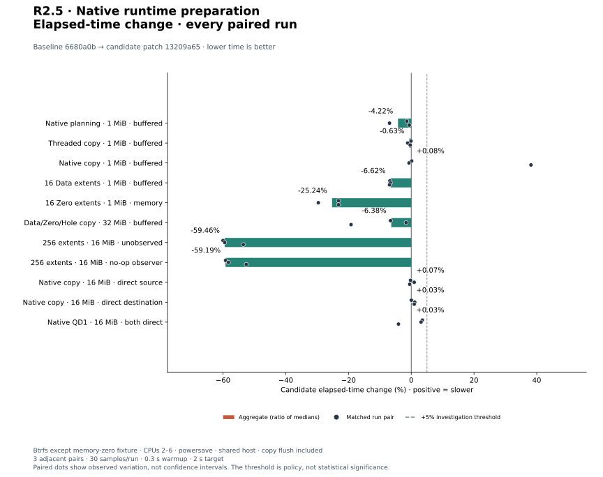
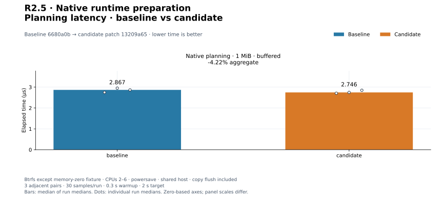
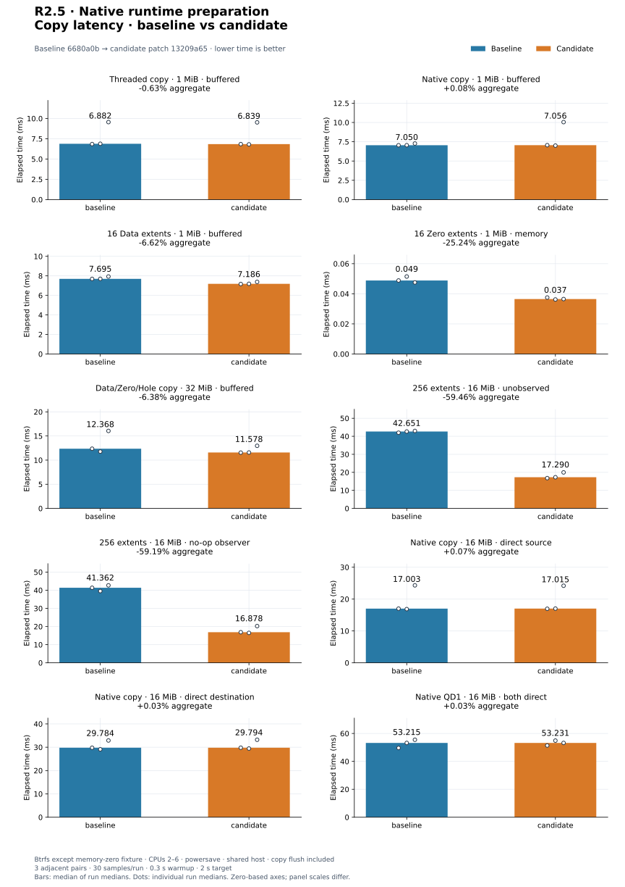
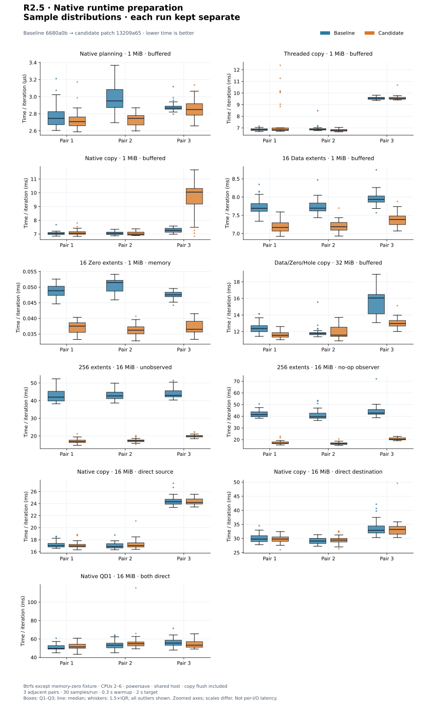
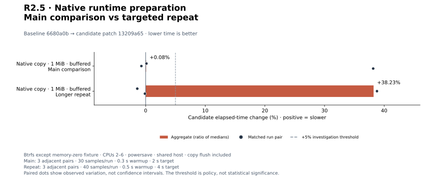
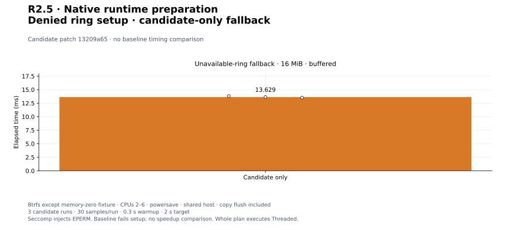

# R2.5 — Prepared native resources and per-job reuse

Baseline: `6680a0b`, plus the [matched new benchmark harness](matched-harness.patch).
Candidate: that baseline plus [candidate.patch](candidate.patch), SHA-256
`13209a6537265cabd622a1b1a485ae29acaa065fa9d14207072ac483468d55ea`.
[Environment and identities](environment.json) record source, harness, executable,
compiler, CPU, storage mount, and sampling context. Defaults were not tuned.

## Outcome

Native ring/pool/descriptor setup precedes initial observation and sparse writes.
One resource set serves every Data extent; sparse write fallback borrows a pool
buffer. Sparse-only jobs allocate scratch without creating a ring. Auto may
select Threaded only for defined unavailable/denied ring construction, with
separate Threaded budget admission and actual-backend progress/reporting.
Explicit native and all other setup errors reject; execution never retries after
mutation. [The runtime contract](../../native-runtime-preparation.md) defines
ownership, public diagnostics, timing, and limits.

**342 workspace tests passed; one unchanged allocation test remains gated**
(343 distinct tests). Formatting, strict all-target Clippy, and core/datamover
wasm32 compilation pass. Eight new runtime tests and six request tests also pass
on Btrfs. [Validation commands](validation.json), [test output](tests.txt),
[inventory](test-inventory.txt), and [storage validation](storage-validation.json)
preserve the checks. The isolated tests inject setup, descriptor-duplication,
and submission failures, validate observer parity and immutable plan provenance,
check fallback budgets, and verify descriptor cleanup on setup error/panic.
Existing engine lifetime, partial-I/O, and shutdown tests pass unchanged.

The [initial test-fixture failure](initial-fixture-failure.md) and output are
retained: missing EXTENTS capability hid its sparse map. This was corrected before
release measurement. Clippy also prompted boxing the native resources in dispatch;
all measurements below use the final implementation.

## Method and workload boundaries

Three adjacent C/B, B/C, C/B comparisons per workload: **30 flat samples/run**,
300 ms warmup, 2 s target, CPUs 2–6, fresh Criterion directories, separate release
Cargo targets. Deterministic data, nonzero destination prefill, full logical
readback after every timed copy, and matched final flush boundaries are retained.
Process CPU/RSS includes untimed fixture/reset/readback work and adaptive
iteration counts; it is not a per-copy memory/CPU measurement.

Storage fixtures use the recorded Btrfs mount on this development host; the
zero-only destination is an in-memory backend. There are no global cache drops.
Setup/readback can warm data. Direct payload bypasses page cache, but buffered
reset/verification aliases remain part of the API fixture. Powersave and shared
host load mean this is not controlled storage qualification or sustained large
cold-disk throughput. Do not infer cross-step speedups from differently timed
runs in previous reports.

| Harness | Workload and timed boundary |
|---|---|
| preflight | 1 MiB dense buffered RAW, 64 KiB blocks; planning or complete plan/copy/flush; Threaded one worker or native QD8/read-window4 |
| native_validation/data | 1 MiB buffered, 16 Data extents, 64 KiB blocks, QD8; low-level native extent copy plus external destination sync |
| native_validation/zero | 1 MiB in-memory destination, 16 Zero extents, 64 KiB blocks; low-level sparse fallback plus memory flush; reset/readback outside timer |
| local_sparse | 32 MiB buffered, 4 MiB Data / 4 MiB Zero / 20 MiB Hole / 4 MiB Data, 64 KiB blocks, QD8; execute/revalidate prebuilt RAW plan plus flush |
| native_runtime/fragmented | 16 MiB buffered, 256 alternating 64 KiB Data/Hole extents, 8 MiB transferred, QD8/read-window4; execute/revalidate prebuilt RAW plan plus flush, unobserved/no-op observer |
| native_requests | 16 MiB dense RAW, one direct endpoint in each direction, 64 KiB blocks, Auto QD8; complete planning/copy/flush |
| native_lifetime/direct | 16 MiB dense, both direct, 64 KiB blocks, QD1/read-window1; FD-only DataMover copy plus external flush; descriptor count checked outside timer |

The same checked-in harnesses run against both implementations; the only baseline
patch adds the native_runtime benchmark and registration. New fragmented copies
assert transferred and logical totals and full byte equality. Reuse does not
change logical extent order or pipeline scheduling.

## Final comparison

Aggregates are medians of three run medians. Positive changes mean slower.

| Workload | Baseline | Candidate | Change | Paired changes |
|---|---:|---:|---:|---|
| `preflight/plan_native` | 2.867 µs | 2.746 µs | -4.22% | -1.41%, -6.93%, -0.62% |
| `preflight_copy/threaded` | 6.882 ms | 6.839 ms | -0.63% | -0.07%, -1.14%, -0.34% |
| `preflight_copy/native` | 7.050 ms | 7.056 ms | +0.08% | +0.14%, -0.72%, +38.16% |
| `native_validation/data_1mib_16extents` | 7.695 ms | 7.186 ms | -6.62% | -6.82%, -6.62%, -6.92% |
| `native_validation/zero_destination_1mib_16extents` | 48.849 µs | 36.520 µs | -25.24% | -23.18%, -29.62%, -23.18% |
| `local_sparse/native` | 12.368 ms | 11.578 ms | -6.38% | -6.60%, -1.64%, -19.19% |
| `native_runtime/fragmented_unobserved` | 42.651 ms | 17.290 ms | -59.46% | -60.00%, -59.46%, -53.53% |
| `native_runtime/fragmented_noop` | 41.362 ms | 16.878 ms | -59.19% | -59.19%, -58.27%, -52.60% |
| `native_requests_copy/direct_source` | 17.003 ms | 17.015 ms | +0.07% | -0.23%, +0.94%, -0.50% |
| `native_requests_copy/direct_destination` | 29.784 ms | 29.794 ms | +0.03% | +0.03%, +1.11%, +0.94% |
| `native_lifetime/direct/q1_b65536` | 53.215 ms | 53.231 ms | +0.03% | +3.55%, +3.12%, -4.07% |

[All 66 runs](measurements.json), [summary](summary.json), and `pair*-*.txt` /
resource logs retain commands, raw samples, estimates, and outliers.

Fragmented native elapsed time falls **59.46% unobserved / 59.19% with a no-op
observer**, consistent across all three pairs. The 16-Data-extent profile falls
**6.62%**, the memory zero fallback **25.24%**, and the mixed local sparse profile
**6.38%**. These observations are consistent with eliminating repeated resource
setup, but do not isolate every implementation change's individual contribution.
Dense RAW native, both mixed directions, and direct QD1 aggregates change by
less than 0.1%; their individual runs still vary.

A **+38.16% native RAW pair** remains an unresolved adverse result despite the
+0.08% aggregate. It is not removed as an outlier or explained away by later runs.
Direct QD1 also retains +3.55%/+3.12% pairs. Planning is −4.22% in this run;
planning logic was not intentionally optimized, so do not call that a causal gain.

[PNG](plots/relative-change.png).

[PNG](plots/planning-latency.png).

[PNG](plots/copy-latency.png).

Every run's sample distribution, including outliers

[PNG](plots/sample-distributions.png). Samples are time divided by iteration
count, not individual I/O latency. Panels have different zoomed axes; runs remain
separate. Boxes show Q1–Q3, median, 1.5×IQR whiskers, and all outliers.

## Native RAW repeat and same-binary control

The +38.16% pair triggers three longer B/C, C/B, B/C pairs on unchanged source
and binaries: 40 flat samples, 500 ms warmup, 4 s target.

| Workload | Baseline | Candidate | Change | Paired changes |
|---|---:|---:|---:|---|
| `preflight_copy/native` | 7.041 ms | 9.733 ms | +38.23% | -1.40%, +38.80%, -0.12% |

[All six repeats](followup-measurements.json), [summary](followup-summary.json),
and `followup*-*.txt` preserve these runs. They do not invalidate the initial pair.

[PNG](plots/followup-change.png).

Three further pairs run **the same baseline preflight executable** twice with
main sampling. First/second are execution slots, not different implementations.

| Workload | First slot | Second slot | Change | Paired changes |
|---|---:|---:|---:|---|
| `preflight_copy/native` | 7.097 ms | 7.042 ms | -0.79% | +3.22%, -0.48%, -0.98% |

[All six controls](control-measurements.json), [summary](control-summary.json),
and `control*-*.txt` preserve the identical executable hashes. Controls measure
observed variation; they neither rule out candidate effects nor establish a cause
for the initial adverse pair. Controlled-runner qualification remains open.

## Focused follow-up diagnosis

Because the longer repeat also retained a large adverse pair, six additional
short adjacent comparisons use unchanged binaries, alternating B/C and C/B,
20 flat samples, 100 ms warmup, and 1 s target. These are a separate diagnostic,
not replacements for the main or longer-repeat measurements.

| Workload | Baseline | Candidate | Change | Paired changes |
|---|---:|---:|---:|---|
| `preflight_copy/native` | 7.241 ms | 7.252 ms | +0.14% | +2.10%, -3.50%, -2.40%, -0.18%, +0.34%, +0.97% |

[All 12 diagnostic runs](diagnostic-measurements.json) and
[summary](diagnostic-summary.json) preserve those observations.

Separate strace runs record io_uring_setup/enter, close, and durability calls with
wall timestamps and syscall durations. They perturb execution and are **excluded
from all performance aggregates**. [Commands and parsed cycles](syscall-diagnostics.json)
and `trace-*-syscalls.txt` retain the trace. Each parsed cycle spans ring setup
through the following durability call, excluding reset and earlier preflight.

| Traced implementation | Cycles | Median setup-through-flush | Median flush syscall |
|---|---:|---:|---:|
| baseline | 37 | 8.812 ms | 6.768 ms |
| candidate | 37 | 9.266 ms | 6.869 ms |

Trace timings are diagnostic observations, not a controlled attribution of the
untraced adverse pair. Native shutdown and durability remain inside the copy
boundary; neither is removed or weakened to improve measurements. The longer
repeat's **+38.23% aggregate / +38.80% adverse pair** remain open alongside the
main +38.16% pair.

## Candidate-only ring-unavailable fallback

A [small launcher](deny-uring-setup.c) installs a process-local seccomp filter that
returns EPERM from io_uring_setup, then execs the benchmark. It changes no host
kernel setting. [Compiler, launcher hash, and environment](unavailable-environment.json)
identify the injection. `RVVDK_BENCH_NATIVE_UNAVAILABLE=1` selects a 16 MiB dense
fixture with 256 Data extents, buffered endpoints, Auto QD8/one Threaded worker,
64 KiB blocks, prebuilt plan execution/revalidation, and final flush.

[Smoke checks](unavailable-smoke.json) show baseline execution fails with denied
native setup while the candidate reports Threaded and verifies full readback.
No baseline fallback timing or before/after speedup exists for this case.
Three candidate-only runs under the same denial yield **13.629 ms** median
of run medians. [Raw runs](candidate-only-measurements.json) and
`unavailable-*.txt` retain samples and process resources. The injected failure
models a denied setup syscall; it is not qualification of every kernel/container
policy. Every benchmark invocation really attempts preparation before fallback.

[PNG](plots/candidate-only.png).

## Disposition and reproduction

Accept R2.5's prepared ownership, failure boundaries, and per-job reuse. The
fragmented workload gains are consistent across measured pairs. General
performance qualification remains **provisional**, retaining the adverse native
RAW pair, repeat/control observations, and earlier PERF.0/R2 follow-ups.
No tuning defaults or correctness checks were relaxed.

[Plot configuration](plot-config.json), [computed values](plots/computed.json),
and [provenance manifest](plots/manifest.json) identify all six SVG/PNG charts.
Use the [plot guide](../../../scripts/benchmarks/README.md) to regenerate them.
[Final audit](audit.json) verifies source reconstruction, exact binary/harness
identity, raw sample calculations, validation, plots, and documentation links.
Earlier benchmark evidence remains unchanged. Next is R2.6's concurrent local
buffered/direct alias policy. ESXi is unnecessary for this step.
