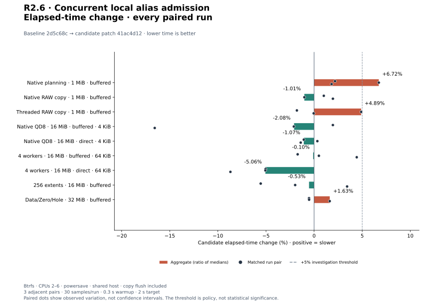
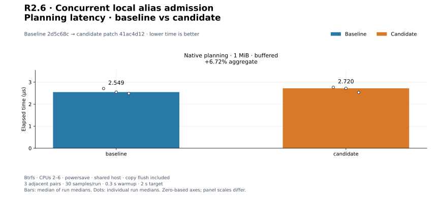
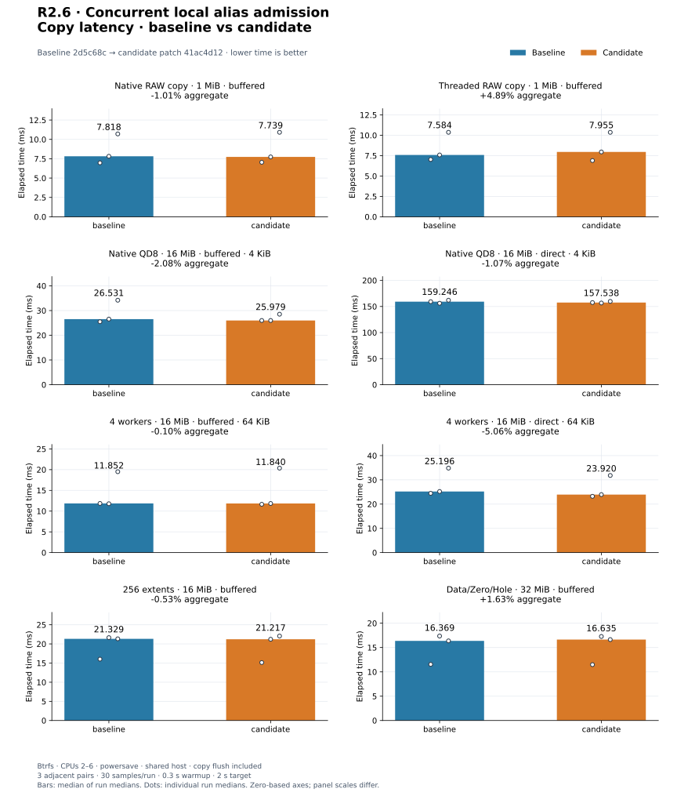
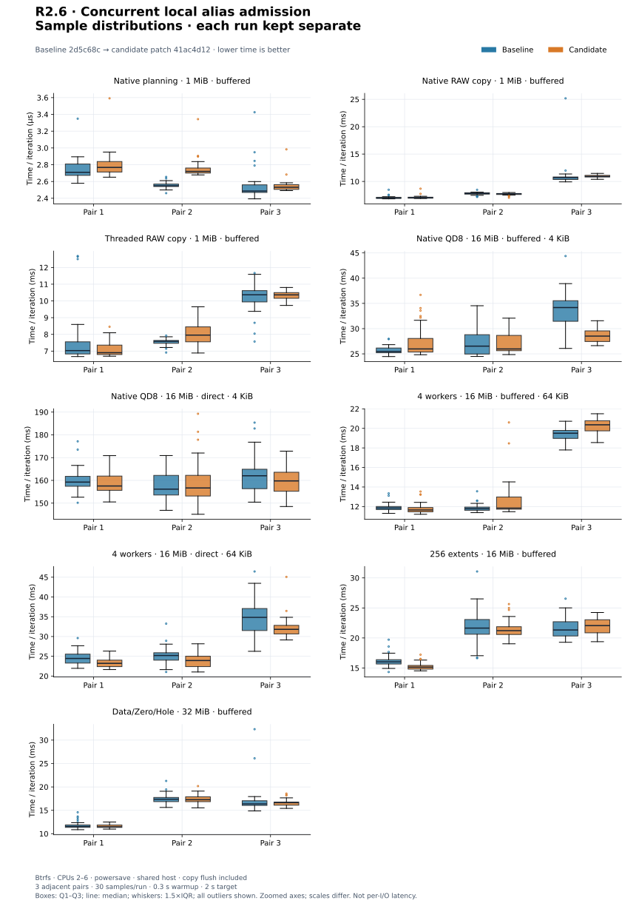
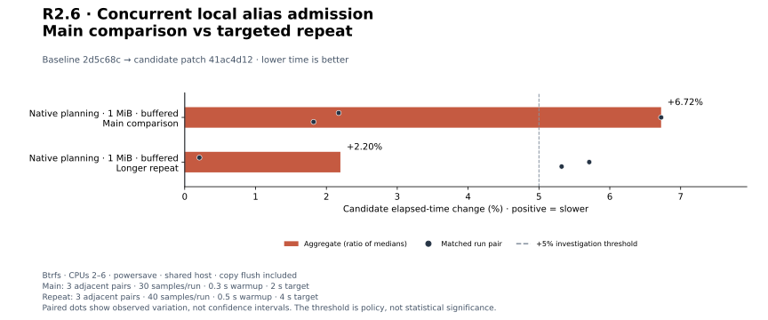

# R2.6 — Concurrent local alias admission

Baseline: **`2d5c68c`**, with unchanged checked-in benchmark harnesses.
Candidate: that baseline plus [candidate.patch](candidate.patch), SHA-256
`41ac4d120344527ce9fc9c4308760264bcb7073233d101eb6594d38ddc6dc32f`.
[Environment and identities](environment.json) record source, harness, executable,
compiler, CPU, mount, affinity, and sampling conditions. The empty
[matched-harness.patch](matched-harness.patch) records that no baseline adaptation
was needed. No tuning defaults changed.

## Outcome

Local methods and owned native requests now cooperate by file identity, including
independent opens and hard links. Overlapping writers and page-overlapping mixed
buffered/direct payload modes reject before I/O. Flush is a whole-file barrier;
sparse and inspection calls retain admission across their complete operation.
Native admission lasts until confirmed CQE or follows ownership into quarantine.
The [contract](../../local-file-concurrency.md) defines the matrix, failure and
retry behavior, memory-accounting boundaries, and external-writer responsibility.

**356 workspace tests passed; one unchanged allocation test remains gated**
(357 distinct tests). Formatting, strict all-target Clippy, and core/datamover
wasm32 compilation pass. The four new concurrency integrations, six request
integrations, and eight runtime integrations also pass on Btrfs.
[Validation commands](validation.json), [test output](tests.txt),
[inventory](test-inventory.txt), and [storage checks](storage-validation.json)
preserve the evidence. These checks do not renew physical-allocation qualification.

Fourteen new tests cover the symmetric conflict matrix, page edges, zero/overflow,
ID wrap, cross-thread release, unwind, hard-link aliases, native queue conflicts,
local direct and buffered fallback, sparse/inspection/flush exclusion, subpage
direct pipelines, negative CQE release, completion-buffer lifetime, and retained
admission after unconfirmed shutdown. Existing correctness assertions remain
unchanged. Two initial test compilations used nonexistent sparse method names;
[the first](development-tests-initial.txt) and
[the second](development-tests-second.txt) diagnostics are retained. The new
integration calls were corrected to the existing discard API before measurement.

## Method and boundaries

Three adjacent C/B, B/C, C/B comparisons for each of nine workloads: **30 flat
samples/run**, 300 ms warmup, 2 s target, CPUs 2–6, separate release build targets,
and fresh Criterion directories. Storage fixtures run on the recorded Btrfs mount.
Every timed copy includes final flush, with nonzero destination prefill/reset and
full logical readback outside timing. Native lifetime fixtures also check FD
counts outside timing. No global cache drops; reset and readback can warm caches.

The host uses powersave and is shared. Direct payload bypasses page cache, but
buffered reset/readback aliases remain in its fixture. These are warm local
experiments, not cold sustained device throughput, isolated lock latency, a
contention stress benchmark, or cross-filesystem qualification. No deliberate
conflicts are inserted into timed copies; deterministic conflict tests cover
rejection behavior. File registration is outside most timed copies, while native
owned-descriptor preparation remains inside their timed boundary. Opening-file
registry scaling and heavily contended multi-job admission remain unmeasured.

| Harness | Workload and timed boundary |
|---|---|
| preflight/plan_native | 1 MiB buffered dense RAW planning, including extent inspection; 64 KiB blocks, QD8/read-window4 intent |
| preflight_copy | 1 MiB buffered dense RAW; complete plan/copy/flush, 64 KiB blocks; native QD8 or one Threaded worker |
| native_lifetime/*/q8_b4096 | 16 MiB dense, both buffered or both direct; 4 KiB blocks, QD8; FD-only DataMover copy plus matched destination flush |
| native_lifetime/*/threaded_control | 16 MiB dense, both buffered or both direct; 64 KiB blocks, four workers; logical copy and final flush |
| native_runtime/fragmented_unobserved | 16 MiB buffered, 256 alternating 64 KiB Data/Hole extents, 8 MiB payload; QD8, prebuilt RAW plan execute/revalidate/flush |
| local_sparse/native | 32 MiB buffered, Data4/Zero4/Hole20/Data4 MiB; QD8, 64 KiB blocks; prebuilt RAW plan execute/revalidate/flush |

The four-worker profiles measure participating concurrent requests. The 4 KiB
native profiles exercise 4,096 reads and 4,096 writes per copy. Admission scans
active entries and takes a short per-file mutex on enqueue/release. Copy elapsed
time also includes filesystem, ring, worker, and flush costs, so these measurements
do not isolate mutex cost or establish a cause for apparent timing improvements.

All `*-resources.txt` logs retain /usr/bin/time CPU, RSS, faults, and context
switches. Main-run maximum RSS spans **16,512–112,108 KiB baseline**
and **16,264–111,912 KiB candidate**.
These are entire benchmark processes with different adaptive iteration counts,
fixture setup/reset/readback, and warmup; they are not per-copy memory or CPU costs.
No per-I/O tail-latency measurement is claimed.

## Final comparison

Aggregates are medians of three run medians. Positive changes mean slower.

| Workload | Baseline | Candidate | Change | Every paired change |
|---|---:|---:|---:|---|
| `preflight/plan_native` | 2.549 µs | 2.720 µs | +6.72% | +2.17%, +6.72%, +1.82% |
| `preflight_copy/native` | 7.818 ms | 7.739 ms | -1.01% | +1.01%, -1.01%, +1.95% |
| `preflight_copy/threaded` | 7.584 ms | 7.955 ms | +4.89% | -1.79%, +4.89%, -0.04% |
| `native_lifetime/buffered/q8_b4096` | 26.531 ms | 25.979 ms | -2.08% | +1.95%, -2.11%, -16.56% |
| `native_lifetime/direct/q8_b4096` | 159.246 ms | 157.538 ms | -1.07% | -1.07%, +0.34%, -1.39% |
| `native_lifetime/buffered/threaded_control` | 11.852 ms | 11.840 ms | -0.10% | -1.71%, +0.50%, +4.43% |
| `native_lifetime/direct/threaded_control` | 25.196 ms | 23.920 ms | -5.06% | -5.04%, -5.06%, -8.70% |
| `native_runtime/fragmented_unobserved` | 21.329 ms | 21.217 ms | -0.53% | -5.55%, -1.97%, +3.43% |
| `local_sparse/native` | 16.369 ms | 16.635 ms | +1.63% | -0.53%, -0.52%, +1.63% |

[All 54 runs](measurements.json), [summary](summary.json), and `pair*-*.txt` /
resource logs retain commands, raw samples, estimates, and outliers.

Planning is **+6.72%**, about **0.171 µs** on this host. It now takes extent-read
admission; that added bookkeeping is a plausible contributor, not an isolated
causal measurement. The main +6.72% planning pair triggers the longer repeat below.
All eight copy aggregates lie between **−5.06% and +4.89%**; no copy pair exceeds
+5%. The favorable −16.56% buffered small-block pair and −5.06% four-worker direct
aggregate are retained without claiming admission makes copying faster.

[PNG](plots/relative-change.png).

[PNG](plots/planning-latency.png).

[PNG](plots/copy-latency.png).

Every run's sample distribution, including outliers

[PNG](plots/sample-distributions.png). Normalized samples are time divided by
iteration count, not individual I/O latency. Panels use different zoomed axes;
boxes show Q1–Q3, median, 1.5×IQR whiskers, and all outliers.

## Planning follow-up

Three longer B/C, C/B, B/C pairs use unchanged source and binaries: **40 flat
samples/run**, 500 ms warmup, 4 s target, same storage and CPU affinity.

| Workload | Baseline | Candidate | Change | Every paired change |
|---|---:|---:|---:|---|
| `preflight/plan_native` | 2.433 µs | 2.486 µs | +2.20% | +0.21%, +5.71%, +5.32% |

[All six repeats](followup-measurements.json), [summary](followup-summary.json),
and `followup*-*.txt` retain these measurements separately. The repeat aggregate
is **+2.20%**, about **0.053 µs**, and the **+5.71%/+5.32% pairs** remain visible.
The repeat does not invalidate the +6.72% main result. Accept this bounded observed
planning cost for the added admission guarantee; controlled-runner attribution,
registry scaling, and contention costs remain open. No default or correctness
check was weakened to reduce overhead.

[PNG](plots/followup-change.png).

## Disposition and reproduction

Accept R2.6's cooperative correctness policy and record its observed planning
cost. General performance qualification remains **provisional**. Earlier adverse
results, including R2.5's +38.16% native RAW pair and +38.23% longer-repeat
aggregate, remain unresolved; this differently timed comparison does not erase
them. Cold storage, contention scaling, and sustained runs belong to PERF.0.

[Plot configuration](plot-config.json), [computed values](plots/computed.json),
and [provenance manifest](plots/manifest.json) identify five SVG/PNG charts.
Use the [plot guide](../../../scripts/benchmarks/README.md) to regenerate them.
[Final audit](audit.json) verifies source reconstruction, binary/harness hashes,
raw medians and pair calculations, validation, chart reproducibility, and local
links. Earlier evidence remains unchanged. Next is R3.1: local RAW inspect/plan
CLI. ESXi is unnecessary for this step.
