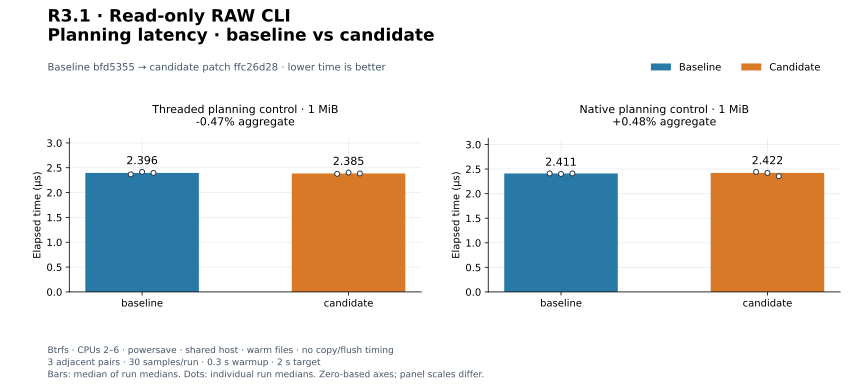
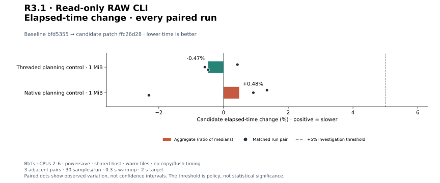
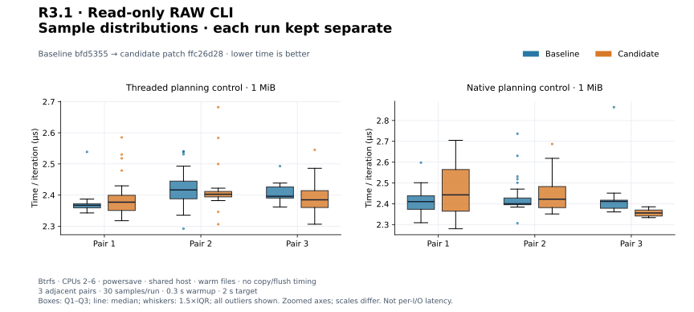
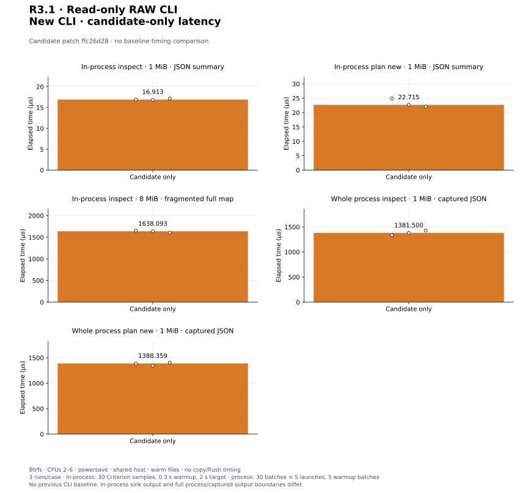

# R3.1 — Read-only RAW CLI

Baseline: **`bfd5355`**, with unchanged library benchmark harnesses.
Candidate: that baseline plus [candidate.patch](candidate.patch), SHA-256
`ffc26d2865ec7bf5820582c1903b4094156b0de6eaecf236bf2f1db1bb422d09`.
[Environment and identities](environment.json) and [build commands](build-commands.json)
record compiler, source, harness, release binary, storage, and affinity evidence.
The empty [matched-harness.patch](matched-harness.patch) records no baseline
adaptation. No existing library implementation or tuning default changed.

## Outcome and validation

The new rvvdk-cli crate provides **rvddk inspect/plan**, explicit RAW format,
versioned JSON and human output, meaningful exit codes, optional full extent maps,
and configuration validation. Source discovery/topology/budget logic stays in the
libraries. Plan is a non-executable preview: destination metadata is checked
without writable opens; new output defaults to no-clobber intent; existing output
requires --overwrite and enough capacity. Known aliases and destination symlinks
reject. Native selection/readiness is explicitly deferred without a writable
endpoint, and the payload estimate is labeled Threaded for every request.
See the [CLI contract](../../cli.md) and [ADR-0030](../../adr/0030-read-only-cli-preview.md).

**368 workspace tests passed; one unchanged allocation test remains gated**
(369 distinct tests). Formatting, strict all-target Clippy, and core/datamover
wasm32 compilation pass. The CLI's twelve tests also pass on Btrfs.
[Validation](validation.json), [test output](tests.txt), [inventory](test-inventory.txt),
and [storage checks](storage-validation.json) retain commands and results.
Clippy output was captured on this exact source before release compilation;
no source changes followed it. A first scaffold check ran before the declared
benchmark file existed; its [manifest diagnostic](initial-manifest-error.txt) is
retained. After the file was added, compilation and all executable tests passed.

Tests cover dense/empty/odd/sparse images, library topology parity, JSON contracts,
no creation or content changes, explicit overwrite/tail reporting, read-only
existing output, hard-link aliases, symlinks, missing parents, special files,
invalid options, metadata budget versus execution estimates, non-UTF-8 paths,
output write/flush errors, and bounded binary execution. Six isolated exec cases
successfully preview new/existing output with all backend requests while seccomp
denies writable opens, creation/truncation/allocation, and ring setup. This is a
process-local test filter, not a change to host policy. Ordinary FIFO rejection
is bounded; concurrent namespace swaps are outside the stable-input contract.

## Method and workload boundaries

Matched controls use existing 1 MiB buffered dense RAW planning, 64 KiB blocks,
with Threaded or native QD8/read-window4 selection. Three adjacent C/B, B/C, C/B
pairs per case use **30 flat Criterion samples**, 300 ms warmup and a 2 s target,
CPUs 2–6, separate release Cargo targets, and fresh Criterion directories.
Planning opens no ring and modifies no output. It is not a copy/flush benchmark.

All fixtures use the recorded Btrfs mount, with warm cache and no global cache
drops. The host uses powersave and is shared. No repeat is triggered because all
matched aggregates and pairs are below the +5% investigation threshold. New CLI
costs have no prior CLI baseline; they are reported separately, with no speedup
claim and no comparison to unmatched library timings.

The added Criterion CLI harness measures complete **in-process** argument cloning,
parsing, read-only source open, extent discovery, report construction and JSON
serialization into an I/O sink. It includes destination metadata inspection for
plan. Fixture construction, fsync, an untimed JSON parse/correctness check, and
cleanup are outside timing. Three runs per case use the same Criterion sampling.

| New CLI workload | Fixture and output |
|---|---|
| inspect_dense_json | 1 MiB nonzero dense source; summary JSON |
| plan_new_json | Same dense source; missing output path, default Threaded preview, summary JSON; assert no output is created |
| inspect_fragmented_extents_json | 8 MiB source, alternating 4 KiB allocated/hole ranges; full extent JSON; fixture must expose at least 1,024 extents |

Separate **whole-process** measurements include taskset, process launch/dynamic
loading, the command, stdout/stderr capture, and exit. For each inspect/plan case,
three runs take 30 samples of five sequential launches after five warmup batches.
Python perf_counter_ns records each launch-through-capture duration; sums are
normalized by five. Exit code, JSON logical size, empty stderr, and absent output
are checked outside timing. Input bytes are checked unchanged after all runs.
There are 900 measured and 150 warmup launches. These use the same dense 1 MiB
fixture and CPU affinity; they are not isolated executable startup timings.
The saved sample container follows the plot input schema; these six runs are
explicitly tagged as perf_counter_ns measurements, not Criterion estimates.

All Criterion process CPU/RSS/fault/context-switch logs are retained in
`*-resources.txt`. They include warmup, setup and adaptive iteration counts,
so they are not per-preview CPU/RSS figures. Whole-process launch sampling retains
elapsed times only. Neither experiment measures copy throughput, cold storage,
contention, or io_uring runtime availability.

## Final comparison

Library controls: aggregates are medians of three run medians. Positive means
slower. Identical library source does not imply identical benchmark executables:
the new CLI enables additional already-locked clap help/usage features in the
candidate workspace build. Both exact executable hashes are recorded.

| Workload | Baseline | Candidate | Change | Every paired change |
|---|---:|---:|---:|---|
| `preflight/plan_threaded` | 2.396 µs | 2.385 µs | -0.47% | +0.43%, -0.58%, -0.47% |
| `preflight/plan_native` | 2.411 µs | 2.422 µs | +0.48% | +1.34%, +0.92%, -2.30% |

[All 12 controls](measurements.json), [summary](summary.json), and `pair*-*.txt`
retain commands, samples, estimates, outliers, and process resources.
The −0.47%/+0.48% aggregates are observed variation, not engine optimizations.

[PNG](plots/planning-latency.png).

[PNG](plots/relative-change.png).

[PNG](plots/sample-distributions.png). Samples are elapsed time divided by
iteration count. Zoomed axes differ; boxes show Q1–Q3, median, 1.5×IQR whiskers,
and all outliers. This is not per-I/O latency.

## New CLI measurements

These are candidate-only costs; no prior CLI exists in the baseline.

| Workload | Median of run medians | Every run median |
|---|---:|---|
| `cli_preview/inspect_dense_json` | 16.913 µs | 16.913 µs, 16.842 µs, 17.162 µs |
| `cli_preview/plan_new_json` | 22.715 µs | 24.904 µs, 22.715 µs, 22.086 µs |
| `cli_preview/inspect_fragmented_extents_json` | 1.638 ms | 1.655 ms, 1.638 ms, 1.607 ms |
| `cli_process/inspect_json` | 1.381 ms | 1.337 ms, 1.381 ms, 1.428 ms |
| `cli_process/plan_json` | 1.388 ms | 1.388 ms, 1.344 ms, 1.406 ms |

[All 15 run records](candidate-only-measurements.json) preserve 9 Criterion runs
and 6 whole-process runs, with [computed summary](candidate-only-summary.json).
`cli*-*.txt` and resource logs retain Criterion diagnostics. Whole-process records
contain the exact argv and raw batch times/iteration counts. Dense in-process
inspection/preview is about 17/23 µs here; fragmented full-map output is about
1.64 ms; whole-command dense inspection/preview is about 1.38/1.39 ms.
These boundaries differ and must not be combined into a speedup or startup-cost
subtraction. Do not extrapolate to cold files, huge maps, or loaded production hosts.

[PNG](plots/candidate-only.png).

## Disposition and reproduction

Accept the read-only CLI workflow and record its initial performance baseline.
No default changed and no earlier qualification issue is closed. PERF.0 and prior
adverse pairs, including R2.6 planning and R2.5 native RAW results, remain open.
Next is R3.2: bounded verification, copy, and safe output creation/publication.
ESXi is unnecessary for this local step.

[Configuration](plot-config.json), [computed values](plots/computed.json), and
[manifest](plots/manifest.json) identify four SVG/PNG figures. The
[plot guide](../../../scripts/benchmarks/README.md) documents regeneration.
[Audit](audit.json) checks reconstructed source, binary/harness hashes, raw
sample calculations, validation, documentation links, and chart reproducibility.
Earlier benchmark evidence remains unchanged.
