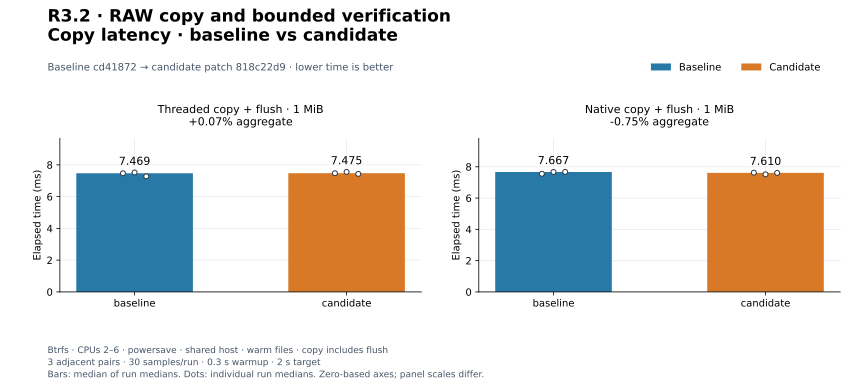
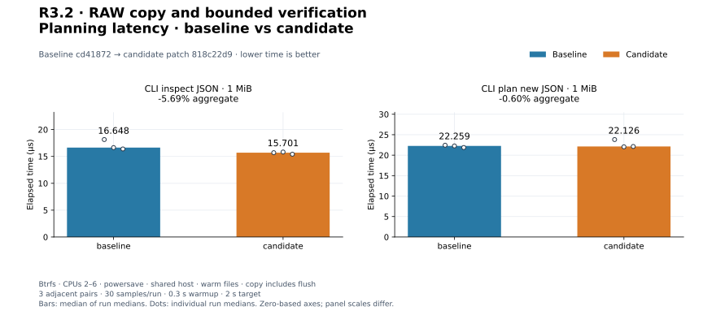
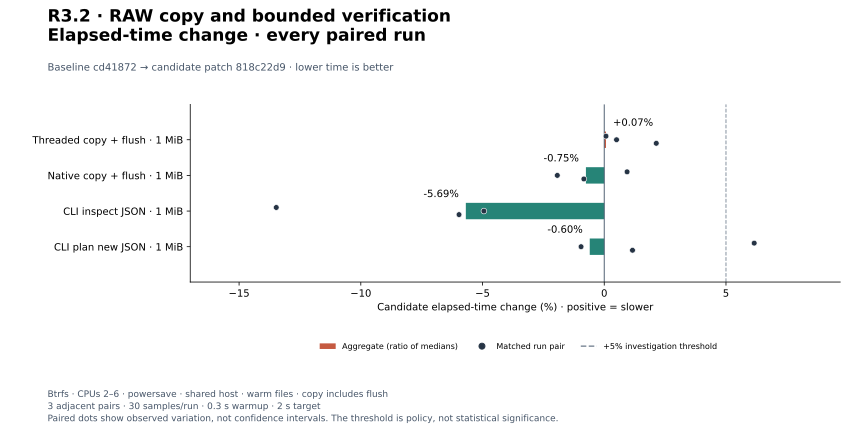
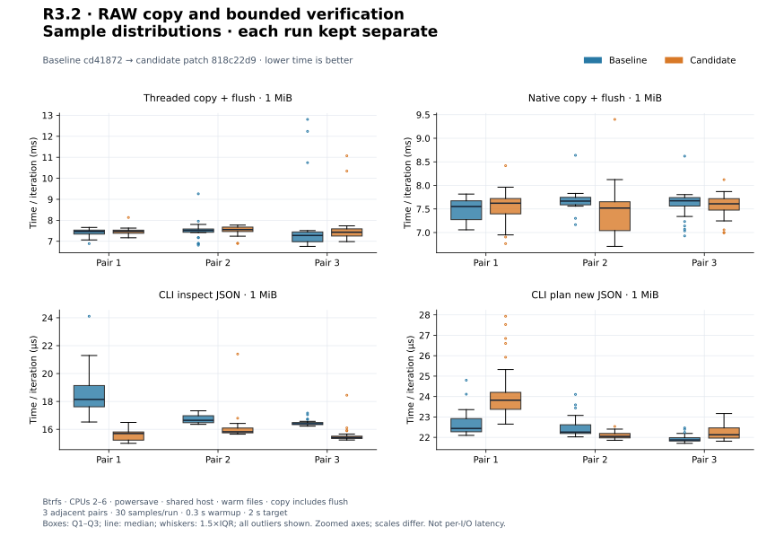
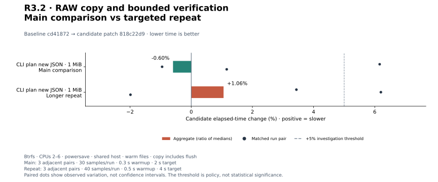
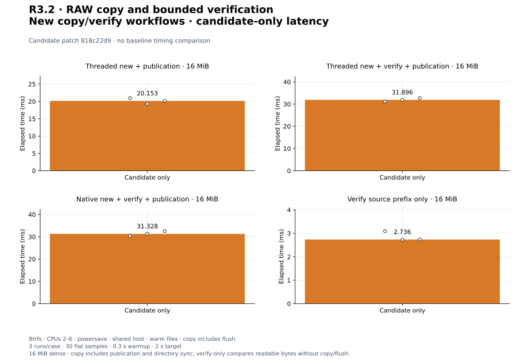

# R3.2 — RAW copy, bounded verification and private publication

Baseline: **`cd41872`**. Final candidate: that baseline plus
[candidate.patch](candidate.patch), SHA-256 `818c22d91e5f9c16d68ed3d9ee2ea52799f36cb25642312acebe47ee45a36745`.
[Environment](environment.json) and [build commands](build-commands.json) identify
source, toolchain, matched harnesses, release binaries, storage and affinity.
The empty [matched-harness.patch](matched-harness.patch) records an unmodified
baseline. Initial implementation measurements are retained under [initial/](initial/README.md),
with their own source patch, binaries and validation; they are not final-source results.

## Outcome and validation

Add CLI copy/verify, a reusable two-buffer Verifier, and owned buffered-descriptor
adoption. New output stays anonymous until copy/flush/optional verification and
file sync succeed, then uses no-clobber publication and directory sync. Explicit
overwrite keeps its inode and tail, reporting potential partial effects. Live
metadata checks detect observed source changes. Requested/planned/actual backend,
Auto fallback, verification, counters, payload budget and durability are reported.
Failures distinguish private, uncertain, modified and published output; report
failure after success retains the completed result. See the
[transfer contract](../../cli-transfer.md) and
[ADR-0031](../../adr/0031-local-copy-publication.md).

**382 workspace tests passed; one unchanged allocation test remains gated**
(383 distinct tests). Formatting, strict all-target Clippy and core/datamover
wasm32 library compilation pass. All **18 CLI integration tests** also pass on
Btrfs. [Validation](validation.json), [raw tests](tests.txt),
[inventory](test-inventory.txt), [storage validation](storage-validation.json)
and [release smoke checks](release-smoke.json) preserve evidence. Final-source
workspace tests and Clippy were captured after parser optimization and before
release measurement. No source changes followed those builds and checks.

Fourteen new tests cover descriptor adoption/rights, bounded and empty verification,
first mismatch including a hole and final short block, larger destinations,
combined verification/copy budgets, aliases, symlinks, no-clobber, inode/tail
preservation, dense/empty/odd/sparse copies across all backend requests, and
output-report failure after completion. Two bounded child executions deny ring
setup with a process-local seccomp filter: Auto falls back and explicit native
fails without publishing. Private test hooks exercise corruption, observed source
mutation, racing name creation, in-place failure and pre-file-sync/post-publication
failure states. Sync hooks inject errors immediately before those calls; they
are state-machine tests, not kernel fsync fault injection or power-loss proof.

Initial diagnostics are retained. An early check reported missing symbols despite
the source definitions being present; refreshing the affected source timestamps
forced dependency rebuilding and the repeated check passed. One test originally
wrote zero into a zero-filled hole while expecting a mismatch; changing that test
byte to nonzero made the intended corruption real. All final checks passed.
See [check failure](initial/initial-check.txt),
[check repeat](initial/check-repeat.txt), and
[fixture failure](initial/initial-hole-fixture-failure.txt).

## Method and workload boundaries

Four unchanged matched controls use three adjacent C/B, B/C, C/B pairs:
**30 flat Criterion samples**, 0.3 s warmup, 2 s target; CPUs 2–6, separate
release build targets and fresh Criterion directories. The 1 MiB buffered dense
library copy uses 64 KiB blocks, one Threaded worker or native QD8/read-window4.
Its timer includes planning/preparation/copy/final flush. Destination prefill and
flush, fixture setup and read-back correctness checks are outside timing.

CLI controls use dense 1 MiB input and summary JSON: inspect and missing-output
plan. Their timer includes in-process argument cloning/construction/parsing,
opening/inspection, planning where applicable, report creation and serialization
into a sink. They perform no copy/flush or ring setup. Filesystem fixtures use the
recorded Btrfs mount, warm cache and no cache drop. This shared host uses powersave.
Final performance runs did not overlap our release builds; other host activity
is uncontrolled. No cold-storage, sustained-device or multi-job qualification is
claimed. Positive matched changes mean slower; aggregates are medians of three
run medians, with every pair retained.

The initial eager command tree added roughly 4–5 µs to inspect/plan (main
aggregates +25.27%/+24.01%). Clap's deferred subcommand construction now builds
only selected options, with shared builders replacing cloned argument trees.
The initial 24 controls, 12 longer repeats and 12 candidate-only runs remain
under initial/. Later initial repeats overlapped the optimization release build,
so those repeats are additionally confounded and are not qualification evidence.
Final comparisons below use the optimized source and fresh complete runs.
No executor tuning defaults or existing control harnesses changed.

## Final comparison

| Workload | Baseline | Candidate | Change | Every paired change |
|---|---:|---:|---:|---|
| `preflight_copy/threaded` | 7.469 ms | 7.475 ms | +0.07% | +0.07%, +0.51%, +2.14% |
| `preflight_copy/native` | 7.667 ms | 7.610 ms | -0.75% | +0.94%, -1.93%, -0.84% |
| `cli_preview/inspect_dense_json` | 16.648 µs | 15.701 µs | -5.69% | -13.47%, -4.94%, -5.97% |
| `cli_preview/plan_new_json` | 22.259 µs | 22.126 µs | -0.60% | +6.16%, -0.95%, +1.16% |

[All 24 main runs](measurements.json), [summary](summary.json), and `pair*.txt`
retain commands, sample arrays, estimates, outliers and resource logs. CLI
latency changes include parser construction; they are not data-plane speedups.
Library differences on this shared host do not establish an engine optimization.

[PNG](plots/copy-latency.png).

[PNG](plots/planning-latency.png).

[PNG](plots/relative-change.png).

[PNG](plots/sample-distributions.png). Samples are elapsed time divided by iteration
count. Independent zoomed axes, Q1–Q3 boxes, median, 1.5×IQR whiskers and all
outliers show run variability; these are not per-I/O latency distributions.

The +5% aggregate/individual-pair threshold triggered longer repeats for the
cases below: 40 flat samples, 0.5 s warmup, 4 s target, three B/C, C/B, B/C pairs.
The longer results remain distinct from the primary experiment. The plan repeat
aggregate is +1.06%, but an individual pair remains +6.20%. Accept this measured
preview cost for this step and keep controlled-runner attribution open.

| Workload | Baseline | Candidate | Change | Every paired change |
|---|---:|---:|---:|---|
| `cli_preview/plan_new_json` | 22.785 µs | 23.026 µs | +1.06% | +3.44%, +6.20%, -1.99% |

[Repeat records](followup-measurements.json) and [summary](followup-summary.json).

[PNG](plots/followup-change.png).

## New workflow baseline

Twelve candidate-only runs use 16 MiB dense deterministic xorshift data, buffered
files and 64 KiB blocks; Threaded copy has four workers, native QD8/read-window4.
All include in-process argument parsing and JSON serialization to a sink. Copy
includes creation, planning/preparation, payload I/O, engine final flush, optional
full logical read-back, file sync, no-replace publication and directory sync.
Verify-only performs read comparison on a prepopulated destination without writes
or flush. It is a different operation, not a faster equivalent copy.

Setup, source fsync, untimed report/backend assertions, full destination read-back
after every iteration, and output unlink/cleanup are outside timers. Verify-only
uses fs::copy to populate its destination; the filesystem may share storage.
Fixtures and correctness reads keep caches warm. These boundaries exclude process
launch, terminal rendering, cold-device behavior and physical-media verification.
The baseline has no copy/verify commands, so no matched speedup is available.

| Workload | Median of run medians | Every run median |
|---|---:|---|
| `cli_transfer/threaded_new` | 20.153 ms | 20.951 ms, 19.306 ms, 20.153 ms |
| `cli_transfer/threaded_new_verify` | 31.896 ms | 31.162 ms, 31.896 ms, 32.693 ms |
| `cli_transfer/native_new_verify` | 31.328 ms | 30.470 ms, 31.328 ms, 32.562 ms |
| `cli_transfer/verify_only` | 2.736 ms | 3.095 ms, 2.726 ms, 2.736 ms |

[All 12 new-workflow runs](candidate-only-measurements.json) and
[summary](candidate-only-summary.json) retain every sample/median. Transfer
resource logs include setup, warmup, correctness checks and adaptive iterations;
they are not per-copy CPU/RSS figures or a memory-budget proof.

[PNG](plots/candidate-only.png).

## Disposition and reproduction

Accept the bounded copy/verification/publication workflow and its measured
initial baseline. Record all adverse pairs; shared-host variation and prior
performance qualifications remain open. Do not derive engine defaults from these
small warm-file measurements. PERF.0, R2.5/R2.6 and earlier adverse results remain
open. Next is **R3.3 progress lifecycle and cancellation**; ESXi is unnecessary.

[Plot configuration](plot-config.json), [computed values](plots/computed.json),
[manifest](plots/manifest.json) and [audit](audit.json) retain provenance and
reproduction checks. Use the [plot guide](../../../scripts/benchmarks/README.md)
to regenerate SVG/PNG without rerunning workloads. Prior reports are unchanged.
