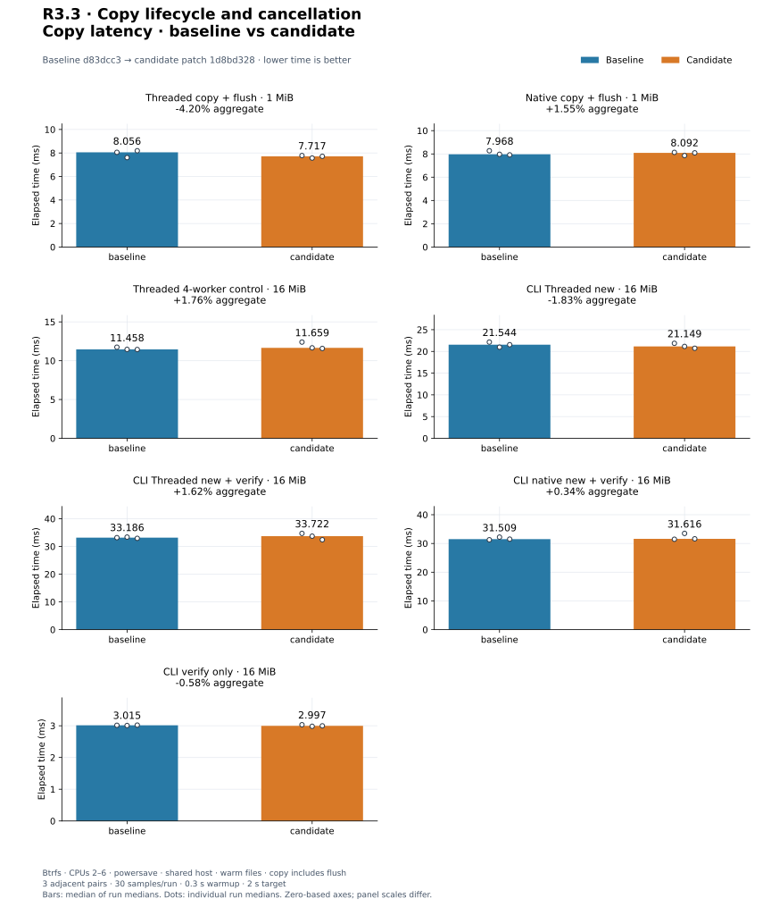
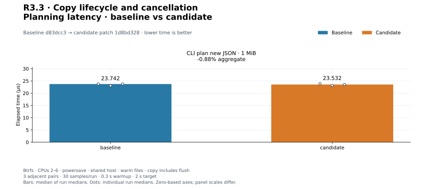
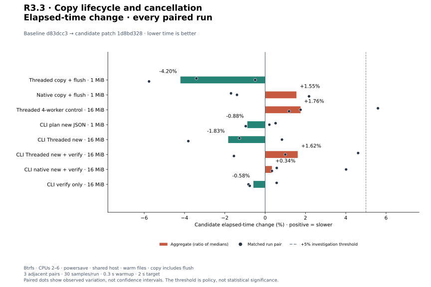
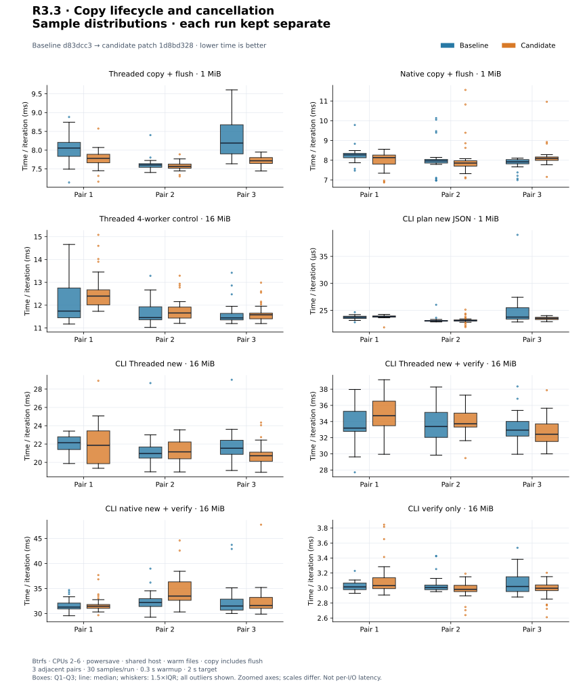
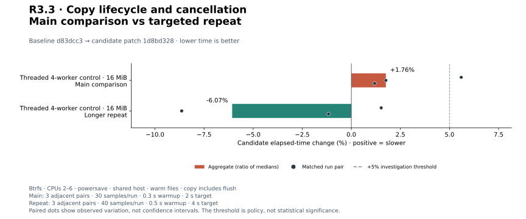
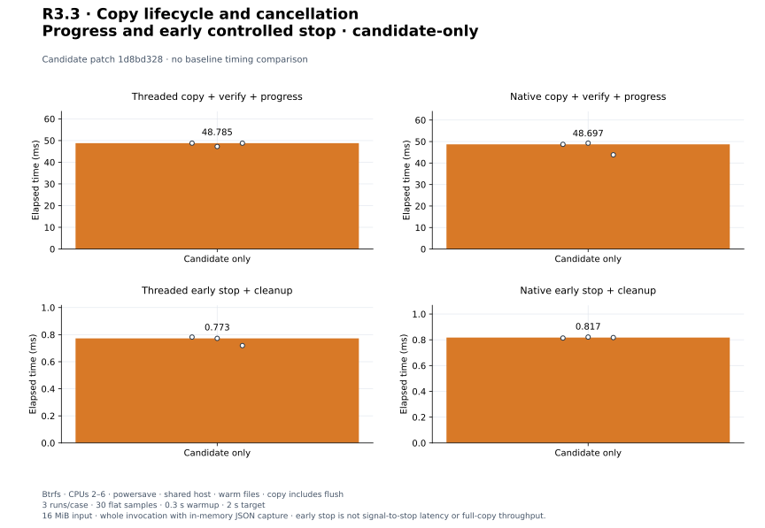

# R3.3 — Lifecycle progress and cooperative cancellation

Baseline **`d83dcc3`**, unchanged control harnesses. Final candidate: baseline plus
[candidate.patch](candidate.patch), SHA-256 `1d8bd3284d99ce424605367aa77708aaa0d930d042084f48b3fd33a2ac9484fd`.
[Environment](environment.json), [build commands](build-commands.json) and the
empty [matched-harness.patch](matched-harness.patch) record source, binary,
compiler, hardware, filesystem, affinity and harness provenance. Earlier measurements
under [initial/](initial/README.md) are retained separately and do not represent
final-source results. No third-party versions or executor tuning defaults changed.

## Outcome and validation

Controlled execution APIs add coordinator-owned Preparing/Started/Transferring/
Flushing/Completed/Cancelled/Failed events and sticky cancellation. Sequential
copies check blocks and read/write boundaries; workers check cancellation and
publish cumulative deltas to a fixed aggregate; native pipelines check completions
and refills, retaining existing owned shutdown/quarantine. Verification adds block
checkpoints and matching-prefix callbacks. Old snapshot APIs retain their cadence;
unobserved copies use generic no-op checkpoints.

CLI --progress emits human stderr lines or JSON lines without changing stdout
success schemas. Binary-only SIGINT/SIGTERM handlers record an atomic request;
embedded CLI calls install no handlers. Engine completion maps to copy_flushed,
and CLI completion follows verification/publication/durability. Cancellation after
linking finishes parent sync/name inspection and reports published output, without
unlinking. Output errors stop cooperatively; uncertain native cleanup remains an
operational failure. See the [contract](../../cli-progress.md) and
[ADR-0032](../../adr/0032-copy-lifecycle-cancellation.md).

**393 workspace tests passed; one existing allocation test is gated** (394 distinct).
Formatting, all-target strict Clippy, portable core/datamover wasm32 compilation,
**24 CLI integration tests** and **five controlled-execution tests** on Btrfs pass.
[Validation](validation.json), [tests](tests.txt), [inventory](test-inventory.txt),
[CLI storage validation](storage-validation.json) and
[controlled storage validation](storage-controlled-validation.json) retain evidence.
[Release smoke checks](release-smoke.json) cover public help/progress/report output.
The wasm check retains one dead-code warning for a counter-combining helper used
only by Linux native execution; this is a compilation check, not wasm runtime
qualification. Linux strict Clippy is clean.

Eleven new tests cover coordinator-thread callbacks, monotonic lower bounds,
completion after flush, cancellation before mutation/during transfer/before flush/
during flush, worker joins and confirmed counters, native stop followed by successful
file reuse, bounded verification prefixes, progress/error JSON separation,
overwrite inode/tail preservation, output failure, sparse 100%-processed cancellation,
and private versus published cancellation states. Three bounded real processes
exercise SIGINT Threaded copy, SIGTERM native copy and SIGTERM verify. Test cancellation
at CLI durability/publication checkpoints is deterministic through a progress writer;
this is not kernel fault injection or power-loss qualification.

An initial test build needed updates to a private native-helper call and two
fixture integer types; [diagnostics](initial/initial-test-compilation.txt) and
[Clippy diagnostics](initial/initial-clippy-compilation.txt) are retained. A portable
check caught an unguarded Linux enum variant in the new cancellation label:
[initial portable output](initial/initial-portable.txt). The platform guard was
fixed, tests/checks rerun, and release binaries rebuilt independently. Some artifact
hashes changed, so the **complete performance experiment was rerun** on final source.
[Artifact comparison](final-artifact-comparison.json) retains both sets of identities;
[initial evidence](initial/README.md) is not silently replaced.

## Method and workload boundaries

Eight matched controls use three adjacent C/B, B/C, C/B pairs: **30 flat Criterion
samples**, 0.3 s warmup, 2 s target. Independent release targets, fresh Criterion
homes, CPUs 2–6, recorded Btrfs storage, warm cache, no cache drop, powersave governor.
No final timing run overlaps our builds or validation. Other shared-host activity
is uncontrolled; large favorable changes are not treated as engine speedups.

| Control | Timed scope |
|---|---|
| preflight_copy/threaded, native | 1 MiB dense buffered RAW, 64 KiB blocks; one worker or native QD8/read-window4; planning/preparation/copy/final flush |
| native_lifetime/buffered/threaded_control | 16 MiB dense buffered, 64 KiB blocks, four workers; direct portable copy and flush, descriptor-count assertions outside timer |
| cli_preview/plan_new_json | 1 MiB input; in-process argument parsing, read-only plan preview and summary JSON sink output; no copy or flush |
| cli_transfer/threaded_new | 16 MiB dense, 64 KiB blocks, four workers; in-process CLI copy, file sync, no-replace linking, directory sync, JSON sink output |
| cli_transfer/threaded_new_verify, native_new_verify | Same CLI boundary plus full logical read-back; native QD8/read-window4 |
| cli_transfer/verify_only | 16 MiB existing prefix comparison and JSON sink output, no writes/flush |

Setup, prefill/reset and its flush where used, destination read-back correctness,
cleanup and descriptor-count assertions are outside timers. CLI source uses fixed
xorshift bytes; verify-only population uses fs::copy, which may share storage on
this filesystem. Correctness reads warm cache. Process startup and real terminal
rendering are excluded. Resource logs include setup, warmup, correctness checks
and adaptive iteration counts, so they are not per-operation CPU/RSS costs.
No cold-storage, sustained-device, huge-extent-map or contended-job claim is made.

## Final comparison

Positive is slower. Aggregates are medians of three run medians; paired changes
are independently computed and all retained. [All 48 main runs](measurements.json)
and [summary](summary.json) include sample arrays, estimates and commands.

| Workload | Baseline | Candidate | Change | Every paired change |
|---|---:|---:|---:|---|
| `preflight_copy/threaded` | 8.056 ms | 7.717 ms | -4.20% | -3.41%, -0.50%, -5.76% |
| `preflight_copy/native` | 7.968 ms | 8.092 ms | +1.55% | -1.69%, -1.40%, +2.18% |
| `native_lifetime/buffered/threaded_control` | 11.458 ms | 11.659 ms | +1.76% | +5.60%, +1.76%, +1.19% |
| `cli_preview/plan_new_json` | 23.742 µs | 23.532 µs | -0.88% | +0.52%, +0.21%, -0.96% |
| `cli_transfer/threaded_new` | 21.544 ms | 21.149 ms | -1.83% | -1.27%, +0.83%, -3.81% |
| `cli_transfer/threaded_new_verify` | 33.186 ms | 33.722 ms | +1.62% | +4.61%, +1.00%, -1.55% |
| `cli_transfer/native_new_verify` | 31.509 ms | 31.616 ms | +0.34% | +0.58%, +4.02%, +0.34% |
| `cli_transfer/verify_only` | 3.015 ms | 2.997 ms | -0.58% | +0.57%, -0.83%, -0.76% |

[PNG](plots/copy-latency.png).

[PNG](plots/planning-latency.png).

[PNG](plots/relative-change.png).

[PNG](plots/sample-distributions.png). Normalized time/iteration; independent zoomed
axes, Q1–Q3 boxes, median, 1.5×IQR whiskers and all outliers. Not per-I/O latency.

An aggregate or individual pair above +5% triggered longer repeats for these
cases: 40 flat samples, 0.5 s warmup, 4 s target, three B/C, C/B, B/C pairs.
Main and repeat samples are not pooled. Every adverse pair remains visible.
The main four-worker control includes a +5.60% pair. Longer repeats yield −6.07%
aggregate with no adverse pair above +1.53%; both third-repeat medians rise to
about 21 ms from roughly 12 ms in earlier pairs. Treat this spread as shared-host
variation, not evidence of a speedup or a resolved dedicated-runner qualification.

| Workload | Baseline | Candidate | Change | Every paired change |
|---|---:|---:|---:|---|
| `native_lifetime/buffered/threaded_control` | 12.739 ms | 11.965 ms | -6.07% | +1.52%, -8.64%, -1.16% |

[Repeat samples](followup-measurements.json), [summary](followup-summary.json).

[PNG](plots/followup-change.png).

## Progress and controlled-stop baseline

These four new CLI modes have no baseline command support, so they are
candidate-only. Each runs three times with the same 30-sample settings and 16 MiB
fixture, 64 KiB blocks, four Threaded workers or native QD8, --verify and JSON progress.
The benchmark captures stdout/stderr in memory; those allocations and progress
serialization are timed. Post-run JSON parsing, correctness checks and cleanup
are outside timing. This differs from matched CLI controls that write into a sink.

Progress modes time full copy/verification/publication/durability and report output.
Cancel modes request cancellation synchronously from the progress writer when
it receives the first copying event; timed work begins before argument parsing and
ends after error output and normal shutdown. They are **whole invocation costs
for an early controlled stop**, not signal-to-stop latency, full-copy throughput,
or a cancellation deadline. Tests check exit 130 and absence of a published file.
Already admitted native operations can have effects during cleanup.

| Workload | Median of run medians | Every run median |
|---|---:|---|
| `cli_lifecycle/threaded_progress` | 48.785 ms | 48.809 ms, 47.257 ms, 48.785 ms |
| `cli_lifecycle/native_progress` | 48.697 ms | 48.697 ms, 49.267 ms, 43.824 ms |
| `cli_lifecycle/threaded_cancel` | 772.529 µs | 782.130 µs, 772.529 µs, 719.173 µs |
| `cli_lifecycle/native_cancel` | 817.444 µs | 813.831 µs, 821.287 µs, 817.444 µs |

[All 12 records](candidate-only-measurements.json) and
[summary](candidate-only-summary.json) preserve raw evidence. Do not subtract
mismatched sink/capture boundaries to claim isolated observer overhead.

[PNG](plots/candidate-only.png).

## Disposition and reproduction

Accept the controlled local workflow with these measured costs and documented
cooperative limits. Keep adverse pairs and shared-host attribution open; no
performance defaults were changed. No earlier issue, including PERF.0 or
R2.5/R2.6/R3.2 adverse pairs, is closed by these runs. Next is **R4.1 bounded VMDK
descriptor parsing and fixture policy**, still local and independent of ESXi.

[Plot configuration](plot-config.json), [computed values](plots/computed.json),
[manifest](plots/manifest.json) and [audit](audit.json) record reproducible SVG/PNG
figures. Follow the [plot guide](../../../scripts/benchmarks/README.md) to regenerate
without new measurements. All prior reports remain unchanged.
