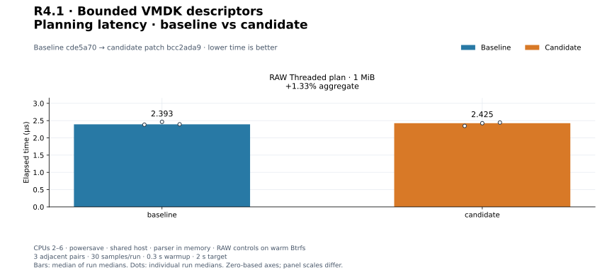
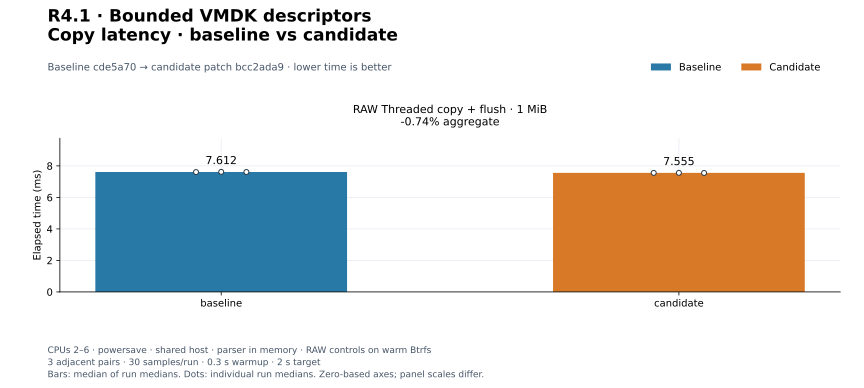
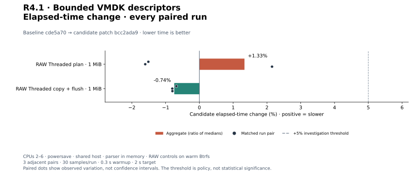
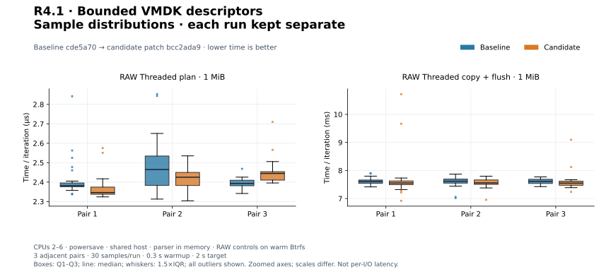
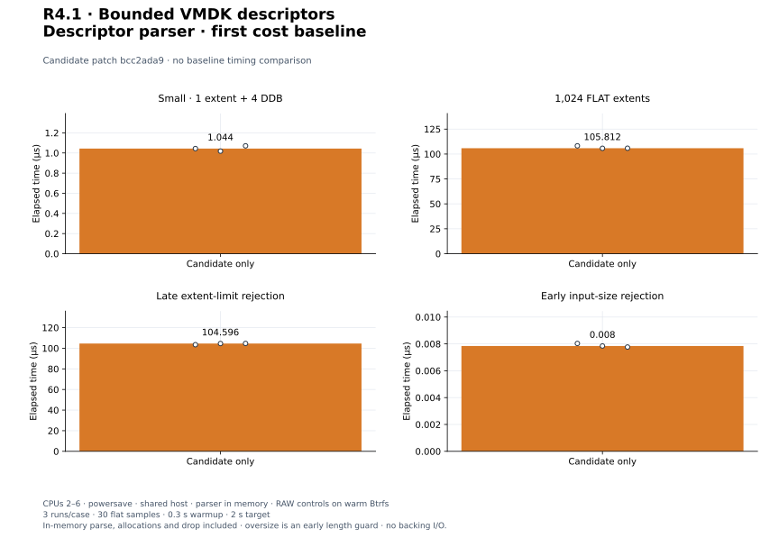

# R4.1 — Bounded VMDK descriptors

Baseline **`cde5a70`**. Candidate: baseline plus [candidate.patch](candidate.patch),
SHA-256 `bcc2ada95790d63a5522b921a8f6a75f6c1f700f539c03b17051744537d1177b`.
[Environment](environment.json), [build commands](build-commands.json),
[unchanged control harness](matched-harness.patch) and [audit](audit.json) retain
source, compiler, executable, hardware, filesystem and harness identities.
The parser is a new independent crate; no existing runtime source or third-party
dependency version changed. No parser speedup comparison is possible yet.

## Outcome and validation

The [descriptor contract](../../vmdk-descriptor.md) defines the initial hosted base
subset: monolithicFlat, split flat and custom FLAT/ZERO, with explicit rejection of
unsupported variants. Borrowed filenames and checked contiguous byte ranges are
metadata only. Input/line/extent/metadata/name bounds precede growth, tokens use a
fixed stack buffer, and all byte arithmetic is checked. No backing I/O, VMDK
logical reads or CLI VMDK support is claimed. [ADR-0033](../../adr/0033-bounded-vmdk-descriptors.md)
records the architecture and follow-on resolver/reader stages.

**405 distinct tests passed, one existing allocation test remains gated** (406
total). Twelve new parser tests exercise positive fixtures, case/CRLF/comments,
quoted Unicode names, ownership, duplicates/order, required fields, unsupported
features, each resource boundary, split shape, maximum integers/overflow, and
deterministic mutations/truncation. Mutation smoke tests are not a fuzz campaign.
[Workspace output](tests.txt), [inventory](test-inventory.txt), [Clippy](clippy.txt),
[formatting](fmt.txt), [portable checks](portable.txt) and [validation](validation.json)
retain evidence. Strict all-target Clippy passes. Core/datamover/parser wasm32
checks pass with the unchanged datamover `control::sum` dead-code warning.
[Initial parser tests](initial-parser-tests.txt) predate tightening quote separators;
final workspace tests validate the final source. Storage behavior is unchanged;
no new storage-specific qualification is claimed.

## Method and controls

Two existing controls use three adjacent C/B, B/C, C/B pairs, **30 flat Criterion
samples**, 0.3 s warmup and 2 s target. Independent release build directories,
fresh Criterion homes, CPUs 2–6, recorded Btrfs directory, warm files, powersave
governor. No timings overlap our builds/tests. Other shared-host activity is
uncontrolled. Controls exercise portable RAW planning and one-worker copy because
the new parser is not wired into any existing executor/CLI path.

`preflight/plan_threaded` plans a 1 MiB copy in 64 KiB blocks.
`preflight_copy/threaded` includes preparation, a buffered 1 MiB copy with one
worker, and final flush. Fixture setup/reset/read-back and assertions are outside
the timer. The planning case does no data transfer. These are warm local controls,
not cold-device throughput or a dedicated-runner regression qualification.

Positive change means slower. Aggregates are medians of three run medians;
individual paired changes are separately retained. [All 12 matched runs](measurements.json)
and [summary](summary.json) contain raw arrays, estimates and exact commands.

| Workload | Baseline | Candidate | Change | Every paired change |
|---|---:|---:|---:|---|
| `preflight/plan_threaded` | 2.393 µs | 2.425 µs | +1.33% | -1.51%, -1.60%, +2.15% |
| `preflight_copy/threaded` | 7.612 ms | 7.555 ms | -0.74% | -0.68%, -0.80%, -0.80% |

[PNG](plots/planning-latency.png).

[PNG](plots/copy-latency.png).

[PNG](plots/relative-change.png).

[PNG](plots/sample-distributions.png). Normalized time/iteration, independently
scaled panels, quartiles, 1.5×IQR whiskers and all outliers; not per-I/O latency.

No adverse aggregate or individual pair exceeded +5%; no longer repeat was triggered.

## First parser cost baseline

Each case runs three times with the same sampling settings. Timers include parse,
result consumption through `black_box`, vector allocation and result destruction.
Input construction, correctness assertions and benchmark process startup are
outside the timer. Filenames/metadata borrow input; there is no backing-file I/O.

| Case | Input and boundary |
|---|---|
| small | 339-byte synthetic descriptor: one FLAT extent and four DDB records |
| 1024_extents | Header plus 1,024 FLAT records (8 sectors each); all validated and stored |
| late_extent_limit | Same layout plus a 1,025th extent; error after parsing the permitted entries |
| oversize | 1 MiB + 1 input bytes; length rejection before UTF-8/token scanning or vector growth |

The oversize case measures a length guard, not scanning throughput. The late
rejection includes allocations and cleanup already performed. These cases establish
costs for future matched parser changes, not speedup over the previous repository.
Resource logs include setup/warmup/adaptive iteration counts and must not be read
as per-parse CPU/RSS or allocation counts.

| Workload | Median of run medians | Every run median |
|---|---:|---|
| `descriptor/small` | 1.044 µs | 1.044 µs, 1.019 µs, 1.071 µs |
| `descriptor/1024_extents` | 105.812 µs | 108.203 µs, 105.733 µs, 105.812 µs |
| `descriptor/late_extent_limit` | 104.596 µs | 103.469 µs, 104.596 µs, 104.680 µs |
| `descriptor/oversize` | 7.85 ns | 8.03 ns, 7.85 ns, 7.77 ns |

[All 12 parser runs](candidate-only-measurements.json) and
[summary](candidate-only-summary.json) preserve evidence.

[PNG](plots/candidate-only.png). Independent zero-based panels preserve the very
different early-guard and full-parser scales.

## Disposition and reproduction

Accept the bounded parser with its documented compatibility restrictions. There is
no existing-engine speedup claim, performance tuning change, or closure of PERF.0
or earlier adverse-pair investigations. R4.2 adds bounded descriptor acquisition,
backing resolution/confinement and live physical validation. ESXi remains unnecessary.

[Plot configuration](plot-config.json), [computed values](plots/computed.json),
[manifest](plots/manifest.json) and [audit](audit.json) record reproducible SVG/PNG
output. Follow the [plot guide](../../../scripts/benchmarks/README.md) to regenerate
from saved samples. Exact benchmark commands and resource logs are retained;
previous reports are unchanged.
