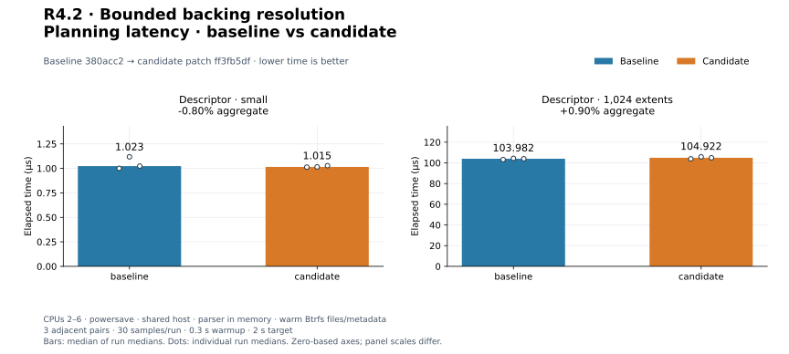
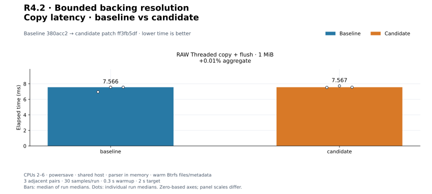
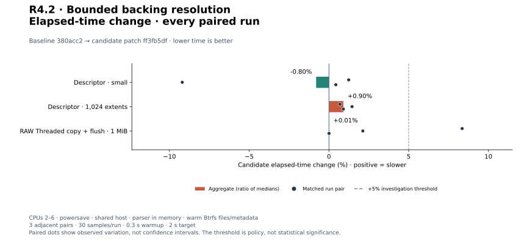
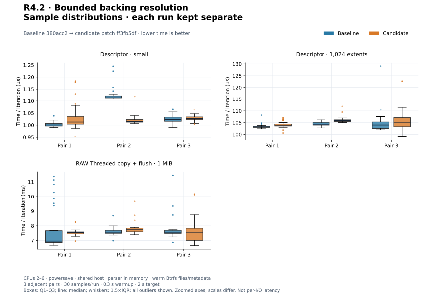
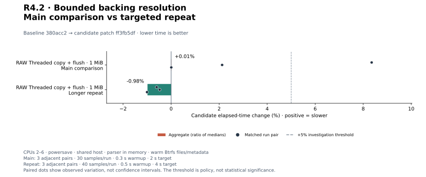
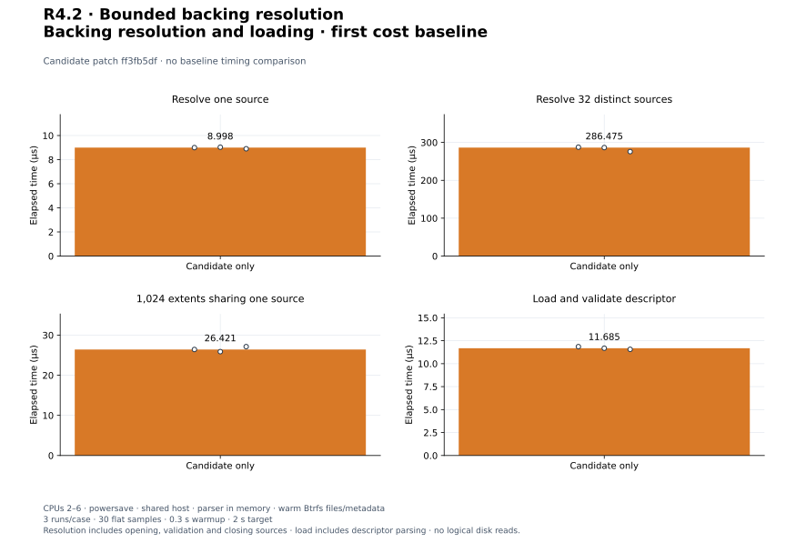

# R4.2 — Bounded backing resolution

Baseline **`380acc2`**. Candidate: baseline plus [candidate.patch](candidate.patch),
SHA-256 `ff3fb5df239cc46e1a12f3ef3514a78caaf5fa635f78fe6d608ca38d3540a166`.
[Environment](environment.json), [build commands](build-commands.json),
[unchanged control harnesses](matched-harness.patch) and [audit](audit.json) retain
source, compiler, executable, hardware, filesystem and harness identities.
New core/local/libc dependencies reuse existing versions; parser implementation
and all previous runtime source files are unchanged. The RAW preflight benchmark
executables are **byte-identical** across independent baseline/candidate builds.
The parser executable now links the extended format crate and is measured anew.

## Outcome and validation

[Bounded descriptor acquisition and backing resolution](../../vmdk-backing.md)
adds portable caller-supplied namespace contracts, exact-reference reuse, pre-open
resource checks, retained read-only sources, live capacity/access validation and
identity revalidation. Linux lookup uses a retained descriptor-parent directory,
openat2 confinement, O_PATH regular-file inspection and a pinned-object procfs
reopen. Unsupported confinement fails without fallback. This resists pathname
replacement but does not freeze file contents or authenticate backing data.
[ADR-0034](../../adr/0034-confined-vmdk-backing-resolution.md) records the design.
Logical VMDK reads, reference byte comparisons and CLI integration remain future work.

**420 distinct tests passed, one existing allocation test remains gated** (421
total). Fifteen new tests cover generic/opaque reference ownership, exact-name
reuse, ZERO without sources, resource limits before opening, partial-failure
cleanup, live access/size/identity changes, bounded short/interrupted reads and
I/O failures. Linux tests cover nested parent-relative files, traversal, symlinks,
proc magic links, mount crossings, FIFO/socket/directory rejection, hard-link
identity, entry/anchor replacement, truncation and retained-FD cleanup. A deterministic
pin/reopen test replaces the original name with a symlink and verifies original
bytes and read-only/CLOEXEC flags. This is not a race-stress campaign.

[Workspace tests](tests.txt), [inventory](test-inventory.txt), [Clippy](clippy.txt),
[formatting](fmt.txt), [portable check](portable.txt) and [validation](validation.json)
record success. All **27 VMDK tests also pass on Btrfs**:
[storage output](storage-tests.txt), [storage settings](storage-validation.json).
Wasm32 core/datamover/VMDK checks pass with the existing `control::sum` dead-code
warning. [Initial tests](initial-tests.txt) predate the added pin/reopen unit test;
final workspace/storage validation covers final measured source.

## Method and matched controls

Three existing controls use three adjacent C/B, B/C, C/B pairs, **30 flat Criterion
samples**, 0.3 s warmup and 2 s target. Independent release build directories,
fresh Criterion homes, CPUs 2–6, recorded Btrfs directory, powersave governor.
Parser inputs and storage metadata/files are warm. No timings overlap our builds
or tests; other shared-host activity is uncontrolled. No cache drops or sustained
cold-device throughput claim is made.

| Control | Timed scope |
|---|---|
| descriptor/small | Existing one-FLAT/four-DDB fixture; parse, allocations and result drop |
| descriptor/1024_extents | Existing 1,024-FLAT fixture; same parse boundary |
| preflight_copy/threaded | Buffered 1 MiB RAW planning/preparation, 64 KiB blocks, one-worker copy and final flush |

Input construction, reset/setup/read-back correctness and process startup are
outside timers. Pure parsing opens no files. The RAW control is intentionally
identical executable code: its differences reflect run conditions, not a source
change to that path. Parser linking/layout may differ despite unchanged parser text.

Positive change means slower. Aggregates are medians of run medians, with all
individual paired changes separately retained. [All 18 matched records](measurements.json)
and [summary](summary.json) contain raw arrays, estimates and exact commands.

| Workload | Baseline | Candidate | Change | Every paired change |
|---|---:|---:|---:|---|
| `descriptor/small` | 1.023 µs | 1.015 µs | -0.80% | +1.24%, -9.20%, +0.43% |
| `descriptor/1024_extents` | 103.982 µs | 104.922 µs | +0.90% | +0.69%, +1.45%, +0.90% |
| `preflight_copy/threaded` | 7.566 ms | 7.567 ms | +0.01% | +8.35%, +2.12%, +0.01% |

[PNG](plots/planning-latency.png).

[PNG](plots/copy-latency.png).

[PNG](plots/relative-change.png).

[PNG](plots/sample-distributions.png). Normalized time/iteration, independent
panel scales, quartiles, 1.5×IQR whiskers and all outliers; not per-I/O latency.

## Investigation threshold

Adverse aggregates or individual pairs above +5% trigger longer repeats:
three B/C, C/B, B/C pairs, 40 flat samples, 0.5 s warmup and 4 s target. Main
and repeat samples are separate; favorable repeats do not erase initial results.

| Workload | Baseline | Candidate | Change | Every paired change |
|---|---:|---:|---:|---|
| `preflight_copy/threaded` | 7.615 ms | 7.541 ms | -0.98% | -0.60%, -0.48%, -1.00% |

[All repeat records](followup-measurements.json), [summary](followup-summary.json).

[PNG](plots/followup-change.png).

## First resolution and acquisition baseline

Each new case runs three times with the same 30-sample settings. No corresponding
previous API exists, so these are candidate-only cost baselines, not speedups.
Fixtures contain 4 KiB regular files with byte value 7. Setup creates 32 files
and one small descriptor. Source data creation and validation are outside timing.
All resolution cases borrow an already parsed descriptor and retain the same
already-open resolver directory between iterations. Each iteration includes
requirement collection, hash/vector allocation, openat2/procfs/adoption/endpoint
checks and closing/dropping the complete result. Backing content is not read.

| Case | Timed scope |
|---|---|
| one_file | One FLAT extent referencing one 4 KiB source |
| 32_files | 32 FLAT extents referencing 32 distinct 4 KiB sources |
| 1024_shared | 1,024 FLAT extents referencing the same 4 KiB source; only one source handle |
| load_descriptor | Construct trusted descriptor path, open parent directory, confined descriptor acquisition, bounded reads and syntax validation, then drop bytes and directory; no backing resolution |

Revalidation assertions on resolution results occur outside timing; initial endpoint
validation is inside. load_descriptor includes parse-on-acquisition, not an additional
borrowed parse/resolve pass. No mutation, writes or flush occur inside these new
case timers. Resource logs include adaptive iterations/setup/warmup; they are not
per-resolution RSS/CPU/allocation counts or steady-state logical read costs.

| Workload | Median of run medians | Every run median |
|---|---:|---|
| `resolution/one_file` | 8.998 µs | 8.998 µs, 9.033 µs, 8.902 µs |
| `resolution/32_files` | 286.475 µs | 287.477 µs, 286.475 µs, 275.853 µs |
| `resolution/1024_shared` | 26.421 µs | 26.421 µs, 25.888 µs, 27.132 µs |
| `resolution/load_descriptor` | 11.685 µs | 11.857 µs, 11.685 µs, 11.563 µs |

[All 12 new-mode records](candidate-only-measurements.json) and
[summary](candidate-only-summary.json) preserve the evidence.

[PNG](plots/candidate-only.png). Separate zero-based panels show costs with different
workload boundaries; do not subtract them to claim isolated syscall overhead.

## Disposition and reproduction

Accept the owned resolution contract with its Linux/procfs and concurrency limits.
Retain every adverse pair and longer repeat. No engine speedup, tuning-default
change, dedicated-runner qualification or closure of PERF.0/earlier adverse
investigations is claimed. Next is R4.3 logical FLAT/ZERO mapping; ESXi is unnecessary.

[Plot configuration](plot-config.json), [computed values](plots/computed.json),
[manifest](plots/manifest.json) and [audit](audit.json) record reproducible SVG/PNG
output. Follow the [plot guide](../../../scripts/benchmarks/README.md) to regenerate
from saved samples. Prior evidence is unchanged.
