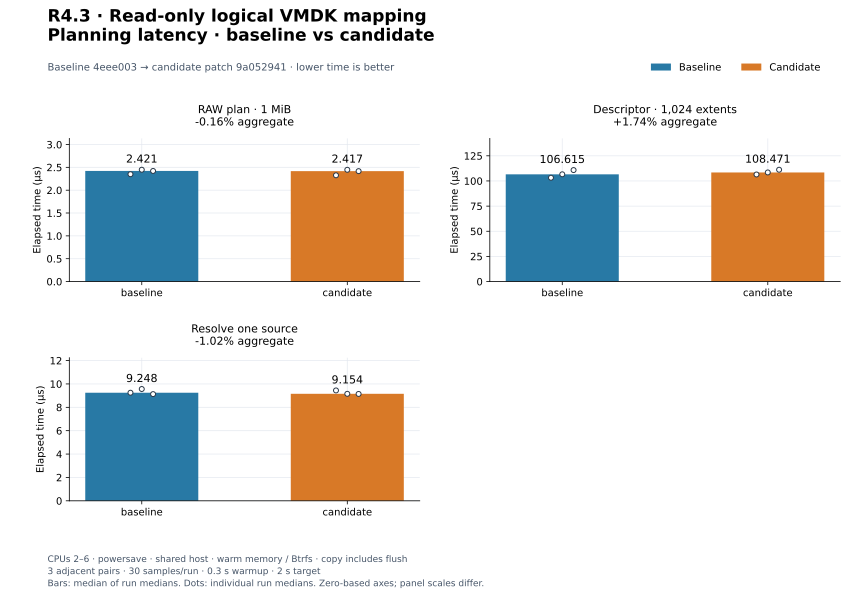
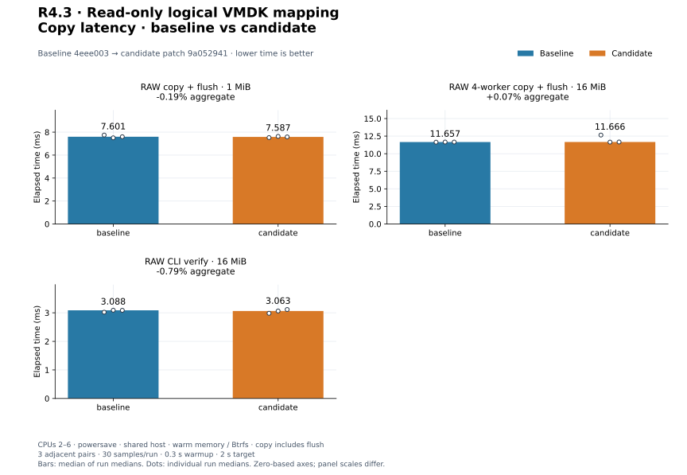
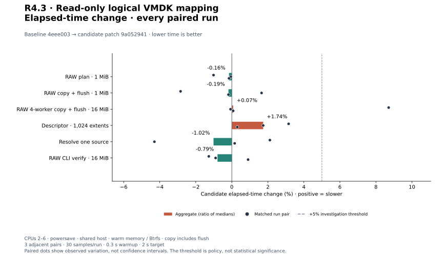
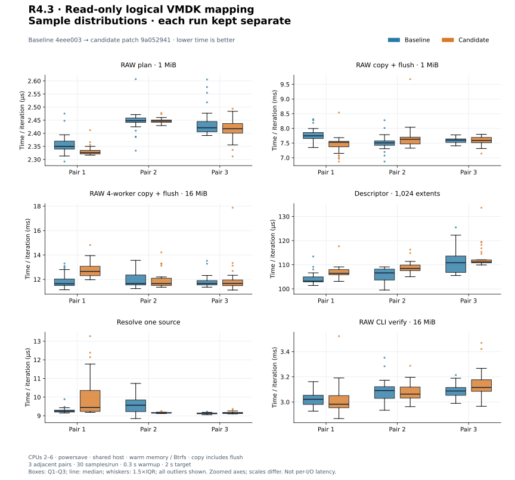
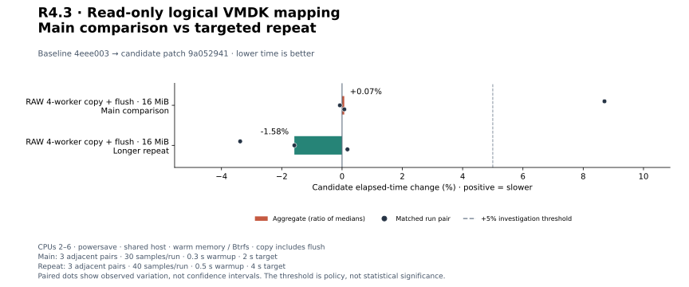
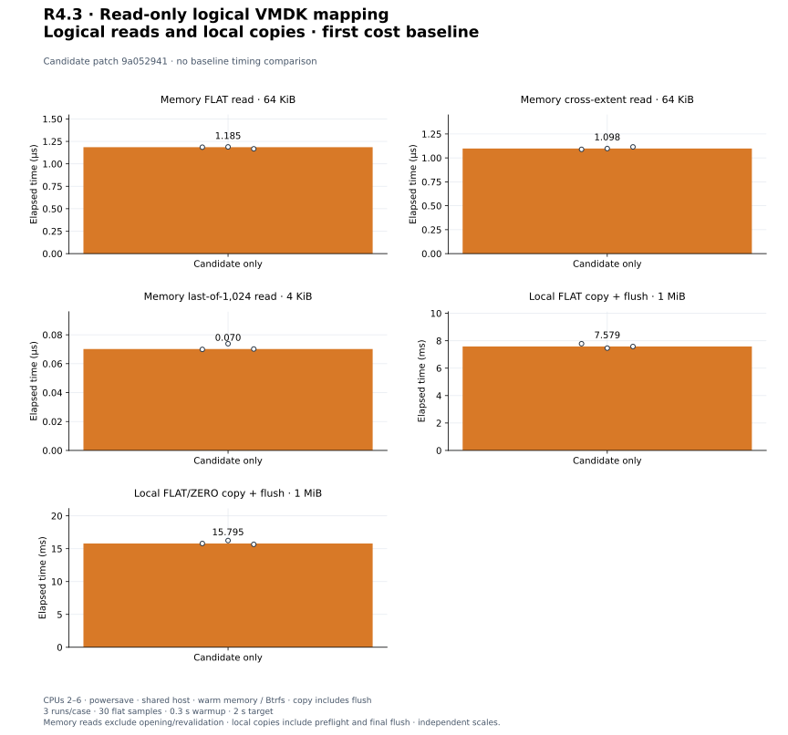

# R4.3 — Read-only logical VMDK mapping

Baseline **`4eee003`**. Candidate: baseline plus [candidate.patch](candidate.patch),
SHA-256 `9a05294192db948dc233a4e0db092dc4649571c6db62d70792cc578f5c4f46d2`.
[Environment](environment.json), [build commands](build-commands.json),
[unchanged control harnesses](matched-harness.patch) and [audit](audit.json) retain
source, compiler, executable, hardware, filesystem and harness identities.
Dependency versions and execution defaults are unchanged. VMDK adds a datamover
dev-dependency for integration tests/benchmarks. Existing parser/resolver algorithms
are unchanged; core adds an identity hook and copy/verification preflight invokes it.

## Outcome and validation

[VmdkDisk](../../vmdk-logical.md) maps retained FLAT/ZERO sources through read-only
VirtualDisk. Binary search finds the first extent; sequential traversal fills the
caller buffer without per-read allocations. Complete ranges are checked before
mutation; backing EOF/errors propagate and may leave a partial read buffer. Logical
extent discovery clips/coalesces Data/Zero and makes no physical-hole assumption.
Construction/endpoint inspection revalidate sources; no per-read full stat scan or
snapshot guarantee is introduced. There is no native RAW endpoint or writable API.

Composite-source identity validation checks every backing before copy/verification;
known aliases and unknown identities reject. Existing RAW and native binding checks
remain. [ADR-0035](../../adr/0035-read-only-vmdk-logical-mapping.md) records the design.
CLI VMDK integration is still R4.4; no ESXi or live VMware compatibility is claimed.

**432 distinct tests passed, one existing allocation test remains gated** (433
total). Twelve new tests cover all start positions in a small mixed fixture,
1,024-extent indexed reads, offset/repeated sources, range overflow, maximum
capacity, empty ranges, clipping/coalescing, short I/O/EOF/errors, concurrent reads,
read-only operations, portable single/four-worker copies, tail preservation,
verification, aliases to any backing, unknown identity and late truncation.
A Linux integration test checks a second backing's hard-link alias before writes,
a successful four-worker mixed copy, and truncation between plan and execute.

[Workspace tests](tests.txt), [inventory](test-inventory.txt), [Clippy](clippy.txt),
[formatting](fmt.txt), [portable check](portable.txt) and [validation](validation.json)
record success. All **39 VMDK tests also pass on Btrfs**:
[storage output](storage-tests.txt), [storage settings](storage-validation.json).
Wasm32 core/datamover/VMDK checks pass with the existing `control::sum` dead-code
warning. [Initial test compilation](initial-test-compilation.txt) records a test
helper's missing concurrency-constructor argument; it was corrected before final
validation. Initial build logs precede extending the hook to verification; final
builds/checks and all measurements use the final source. No timings were reassigned
from earlier binaries.

## Reference bytes and explicit limits

[Reference records](reference.json) and [invocation](reference-command.json) include
QEMU version, binary/generator hashes, commands, descriptor text and all generated
file hashes. The [saved generator](reference-generator.py) is identical to the
[repository runner](../../../scripts/vmdk/compare_reference.py). Generated disks
remain in ignored storage, not version control. The measured candidate's dump
helper produces the rvvdk bytes; it uses odd 65,537-byte read boundaries.

| Case | Qualification |
|---|---|
| Synthetic monolithicFlat | rvvdk/QEMU conversion/QEMU compare/RAW oracle agree on 65,536 bytes |
| Synthetic three-extent split flat | Same agreement on 11,776 bytes, distinct and repeated references |
| QEMU-generated monolithicFlat and twoGbMaxExtentFlat | 1 MiB each matches original RAW and QEMU compare after fixture-only trailing NUL removal |
| custom FLAT/ZERO with nonzero offset | 3,584 bytes match the independent byte oracle; QEMU rejects custom createType |

Generated originals are preserved. This QEMU emitted 157 and 149 trailing NUL
bytes in its hosted descriptors. The strict parser rejects them; normalized
fixture copies remove only those terminal bytes and retain all text. No unmodified
padded-input compatibility is claimed. The first runner's expectation of an
unaltered generated descriptor failed; [diagnostic](initial-reference.txt) and
[initial runner](initial-reference-generator.py) are retained. Final reference
records explicitly include original rejection and normalization.

Early [relabeling probes](reference-probes.json) produced byte mismatches and are
not qualified inputs. Changing a custom descriptor's createType cannot establish
reference agreement for the original layout. Custom ZERO/offset behavior remains
oracle/test-qualified, with independent decoder support still an open roadmap item.
No third-party implementation source was used.

## Method and matched controls

Six existing controls use three adjacent C/B, B/C, C/B pairs, **30 flat Criterion
samples**, 0.3 s warmup and 2 s target. Independent release build directories,
fresh Criterion homes, CPUs 2–6, recorded Btrfs directory, powersave governor.
Parser/memory data and local files/metadata are warm. No timings overlap our builds,
reference conversions or tests; shared-host background activity is uncontrolled.
No cache drops, cold-device or dedicated-runner qualification is claimed.

| Control | Timed scope |
|---|---|
| preflight/plan_threaded | RAW portable planning for 1 MiB/64 KiB blocks |
| preflight_copy/threaded | 1 MiB buffered RAW preparation/copy/final flush, one worker |
| native_lifetime/buffered/threaded_control | 16 MiB buffered RAW copy/final flush, four workers/64 KiB blocks |
| descriptor/1024_extents | Existing 1,024-FLAT parse, vector allocation/result drop |
| resolution/one_file | Existing one-file confined resolution, validation, close/drop; parse excluded |
| cli_transfer/verify_only | Existing 16 MiB in-process RAW CLI comparison and JSON sink output |

Setup/reset/its flush, correctness reads, descriptor-count assertions where used,
and process startup are excluded. Resource logs include those operations and
adaptive iteration counts; they are not per-operation RSS/CPU costs.

Positive change means slower. Aggregates are medians of run medians, with every
individual pair separately retained. [All 36 matched records](measurements.json)
and [summary](summary.json) contain raw arrays, estimates and exact commands.

| Workload | Baseline | Candidate | Change | Every paired change |
|---|---:|---:|---:|---|
| `preflight/plan_threaded` | 2.421 µs | 2.417 µs | -0.16% | -1.02%, -0.05%, -0.16% |
| `preflight_copy/threaded` | 7.601 ms | 7.587 ms | -0.19% | -2.84%, +1.65%, -0.19% |
| `native_lifetime/buffered/threaded_control` | 11.657 ms | 11.666 ms | +0.07% | +8.71%, -0.07%, +0.07% |
| `descriptor/1024_extents` | 106.615 µs | 108.471 µs | +1.74% | +3.15%, +1.74%, +0.30% |
| `resolution/one_file` | 9.248 µs | 9.154 µs | -1.02% | +2.11%, -4.30%, +0.16% |
| `cli_transfer/verify_only` | 3.088 ms | 3.063 ms | -0.79% | -1.28%, -0.90%, +0.90% |

[PNG](plots/planning-latency.png).

[PNG](plots/copy-latency.png).

[PNG](plots/relative-change.png).

[PNG](plots/sample-distributions.png). Normalized time/iteration, independent
panel scales, quartiles, 1.5×IQR whiskers and all outliers; not per-I/O latency.

## Investigation threshold

Every adverse aggregate or individual pair above +5% triggered longer repeats:
three B/C, C/B, B/C pairs, 40 flat samples, 0.5 s warmup and 4 s target. Main
and repeat samples remain separate; favorable repeats do not erase initial results.

| Workload | Baseline | Candidate | Change | Every paired change |
|---|---:|---:|---:|---|
| `native_lifetime/buffered/threaded_control` | 11.889 ms | 11.701 ms | -1.58% | -3.38%, -1.58%, +0.18% |

[All repeat records](followup-measurements.json), [summary](followup-summary.json).

[PNG](plots/followup-change.png).

## First logical read and copy baseline

Each new case runs three times with the same 30-sample settings. No corresponding
previous logical disk API exists, so these are candidate-only costs, not speedups.

| Case | Timed scope |
|---|---|
| logical/flat_64k | Read 64 KiB at offset zero from one FLAT extent; 8 MiB memory backing |
| logical/cross_64k | Read 64 KiB at offset 257 across alternating 4 KiB FLAT/ZERO extents in a 1,024-extent/4 MiB map |
| logical/last_4k_1024 | Read final 4 KiB in a 1,024-FLAT/4 MiB map, exercising indexed lookup |
| logical_copy/flat_1m | Complete 1 MiB buffered local FLAT-to-RAW copy, four workers, 64 KiB blocks, including preflight/planning/final flush |
| logical_copy/mixed_1m | Same copy boundary over 256 alternating 4 KiB FLAT/ZERO extents; FLAT references share a source |

Memory backing bytes are 7. Descriptor parsing/resolution/construction, buffer
allocation, live revalidation and correctness assertions occur before memory-read
timing. The read timer includes exact logical read dispatch and backing locks, not
source opening or endpoint scans. Output is black-boxed. The mixed map repeatedly
references the same 4 KiB source region; it is not a realistic random-device workload.

Local copy fixtures use a 1 MiB regular source filled with 7. Before every iteration,
the destination is filled with 0xa5 and flushed outside timing. The timed copy
includes logical endpoint/identity checks, extent planning, workers, zero policy
and final flush. Complete output bytes are checked outside timing. Input opening
and map construction are excluded; no source/target durability boundary is equated
with the in-memory read-only cases. Successful copy checks prevent zero-skipping
from hiding stale destination bytes.

| Workload | Median of run medians | Every run median |
|---|---:|---|
| `logical/flat_64k` | 1.185 µs | 1.185 µs, 1.189 µs, 1.167 µs |
| `logical/cross_64k` | 1.098 µs | 1.089 µs, 1.098 µs, 1.115 µs |
| `logical/last_4k_1024` | 0.070 µs | 0.070 µs, 0.074 µs, 0.070 µs |
| `logical_copy/flat_1m` | 7.579 ms | 7.782 ms, 7.461 ms, 7.579 ms |
| `logical_copy/mixed_1m` | 15.795 ms | 15.795 ms, 16.244 ms, 15.662 ms |

[All 15 new-mode records](candidate-only-measurements.json) and
[summary](candidate-only-summary.json) preserve evidence.

[PNG](plots/candidate-only.png). Independent zero-based panels; boundaries differ.
Do not subtract unlike cases to claim isolated mapping overhead.

## Disposition and reproduction

Accept the documented read-only logical mapping and composite identity contract.
Retain adverse main/repeat pairs and reference limitations. No engine speedup,
tuning-default change or closure of PERF.0/earlier investigations is claimed.
Next is R4.4 explicit CLI VMDK source integration, with RAW destinations. Padded
input acceptance and custom independent-decoder qualification remain explicit
follow-up items; ESXi is unnecessary.

[Plot configuration](plot-config.json), [computed values](plots/computed.json),
[manifest](plots/manifest.json) and [audit](audit.json) record reproducible SVG/PNG
output. Follow the [plot guide](../../../scripts/benchmarks/README.md) to regenerate
from saved samples. Prior evidence is unchanged.
