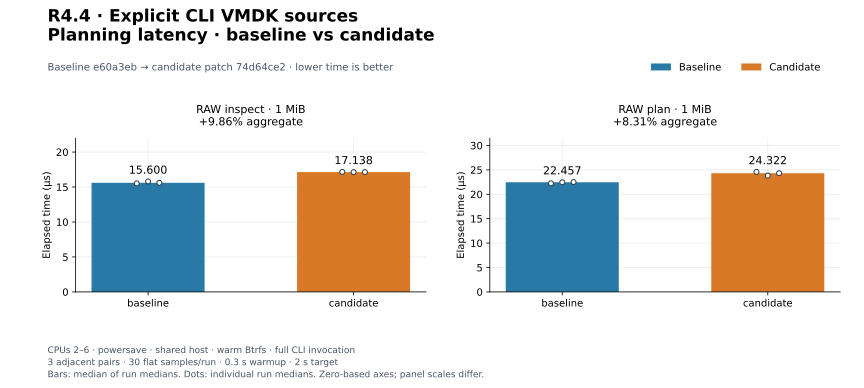
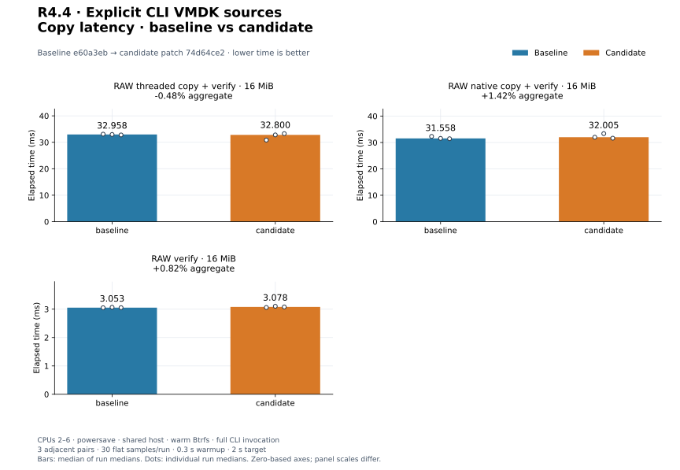
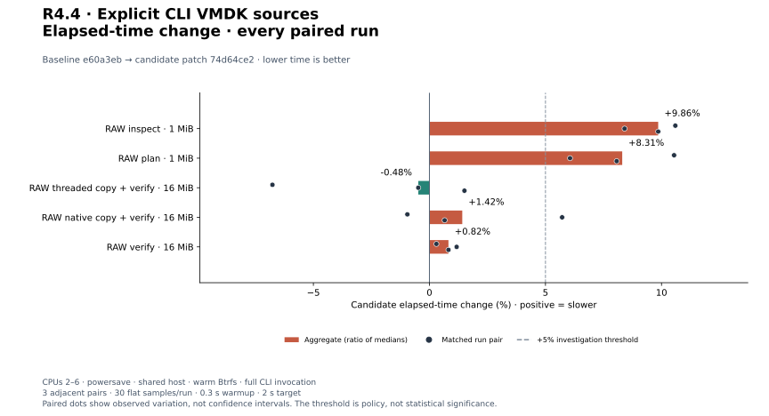
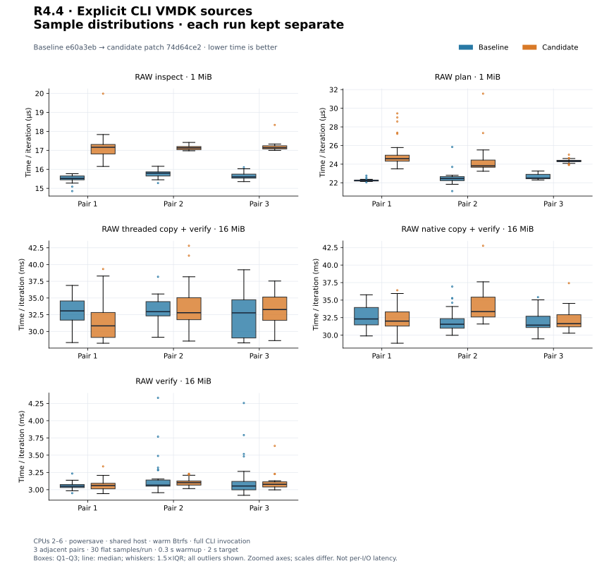
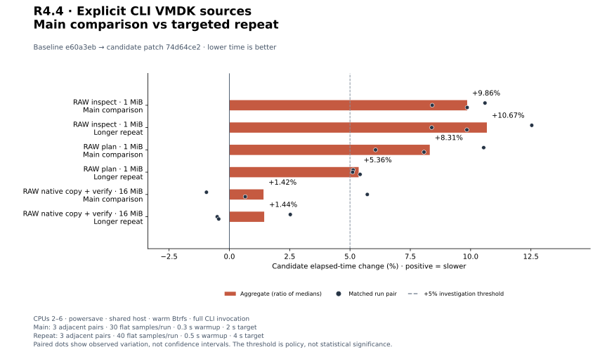
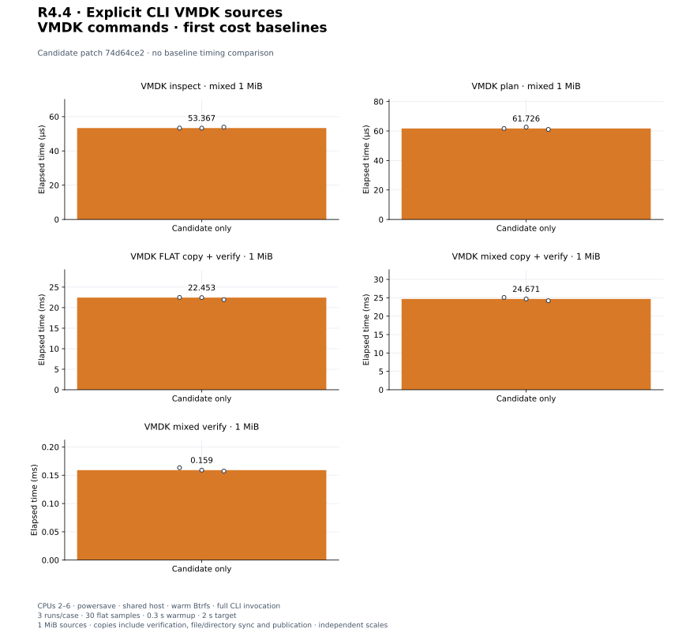

# R4.4 — Explicit CLI VMDK sources

Baseline **`e60a3eb`**. Candidate: baseline plus [candidate.patch](candidate.patch),
SHA-256 `74d64ce2a6de2d2e40ff23bbe5ae450f623ace34b452e5b8a04a89a3b8cba990`.
[Environment](environment.json), [build commands](build-commands.json),
[unchanged control harness patch](matched-harness.patch) and [audit](audit.json)
retain source, compiler, executable, hardware, filesystem and harness identities.
Dependency versions and execution defaults are unchanged. The CLI now depends on
rvvdk-vmdk; its parser and logical mapping algorithms are unchanged.

## Outcome and correctness

[Explicit VMDK sources](../../cli-vmdk.md) work with inspect, plan, copy and verify.
Destinations remain RAW. Typed RAW native execution remains available; VMDK uses
portable Threaded execution, Auto reports portable_api, and explicit io-uring
rejects before destination effects. The loader retains observations of every
opened source object; descriptor/backing aliases reject before mutation. Existing
verification, cancellation and publication policy apply to logical bytes.
[ADR-0036](../../adr/0036-cli-vmdk-sources.md) records the decision.

**440 distinct tests passed, one existing allocation test remains gated** (441
total). Eight new integration tests cover logical previews, FLAT offsets/repeated
sources/Zero regions, four-worker verified copies, odd block boundaries, overwrite
tails, mismatch offsets, every backing and descriptor hard link, Zero-only disks,
explicit RAW selection, confinement and unsupported formats, pre-open native
rejection, budget failure, same-size source mutation, cancellation and publication
collisions. A separate **76-test CLI/VMDK run passes** with integration fixtures
on Btrfs via RVVDK_TEST_DIR. The five existing CLI unit fault tests still use
the system temporary directory; pure parser/memory tests do not exercise storage.

[Workspace tests](tests.txt), [inventory](test-inventory.txt), [Clippy](clippy.txt),
[formatting](fmt.txt), [portable check](portable.txt), [validation](validation.json),
[storage tests](storage-tests.txt) and [storage invocation](storage-validation.json)
record the checks. Wasm32 core/datamover/VMDK checks retain the existing control::sum
warning. [Initial Clippy output](initial-clippy.txt) records a test-only byte-string
style correction; strict Clippy and CLI/VMDK tests then pass on the final source.
No ESXi, VMware SDK or new independent-decoder qualification is involved. Trailing
NUL descriptors still reject, and custom layouts retain the prior oracle-only
qualification. See [R4.3 reference evidence](../2026-09-29-r43/README.md).

## Matched RAW controls

Three adjacent C/B, B/C, C/B pairs per workload, 30 flat samples/run, 0.3 s warmup,
2 s target. Values are medians of the three run medians; every paired percentage
is shown. CPUs 2–6, powersave, shared host, warm Btrfs; no global cache drops.
Builds and correctness tests finished before timing. Executables run in separate
processes with isolated Criterion directories. No engine or storage speedup claim.

| Workload | Baseline | Candidate | Change | Every paired change |
|---|---:|---:|---:|---|
| `cli_preview/inspect_dense_json` | 15.600 µs | 17.138 µs | +9.86% | +10.60%, +8.41%, +9.86% |
| `cli_preview/plan_new_json` | 22.457 µs | 24.322 µs | +8.31% | +10.54%, +6.06%, +8.07% |
| `cli_transfer/threaded_new_verify` | 32.958 ms | 32.800 ms | -0.48% | -6.76%, -0.48%, +1.51% |
| `cli_transfer/native_new_verify` | 31.558 ms | 32.005 ms | +1.42% | -0.95%, +5.72%, +0.66% |
| `cli_transfer/verify_only` | 3.053 ms | 3.078 ms | +0.82% | +0.30%, +1.17%, +0.82% |

[Raw measurements](measurements.json), [summary](summary.json). Inspect/plan use
1 MiB sources; plan is metadata-only and creates nothing. Copy/verify controls
use 16 MiB, 64 KiB blocks, four workers or native QD8. Full CLI invocation includes
argument parsing, source/target setup, JSON to a sink and cleanup. Copy includes
engine flush, bounded verification, file sync, publication and directory sync.
Verify compares existing bytes without copy/flush. Output byte checks and deletion
are outside timing. Criterion bootstrap samples and per-process resource reports
remain alongside the JSON records; process RSS/CPU includes setup and validation.


[PNG](plots/planning-latency.png).


[PNG](plots/copy-latency.png).


[PNG](plots/relative-change.png).


[PNG](plots/sample-distributions.png).

## Adverse-pair investigation

Every adverse aggregate **or individual pair** above +5% triggered three longer
B/C, C/B, B/C pairs, 40 flat samples, 0.5 s warmup and 4 s target. Original and
repeat sets remain separate; no discarded adverse runs or pooled estimates.

| Workload | Baseline | Candidate | Change | Every paired change |
|---|---:|---:|---:|---|
| `cli_preview/inspect_dense_json` | 15.647 µs | 17.317 µs | +10.67% | +12.53%, +8.39%, +9.84% |
| `cli_preview/plan_new_json` | 22.776 µs | 23.997 µs | +5.36% | +5.13%, +5.11%, +5.42% |
| `cli_transfer/native_new_verify` | 31.781 ms | 32.239 ms | +1.44% | +2.53%, -0.50%, -0.44% |

[Repeat records](followup-measurements.json), [repeat summary](followup-summary.json).

The small preview increase persists: about 1–2 µs in this environment. Source
inspection previously checked the path then opened a RAW device directly. It now
uses a nonblocking regular-file open, descriptor adoption, a retained observation
handle and size/mtime/ctime checks shared with transfers. This adds descriptor
validation/duplication and metadata observations, plus generalized dispatch. Code
inspection identifies these added operations; no isolated syscall attribution is
claimed. The bounded absolute cost is accepted for stronger source handling.
No hot-path per-block checks or copy-engine changes were added. RAW copy/verify
aggregate changes remain below 5%; the initial adverse native pair remains visible.
Controlled-runner preview overhead/tuning and all earlier PERF.0 follow-ups remain
open. These warm local results do not establish cold-storage or remote performance.


[PNG](plots/followup-change.png).

## New VMDK command cost baselines

Three candidate-only runs per workload, 30 flat samples/run, 0.3 s warmup, 2 s
target. All use a deterministic 1 MiB logical source. Flat uses one FLAT extent;
mixed uses 64 alternating 16 KiB FLAT/Zero extents over one backing. Copies use
Auto (portable Threaded), four workers, 64 KiB blocks and bounded verification;
whole-invocation boundaries include loading, confinement, checks, engine flush,
file sync, no-replace publication and directory sync. Inspect/plan include loading
and JSON output but no payload copy. Verify includes logical comparison without
flush. Destination equality/deletion are checked outside timing. The new modes
are not compared to RAW controls with different sizes or work boundaries.

| Workload | Median | Every run median |
|---|---:|---|
| `cli_vmdk/inspect_mixed` | 53.367 µs | 53.367 µs, 53.303 µs, 53.908 µs |
| `cli_vmdk/plan_mixed` | 61.726 µs | 61.726 µs, 62.641 µs, 61.076 µs |
| `cli_vmdk/copy_flat_verify` | 22.453 ms | 22.495 ms, 22.453 ms, 21.949 ms |
| `cli_vmdk/copy_mixed_verify` | 24.671 ms | 25.094 ms, 24.671 ms, 24.201 ms |
| `cli_vmdk/verify_mixed` | 159.038 µs | 163.315 µs, 159.038 µs, 157.423 µs |

[Samples](candidate-only-measurements.json), [summary](candidate-only-summary.json),
[harness](../../../crates/rvvdk-cli/benches/vmdk.rs).


[PNG](plots/candidate-only.png).

## Reproduce plots

```bash
target/benchmark-plots/bin/python scripts/benchmarks/plot.py docs/benchmark-results/2026-09-29-r44
```

[Plot config](plot-config.json), [manifest](plots/manifest.json) and
[computed values](plots/computed.json) retain inputs, output hashes and plotting
versions. The generator validates normalized sample medians and every pair.
The audit checks regeneration is byte-identical. Plots are saved artifacts;
regenerating them never reruns a benchmark or changes original measurements.
