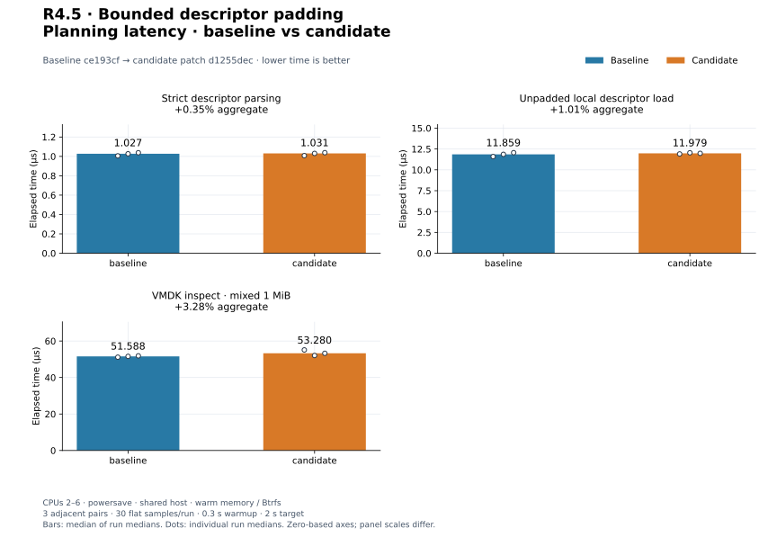
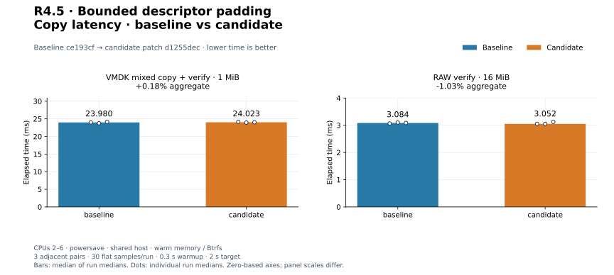
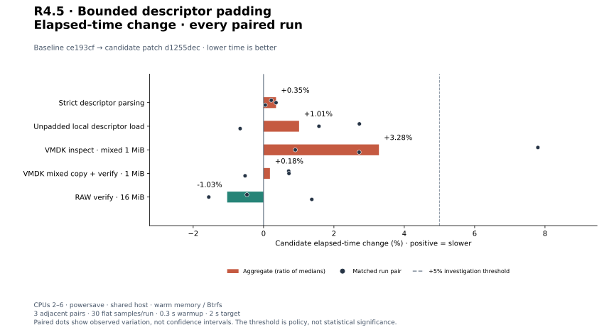
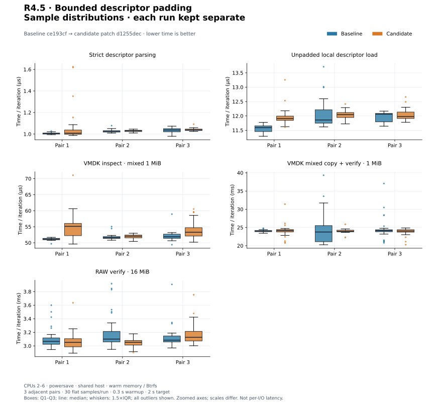
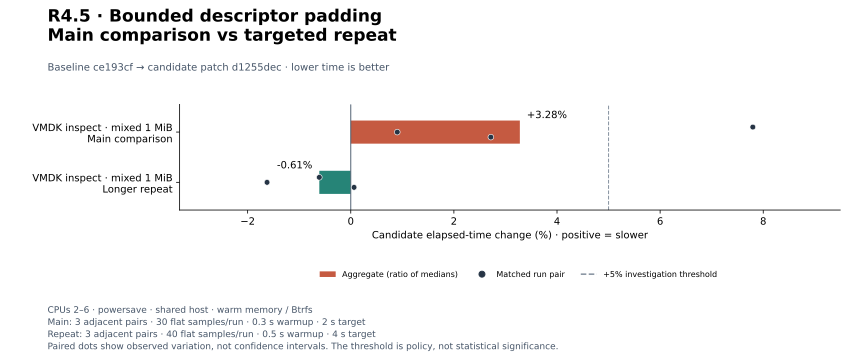
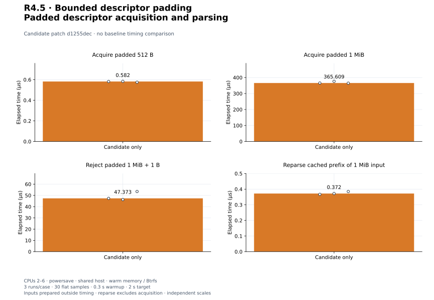

# R4.5 — Bounded descriptor padding

Baseline **`ce193cf`**. Candidate: baseline plus [candidate.patch](candidate.patch),
SHA-256 `d1255dec6db2f33d51a298f200cf91c47aa54608037339e83c207e38d80e95a8`. [Environment](environment.json),
[build commands](build-commands.json), [unchanged control harness patch](matched-harness.patch)
and [audit](audit.json) retain source, compiler, executable, filesystem and harness
identities. Dependency versions, execution defaults and strict parser are unchanged.
The [reference runner snapshot](reference-generator.py) records the separate tool change.

## Outcome and validation

[DescriptorText acquisition](../../vmdk-padding.md) accepts a contiguous terminal
NUL run after EOF and total-byte admission. Original bytes remain intact; a cached
text boundary avoids repeated padding scans and a second text allocation. Direct
Descriptor parsers still reject NUL. Embedded NULs and any nonzero suffix after a
NUL reject. The 1 MiB default includes padding; oversize input consumes at most one
extra probe. I/O errors after padding remain errors. CLI and local loading inherit
this behavior without file rewrites, mapping changes or native execution changes.
See [ADR-0037](../../adr/0037-bounded-vmdk-padding.md).

**447 distinct tests pass; one existing allocation test remains gated** (448 total).
Six acquisition tests cover suffix lengths, unchanged bytes, strict parser behavior,
missing newline/unaligned suffixes, hidden text, all-NUL/invalid input, line limits,
exact/over-limit padding, chunk boundaries, Interrupted reads and failure after
padding. One CLI test exercises inspect/plan/copy/verify on an unchanged padded
mixed source. The earlier CLI rejection fixture now contains an embedded NUL and
hidden text instead of a permitted terminal suffix.

[Workspace tests](tests.txt), [inventory](test-inventory.txt), [Clippy](clippy.txt),
[formatting](fmt.txt), [portable check](portable.txt) and [validation](validation.json)
pass. Wasm32 core/datamover/VMDK retains the existing control::sum warning.
A separate **83-test CLI/VMDK run passes** with integration fixtures on Btrfs:
[output](storage-tests.txt), [invocation](storage-validation.json). Five existing
CLI unit fault tests still use the system temporary directory; pure parser/memory
tests do not exercise storage.

## Unmodified reference inputs

[Reference records](reference.json), [invocation](reference-command.json) and
[output](reference-output.txt) retain QEMU 10.2.2, executable/generator hashes,
commands, original descriptor contents, file hashes and CLI JSON reports.
The generated disks remain in ignored storage; no VMware SDK or implementation
source was used. Custom decoder support remains unavailable and is not counted
as independent agreement.

| Fixture | Qualified result |
|---|---|
| Synthetic monolithicFlat, 65,536 bytes | Dump output, QEMU conversion/compare and RAW oracle agree |
| Synthetic three-extent split flat, 11,776 bytes | Same agreement, repeated and distinct backing files |
| Synthetic custom FLAT/ZERO, 3,584 bytes | Byte oracle agreement only; QEMU rejects custom |
| QEMU-generated monolithicFlat, 1 MiB, 157 padding bytes | Original descriptor accepted by dump and all four CLI commands; outputs equal RAW oracle and QEMU comparison |
| QEMU-generated twoGbMaxExtentFlat, 1 MiB, 149 padding bytes | Same agreement on original descriptor; no normalization |

The two generated descriptor hashes are checked before/after the commands.
CLI plan creates no output; Auto copy uses Threaded, verifies all logical bytes,
and publishes with the existing durability policy. Historical
[R4.3 normalization evidence](../2026-09-29-r43/README.md) is unchanged. These small
hosted fixtures do not qualify arbitrary producer variants, large split images,
custom layouts with another decoder, sparse formats, or live VMware access.

## Matched controls

Three adjacent C/B, B/C, C/B pairs per workload; 30 flat samples/run, 0.3 s warmup,
2 s target. Medians of run medians and every paired change are shown. CPUs 2–6,
powersave, shared host, warm Btrfs/memory; no cache drops. Builds, tests and reference
conversions completed before timing. Original Criterion sample arrays and resource
logs remain in this directory; process CPU/RSS includes setup and checks.

| Workload | Baseline | Candidate | Change | Every paired change |
|---|---:|---:|---:|---|
| `descriptor/small` | 1.027 µs | 1.031 µs | +0.35% | +0.22%, +0.35%, +0.05% |
| `resolution/load_descriptor` | 11.859 µs | 11.979 µs | +1.01% | +2.72%, +1.57%, -0.66% |
| `cli_vmdk/inspect_mixed` | 51.588 µs | 53.280 µs | +3.28% | +7.80%, +0.90%, +2.72% |
| `cli_vmdk/copy_mixed_verify` | 23.980 ms | 24.023 ms | +0.18% | +0.71%, +0.72%, -0.52% |
| `cli_transfer/verify_only` | 3.084 ms | 3.052 ms | -1.03% | -0.47%, -1.56%, +1.37% |

[Measurements](measurements.json), [summary](summary.json).
Strict small parsing excludes acquisition; local loading includes open/read/parse/
close of an unpadded descriptor. VMDK inspect/copy use the unchanged 1 MiB mixed
64-extent fixture. Copy includes four-worker portable execution, verification,
flush, file/directory sync and no-replace publication. RAW verification compares
16 MiB at 64 KiB blocks without flush. Full CLI timings include argument parsing
and JSON to a sink; content checks and fixture deletion are outside timing.
These different work boundaries are not compared as engine throughput.


[PNG](plots/planning-latency.png).


[PNG](plots/copy-latency.png).


[PNG](plots/relative-change.png).


[PNG](plots/sample-distributions.png).

## Triggered investigation

Every adverse aggregate or individual pair above +5% triggered three longer
B/C, C/B, B/C pairs, 40 flat samples, 0.5 s warmup and 4 s target. Main and
repeat sets remain separate; no discarded adverse runs or pooled estimates.

| Workload | Baseline | Candidate | Change | Every paired change |
|---|---:|---:|---:|---|
| `cli_vmdk/inspect_mixed` | 52.039 µs | 51.722 µs | -0.61% | -0.61%, -1.62%, +0.06% |

[Repeat records](followup-measurements.json), [summary](followup-summary.json).


[PNG](plots/followup-change.png).


The initial +7.80% inspection pair is retained. Longer inspection repeats yield
-0.61% aggregate, with pairs -0.61%, -1.62%, +0.06%; the adverse shift was not
reproduced in that set. No tested control aggregate exceeds +5%.

Shared-host observations do not close PERF.0 or R4.4 preview-overhead tuning.
No engine speedup, cold-storage result or global performance qualification is
claimed. The acquisition boundary lookup adds one reverse suffix scan; unpadded
input inspects only the final byte, while reparsing uses the cached text prefix.

## First padded-input cost baselines

Three candidate-only runs/case, 30 flat samples, 0.3 s warmup, 2 s target. Inputs
are prepared outside timing in memory; acquire includes read/copy, suffix scan,
strict validation and drop. The 1 MiB input is valid short text plus NUL padding.
Oversize is that input plus one NUL and rejects before suffix scanning/parsing.
Reparse borrows a preloaded 1 MiB descriptor and times only strict prefix parsing/
drop; it excludes acquisition. These are separate costs, not before/after speedups.

| Workload | Median | Every run median |
|---|---:|---|
| `padding/acquire_512` | 0.582 µs | 0.582 µs, 0.584 µs, 0.575 µs |
| `padding/acquire_1m` | 365.609 µs | 365.609 µs, 376.303 µs, 364.799 µs |
| `padding/reject_oversize` | 47.373 µs | 47.373 µs, 46.299 µs, 53.465 µs |
| `padding/reparse_1m` | 0.372 µs | 0.367 µs, 0.372 µs, 0.385 µs |

[Samples](candidate-only-measurements.json), [summary](candidate-only-summary.json),
[harness](../../../crates/rvvdk-vmdk/benches/padding.rs).


[PNG](plots/candidate-only.png).

## Reproduce plots

```bash
target/benchmark-plots/bin/python scripts/benchmarks/plot.py docs/benchmark-results/2026-09-29-r45
```

[Config](plot-config.json), [manifest](plots/manifest.json) and [computed values](plots/computed.json)
retain hashes and generator versions. The audit checks every normalized sample
median, every pair, source reconstruction and byte-identical plot regeneration.
