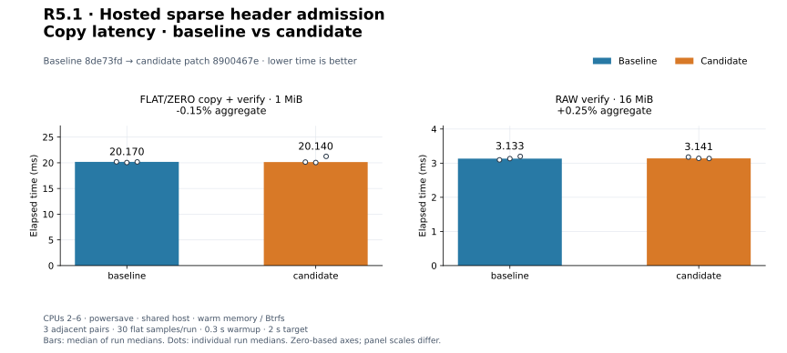
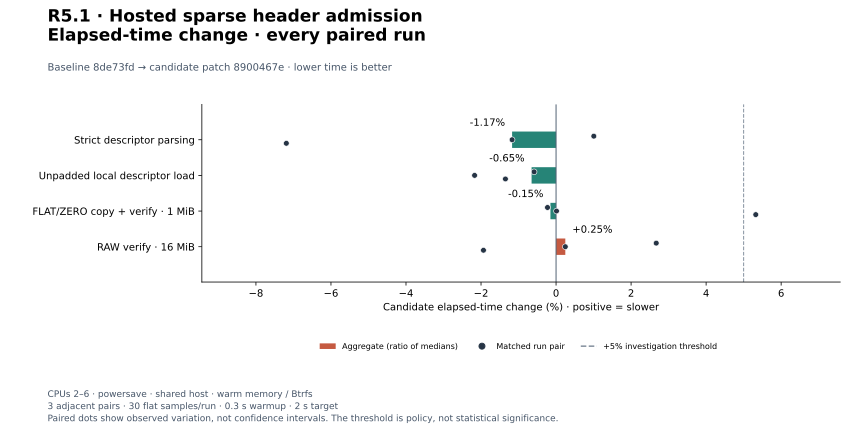
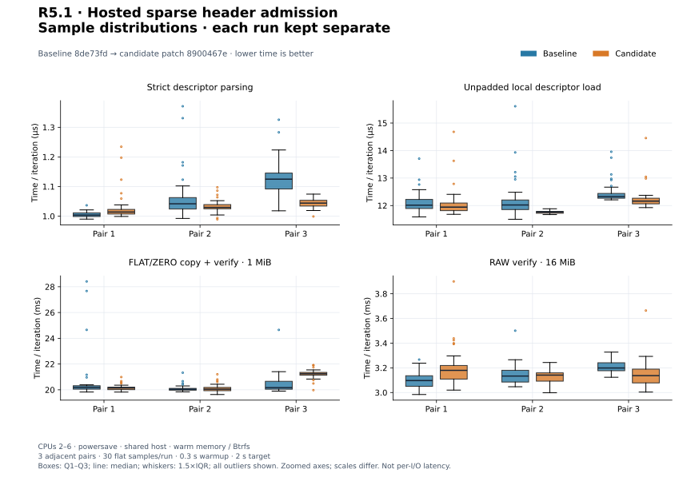
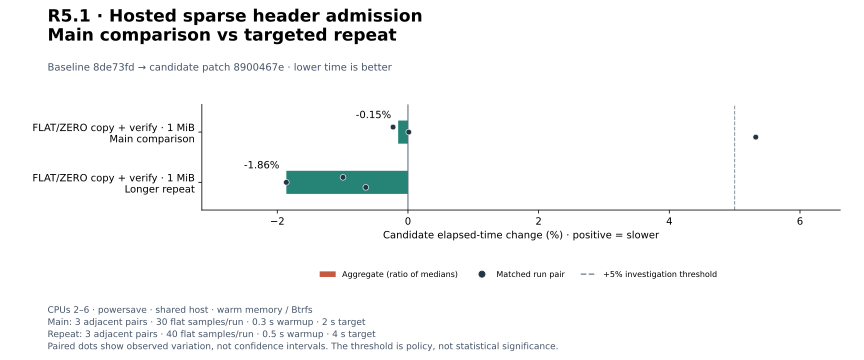
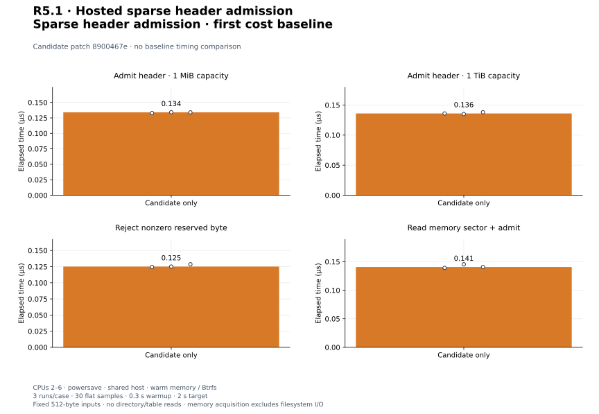

# R5.1 — Hosted sparse header admission

Baseline **`8de73fd`**. Candidate: baseline plus [candidate.patch](candidate.patch),
SHA-256 `8900467e0b9c7b130c38b06a1d7b3485dd64f491a9936598f746e4245b67f612`. [Environment](environment.json),
[build commands](build-commands.json), [unchanged control harness patch](matched-harness.patch)
and [audit](audit.json) retain source, compiler, executable, filesystem and harness
identities. Dependency versions and execution defaults are unchanged. Existing
FLAT/ZERO parser, acquisition, mapping and CLI source paths are unchanged.

## Outcome and validation

[SparseHeader](../../vmdk-sparse-header.md) admits clean, uncompressed version-1
hosted sparse headers. Fixed-offset little-endian parsing avoids casts, unsafe
code and allocation. Checked geometry/ranges, physical bounds, metadata overlap,
minimum table storage and independent limits precede any future metadata work.
The Read helper consumes exactly one 512-byte sector; it follows no offsets.
Unsupported versions/flags, dirty state, compression, footer markers, reserved
bytes and inconsistent fields reject. See [ADR-0038](../../adr/0038-bounded-hosted-sparse-header.md).

This step provides **no logical sparse reads**. Directory/table contents, descriptor
binding, redundancy agreement and data placement remain unvalidated. Public CLI
and VmdkDisk continue to reject sparse inputs. No zero inference, parent resolution,
VMware SDK or live ESXi compatibility is introduced. Format layout comes from the
[VMware technical note](https://github.com/vmware/open-vmdk/blob/master/vmdk_50_technote.pdf),
pp. 6–9; [specification identity](specification.json) records the retained PDF hash.
Only the specification was read, not a third-party implementation.

**456 distinct tests pass; one existing allocation test remains gated** (457 total).
Nine new tests cover exact fields/regions, absent descriptor/redundancy, optional
newline checking, every truncated length, excess input, endian magic, unaligned
input slices, unsupported features, rounding, overflow, limits, overlap, file
bounds, interrupted/short/error reads and 2,048 deterministic byte mutations.
[Workspace tests](tests.txt), [inventory](test-inventory.txt), [Clippy](clippy.txt),
[formatting](fmt.txt), [portable check](portable.txt) and [validation](validation.json)
pass. Wasm32 core/datamover/VMDK retains the existing control::sum warning.
A separate **92-test CLI/VMDK run passes** with integration fixtures on Btrfs:
[output](storage-tests.txt), [invocation](storage-validation.json). Five existing
CLI unit fault tests retain system-temporary fixtures; header/parser/memory tests
do not exercise storage. The new header parser is tested portably in memory.

## Producer headers, not decoded sparse bytes

[Reference records](reference.json), [invocation](reference-command.json),
[output](reference-output.txt) and [runner snapshot](reference-generator.py) retain
QEMU 10.2.2, executable/generator hashes, commands, header hex, file hashes and
QEMU info results. Generated files stay in ignored storage. Each extent hash is
unchanged after inspection. Every fixture is still rejected by the public CLI.

| Generated fixture | Result |
|---|---|
| monolithicSparse, 1 MiB | Header admitted; capacity matches QEMU info; one directory entry |
| monolithicSparse, 64 MiB | Header admitted; capacity matches QEMU info; two directory entries |
| twoGbMaxExtentSparse, 1 MiB, one extent | Header admitted; capacity matches QEMU info; advertised descriptor region contains only zeros |
| monolithicSparse, 1 MiB + 512 B | Deliberately rejected: capacity is not grain-aligned |
| streamOptimized, 1 MiB | Deliberately rejected: unsupported version |

QEMU's split extent advertises a 10,240-byte descriptor region containing no text.
The initial runner wrongly assumed that split extents would advertise no descriptor;
[failed invocation](initial-reference-command.json), [diagnostic](initial-reference-output.txt),
[header probe](initial-reference-probe.json) and [initial runner](initial-reference-generator.py)
preserve that failure. The corrected runner records the region contents and makes
no descriptor-validity claim. No parser relaxation or source change was needed.
R5.2 must bind the external descriptor explicitly. No table/GTE validation or
logical byte comparison is claimed here; header agreement is narrower evidence.
Custom-layout independent-decoder qualification and earlier R4 limits stay open.

## Matched existing controls

Three adjacent C/B, B/C, C/B pairs per workload; 30 flat samples/run, 0.3 s warmup,
2 s target. Medians of run medians and every paired change are shown. CPUs 2–6,
powersave, shared host, warm Btrfs/memory; no cache drops. Builds, tests and reference
work completed before timing. Original Criterion sample arrays and resource logs
remain in this directory; process CPU/RSS includes setup and checks.

| Workload | Baseline | Candidate | Change | Every paired change |
|---|---:|---:|---:|---|
| `descriptor/small` | 1.042 µs | 1.029 µs | -1.17% | +1.01%, -1.17%, -7.19% |
| `resolution/load_descriptor` | 12.021 µs | 11.943 µs | -0.65% | -0.58%, -2.17%, -1.35% |
| `cli_vmdk/copy_mixed_verify` | 20.170 ms | 20.140 ms | -0.15% | -0.23%, +0.01%, +5.32% |
| `cli_transfer/verify_only` | 3.133 ms | 3.141 ms | +0.25% | +2.67%, +0.25%, -1.93% |

[Measurements](measurements.json), [summary](summary.json). Strict text parsing
excludes acquisition; local loading includes open/read/parse/close of an unpadded
descriptor. Existing VMDK copy uses the unchanged mixed 1 MiB/64-extent fixture,
four workers, 64 KiB blocks, verification, engine flush, file/directory sync and
publication. RAW verification compares 16 MiB at 64 KiB blocks without flush.
Full CLI timings include argument parsing and JSON to a sink; content checks and
fixture deletion are outside timing. Different boundaries are not compared as
engine throughput. Control executable hashes differ despite unchanged algorithms;
no byte-identical-control or causal speedup claim is made.


[PNG](plots/planning-latency.png).


[PNG](plots/copy-latency.png).


[PNG](plots/relative-change.png).


[PNG](plots/sample-distributions.png).

## Triggered investigation

Every adverse aggregate or individual pair above +5% triggered three longer
B/C, C/B, B/C pairs, 40 flat samples, 0.5 s warmup and 4 s target. Main and
repeat sets remain separate; no discarded adverse runs or pooled estimates.

| Workload | Baseline | Candidate | Change | Every paired change |
|---|---:|---:|---:|---|
| `cli_vmdk/copy_mixed_verify` | 20.601 ms | 20.217 ms | -1.86% | -0.99%, -1.86%, -0.65% |

[Repeat records](followup-measurements.json), [summary](followup-summary.json).


[PNG](plots/followup-change.png).


The initial +5.32% mixed-copy pair remains visible. Longer repeats yield -1.86%
aggregate, paired -0.99%, -1.86%, -0.65%; the adverse shift was not reproduced.
No control aggregate exceeds +5%. Shared-host observations do not close PERF.0,
R4.4 preview-overhead tuning or earlier adverse timing follow-ups. No engine
speedup, cold-storage result or global performance qualification is claimed.

## First sparse-header cost baselines

Three candidate-only runs/case, 30 flat samples, 0.3 s warmup, 2 s target. Authored
512-byte inputs are prepared outside timing. Valid and 1 TiB-capacity headers time
only header admission/drop; the large case changes counts and ranges, not input
size or metadata I/O. Reserved rejection changes the last byte. Read-sector wraps
a memory slice and includes copying exactly 512 bytes to the stack before parsing;
it is not a filesystem latency or sparse data throughput measurement. No parser
heap allocation is present, and metadata parsing work is independent of capacity.

| Workload | Median | Every run median |
|---|---:|---|
| `sparse_header/valid` | 0.134 µs | 0.133 µs, 0.134 µs, 0.134 µs |
| `sparse_header/large_capacity` | 0.136 µs | 0.136 µs, 0.135 µs, 0.138 µs |
| `sparse_header/reserved_rejection` | 0.125 µs | 0.124 µs, 0.125 µs, 0.129 µs |
| `sparse_header/read_sector` | 0.141 µs | 0.139 µs, 0.146 µs, 0.141 µs |

[Samples](candidate-only-measurements.json), [summary](candidate-only-summary.json),
[harness](../../../crates/rvvdk-vmdk/benches/sparse_header.rs).


[PNG](plots/candidate-only.png).

## Reproduce plots

```bash
target/benchmark-plots/bin/python scripts/benchmarks/plot.py docs/benchmark-results/2026-09-30-r51
```

[Config](plot-config.json), [manifest](plots/manifest.json) and [computed values](plots/computed.json)
retain hashes and generator versions. The audit checks normalized sample medians,
every pair, source reconstruction, reference hashes and byte-identical regeneration.
