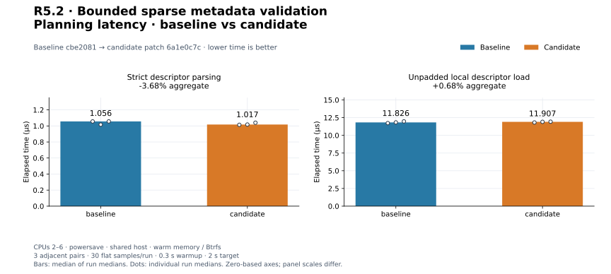
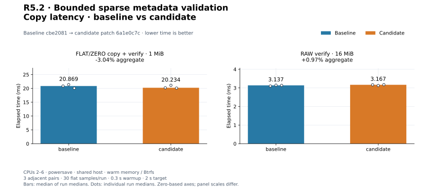
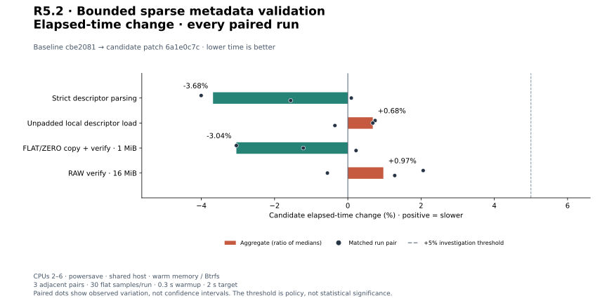
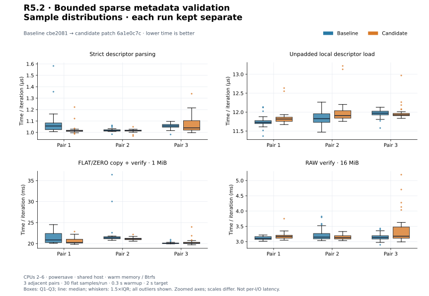
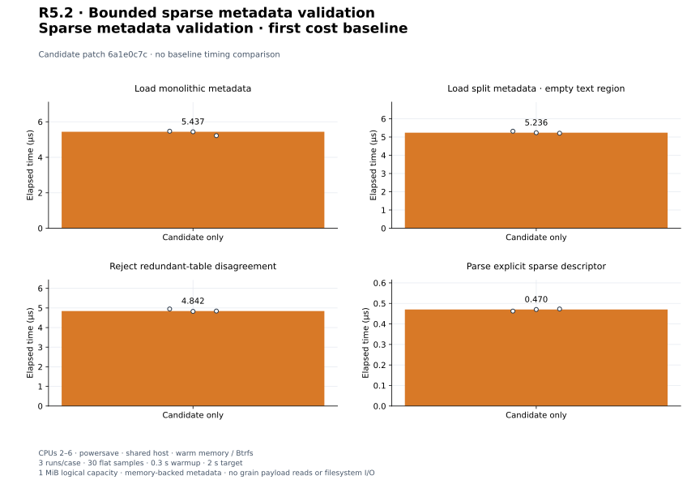

# R5.2 — Bounded sparse metadata validation

Baseline **`cbe2081`**. Candidate: baseline plus [candidate.patch](candidate.patch),
SHA-256 `6a1e0c7c1f6b2844d9202412f9c4c96ee52c4684ba7e9e92982f956b9746aa6e`. [Environment](environment.json),
[build commands](build-commands.json), [unchanged control harness patch](matched-harness.patch)
and [audit](audit.json) retain source, compiler, executable, filesystem and harness
identities. Dependencies and execution defaults are unchanged. Descriptor syntax
is now shared through a constant parser mode; default FLAT/ZERO acceptance stays
unchanged. Backing resolution gains an explicit defensive sparse rejection.

## Outcome and validation

[SparseMetadata](../../vmdk-sparse-metadata.md) acquires and validates one base
hosted sparse extent: descriptor/header binding, bounded metadata buffers/read work,
all table placements before table I/O, exact redundant-table agreement, complete
grain bounds/alignment and duplicate rejection. It retains the backing and an
immutable logical-order grain map. Endpoint and header observations reject detected
source changes; same-size table/content mutation still requires caller quiescence.
Per-job totals and logical alias protection belong to the next mapping layer.
[ADR-0039](../../adr/0039-bounded-sparse-metadata.md) records the contract.

There is **no production logical sparse reader or public CLI sparse support**.
Zero entries remain unallocated metadata; no parent lookup, sparse native FD,
writes or recovery fallback is introduced. The explicit SparseDescriptor parser
accepts only base hosted sparse text, including one-to-eight-digit 32-bit CIDs.
Existing Descriptor still requires eight CID digits and rejects sparse inputs.
Format semantics come from the [VMware technical note](https://github.com/vmware/open-vmdk/blob/master/vmdk_50_technote.pdf),
pp. 3–9; [specification identity](specification.json) retains its hash. No producer
implementation source or VMware SDK was used, and no ESXi qualification is claimed.

**465 distinct tests pass; one existing allocation test remains gated** (466 total).
Nine new tests cover explicit grammar, CID widths, embedded/external mismatches,
empty split reservations, placement before table reads, redundancy, grain bounds,
exact budgets, duplicate pointers, endpoint/header changes and short/error I/O.
[Workspace tests](tests.txt), [inventory](test-inventory.txt), [Clippy](clippy.txt),
[formatting](fmt.txt), [portable check](portable.txt) and [validation](validation.json)
pass. Wasm32 core/datamover/VMDK retains the existing control::sum warning.
A separate **101-test CLI/VMDK run passes** with integration fixtures on Btrfs:
[output](storage-tests.txt), [invocation](storage-validation.json). Five existing
CLI unit fault tests retain system-temporary fixtures; parser/memory tests do not
exercise storage. The sparse metadata rejection tests use authored memory sources.

## Reference maps and byte reconstruction

[Reference records](reference-metadata.json), [invocation](reference-command.json)
and [runner snapshot](reference-generator.py) retain QEMU 10.2.2, executable and
runner hashes, commands, full validated maps and generated-file hashes. Generated
images remain in ignored storage. Each RAW oracle has an allocated first and last
64 KiB grain with intervening zeros. A test-only utility reconstructs bytes using
the returned map and compares hashes with RAW, then runs QEMU compare.

| Generated fixture | Result |
|---|---|
| monolithicSparse, 1 MiB | Valid map; reconstructed bytes equal RAW and QEMU |
| monolithicSparse, 64 MiB | Two grain tables, distant allocated grain; byte agreement |
| twoGbMaxExtentSparse, 1 MiB, one extent | Empty descriptor reservation bound externally; byte agreement |

All source hashes remain unchanged; public CLI rejects all three sparse fixtures.
This qualifies the returned maps, not a production read path, multi-file producer
split disks, arbitrary VMware images or custom-layout decoding. Authored tests
cover selection within a two-extent split descriptor separately.

The initial reference attempt exposed QEMU's unpadded `CID=35cf2bd`, rejected by
the pre-existing eight-digit rule. [Failed invocation](initial-reference-command.json),
[descriptor/hash probe](initial-reference-probe.json),
[initial runner](initial-reference-generator.py) and [build log](initial-candidate-build.txt)
retain that result. The opt-in sparse parser now accepts one to eight hex digits
as a bounded 32-bit value; the default parser's contract/tests are unchanged.
The final reference run uses freshly generated images without fixture rewriting.
Final tests and rebuilt candidate binaries precede all timing below.

## Matched existing controls

Three adjacent C/B, B/C, C/B pairs per workload; 30 flat samples/run, 0.3 s warmup,
2 s target. Medians of run medians and every paired change are shown. CPUs 2–6,
powersave, shared host, warm Btrfs/memory; no cache drops. Builds, tests and reference
work completed before timing. Criterion arrays and resource logs are retained;
process CPU/RSS includes setup and checks.

| Workload | Baseline | Candidate | Change | Every paired change |
|---|---:|---:|---:|---|
| `descriptor/small` | 1.056 µs | 1.017 µs | -3.68% | -4.00%, +0.10%, -1.56% |
| `resolution/load_descriptor` | 11.826 µs | 11.907 µs | +0.68% | +0.75%, +0.68%, -0.35% |
| `cli_vmdk/copy_mixed_verify` | 20.869 ms | 20.234 ms | -3.04% | -3.04%, -1.22%, +0.22% |
| `cli_transfer/verify_only` | 3.137 ms | 3.167 ms | +0.97% | +2.06%, -0.56%, +1.28% |

[Measurements](measurements.json), [summary](summary.json). Strict text parsing
excludes acquisition; local loading includes open/read/parse/close of an unpadded
descriptor. VMDK copy uses the unchanged mixed 1 MiB/64-extent fixture, four workers,
64 KiB blocks, verification, engine flush, file/directory sync and publication.
RAW verification compares 16 MiB at 64 KiB blocks without flush. Full CLI timings
include argument parsing and JSON to a sink; content checks and fixture deletion
are outside timing. Different boundaries are not compared as engine throughput.
Control executable hashes differ; no causal speedup claim is made.


[PNG](plots/planning-latency.png).


[PNG](plots/copy-latency.png).


[PNG](plots/relative-change.png).


[PNG](plots/sample-distributions.png).

## Triggered investigation

No adverse aggregate or individual pair exceeded +5%; no longer repeat was triggered.

Shared-host observations do not close PERF.0, R4.4 preview-overhead tuning or earlier
adverse timing follow-ups. All original and adverse runs remain visible. No engine
speedup, cold-storage result or global performance qualification is claimed.

## First sparse metadata cost baselines

Three candidate-only runs/case, 30 flat samples, 0.3 s warmup, 2 s target. Authored
1 MiB logical-capacity memory sources, 64 KiB grains, two allocated grain pointers,
redundant metadata and descriptors are constructed outside timing. Load timings
include resolver Arc cloning, endpoint observations, memory-backed metadata reads,
validation, allocation, sorting and drop, but no grain payload I/O. Monolithic
parses/binds embedded text; split scans an empty reserved region. Rejection stops
on redundant-table disagreement. Descriptor-only parses unpadded sparse text.
These are first cost baselines, not filesystem opening or data throughput results.
Default payload budgets are 128 MiB memory / 256 MiB metadata reads per extent;
fixture success reserves 11,488 payload bytes and requests 16,384 metadata bytes.
These counters exclude parser/resolver/allocator overhead and fixed stack buffers;
process RSS is not a loader allocation bound. Larger-capacity tuning remains open.

| Workload | Median | Every run median |
|---|---:|---|
| `sparse_metadata/monolithic` | 5.437 µs | 5.470 µs, 5.437 µs, 5.219 µs |
| `sparse_metadata/split_empty_region` | 5.236 µs | 5.318 µs, 5.236 µs, 5.209 µs |
| `sparse_metadata/redundant_rejection` | 4.842 µs | 4.948 µs, 4.825 µs, 4.842 µs |
| `sparse_metadata/descriptor` | 0.470 µs | 0.463 µs, 0.470 µs, 0.473 µs |

[Samples](candidate-only-measurements.json), [summary](candidate-only-summary.json),
[harness](../../../crates/rvvdk-vmdk/benches/sparse_metadata.rs).


[PNG](plots/candidate-only.png).

## Reproduce plots

```bash
target/benchmark-plots/bin/python scripts/benchmarks/plot.py docs/benchmark-results/2026-09-30-r52
```

[Config](plot-config.json), [manifest](plots/manifest.json) and [computed values](plots/computed.json)
retain hashes and generator versions. The audit verifies normalized medians, every
pair, source reconstruction, reference hashes and byte-identical regeneration.
