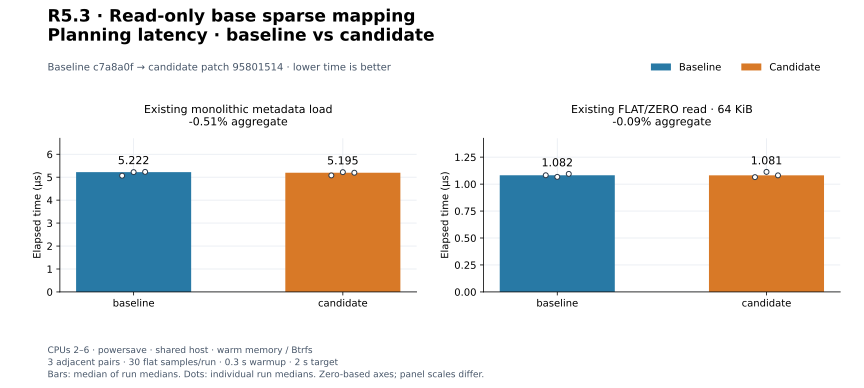
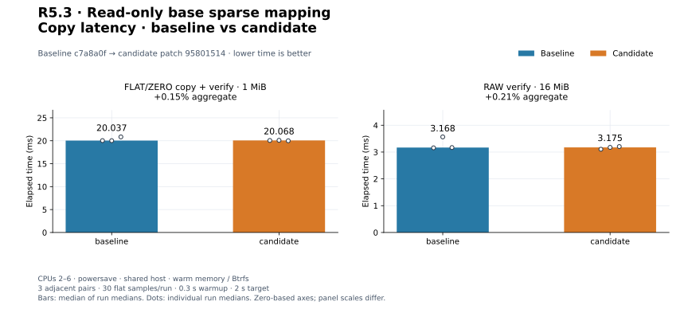
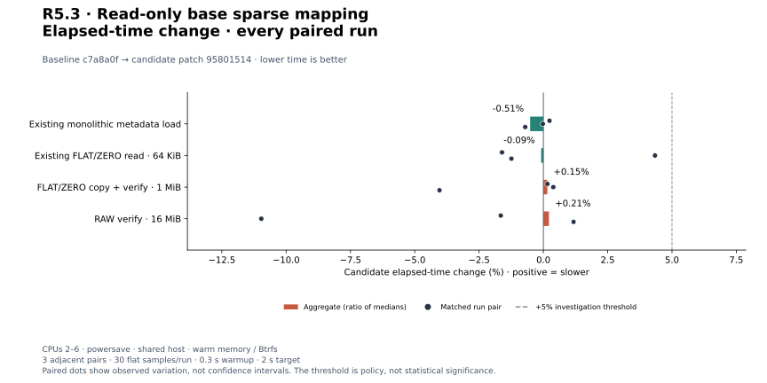
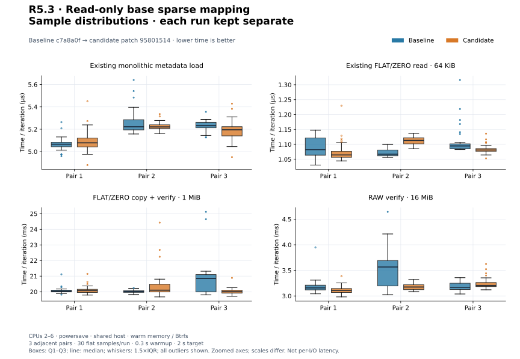
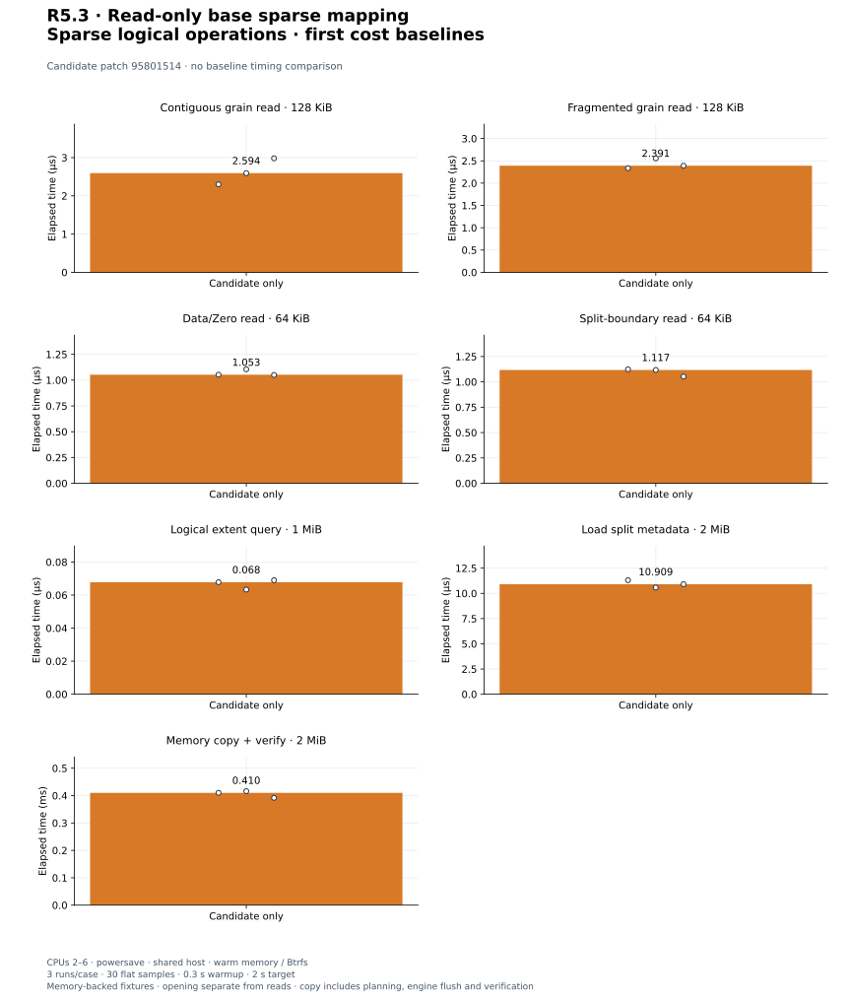

# R5.3 — Read-only base sparse logical mapping

Baseline **`c7a8a0f`**. Candidate: baseline plus [candidate.patch](candidate.patch),
SHA-256 `95801514b5c734400187f3b8a5cb2db96c003e4add3199716e7f3d873cab377f`. [Environment](environment.json),
[build commands](build-commands.json), [unchanged control harness patch](matched-harness.patch)
and [audit](audit.json) retain source, compiler, executable, filesystem and harness
identities. Dependency versions and execution defaults are unchanged. Existing
metadata admission, FLAT/ZERO mapping and public CLI source paths are unchanged;
SparseMetadata gains a crate-private physical read method for the new mapper.

## Outcome and validation

[SparseDisk](../../vmdk-sparse-disk.md) is a read-only base hosted sparse VirtualDisk.
It owns validated maps/backings, admits aggregate metadata memory/read work and
handle count, and exposes allocation-free reads with physical grain coalescing.
Unallocated base grains read zero; logical Data/Zero extents clip and coalesce across
split boundaries. Query output count is bounded before exact-size allocation.
Portable DataMover/Verifier preflight rejects every backing alias and unknown
identity. Endpoint observations require caller-maintained source quiescence;
they are not a snapshot or metadata replay. [ADR-0040](../../adr/0040-read-only-base-sparse-mapping.md).

There is **no public CLI sparse support, parent resolution, native RAW endpoint or
write path**. The API accepts the same clean, uncompressed version-1 base subset as
R5.2. Default aggregate payload limits are 128 MiB memory / 256 MiB metadata reads,
128 loaded extents and 65,536 coalesced entries per query. Memory sums loader
reservations conservatively, including released scratch, plus metadata structs.
Parser/resolver/allocator overhead, fixed stacks and query/caller buffers remain
separate. No RSS, live-VM consistency or ESXi qualification is claimed.

**478 distinct tests pass; one existing allocation test remains gated** (479 total).
Thirteen new tests cover arbitrary/clipped ranges, contiguous/fragmented grains,
zero reads without payload I/O, split boundaries with different grain sizes,
query limits, exact aggregate budgets, release on failure, short/error reads,
concurrent ownership, portable copy/verify, alias/unknown/changed identity preflight,
final acquisition rechecks and real-file hard links/path replacement.
[Workspace tests](tests.txt), [inventory](test-inventory.txt), [Clippy](clippy.txt),
[formatting](fmt.txt), [portable check](portable.txt) and [validation](validation.json)
pass. Wasm32 core/datamover/VMDK retains the existing control::sum warning.
A separate **114-test CLI/VMDK run passes** with integration fixtures on Btrfs:
[output](storage-tests.txt), [invocation](storage-validation.json). Five existing
CLI unit fault tests retain system-temporary fixtures; parser/memory tests do not
exercise storage. The new hard-link/path replacement case runs on Btrfs here.

## Full logical reads against reference images

[Reference records](reference-sparse.json), [invocation](reference-command.json)
and [runner snapshot](reference-generator.py) retain QEMU 10.2.2, executable/runner
hashes, exact commands, decoded geometry/counters and all generated-file hashes.
Generated images remain in ignored storage. The production SparseDisk reader reads
every byte in 65,537-byte chunks; the dump utility leaves zero-only output chunks
sparse. SHA-256 equality against independently patterned RAW oracles and QEMU
compare both pass. All input VMDK hashes remain unchanged.

| Generated fixture | Result |
|---|---|
| monolithicSparse, 1 MiB | Full logical bytes equal RAW and QEMU |
| monolithicSparse, 64 MiB | Two grain tables; full byte agreement |
| twoGbMaxExtentSparse, 1 MiB, one extent | External descriptor; full byte agreement |
| twoGbMaxExtentSparse, 2 GiB + 64 KiB, two extents | Allocated data crosses split boundary; full byte agreement |

The last fixture reserves 287,352 loader/struct payload bytes and requests 290,816
metadata bytes on this target. It validates a larger geometry, not a large-capacity
performance benchmark. No fixture rewriting or alternate decoder is used to feed
the library. Public CLI rejects all four sparse sources pending R5.4. This qualifies
the specified QEMU-produced subset, not arbitrary VMware images, parents, custom
layouts or live access. Format semantics remain those documented in the
[R5.2 specification record](../2026-09-30-r52/specification.json); no producer
implementation source or VMware SDK was read or copied.

## Matched existing controls

Three adjacent C/B, B/C, C/B pairs per workload; 30 flat samples/run, 0.3 s warmup,
2 s target. Medians of run medians and every paired change are shown. CPUs 2–6,
powersave, shared host, warm Btrfs/memory; no cache drops. All builds, tests and
reference work completed before timing. Criterion arrays and resource logs are
retained; process CPU/RSS includes setup and validation outside timed sections.

| Workload | Baseline | Candidate | Change | Every paired change |
|---|---:|---:|---:|---|
| `sparse_metadata/monolithic` | 5.222 µs | 5.195 µs | -0.51% | +0.24%, -0.02%, -0.71% |
| `logical/cross_64k` | 1.082 µs | 1.081 µs | -0.09% | -1.61%, +4.34%, -1.24% |
| `cli_vmdk/copy_mixed_verify` | 20.037 ms | 20.068 ms | +0.15% | +0.15%, +0.39%, -4.04% |
| `cli_transfer/verify_only` | 3.168 ms | 3.175 ms | +0.21% | -1.65%, -10.96%, +1.17% |

[Measurements](measurements.json), [summary](summary.json). Metadata load is the
unchanged R5.2 1 MiB logical memory fixture, including allocation/validation/drop.
The existing FLAT/ZERO read spans alternating 4 KiB Data/Zero pieces in a 1,024-extent
memory map, starting at byte 257 and reading 64 KiB with setup outside timing.
CLI VMDK copy uses the unchanged mixed 1 MiB/64-extent fixture, four workers,
64 KiB blocks, verification, engine flush, file/directory sync and publication.
RAW verification compares 16 MiB at 64 KiB blocks without flush. Full CLI timings
include argument parsing and JSON to a sink; content checks and fixture deletion
are outside timing. These different boundaries are not engine throughput comparisons.
Executable hashes differ; no causal speedup claim is made.


[PNG](plots/planning-latency.png).


[PNG](plots/copy-latency.png).


[PNG](plots/relative-change.png).


[PNG](plots/sample-distributions.png).

## Triggered investigation

No adverse aggregate or individual pair exceeded +5%; no longer repeat was triggered.

The favorable -10.96% RAW verification pair is retained as shared-host variability,
not a speedup claim. Shared-host observations do not close PERF.0, R4.4 preview-overhead tuning or earlier
adverse timing follow-ups. All original and adverse runs remain visible. No engine
speedup, cold-storage result or global performance qualification is claimed.

## First sparse logical cost baselines

Three candidate-only runs/case, 30 flat samples, 0.3 s warmup, 2 s target. Authored
memory sources use 1 MiB logical capacity, 64 KiB grains, two allocated grain pointers
and redundant metadata. Setup/admission and reusable buffers are outside read/query
timing. Contiguous 128 KiB reads merge two grains into one backend request; reversed
physical pointers require two requests. Cross-zero 64 KiB reads span 32 KiB Data and
32 KiB Zero. Split-boundary 64 KiB reads span 32 KiB Zero then 32 KiB Data.
Extents queries cover the full 1 MiB and allocate two coalesced entries.

Split opening times complete load/revalidate/drop for two 1 MiB logical references
to the same memory source, charged separately; no deduplication is claimed. Its
memory reservation is 23,440 bytes and metadata read payload is 32,768 bytes on this
target. Copy+verify uses this 2 MiB disk, four workers, 64 KiB blocks, engine flush
(memory backend), and a reused Verifier with two 64 KiB buffers. Planning/preflight,
copy and verification are timed; dirty destination fill, independent output checks
and fixture setup are outside timing. No filesystem or CLI publication is included.
Different sizes/boundaries are first cost baselines, not speedups over each other.

| Workload | Median | Every run median |
|---|---:|---|
| `sparse_disk/read_contiguous_128k` | 2.594 µs | 2.302 µs, 2.594 µs, 2.981 µs |
| `sparse_disk/read_fragmented_128k` | 2.391 µs | 2.335 µs, 2.556 µs, 2.391 µs |
| `sparse_disk/read_cross_zero_64k` | 1.053 µs | 1.053 µs, 1.105 µs, 1.050 µs |
| `sparse_disk/read_split_64k` | 1.117 µs | 1.124 µs, 1.117 µs, 1.052 µs |
| `sparse_disk/extents_1m` | 0.068 µs | 0.068 µs, 0.063 µs, 0.069 µs |
| `sparse_disk/load_split_2m` | 10.909 µs | 11.303 µs, 10.581 µs, 10.909 µs |
| `sparse_disk/copy_verify_2m` | 410.128 µs | 410.128 µs, 416.115 µs, 391.762 µs |

Contiguous-read medians span 2.302–2.981 µs. Unit tests prove fewer backend requests;
these noisy memory timings do not establish a coalescing speedup or a ranking against
fragmented reads. Larger-capacity opening/query performance remains unqualified.

[Samples](candidate-only-measurements.json), [summary](candidate-only-summary.json),
[harness](../../../crates/rvvdk-vmdk/benches/sparse_disk.rs).


[PNG](plots/candidate-only.png).

## Reproduce plots

```bash
target/benchmark-plots/bin/python scripts/benchmarks/plot.py docs/benchmark-results/2026-09-30-r53
```

[Config](plot-config.json), [manifest](plots/manifest.json) and [computed values](plots/computed.json)
retain hashes and generator versions. The audit verifies normalized medians, every
pair, source reconstruction, reference hashes and byte-identical regeneration.
