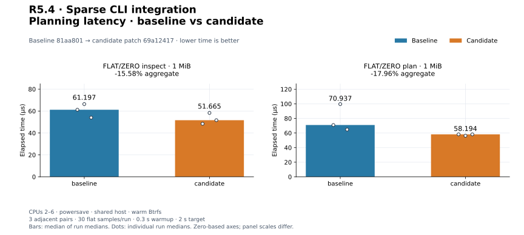
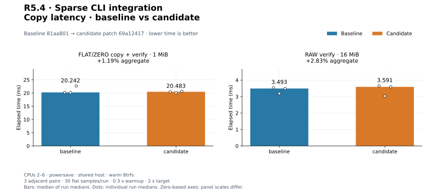
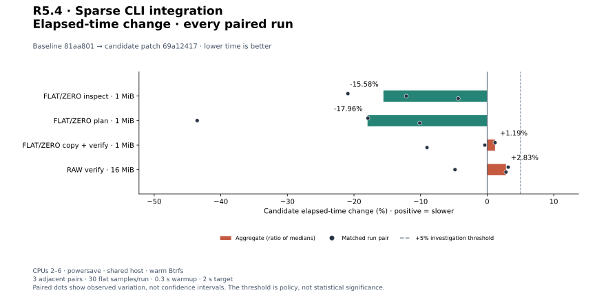
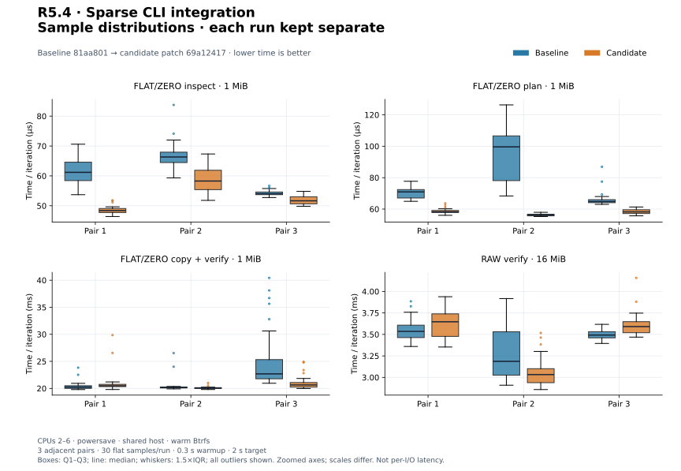
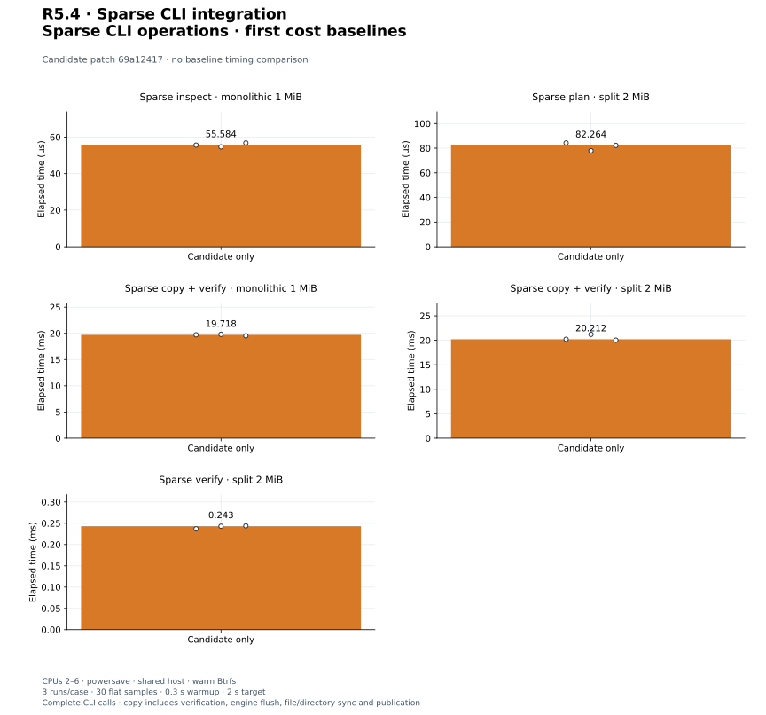

# R5.4 — Sparse CLI source acquisition and integration

Baseline **`81aa801`**. Candidate: baseline plus [candidate.patch](candidate.patch),
SHA-256 `69a12417cbac8daac887ba6352d7b221d7ba46841f98cd3d9d8fd3a1ee958cdb`. [Environment](environment.json),
[build commands](build-commands.json), [unchanged control harness patch](matched-harness.patch)
and [audit](audit.json) retain source, compiler, executable, filesystem and harness
identities. Dependencies and execution defaults are unchanged. Format library code
is unchanged; CLI acquisition now dispatches bounded input to flat or sparse parsing.
The successful flat parse is reused instead of repeating validation after acquisition.

## Outcome and validation

Explicit `--format vmdk` now supports clean version-1 base monolithic sparse
containers and external split sparse descriptors in inspect, plan, copy and verify.
The [CLI contract](../../cli-vmdk.md) retains confined lookup, descriptor/backing alias
checks, timestamp observations, portable execution, cancellation and publication.
Embedded monolithic text must resolve to the already opened container's device/inode
before backing metadata reads; equal bytes at another inode do not satisfy binding.
[ADR-0041](../../adr/0041-sparse-cli-source-acquisition.md) records the decision.

The bounded first chunk (at most 4 KiB) is reused as text input; binary header admission
precedes advertised descriptor allocation/read. Text bounds include all padding and
one oversize probe. Source metadata limits remain independent of --memory-budget:
SparseDisk defaults admit 128 extents, 128 MiB metadata reservation, 256 MiB metadata
read payload and 65,536 query outputs, plus per-extent limits. Container entry
acquisition can add 4 KiB + 512 B + 1 MiB beyond loader counters. Each backing has
an extra observation FD. These are payload/count limits, not an RSS limit.

RAW selection remains explicit. Native RAW execution, parents, compressed/managed
variants, dirty recovery and VMDK writes are not introduced. Sources must remain
quiescent: timestamps and identity observations do not provide a snapshot or exclude
external writers. Schema version 1 remains; sparse previews add layout and loader
reservation/read counters. Existing FLAT/ZERO report fields remain unchanged.

**488 distinct tests pass; one existing allocation test remains gated** (489 total).
Ten new CLI tests exercise logical inspect/plan/copy/verify, split and monolithic
inputs, threaded/auto behavior, overwrite tails and mismatch offsets, original-byte
preservation, container redirection rejection/same-inode acceptance, every source
alias, malformed headers/tables, traversal/symlinks, byte limits, native/budget rejection,
same-size descriptor/metadata/payload changes, cancellation and publication collisions.
[Workspace tests](tests.txt), [inventory](test-inventory.txt), [Clippy](clippy.txt),
[formatting](fmt.txt), [portable check](portable.txt) and [validation](validation.json)
pass. Wasm32 core/datamover/VMDK retains the existing control::sum warning.
Validation uses a fresh target directory after stale local build artifacts exposed
older API definitions; matched release builds also use independent fresh targets.
A separate **124-test CLI/VMDK run passes** with integration fixtures on Btrfs:
[output](storage-tests.txt), [invocation](storage-validation.json). Five existing
CLI unit fault tests retain system-temporary fixtures; parser/memory tests do not
exercise storage.

## Public CLI reference qualification

[Reference records](reference-cli.json), [invocation](reference-command.json)
and [runner snapshot](reference-generator.py) retain QEMU 10.2.2, executable/runner
hashes, commands, all CLI JSON reports and generated-file hashes. Generated files
remain in ignored storage. All four commands pass for each fixture:

| Generated fixture | Qualification |
|---|---|
| monolithicSparse, 1 MiB | Embedded descriptor, inspect/plan, copy+verify and standalone verify |
| monolithicSparse, 64 MiB | Two grain tables; all four commands |
| twoGbMaxExtentSparse, 1 MiB, one extent | External descriptor; all four commands |
| twoGbMaxExtentSparse, 2 GiB + 64 KiB, two extents | Data crosses split boundary; all four commands |

Plan creates no output. Auto selects threaded. Copy uses four workers and 65,537-byte
blocks, verifies all logical bytes, and reports file/directory sync for new output.
Output SHA-256 equals the independently patterned RAW oracle; QEMU compare also
passes. Source VMDK hashes remain unchanged. No fixture rewriting, VMware SDK,
third-party implementation source or live ESXi access is used. The larger case is
correctness evidence, not a large-capacity timing result. Earlier staged reference
runners/evidence retain their original pre-CLI rejection expectations; this runner
qualifies the current public CLI.

## Matched existing controls

Three adjacent C/B, B/C, C/B pairs per workload; 30 flat samples/run, 0.3 s warmup,
2 s target. Medians of run medians and every paired change are shown. CPUs 2–6,
powersave, shared host, warm Btrfs; no cache drops. Builds, tests and reference work
completed before timing. Criterion arrays and resource logs are retained; process
CPU/RSS includes fixture setup and content checks outside timed regions.

| Workload | Baseline | Candidate | Change | Every paired change |
|---|---:|---:|---:|---|
| `cli_vmdk/inspect_mixed` | 61.197 µs | 51.665 µs | -15.58% | -20.92%, -12.15%, -4.35% |
| `cli_vmdk/plan_mixed` | 70.937 µs | 58.194 µs | -17.96% | -17.91%, -43.54%, -10.12% |
| `cli_vmdk/copy_mixed_verify` | 20.242 ms | 20.483 ms | +1.19% | +1.19%, -0.35%, -9.04% |
| `cli_transfer/verify_only` | 3.493 ms | 3.591 ms | +2.83% | +3.17%, -4.83%, +2.83% |

[Measurements](measurements.json), [summary](summary.json). All controls are complete
CLI calls with argument parsing and JSON to a sink. FLAT/ZERO inspect/plan use the
unchanged mixed 1 MiB/64-extent descriptor; plan previews a new destination. Copy adds
four workers, 64 KiB blocks, verification, engine flush, file/directory sync and
publication. RAW verify compares 16 MiB at 64 KiB blocks without flush. Content
checks and fixture removal are outside timing. Candidate source dispatch reuses
its first read and parses valid flat text once; controls include that change.
Different operations are not engine throughput comparisons. No causal speedup or
byte-identical executable claim is made.


[PNG](plots/planning-latency.png).


[PNG](plots/copy-latency.png).


[PNG](plots/relative-change.png).


[PNG](plots/sample-distributions.png).

## Triggered investigation

No adverse aggregate or individual pair exceeded +5%; no longer repeat was triggered.

The favorable -43.54% plan pair is retained. The candidate avoids duplicate flat
parsing, but host variability prevents assigning a precise speedup to that change.
Shared-host observations do not close PERF.0, R4.4 preview-overhead tuning or earlier
adverse timing follow-ups. All original and adverse runs remain visible. No engine
speedup, cold-storage result or global performance qualification is claimed.

## First sparse CLI cost baselines

Three candidate-only runs/case, 30 flat samples, 0.3 s warmup, 2 s target. Authored
fixtures use 64 KiB grains, redundant metadata and two allocated grains per 1 MiB
extent; remaining base grains read zero. Monolithic capacity is 1 MiB; split is
2 MiB across two separately opened files. Inspect uses monolithic input; plan and
standalone verify use split. Full CLI acquisition, metadata validation, arguments
and JSON output to a sink are timed. Plan creates nothing. Copy+verify includes
four workers, 64 KiB blocks, engine flush, verification, file/directory sync and
no-replace publication. Standalone verify uses the RAW source-length destination
prefix. Creation/setup, output-byte assertions and removal are outside timing.
No parent-chain or cold-storage measurement is implied. These are first baselines;
the previous CLI rejects these sources, so no sparse before/after speedup exists.

| Workload | Median | Every run median |
|---|---:|---|
| `cli_sparse/inspect_mono` | 55.584 µs | 55.584 µs, 54.628 µs, 56.783 µs |
| `cli_sparse/plan_split` | 82.264 µs | 84.270 µs, 77.915 µs, 82.264 µs |
| `cli_sparse/copy_mono_verify` | 19.718 ms | 19.718 ms, 19.801 ms, 19.524 ms |
| `cli_sparse/copy_split_verify` | 20.212 ms | 20.212 ms, 21.215 ms, 20.030 ms |
| `cli_sparse/verify_split` | 243.019 µs | 236.874 µs, 243.019 µs, 243.869 µs |

[Samples](candidate-only-measurements.json), [summary](candidate-only-summary.json),
[harness](../../../crates/rvvdk-cli/benches/sparse.rs).


[PNG](plots/candidate-only.png).

## Reproduce plots

```bash
target/benchmark-plots/bin/python scripts/benchmarks/plot.py docs/benchmark-results/2026-09-30-r54
```

[Config](plot-config.json), [manifest](plots/manifest.json) and [computed values](plots/computed.json)
retain hashes and generator versions. The audit verifies normalized medians, every
pair, source reconstruction, reference hashes and byte-identical regeneration.
