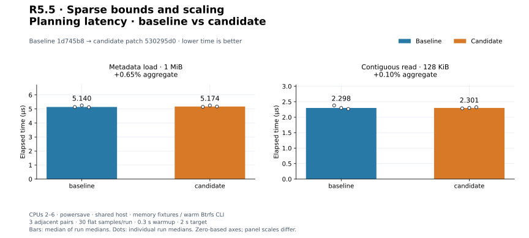
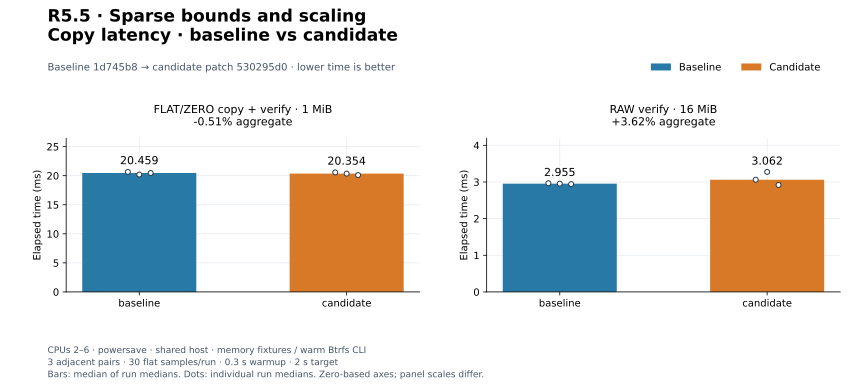
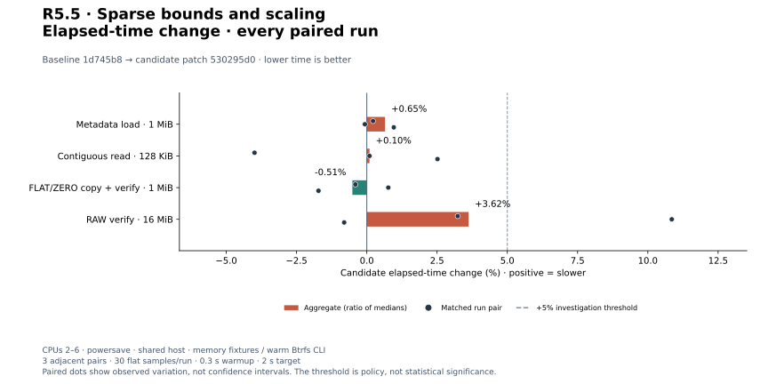
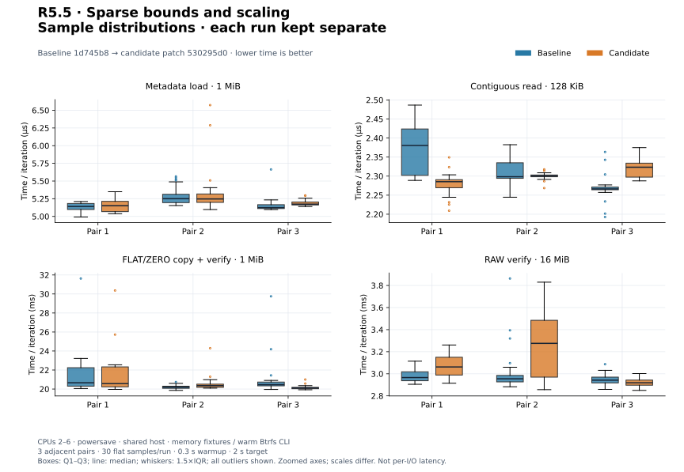
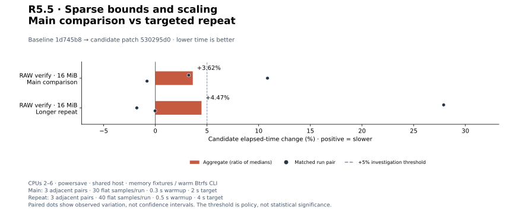
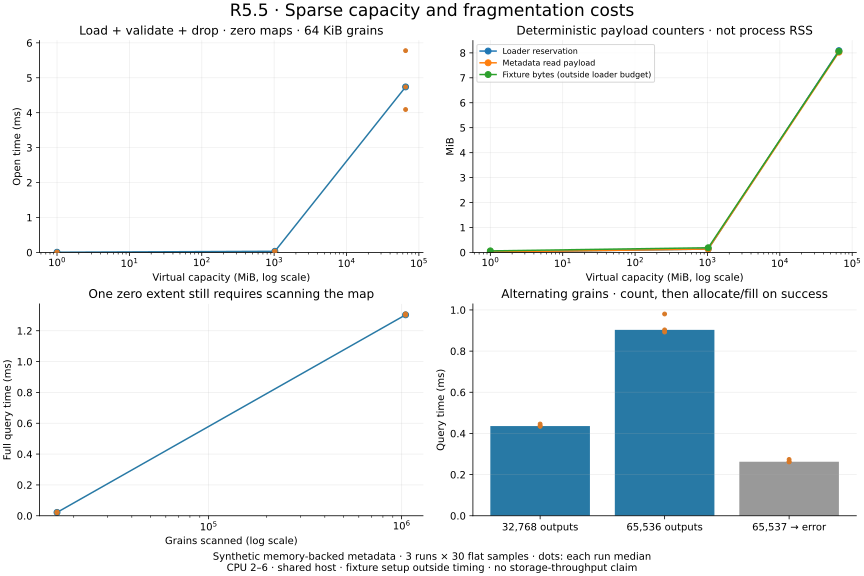
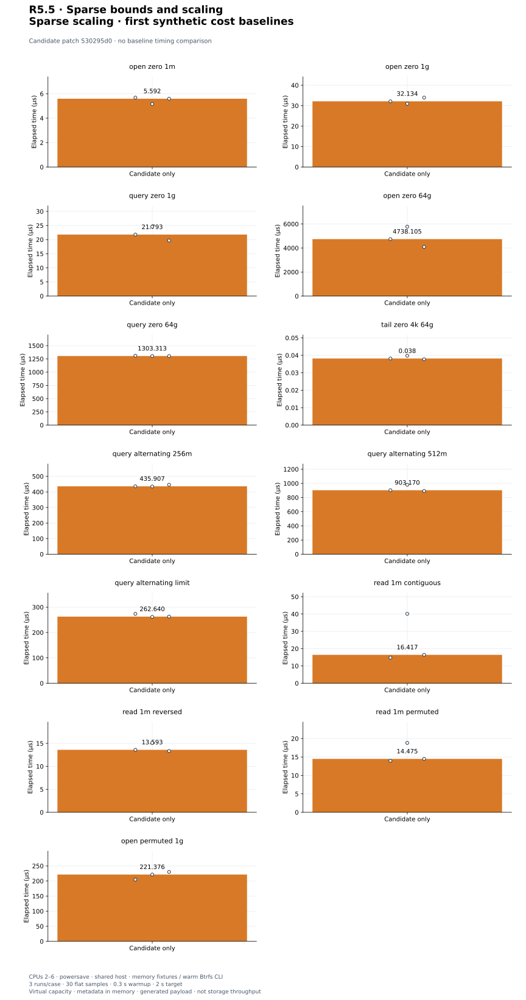

# R5.5 — Adversarial sparse validation and scaling

Baseline **`1d745b8`**. Candidate: baseline plus [candidate.patch](candidate.patch),
SHA-256 `530295d0bb988fff79d8c996d6900f76c7a5a2a5ae43a12596f917aaf6a2e504`. [Environment](environment.json),
[build commands](build-commands.json), [unchanged control harness patch](matched-harness.patch)
and [audit](audit.json) retain source/compiler/executable/harness identities.
**Production Rust source, dependencies and execution defaults are unchanged.**
This step adds qualification and first scaling baselines, not an optimization.
The [qualification contract](../../vmdk-sparse-qualification.md) describes the
architecture, exact coverage, limits and next parent-chain admission step.

## Correctness and resource boundaries

**496 distinct tests pass; one existing allocation test remains gated** (497 total).
[Workspace tests](tests.txt), [inventory](test-inventory.txt), [Clippy](clippy.txt),
[formatting](fmt.txt), [portable check](portable.txt), [validation](validation.json).
Wasm32 core/datamover/VMDK retains the existing control::sum warning. A separate
**132-test CLI/VMDK run passes** with integration fixtures on Btrfs:
[output](storage-tests.txt), [invocation](storage-validation.json). Five existing
CLI unit fault tests retain system-temporary fixtures; memory tests are not storage
qualification. Release variants and workspace validation use fresh target directories.

Eight new tests cover 60 generated layouts × 24 ranges, byte oracles, extent coverage,
coalescing and exact backing request counts, invalid pointers/duplicates, truncation,
aggregate metadata admission, query output limits and capacity counters. The
fixed-seed 4,096-case mutation corpus admits 65 and rejects 4,031, including 64
semantic-preserving positive controls. Admitted maps match independently decoded
words; source-bound and read-ceiling assertions guard metadata acquisition.
This finite corpus is not coverage-guided fuzzing or exhaustive malformed-input
proof. [Focused output](adversarial.txt), [invocation](adversarial-command.json).

The 1 TiB/64 KiB-grain profile is rejected by the default 128 MiB aggregate budget
after one header read, before offset reads. A 65,536-output query succeeds;
65,537 fails, while a one-byte tail query on the same disk succeeds. All-zero
full queries still scan the map. These preserve existing conservative bounds.

| Virtual capacity | Grains | Loader reservation (bytes) | Metadata read payload (bytes) | Backing calls |
|---|---:|---:|---:|---:|
| 1 MiB | 16 | 11,720 | 16,384 | 7 |
| 1,024 MiB | 16,384 | 143,656 | 143,360 | 69 |
| 65,536 MiB | 1,048,576 | 8,481,064 | 8,416,256 | 4,101 |

[Machine-readable counters](capacity-profiles.json). Fixture memory is outside loader
budgets; caller buffers, output vectors and allocator overhead are also excluded.
These are reservation/read-payload counters, not RSS or peak live memory.

## Current CLI reference checks

All four commands pass on QEMU-generated 1 MiB and 64 MiB monolithic, 1 MiB split
and two-file 2 GiB + 64 KiB split fixtures. Plan creates nothing. Copy uses auto/
threaded, four workers, 65,537-byte blocks, full verification and file/directory
sync. Output SHA-256 matches the RAW oracle, QEMU compare agrees and source hashes
remain unchanged. [Records](reference-cli.json), [invocation](reference-command.json),
[runner snapshot](reference-generator.py). No VMware SDK, producer implementation
source or live ESXi is used. These are correctness checks, not capacity timings.

## Paired existing controls

Three adjacent C/B, B/C, C/B pairs per workload; 30 flat samples/run, 0.3 s warmup,
2 s target. CPUs 2–6, powersave, shared host; warm Btrfs CLI fixtures and synthetic
memory-backed library fixtures. Builds, tests and QEMU checks finish before timing.
Raw Criterion arrays, commands and resource logs retain every run. Process RSS/CPU
includes untimed setup. Median-of-run-medians changes and every pair follow:

| Workload | Baseline | Candidate | Change | Every paired change |
|---|---:|---:|---:|---|
| `sparse_metadata/monolithic` | 5.140 µs | 5.174 µs | +0.65% | +0.22%, -0.07%, +0.96% |
| `sparse_disk/read_contiguous_128k` | 2.298 µs | 2.301 µs | +0.10% | -4.00%, +0.10%, +2.52% |
| `cli_vmdk/copy_mixed_verify` | 20.459 ms | 20.354 ms | -0.51% | -0.41%, +0.76%, -1.72% |
| `cli_transfer/verify_only` | 2.955 ms | 3.062 ms | +3.62% | +3.23%, +10.85%, -0.81% |

[Measurements](measurements.json), [summary](summary.json). Metadata control loads
and validates the existing 1 MiB monolithic fixture; the sparse read control copies
128 KiB across contiguous grains in memory. FLAT/ZERO mixed 1 MiB copy includes
CLI acquisition, four workers, verification, flush, file/directory sync and publication.
RAW verify compares 16 MiB without flush. Setup/content checks/removal are untimed.
Independent builds and shared-host variation preclude a causal speedup claim.


[PNG](plots/planning-latency.png).


[PNG](plots/copy-latency.png).


[PNG](plots/relative-change.png).


[PNG](plots/sample-distributions.png).

## Triggered investigation

Every adverse aggregate or individual pair above +5% triggered three longer
B/C, C/B, B/C pairs, 40 flat samples, 0.5 s warmup and 4 s target. Main and
repeat sets remain separate; no discarded adverse runs or pooled estimates.

| Workload | Baseline | Candidate | Change | Every paired change |
|---|---:|---:|---:|---|
| `cli_transfer/verify_only` | 3.336 ms | 3.485 ms | +4.47% | +27.90%, -1.79%, -0.02% |

[Repeat records](followup-measurements.json), [summary](followup-summary.json).


[PNG](plots/followup-change.png).


The RAW verify main pair reaches +10.85%; its longer repeat still contains
+27.90% (aggregate +4.47%). This investigation remains open. Earlier adverse
results and PERF.0/R4.4 remain open for controlled-runner work.
A favorable or quiet repeat does not erase an adverse original pair. Production
code is unchanged, so differences here do not demonstrate an implementation effect.

## First capacity and fragmentation baselines

Three candidate-only runs/case, 30 flat samples, 0.3 s warmup, 2 s target.
Authored fixtures allocate metadata only, with generated payload by physical grain;
64 GiB is virtual capacity. No equivalent payload storage or RAM disk is allocated.
Opening times validation/allocation/drop, excluding descriptor parsing and fixture
creation. Successful queries include two passes and output allocation/drop; the
limit case measures rejection without output allocation. Read buffers are reused
and payload generation is timed. Contiguous, reversed and permuted 1 MiB reads use
1 GiB virtual capacity and 64 KiB grains. Physical fragmentation affects backing
request counts; these are not storage seeks or storage-throughput results.

The harness is new, and has no historical matched scaling result. Runtime source
is unchanged, so candidate-only results establish costs, not improvement ratios.

| Workload | Median | Every run median |
|---|---:|---|
| `sparse_scale/open_zero_1m` | 5.592 µs | 5.684 µs, 5.159 µs, 5.592 µs |
| `sparse_scale/open_zero_1g` | 32.134 µs | 32.134 µs, 30.949 µs, 33.960 µs |
| `sparse_scale/query_zero_1g` | 21.793 µs | 21.793 µs, 24.592 µs, 19.694 µs |
| `sparse_scale/open_zero_64g` | 4.738 ms | 4.738 ms, 5.776 ms, 4.091 ms |
| `sparse_scale/query_zero_64g` | 1.303 ms | 1.310 ms, 1.303 ms, 1.302 ms |
| `sparse_scale/tail_zero_4k_64g` | 0.038 µs | 0.038 µs, 0.040 µs, 0.038 µs |
| `sparse_scale/query_alternating_256m` | 435.907 µs | 435.907 µs, 434.702 µs, 445.817 µs |
| `sparse_scale/query_alternating_512m` | 903.170 µs | 903.170 µs, 980.325 µs, 892.599 µs |
| `sparse_scale/query_alternating_limit` | 262.640 µs | 273.597 µs, 261.582 µs, 262.640 µs |
| `sparse_scale/read_1m_contiguous` | 16.417 µs | 14.800 µs, 40.115 µs, 16.417 µs |
| `sparse_scale/read_1m_reversed` | 13.593 µs | 13.593 µs, 15.108 µs, 13.334 µs |
| `sparse_scale/read_1m_permuted` | 14.475 µs | 13.973 µs, 18.818 µs, 14.475 µs |
| `sparse_scale/open_permuted_1g` | 221.376 µs | 204.648 µs, 221.376 µs, 230.072 µs |

The contiguous read's second run is 40.115 µs versus 14.800 and 16.417 µs;
all three remain visible. Fragmented synthetic reads are not consistently slower,
and generated payload/cache behavior cannot establish a physical-fragmentation
penalty. These observations are baselines for later controlled measurements.

[Samples](candidate-only-measurements.json), [summary](candidate-only-summary.json),
[harness](../../../crates/rvvdk-vmdk/benches/sparse_scale.rs).


[PNG](scaling-plots/capacity.png).


[PNG](plots/candidate-only.png).

## Reproduce plots

```bash
target/benchmark-plots/bin/python scripts/benchmarks/plot.py docs/benchmark-results/2026-09-30-r55
target/benchmark-plots/bin/python scripts/benchmarks/plot_sparse_scaling.py docs/benchmark-results/2026-09-30-r55
```

[Config](plot-config.json), [standard manifest](plots/manifest.json),
[computed values](plots/computed.json) and [scaling manifest](scaling-plots/manifest.json)
retain input/output/generator hashes. The audit checks every median, pair, repeat
trigger, source reconstruction, reference hashes and byte-identical plot regeneration.
