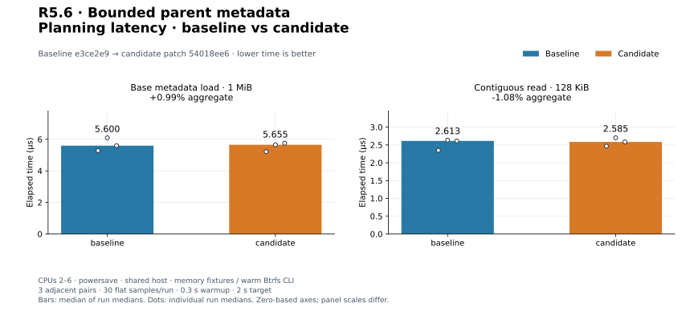
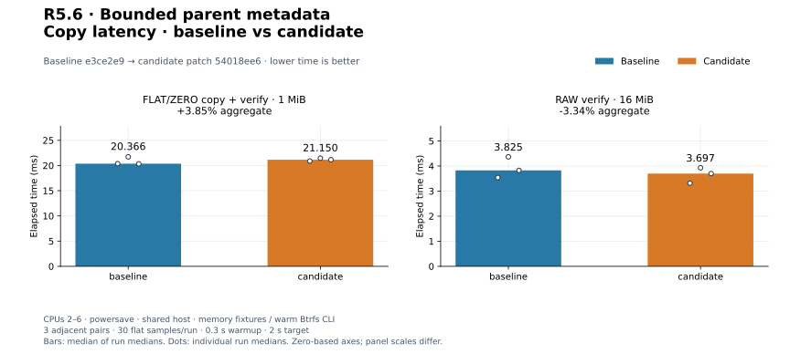
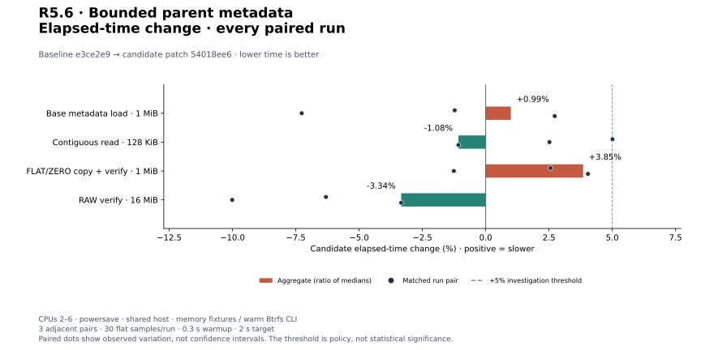
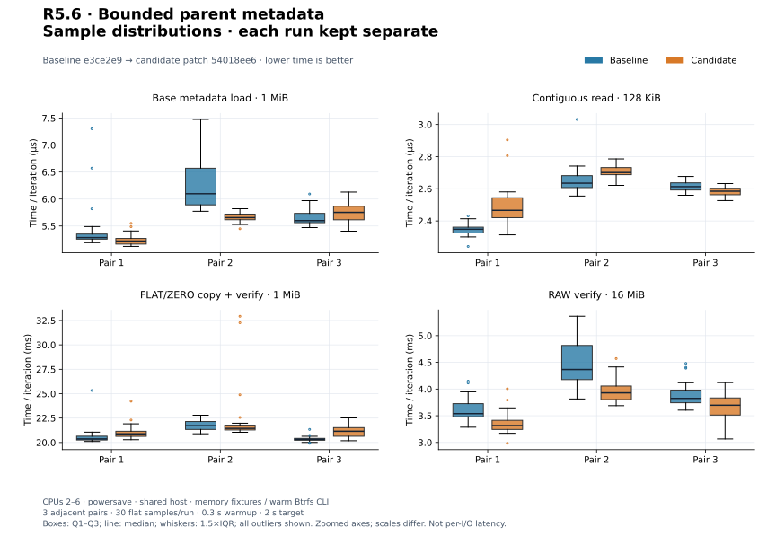
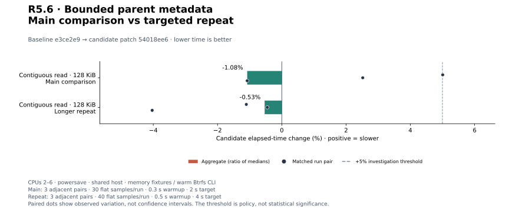
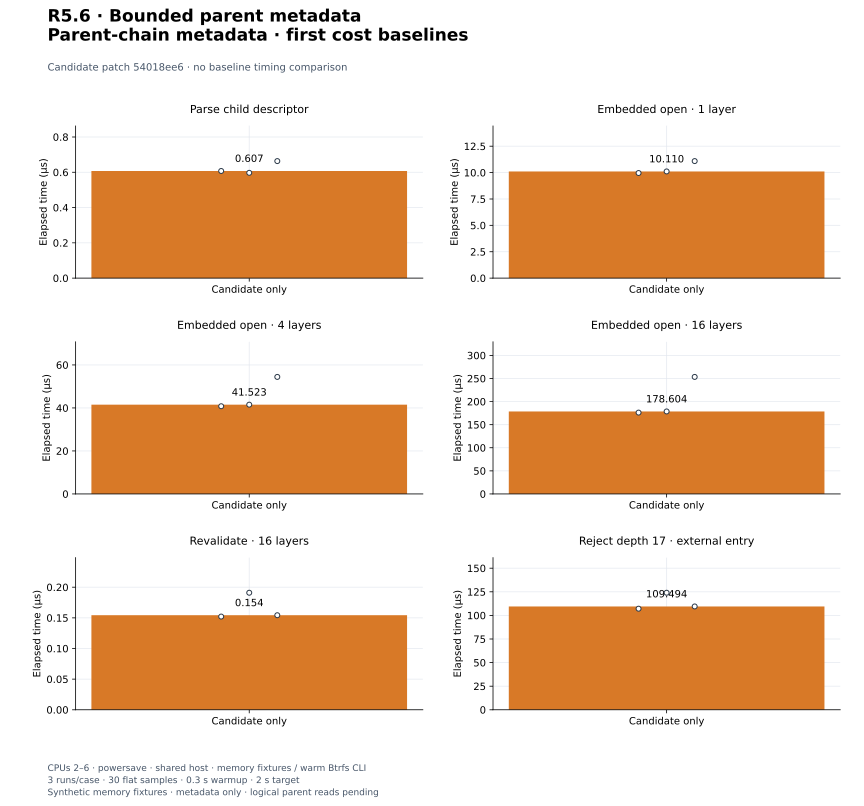

# R5.6 — Bounded sparse parent metadata

Baseline **`e3ce2e9`**. Candidate: baseline plus [candidate.patch](candidate.patch),
SHA-256 `54018ee6386a95d5081d5d0452b0341dfa54301baca23618aaa2c413c2ea4783`. [Environment](environment.json),
[build commands](build-commands.json), [unchanged control harness patch](matched-harness.patch)
and [audit](audit.json) retain source/compiler/executable/harness identities.
No dependencies or execution defaults change. The shared parser gains an opt-in
parent-capable type; the metadata loader gains internal parent-aware binding.
[Contract](../../vmdk-parent-chain.md); [ADR-0042](../../adr/0042-bounded-parent-chain-metadata.md).

## Result and validation

`SparseChain` admits and retains leaf-to-base metadata through an explicit parent
resolver with per-layer namespaces, CID/capacity checks, identity cycle/alias
checks and aggregate limits. Defaults: 16 layers, 128 extents, 8 MiB descriptor
payload, 128 MiB conservative reservation and 256 MiB acquisition payload. Embedded
entries must resolve the same container. Known readable identities are required.
The result is deliberately not a VirtualDisk. Base APIs and public CLI still reject
parents; unallocated child grains never enter base logical-zero semantics.

**512 distinct tests pass; one existing allocation test remains gated** (513 total).
Sixteen new tests cover grammar/limits, both entries, retained ownership, missing/
denied parents, CID/capacity mismatches before backing reads, self/long cycles,
equal-CID distinct objects, shared sources, unknown/changed identity, embedded
binding, split geometry, I/O errors, exact budgets and the inclusive depth limit.
[Workspace tests](tests.txt), [inventory](test-inventory.txt), [Clippy](clippy.txt),
[formatting](fmt.txt), [portable check](portable.txt), [validation](validation.json).
Wasm32 core/datamover/VMDK retains the existing control::sum warning.
A separate **148-test CLI/VMDK run passes** with integration fixtures on Btrfs:
[output](storage-tests.txt), [invocation](storage-validation.json). Five existing
CLI unit fault tests retain system-temporary fixtures; memory tests are not storage
qualification. Both release variants and validation use fresh target directories.

[Focused chain output](chain.txt), [invocation](chain-validation.json) verify actual
metadata read payload. Three authored 1 MiB layers reserve 37,187 bytes and read
49,515 bytes with external descriptors; embedded entry reserves 67,544 bytes and
reads 81,408 bytes. Outer descriptor totals are 363 and 30,720 bytes respectively.
Counters conservatively sum released scratch/text and all permitted layer slots.
Parser/resolver/allocator overhead, source storage and stack buffers are excluded;
these are not peak-RSS limits. Header/embedded-text rereads remain charged.

## Reference qualification

[Chain records](reference-chain.json), [invocation](reference-chain-command.json),
[runner snapshot](reference-chain-generator.py) preserve unmodified QEMU-created
base, three-layer monolithic, three-layer split and three-layer mixed chains.
Helper output matches descriptor CIDs/parentCIDs and QEMU backing-chain capacities.
All three parent chains are still rejected by public `rvddk inspect`; a base succeeds.
The confined example uses basename-only parent hints in one selected directory;
its four-byte entry probes are outside chain read counters. These are metadata
checks, not parent-byte decoding or snapshot consistency qualification.

The existing [base CLI reference checks](reference-cli.json),
[invocation](reference-cli-command.json) and [runner](reference-cli-generator.py)
also pass all four commands on 1 MiB/64 MiB monolithic, 1 MiB split and two-file
2 GiB + 64 KiB split sources. RAW oracle hashes and QEMU compare agree; source
hashes remain unchanged. No SDK, producer implementation source or ESXi was used.

## Paired existing controls

Three adjacent C/B, B/C, C/B pairs per workload; 30 flat samples/run, 0.3 s warmup,
2 s target. CPUs 2–6, powersave, shared host, warm Btrfs CLI fixtures and memory
library fixtures. Builds/tests/reference checks finish before timing. Resource
logs include untimed setup. Raw Criterion arrays retain every measured sample.

| Workload | Baseline | Candidate | Change | Every paired change |
|---|---:|---:|---:|---|
| `sparse_metadata/monolithic` | 5.600 µs | 5.655 µs | +0.99% | -1.22%, -7.27%, +2.73% |
| `sparse_disk/read_contiguous_128k` | 2.613 µs | 2.585 µs | -1.08% | +5.01%, +2.52%, -1.08% |
| `cli_vmdk/copy_mixed_verify` | 20.366 ms | 21.150 ms | +3.85% | +2.56%, -1.26%, +4.04% |
| `cli_transfer/verify_only` | 3.825 ms | 3.697 ms | -3.34% | -6.31%, -10.01%, -3.34% |

[Measurements](measurements.json), [summary](summary.json). Metadata control loads
and validates the existing 1 MiB monolithic fixture; the read control copies 128 KiB
across contiguous grains in memory. FLAT/ZERO mixed 1 MiB copy includes complete CLI
acquisition, four workers, verification, flush, file/directory sync and publication.
RAW verify compares 16 MiB without flush. Setup/content checks/removal are untimed.
The parser/metadata refactor can affect controls; shared-host variation and separate
builds prevent precise causal attribution. These are not engine throughput claims.


[PNG](plots/planning-latency.png).


[PNG](plots/copy-latency.png).


[PNG](plots/relative-change.png).


[PNG](plots/sample-distributions.png).

## Triggered investigation

Every adverse aggregate or individual pair above +5% triggers three longer
B/C, C/B, B/C pairs, 40 flat samples, 0.5 s warmup and 4 s target. Main and
repeat sets remain separate; no discarded adverse runs or pooled estimates.

| Workload | Baseline | Candidate | Change | Every paired change |
|---|---:|---:|---:|---|
| `sparse_disk/read_contiguous_128k` | 2.576 µs | 2.562 µs | -0.53% | -1.10%, -0.45%, -4.03% |

[Repeat records](followup-measurements.json), [summary](followup-summary.json).


[PNG](plots/followup-change.png).


The sparse read pair is +5.0069%, just above the trigger. Longer repeats show
-0.53% aggregate and -1.10%, -0.45%, -4.03% pairs. This does not reproduce an
adverse repeat, but retains the original. PERF.0/R4.4 and earlier adverse results
remain open for a controlled runner. Quiet
or favorable repeats do not erase adverse original pairs. No cold-storage or
live-VM performance qualification is claimed.

## First chain cost baselines

Three candidate-only runs/case, 30 flat samples, 0.3 s warmup, 2 s target. Each
layer is a synthetic 1 MiB monolithic sparse disk with 64 KiB grains and two
allocated grains. Metadata/payload reside in memory; setup is outside timing.
Child parse includes bounded syntax validation/allocation/drop. Opening includes
outer header/text acquisition, parsing, parent callbacks, extent validation,
identity checks, final revalidation, allocation and drop. Read counters are disabled;
fixture fault-flag atomics and memory device synchronization remain timed.
Revalidation only observes retained descriptor/backing endpoints, without rereading
metadata. Depth rejection uses external descriptors and validates 16 layers before
rejecting the next hint; it is not equivalent to a successful embedded open.

No prior successful chain harness exists. These establish costs, not improvement
ratios, physical-storage throughput or logical parent read latency.

| Workload | Median | Every run median |
|---|---:|---|
| `sparse_chain/parse_child` | 0.607 µs | 0.607 µs, 0.597 µs, 0.663 µs |
| `sparse_chain/open_embedded_1` | 10.110 µs | 9.960 µs, 10.110 µs, 11.090 µs |
| `sparse_chain/open_embedded_4` | 41.523 µs | 40.796 µs, 41.523 µs, 54.428 µs |
| `sparse_chain/open_embedded_16` | 178.604 µs | 176.133 µs, 178.604 µs, 253.378 µs |
| `sparse_chain/revalidate_16` | 0.154 µs | 0.152 µs, 0.191 µs, 0.154 µs |
| `sparse_chain/reject_depth_17` | 109.494 µs | 107.114 µs, 124.010 µs, 109.494 µs |

The third 16-layer open run is 253.378 µs versus 176.133 and 178.604 µs; all
remain visible. Shared-host variation limits extrapolation of depth scaling.

[Samples](candidate-only-measurements.json), [summary](candidate-only-summary.json),
[harness](../../../crates/rvvdk-vmdk/benches/chain.rs).


[PNG](plots/candidate-only.png).

## Reproduce plots

```bash
target/benchmark-plots/bin/python scripts/benchmarks/plot.py docs/benchmark-results/2026-09-30-r56
```

[Config](plot-config.json), [manifest](plots/manifest.json) and
[computed values](plots/computed.json) retain input/output/generator hashes.
The audit checks medians, pairs, repeat triggers, source reconstruction,
reference-file hashes and byte-identical plot regeneration.
