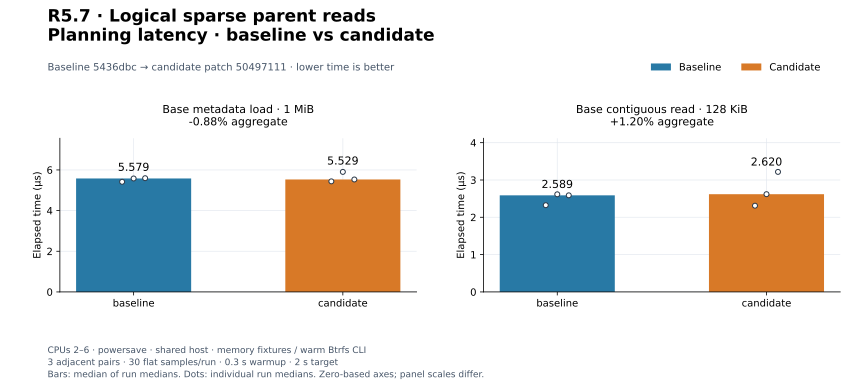
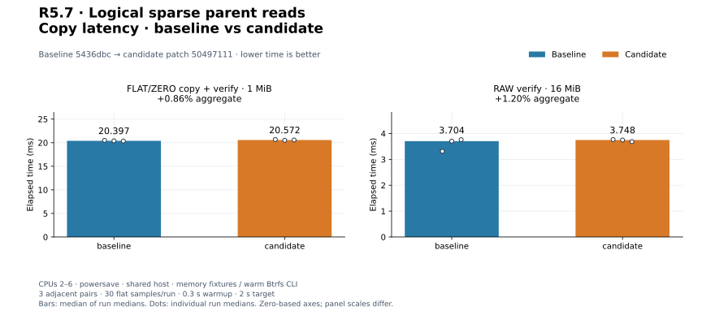
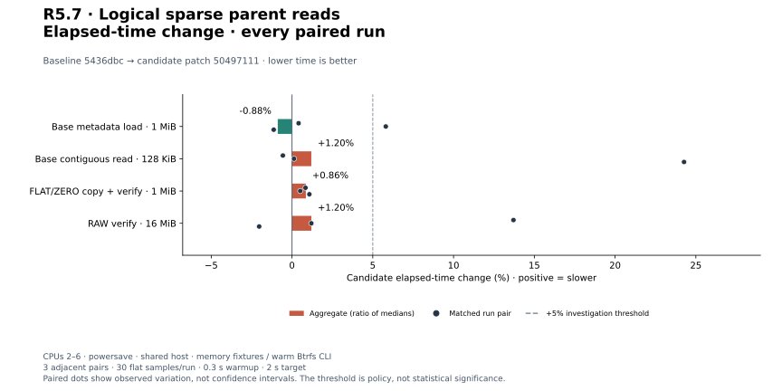
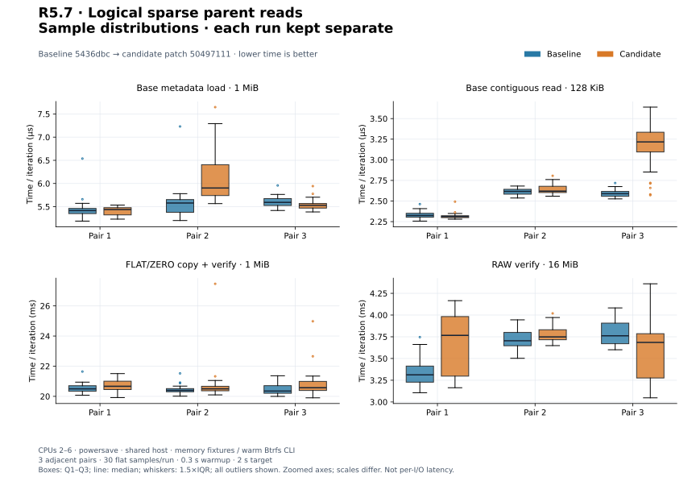
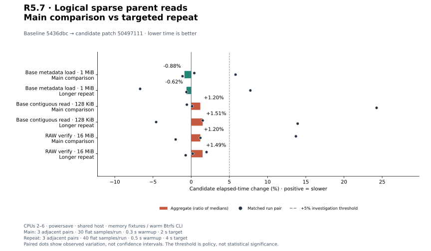
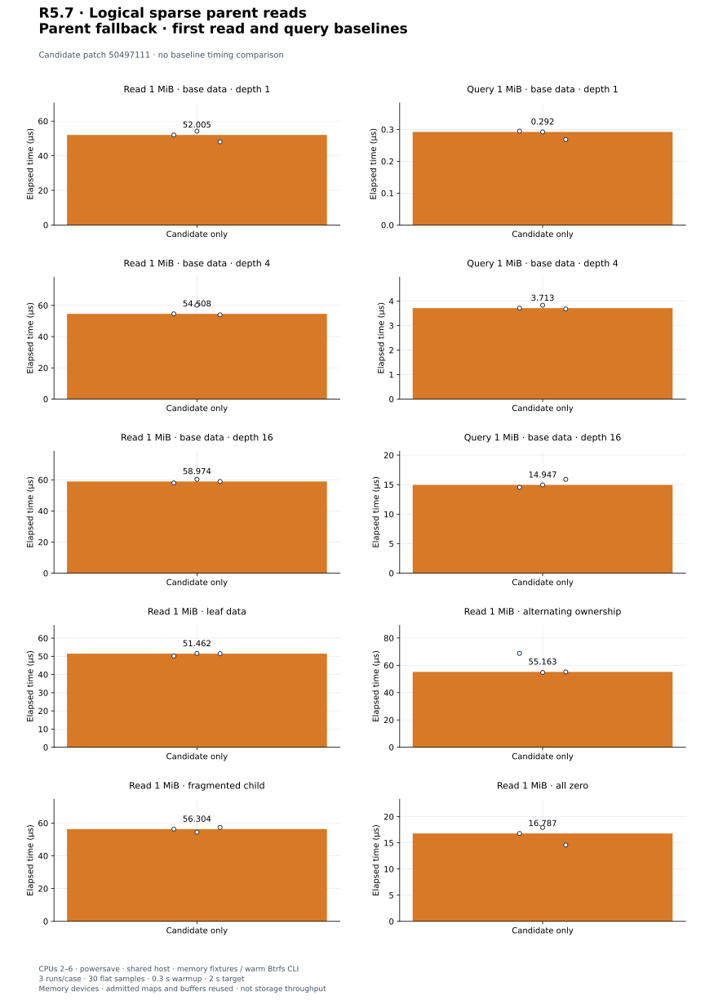

# R5.7 — Read-only sparse parent fallback

Baseline **`5436dbc`**. Candidate: baseline plus [candidate.patch](candidate.patch),
SHA-256 `504971111e8044c6529506445ba50fd69dc3f9ea95d09dd829fbb2b882c91055`. [Environment](environment.json),
[build commands](build-commands.json), [unchanged control harness patch](matched-harness.patch)
and [audit](audit.json) retain compiler/source/executable/harness identities.
Existing admission, base disk, CLI and execution defaults are unchanged. A new
`SparseChainDisk` wraps admitted chain metadata with portable logical reads.
[Contract](../../vmdk-chain-disk.md); [ADR-0043](../../adr/0043-read-only-sparse-parent-fallback.md).

## Result and validation

Iterative lookup resolves the nearest allocated ancestor, clipping at every
consulted grain boundary. Only fully resolved unallocated ranges become Zero.
Read coalescing requires adjacent physical bytes in the same backing map; logical
Data/Zero queries coalesce by kind and use count-then-allocate admission. Reads
use constant auxiliary space without a second whole-disk map. A separate default
65,536 query-output limit preserves loader budgets. All descriptor/backing aliases,
including hidden ancestors, reject at copy preflight. Source quiescence is required.
Public CLI still rejects parent chains; CLI lifecycle integration is R5.8.

**524 distinct tests pass; one existing allocation test remains gated** (525 total).
Twelve new tests cover nine grain combinations × 38 ranges, independent byte/kind
oracles, split boundaries, overrides, allocated zero bytes, depth 16, coalescing,
range errors, exact output limits, every descriptor/backing alias, changed endpoints,
short reads/EOF/errors, completed-prefix behavior, retained ownership and threaded
copy/verify. [Focused output](chain-disk.txt), [invocation](chain-disk-validation.json).
[Workspace tests](tests.txt), [inventory](test-inventory.txt), [Clippy](clippy.txt),
[formatting](fmt.txt), [portable check](portable.txt), [validation](validation.json).
Wasm32 core/datamover/VMDK retains the existing control::sum warning.
A separate **160-test CLI/VMDK run passes** with integration fixtures on Btrfs:
[output](storage-tests.txt), [invocation](storage-validation.json). Five existing
CLI unit fault tests retain system-temporary fixtures; memory tests are not storage
qualification. Fresh target directories isolate validation and both release builds.

## Full logical-byte reference qualification

[Read records](reference-reads.json), [invocation](reference-reads-command.json) and
[runner](reference-reads-generator.py) preserve QEMU monolithic, split and mixed
three-layer chains, including two-file 2 GiB + 64 KiB split sources. Independent
RAW overlays model intended writes. Production reads use 65,537-byte chunks and
read every byte; RAW output hashes agree with the oracle and QEMU decoding, and
QEMU compare passes. Sub-grain updates, grain-boundary writes and allocated zero
overrides exercise inheritance. Source VMDK hashes remain unchanged. Public CLI
inspect rejects all four parent leaves. No SDK, producer source or ESXi is used.

The large case's final second-extent grain is fully overwritten. **The initial
partial-write variant failed the independent oracle check**, and remains preserved:
[original generator](reference-reads-initial-generator.py),
[original invocation](reference-reads-initial-command.json),
[failure output](reference-reads-initial-output.txt),
[diagnostics and file hashes](reference-initial-diagnostic.json).
After the final cross-split partial write, both rvddk and QEMU decode 65,024 bytes
at offset 2,147,484,160 as 0x31 instead of the intended retained 0x61. Diagnostic
QEMU reads confirm the base and intermediate layer retain 0x61; only the final
layer fails. Thus the original producer output differs from the intended overlay;
rvddk agrees with the recorded image's QEMU decoding. No reader change was made to
hide this mismatch. The separately generated qualified large case fully overwrites
the affected second-extent grain. This does **not** qualify that producer partial-
write path; smaller cases retain partial-write qualification. Original files and
all failed evidence remain available. No upstream implementation cause is claimed.

The prior [metadata chain reference](reference-chain.json),
[invocation](reference-chain-command.json), [runner](reference-chain-generator.py)
also passes. Base CLI [reference results](reference-cli.json),
[invocation](reference-cli-command.json), [runner](reference-cli-generator.py) retain
all four commands on four fixtures, including the two-file split case, full RAW
hashes, QEMU compare and unchanged sources. The examples now share the same confined
fixture resolver; that policy remains separate from public CLI parent acquisition.

## Matched existing controls

Three adjacent C/B, B/C, C/B pairs per workload; 30 flat samples/run, 0.3 s warmup,
2 s target. CPUs 2–6, powersave, shared host; memory library fixtures and warm Btrfs
CLI fixtures. Builds, tests, reference generation/diagnostics finish before timing.
Process resource logs include untimed setup. All sample arrays and runs are retained.

| Workload | Baseline | Candidate | Change | Every paired change |
|---|---:|---:|---:|---|
| `sparse_metadata/monolithic` | 5.579 µs | 5.529 µs | -0.88% | +0.41%, +5.81%, -1.13% |
| `sparse_disk/read_contiguous_128k` | 2.589 µs | 2.620 µs | +1.20% | -0.56%, +0.12%, +24.27% |
| `cli_vmdk/copy_mixed_verify` | 20.397 ms | 20.572 ms | +0.86% | +0.83%, +0.51%, +1.07% |
| `cli_transfer/verify_only` | 3.704 ms | 3.748 ms | +1.20% | +13.71%, +1.20%, -2.03% |

[Measurements](measurements.json), [summary](summary.json). Metadata control validates
an existing 1 MiB monolithic base fixture; read control copies contiguous 128 KiB
in memory. Mixed 1 MiB FLAT/ZERO CLI copy includes four workers, verification, flush,
file/directory sync and publication. RAW verify compares 16 MiB without flush.
Fixture setup/content checks/removal are untimed. Existing runtime paths are
unchanged, but independent builds/shared-host variation can affect controls.
No causal speedup, physical-storage throughput or global qualification is claimed.


[PNG](plots/planning-latency.png).


[PNG](plots/copy-latency.png).


[PNG](plots/relative-change.png).


[PNG](plots/sample-distributions.png).

## Triggered investigation

Every adverse aggregate or individual pair above +5% triggers three longer
B/C, C/B, B/C pairs, 40 flat samples, 0.5 s warmup and 4 s target. Main and
repeat sets remain separate; no discarded adverse runs or pooled estimates.

| Workload | Baseline | Candidate | Change | Every paired change |
|---|---:|---:|---:|---|
| `sparse_metadata/monolithic` | 5.730 µs | 5.695 µs | -0.62% | -6.68%, +7.75%, -0.62% |
| `sparse_disk/read_contiguous_128k` | 2.583 µs | 2.622 µs | +1.51% | +1.51%, -4.59%, +13.94% |
| `cli_transfer/verify_only` | 3.768 ms | 3.824 ms | +1.49% | +2.01%, +0.20%, -0.72% |

[Repeat records](followup-measurements.json), [summary](followup-summary.json).


[PNG](plots/followup-change.png).


The original adverse pairs are +5.81% metadata, +24.27% sparse read and +13.71%
RAW verify. Their repeats remain separate above; any adverse repeat is still an
open investigation. Prior adverse results, PERF.0 and R4.4 remain open for controlled-runner work.
Quiet repeats never erase original adverse pairs; datasets are not pooled.

## First logical parent-read costs

Three candidate-only runs/case, 30 flat samples, 0.3 s warmup, 2 s target.
One MiB virtual capacity uses authored memory-backed layers. Fallback depths 1/4/16
put all data in the base (64 KiB grains), with empty children at 8 KiB grains.
Reads reuse a 1 MiB buffer; queries resolve the full 1 MiB range to one Data entry.
At two layers, leaf-only data, alternating ownership, reversed physical child
grains and all-unallocated Zero exercise lookup/coalescing. Allocated child grains
are 8 KiB; parent grains are 64 KiB. Synthetic payload bytes are already stored
in memory. Fixture creation, metadata loading and oracle assertions are untimed;
range lookup, copying/zero filling and query allocation/drop are timed. Counter
tracking is disabled but fixture flag atomics/memory-device synchronization remain.

These are initial costs, without a prior matched chain-reader baseline. Zero-fill
and memory-copy rates must not be presented as storage throughput. Library grain
lookup avoids extra allocations, but work still grows with depth and boundaries.

| Workload | Median | Every run median |
|---|---:|---|
| `chain_disk/read_base_1m_depth1` | 52.005 µs | 52.005 µs, 54.209 µs, 48.055 µs |
| `chain_disk/query_base_1m_depth1` | 0.292 µs | 0.295 µs, 0.292 µs, 0.269 µs |
| `chain_disk/read_base_1m_depth4` | 54.608 µs | 54.608 µs, 60.118 µs, 53.972 µs |
| `chain_disk/query_base_1m_depth4` | 3.713 µs | 3.713 µs, 3.831 µs, 3.680 µs |
| `chain_disk/read_base_1m_depth16` | 58.974 µs | 58.028 µs, 60.360 µs, 58.974 µs |
| `chain_disk/query_base_1m_depth16` | 14.947 µs | 14.543 µs, 14.947 µs, 15.901 µs |
| `chain_disk/read_leaf_1m` | 51.462 µs | 50.150 µs, 51.600 µs, 51.462 µs |
| `chain_disk/read_alternating_1m` | 55.163 µs | 68.722 µs, 54.826 µs, 55.163 µs |
| `chain_disk/read_fragmented_1m` | 56.304 µs | 56.304 µs, 54.447 µs, 57.301 µs |
| `chain_disk/read_zero_1m` | 16.787 µs | 16.787 µs, 17.931 µs, 14.586 µs |

[Samples](candidate-only-measurements.json), [summary](candidate-only-summary.json),
[harness](../../../crates/rvvdk-vmdk/benches/chain_disk.rs).


[PNG](plots/candidate-only.png).

## Reproduce plots

```bash
target/benchmark-plots/bin/python scripts/benchmarks/plot.py docs/benchmark-results/2026-09-30-r57
```

[Config](plot-config.json), [manifest](plots/manifest.json),
[computed values](plots/computed.json). The audit verifies source reconstruction,
all medians/pairs/repeat triggers, reference hashes (including failed originals),
and byte-identical plot regeneration. Earlier evidence stays unchanged.
