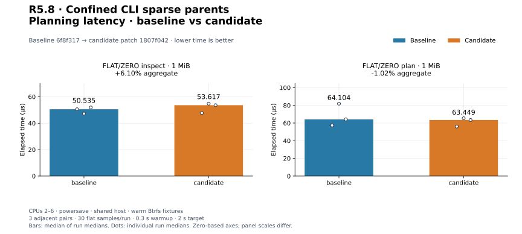
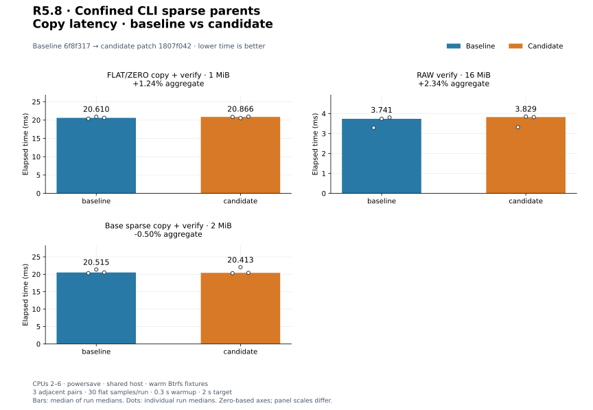
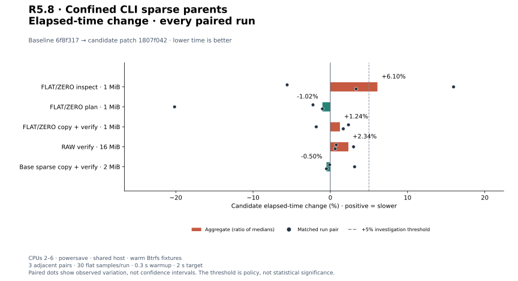
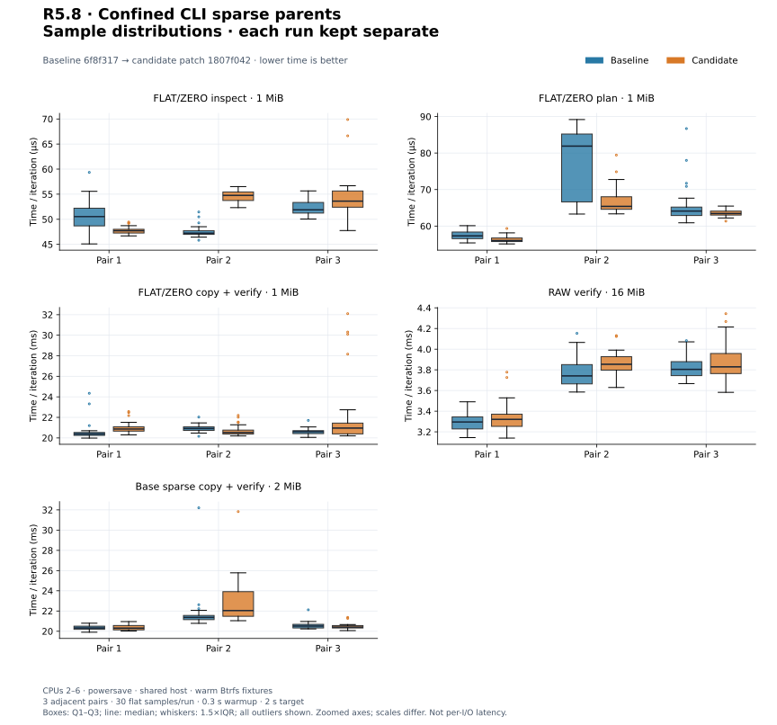
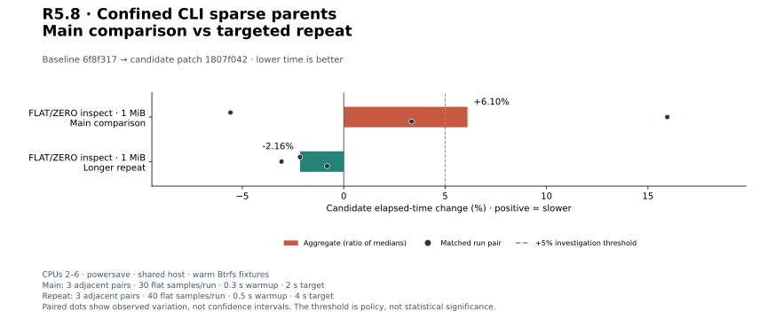
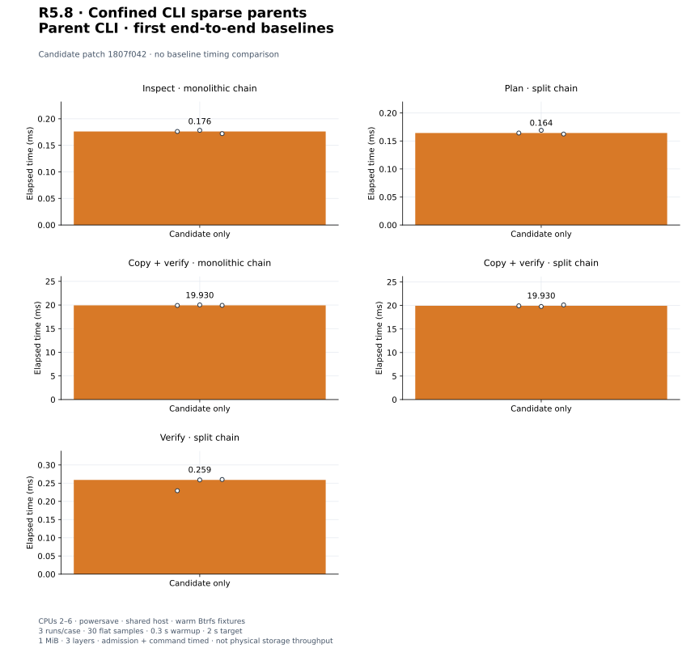

# R5.8 — Confined CLI sparse parent chains

Baseline **`6f8f317`**. Candidate: baseline plus [candidate.patch](candidate.patch),
SHA-256 `1807f042f35c7d4cec82932922813bc44627fcf286f45a5e1b2db4b2ae0c2f4f`. [Environment](environment.json),
[build commands](build-commands.json), [unchanged control harness patch](matched-harness.patch)
and [audit](audit.json) retain compiler/source/executable/harness identities.
[Contract](../../cli-vmdk-parents.md); [ADR-0044](../../adr/0044-confined-cli-parent-chains.md).

## Behavior and validation

`--format vmdk --allow-parents` integrates sparse parent chains with inspect, plan,
copy and verify. Parent hints must be basenames in one pinned source directory;
all descriptors/backings use confined regular-file resolution and retain timestamp,
size and identity observations. Embedded entries bind to their container. The
existing library handles chain budgets, inherited reads and whole-chain aliases;
CLI commands preserve portable execution, verification, cancellation and publication.
Defaults still reject parents. Copy payload budgets remain separate from bounded
source metadata, entry probes, observation FDs and reports.

**537 distinct tests pass; one existing allocation test remains gated** (538 total).
Thirteen new integration tests cover all commands, monolithic/split/mixed ancestry,
inherited data and allocated zero overrides, destination tails, mismatch offsets,
unchanged sources, raw/flat opt-in rejection, default parent rejection, every ancestor
alias, confined hints/backings, oversized/padded descriptors, invalid CID/capacity/
cycles/format, depth 16/17, external monolithic mirrors, embedded container identity,
ancestor metadata/payload changes, cancellation, output races, backend and budgets.
[Focused output](parents.txt), [invocation](parents-validation.json).
[Workspace tests](tests.txt), [inventory](test-inventory.txt), [Clippy](clippy.txt),
[formatting](fmt.txt), [portable check](portable.txt), [validation](validation.json).
The portable check retains the existing control::sum warning.
A separate **173-test CLI/VMDK run passes** with integration fixtures on Btrfs:
[output](storage-tests.txt), [invocation](storage-validation.json). Five existing CLI
unit fault tests retain system-temporary fixtures; memory tests are not storage
qualification. Validation and both release builds use independent target directories.

## Independent logical-byte qualification

[Reference records](reference-cli.json), [invocation](reference-cli-command.json),
[output](reference-cli-output.txt) and [runner](reference-cli-generator.py) preserve
all four CLI commands on QEMU-generated three-layer monolithic, split and mixed
chains, including a two-file 2 GiB + 64 KiB split disk. Independent RAW overlays model
intended writes. Copied RAW hashes agree with the oracle and QEMU decoding, QEMU
compare passes, source hashes remain unchanged, and all four default-mode inspect
requests reject parents. Copy uses four workers and 65,537-byte blocks with
verification. Plan creates no output. No SDK, producer source or ESXi is used.

The large case fully overwrites its final second-extent grain. The prior
[R5.7 partial-write discrepancy](../2026-09-30-r57/README.md#full-logical-byte-reference-qualification)
and all original failed evidence remain unchanged. Both rvddk and QEMU decoded
65,024 bytes at offset 2,147,484,160 as 0x31 instead of intended retained 0x61 in
that original producer output. This step does **not** qualify that producer partial-
write path or claim an upstream implementation cause. Smaller reference cases
retain sub-grain writes and allocated zero overrides.

## Matched existing CLI controls

Three adjacent C/B, B/C, C/B pairs per workload; 30 flat samples/run, 0.3 s warmup,
2 s target. CPUs 2–6, powersave, shared host, warm Btrfs fixtures. Builds, tests and
reference generation finish before timing. Every run, raw sample array and process
resource log is retained. Resource logs include untimed setup.

| Workload | Baseline | Candidate | Change | Every paired change |
|---|---:|---:|---:|---|
| `cli_vmdk/inspect_mixed` | 50.535 µs | 53.617 µs | +6.10% | -5.59%, +15.95%, +3.34% |
| `cli_vmdk/plan_mixed` | 64.104 µs | 63.449 µs | -1.02% | -2.24%, -20.16%, -1.02% |
| `cli_vmdk/copy_mixed_verify` | 20.610 ms | 20.866 ms | +1.24% | +2.35%, -1.82%, +1.68% |
| `cli_transfer/verify_only` | 3.741 ms | 3.829 ms | +2.34% | +0.77%, +3.01%, +0.63% |
| `cli_sparse/copy_split_verify` | 20.515 ms | 20.413 ms | -0.50% | -0.09%, +3.15%, -0.50% |

[Measurements](measurements.json), [summary](summary.json). The unchanged controls
measure 1 MiB mixed FLAT/ZERO inspect/plan/copy, 16 MiB RAW verify and 2 MiB base
split-sparse copy. Copy includes four workers, verification, flush, file/directory
sync and publication. Setup/content checks/removal are untimed. The additional CLI
flag participates in argument parsing for all paths; these controls use no flag.
Shared-host variation and independent builds limit causal attribution. No physical
storage throughput, global qualification or causal speedup is claimed.


[PNG](plots/planning-latency.png).


[PNG](plots/copy-latency.png).


[PNG](plots/relative-change.png).


[PNG](plots/sample-distributions.png).

## Triggered investigation

Every adverse aggregate or individual pair above +5% triggers three longer
B/C, C/B, B/C pairs, 40 flat samples, 0.5 s warmup and 4 s target. Main and
repeat sets remain separate; no discarded adverse runs or pooled estimates.

| Workload | Baseline | Candidate | Change | Every paired change |
|---|---:|---:|---:|---|
| `cli_vmdk/inspect_mixed` | 53.620 µs | 52.462 µs | -2.16% | -2.16%, -3.07%, -0.82% |

[Repeat records](followup-measurements.json), [summary](followup-summary.json).


[PNG](plots/followup-change.png).


The initial inspection result is +6.10% overall, including a +15.95% pair.
Longer inspection repeats are -2.16% overall, with all three pairs between -3.07%
and -0.82%. This does not reproduce the initial slowdown; the mixed evidence
remains provisional pending a controlled runner.

Prior adverse results, PERF.0 and R4.4 remain open for controlled-runner work.
Quiet repeats never erase original adverse pairs; datasets are not pooled.

## Initial parent CLI costs

Three candidate-only runs per case, 30 flat samples, 0.3 s warmup, 2 s target.
Authored 1 MiB, three-layer fixtures have 64 KiB grains: base data, a middle-layer
override and a leaf allocated-zero override, followed by unallocated space.
Monolithic layers use embedded descriptors; split layers use separate descriptors
and one backing each. Admission, path confinement, observations, argument parsing,
report serialization and each command's work are timed. Copy uses four workers,
64 KiB blocks, verification, flush, sync and private publication. Verify compares
an existing RAW oracle. Setup, byte assertions and removal are outside timing.
These are first end-to-end costs, without a matched previous parent CLI baseline.

| Workload | Median | Every run median |
|---|---:|---|
| `cli_parents/inspect_mono` | 176.155 µs | 176.155 µs, 178.308 µs, 172.050 µs |
| `cli_parents/plan_split` | 164.228 µs | 164.228 µs, 169.049 µs, 162.363 µs |
| `cli_parents/copy_mono_verify` | 19.930 ms | 19.907 ms, 20.022 ms, 19.930 ms |
| `cli_parents/copy_split_verify` | 19.930 ms | 19.930 ms, 19.786 ms, 20.121 ms |
| `cli_parents/verify_split` | 259.006 µs | 229.294 µs, 259.006 µs, 260.142 µs |

[Samples](candidate-only-measurements.json), [summary](candidate-only-summary.json),
[harness](../../../crates/rvvdk-cli/benches/parents.rs).


[PNG](plots/candidate-only.png).

## Reproduce plots

```bash
target/benchmark-plots/bin/python scripts/benchmarks/plot.py docs/benchmark-results/2026-09-30-r58
```

[Config](plot-config.json), [manifest](plots/manifest.json),
[computed values](plots/computed.json). The audit reconstructs the source patch,
checks all medians/pairs/repeat triggers, reference hashes and byte-identical plot
regeneration. Earlier evidence stays unchanged. Next: bounded coverage-guided fuzzing.
