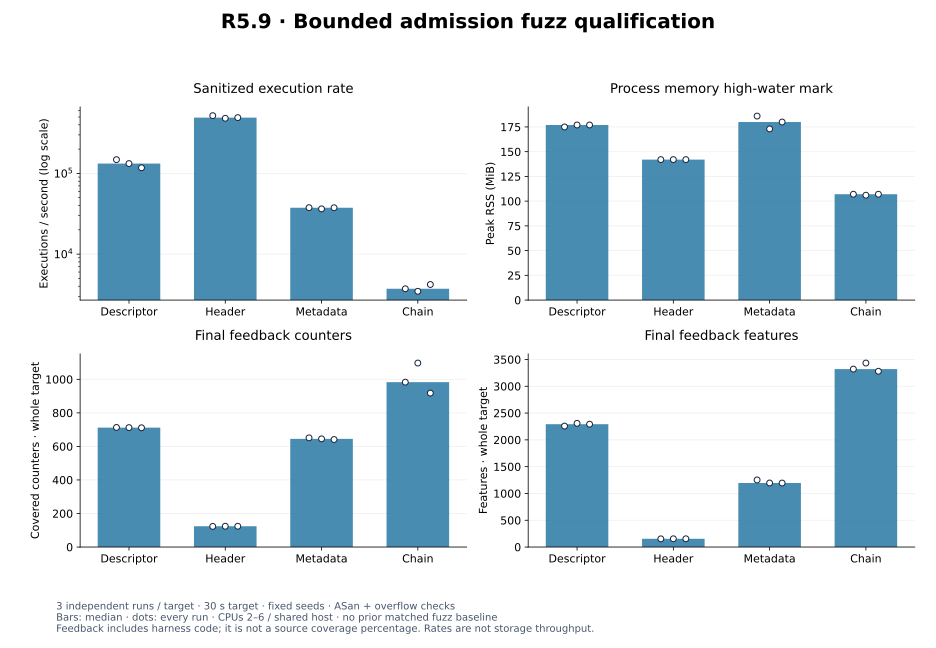

# R5.9 — Bounded admission fuzz qualification

Baseline **`aa09755`**. Production crates, root Cargo manifests/lockfile and all
shipping dependencies are unchanged. This step adds a standalone fuzz workspace,
authored seeds, a bounded runner and reproducible plots. [Environment and hashes](environment.json),
[source patch](candidate.patch), [audit](audit.json), [harness contract](../../../fuzz/README.md)
and [ADR-0045](../../adr/0045-bounded-admission-fuzzing.md).

## Results and limits

**62,446,303 executions across twelve independent 30-second campaigns** completed
without reported crashes, sanitizer errors, timeouts, OOMs or harness invariant
failures. Peak reported RSS was **186 MiB**. Four initial five-second smoke runs
also passed (4,428,408 executions); their original logs and commands are retained.
A finite clean campaign is not proof of exhaustive input safety or bug absence.

The four targets exercise raw descriptor/header bytes, sparse physical metadata
prefixes and structured 1–4-layer chain mutations. Independently metered reads and
resolver calls enforce bounds even when admission fails. Accepted values check
extent arithmetic, collection and geometry bounds, metadata reservation/read
counters, grain-map length, CID/capacity linkage and endpoint revalidation.
Sources are authored, immutable memory devices with no filesystem or network I/O.
No SDK or producer implementation source is used. Logical-read byte equivalence,
filesystem confinement and full production limits remain covered separately by the
existing deterministic/reference suites, not by these fuzz targets.

Fuzz limits: 64 KiB parser/metadata input, 520-byte header/chain input, 16 MiB virtual
capacity, 1 MiB grains/metadata geometry, 64 directory entries, 32 parser extents,
16 DDB entries, four layers/eight chain extents, 256 KiB chain descriptors and
4 MiB read/reservation budgets. Chain controls additionally exercise smaller
memory/read/depth limits, missing/cyclic parents and shared/unknown identities.
See the harness contract for exact encodings and coverage limitations.

## Validation and reproducibility

**537 workspace tests pass; one existing allocation test remains gated.** Two
standalone harness tests pass, checking accepted/rejected seeds and input gates.
[Workspace tests](tests.txt), [inventory](test-inventory.txt), [Clippy](clippy.txt),
[format](fmt.txt), [portable core/datamover/VMDK check](portable.txt),
[commands](validation.json). The portable check retains the existing control::sum
warning. [Harness tests](harness-tests.txt), [Clippy](harness-clippy.txt),
[format](harness-fmt.txt) and [commands](harness-validation.json) pass.

The isolated fuzz lockfile uses libfuzzer-sys 0.4.13; cargo-fuzz 0.13.2 and
nightly-2026-07-15 build with ASan, coverage instrumentation, debug assertions and
checked arithmetic. The shipping workspace keeps its stable toolchain and original
lockfile. [Installation](install.txt), [initial build](fuzz-build.txt),
[final build](fuzz-build-final.txt) and [seed generation](seeds.txt) retain output.
No production `cfg(fuzzing)` changes are present. ASan and feedback instrumentation
symbols are verified in the binaries. Production source hashes match the baseline.

Every formal campaign starts with a fresh copy of committed seeds and uses one
of random seeds 5901/5902/5903. The runner pins CPUs 2–6, permits 1 GiB RSS and
64 MiB single allocations, enables leak detection with a 64 MiB ASan quarantine,
and applies a five-second input timeout plus an outer process-group watchdog.
The timer target is 30 seconds; libFuzzer may finish after 31 seconds. No tests,
builds, plot rendering or hash audits overlap these campaigns. Shared-host load
and evolving corpus contents can affect rates; no isolated-runner claim is made.

[All campaign records](campaigns/runs.json) include command/environment/executable
identities, raw statistics/feedback and hashes for every retained input. Each
campaign has a raw log, `/usr/bin/time` resource log and deterministic input archive
in [campaigns](campaigns). Archives include the entire learned corpus and any
failure artifacts; there were no failure artifacts. The runner stops on a failure
and preserves originals before any minimization. No run was discarded or replaced.
[Smoke commands](smoke-runs.json) and the four `smoke-*.txt` logs preserve the initial
short exploration; [smoke inputs](smoke-inputs.tar.gz) retain all learned units.

## Harness performance and feedback

This is a qualification-only change. No matched production runtime comparison is
needed to attribute a code change because shipping code/dependencies are identical.
Prior matched runtime results, adverse pairs, PERF.0 and R4.4 investigations remain
unchanged and open. A future production fix must run the usual matched benchmarks
and trigger longer repeats for any adverse aggregate or pair above +5%.

These candidate-only rates measure sanitizer harness capacity, including fixture
construction, mutation-selected validation and rejection. Inputs differ across
runs and targets. Rates are **not disk throughput**, a speedup or a regression
comparison. Feedback includes the harness and linked code; it is not a source-line
coverage percentage, and cross-target counter totals do not compare completeness.

| Target | Executions, all runs | Executions/s, all runs | Peak RSS MiB, all runs | Initial → final feedback counters, all runs |
|---|---|---|---|---|
| descriptor | 4,591,644 / 4,106,527 / 3,638,510 | 148,117 / 132,468 / 117,371 | 175 / 177 / 177 | 352 / 352 / 352 → 713 / 712 / 711 |
| header | 16,110,230 / 14,950,855 / 15,237,470 | 519,684 / 482,285 / 491,531 | 142 / 142 / 142 | 64 / 64 / 64 → 123 / 124 / 124 |
| metadata | 1,167,375 / 1,126,907 / 1,163,927 | 37,657 / 36,351 / 37,546 | 186 / 173 / 180 | 458 / 458 / 458 → 651 / 645 / 641 |
| chain | 115,330 / 107,278 / 130,250 | 3,720 / 3,460 / 4,201 | 107 / 106 / 107 | 682 / 682 / 682 → 983 / 1,097 / 918 |


[PNG](plots/qualification.png), [computed values](plots/computed.json),
[manifest](plots/manifest.json). All per-run values remain visible.

```bash
target/benchmark-plots/bin/python scripts/fuzz/plot.py docs/benchmark-results/2026-09-30-r59
```

The audit verifies log statistics/feedback, archive hashes and every input,
source/binary/seed identities, untouched production code and historical evidence,
documentation links, deterministic seed generation and byte-identical plot regeneration.

## Remaining work

Sustained campaigns, broader resource profiles and logical-read differential fuzzing
remain optional follow-ups. The original [R5.7 QEMU partial second-extent producer
discrepancy](../2026-09-30-r57/README.md#full-logical-byte-reference-qualification)
remains unqualified; its failed evidence is unchanged. This step performs no new
QEMU producer qualification or live VMware access.

Next **V0.1** prepares the independent-access workflow, capability/privilege/TLS/
cleanup matrix and disposable-lab acceptance plan. Do not activate the user's
60-day ESXi trial yet; request it when the concrete lab proof is ready.

Tooling references: [Rust Fuzz Book](https://rust-fuzz.github.io/book/cargo-fuzz/guide.html),
[libFuzzer options](https://llvm.org/docs/LibFuzzer.html#options).
