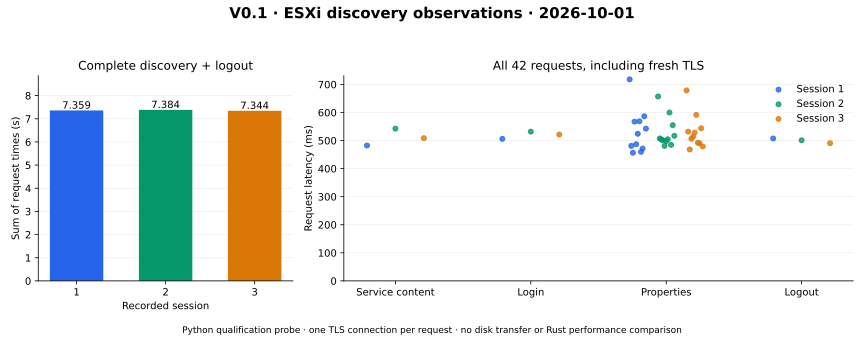

# V0.1 — Live discovery and independent export plan

Date: 2026-10-01. Baseline: `134ffdf`. Candidate: the commit containing this
evidence. This step changes qualification tools and docs,
not shipping Rust code, dependencies or features. [Design](../../vmware-access-plan.md),
[ADR-0046](../../adr/0046-independent-export-feasibility.md).

## Outcome and scope

The authorized standalone host reports ESXi 8.0.3 build 24677879, HostAgent API
8.0.3.0, one accessible VMFS 6.82 datastore and two Fedora VMs with 30/60 GiB
persistent, thick disks. Both VMs stayed powered on with Tools running. No
snapshots, disk backing parents or encryption keys were reported. Discovery used
only RetrieveServiceContent, Login, RetrievePropertiesEx and Logout. No guest
power, files, snapshots, export leases or licensing were changed.

Available-license metadata contains `esx.hypervisor.cpuPackageCoreLimited` and no
expiration. Deprecated `licensedEdition` was empty. This is consistent with the
free edition, but **does not establish active assignment or export eligibility**.
Both VMs list ExportVm as disabled while powered on; that is not an isolated
license test. See the [source-backed capability matrix](../../vmware-access-plan.md#capability-and-workflow-matrix).

Three final-source sessions made **42 successful requests**, 14 per session,
and all confirmed Logout. An earlier exploratory session also completed/logout;
its measurements were not saved and are not part of this formal dataset. The
recorded inventory and VM states agree across all three sessions. No actual disk
bytes were acquired, so V0 remains open. Next: V0.2 Rust session/inventory, then
V0.3 powered-off export and failure/lease-cleanup proof. No trial was activated.

## Validation and provenance

[Seven focused tests](tests.txt) pass: bounded/encoded XML, fault-text redaction,
certificate checking before HTTP, mutation-method rejection, redirect rejection,
response read limits, missing properties/pagination, and logout after discovery
failure. No new Rust workspace test run is claimed because shipping source is
unchanged. The [probe contract](../../../scripts/vsphere/README.md) records timeout,
cleanup and inventory limitations; this is an isolated Python qualification tool.

The probe password and session cookie existed only in process memory; no raw SOAP
response was persisted. Artifact fields are selected explicitly. Actual endpoint,
fingerprint, account, VM/datastore names, managed references, disk paths, license
keys and cookies are omitted. The certificate pin came from the first connection:
this is trust on first use, not independent out-of-band identity verification.
Python does not promise cryptographic secret erasure.

[Source and artifact identities](manifest.json) bind the exact probe, test and plot
sources, recorded observations and generated plots. The source files themselves
remain alongside this evidence. The audit checks unchanged production paths and
historical evidence, current local links, sanitized observations, and byte-identical
plot regeneration. No secret-bearing invocation is saved. Parameterized invocation:

```bash
python3 scripts/vsphere/probe.py --host HOST --certificate-sha256 SHA256 --user USER --repeats 3 > target/v01-observations/probe.json
python3 -m unittest discover -s scripts/vsphere -p test_probe.py -v
```

The probe prompts for the password with terminal echo disabled. Supply a validated
host pin and keep operational identities out of committed command transcripts.

## Control-plane observations



[PNG](discovery.png), [raw sanitized JSON](probe.json), [computed values](computed.json).

| Session | Requests | Sum of timed requests | Logout |
|---|---:|---:|---|
| 1 | 14 | 7.358791 s | Confirmed |
| 2 | 14 | 7.384314 s | Confirmed |
| 3 | 14 | 7.344344 s | Confirmed |

Times use the probe's monotonic clock and include a new TLS connection, HTTP and
bounded XML parsing for every request. Sums exclude work between calls and the
password prompt. Property requests retrieve different objects and payload sizes;
these points are not interchangeable samples of one fixed operation. Host/guest
background activity and network latency are uncontrolled. CPU/RSS were not measured.

There is **no disk throughput, Rust performance, tuning or before/after speedup
claim**. These are initial read-only control-plane observations. The matched
runtime regression threshold does not apply because there is no runtime change or
paired baseline. A future Rust comparison must hold workload and connection policy
constant or explicitly account for their difference. Retain all observations.

Reproduce with Python 3.14.7 and Matplotlib 3.10.9 (existing plot environment):

```bash
target/benchmark-plots/bin/python scripts/vsphere/plot_probe.py docs/benchmark-results/2026-10-01-v01/probe.json target/v01-plots-repro
```

SVG/PNG and computed JSON regenerate byte-identically in that environment. Prior
PERF.0/R4.4 investigations, adverse timing results and the QEMU partial second-extent
producer discrepancy remain open; no historical evidence is rewritten.
