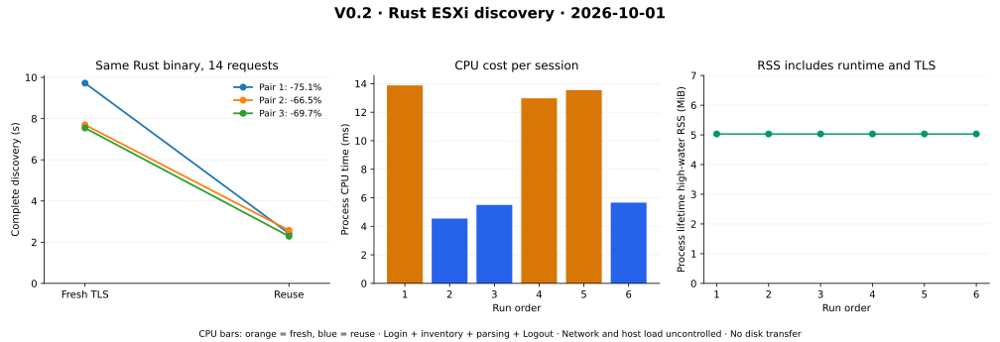

# V0.2 — Independent Rust authentication and inventory

Date: 2026-10-01. Baseline: `b5c5cc9`. Candidate: the commit containing this
record. [Contract](../../../crates/rvvdk-vsphere/README.md),
[ADR-0047](../../adr/0047-bounded-rust-vsphere-discovery.md),
[export acceptance plan](../../vmware-access-plan.md).

## Result

The new `rvvdk-vsphere` crate qualifies direct ESXi 8.0.3 / HostAgent API 8.0.3.0
session and inventory access in independent Rust. The existing local disk engine
and its package versions are unchanged. No VMware SDK/VDDK or Python runtime
participates. The qualification example is separate from the public disk CLI.

Six complete final-source discovery sessions made 84 requests. A separate
intentional inventory-limit failure made five requests and confirmed Logout.
Both Fedora VMs remained powered on with Tools running, unchanged 30/60 GiB
persistent thick disk topology, and no snapshots reported. No guest files, VM
power, snapshots, export leases or licenses were changed. No trial was requested.
Available free-edition metadata does not establish active assignment or export
eligibility; that status is explicitly unresolved. V0.3 still must prove export
bytes, format admission and lease complete/abort behavior.

## Correctness and failure evidence

[Workspace test log](tests.txt): **558 unique tests pass**, one existing ignored
test. The 21 new tests comprise four unit and seventeen local TLS integration
cases. Counts use only top-level summaries with zero filtered tests; child-process
reruns are not counted twice. All seven doctest suites contain zero tests.
[Workspace Clippy](clippy.txt) with warnings denied and [formatting](fmt.txt) pass.
[Release build](build.txt) identifies the measured build mode.

The local fixture server generates TLS certificates/keys in memory. Cases exercise
pin mismatch before any HTTP, redirects, secret-safe errors, schema namespaces,
DTD/depth/node/text limits, declared and chunked body limits, response truncation,
missing cookies/properties, duplicate properties, wrong object identity, inventory/
disk bounds, login faults, malformed Login followed by authenticated Logout,
pagination cursor cancellation and cleanup failure, request/discovery deadlines,
and unsuccessful Logout after otherwise successful discovery.

The [first live discovery failed](initial-discovery-failure.json) at the root
folder, then logged out successfully. The XML library's `attribute("type")`
shortcut matches local names across namespaces; it mistook an array's `xsi:type`
for the unqualified managed-reference `type`. Exact unqualified matching fixes
this. Realistic namespaced array/reference fixtures cover it. The
[initial source archive](initial-source.tar.gz) and its binary hash in
[the manifest](manifest.json) preserve the failed candidate. No raw server XML
was saved. Workspace tests/build checks overlapped that attempt; it is correctness
evidence, not a completed performance sample or an omitted adverse timing pair.

[Final bounded-error proof](bounded-failure.json): object budget one intentionally
returns `inventory_limit`, retains no partial inventory, and reports `logged_out`.
Across all eight live sessions attempted in this step, Logout was confirmed.
Wrong-password tests stayed local; no bad-password attempt was made against ESXi.

## Matched connection-policy measurements



[PNG](discovery.png), [all raw paired results](paired.json),
[computed changes](computed.json), [environment and timing boundaries](environment.json).

| Pair | Order | Fresh TLS | Reused connection | Elapsed change |
|---|---|---:|---:|---:|
| 1 | Fresh → reuse | 9.722365 s | 2.423546 s | -75.07% |
| 2 | Reuse → fresh | 7.695751 s | 2.577125 s | -66.51% |
| 3 | Fresh → reuse | 7.543683 s | 2.287278 s | -69.68% |
| Median of each policy | | 7.695751 s | 2.423546 s | **-68.51%** |

The same optimized Rust binary, endpoint, credentials, inventory paths, limits,
verification and explicit Logout are used for both policies. Only connection
reuse changes. Each session creates a new client/session; reuse does not carry
cookies/connections across sessions. All fourteen calls and parsed inventories
agree. Fresh policy performs fourteen certificate checks; reuse performs one.

Elapsed time includes client construction, initial TLS, authentication, inventory,
parsing and explicit Logout. It excludes the terminal password prompt and final
JSON serialization. Per-call times and response sizes are retained; object requests
have different payloads and are not interchangeable samples. Linux process CPU
deltas include report assembly; RSS is process-lifetime high-water, **5,152 KiB**
throughout this paired process, not a per-session maximum or enforced RSS cap.

No aggregate or individual matched session pair worsens by more than +5%, so
longer-repeat escalation is not triggered. The first fresh session is visibly
slower than later fresh sessions and is retained. No cause is established for that
variation. No assistant builds/tests ran concurrently with these final pairs;
network, host/guest background load and caches remain uncontrolled. Three pairs
support the default reuse policy for this lab control workload; they do not prove
universal performance, physical disk throughput, or a Python/Rust speedup.

Previous disk-runtime source is unchanged, so this step does not attribute a local
copy-engine before/after result. PERF.0/R4.4, prior adverse investigations and the
QEMU partial second-extent producer discrepancy remain open and unmodified.

## Reproduction and privacy

[Source patch](source.patch) applies to baseline `b5c5cc9` and reconstructs the
measured Rust crate plus workspace manifests/lockfile. [Manifest](manifest.json)
binds source and binary identities; [artifact hashes](artifact-sha256.json) bind
raw observations, logs, archive and plots. [Audit](audit.json) verifies source
reconstruction, source/package isolation, local links and byte-identical plot
regeneration. The generator asserts identical inventories and all session/call
counts before drawing the comparison.

```bash
cargo test --workspace
cargo clippy --workspace --all-targets -- -D warnings
cargo fmt --all --check
cargo build --release -p rvvdk-vsphere --example discover
# Replace placeholders locally; enter the password only at the terminal prompt.
target/release/examples/discover --endpoint HTTPS_URL --certificate-sha256 SHA256 --user USER --paired
target/release/examples/discover --endpoint HTTPS_URL --certificate-sha256 SHA256 --user USER --fail-inventory
# Python is used only to render recorded measurements.
target/benchmark-plots/bin/python scripts/vsphere/plot_rust_discovery.py docs/benchmark-results/2026-10-01-v02/paired.json target/v02-plots-repro
```

The plot environment is Python 3.14.7 / Matplotlib 3.10.9. SVG/PNG and computed
JSON regenerate byte-identically. Rust infrastructure versions are pinned directly
and fully resolved in Cargo.lock; no prior package version was removed/upgraded.

The password is entered without terminal echo, and no password argument/env/file
is supported. The original first-contact pin provides TOFU, not independent host
identity validation. Private endpoint, pin, account, VM/datastore names, managed
references, UUIDs, disk paths, keys, tickets and cookies are omitted from artifacts.
Reports expose allowlisted inventory fields and closed diagnostic codes only.
Source archives contain authored code, dependency manifests and dummy local-test
values; no lab credentials or generated TLS private keys are included.
