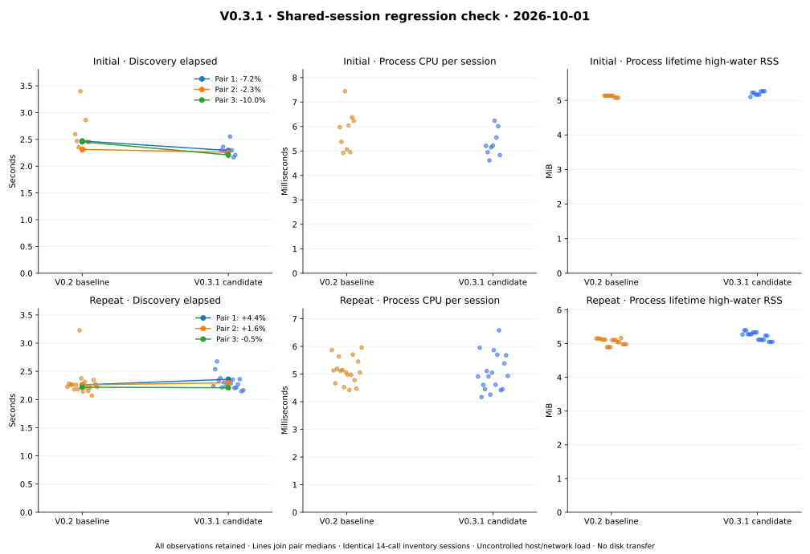

# V0.3.1 — Rust export foundation and observed license gate

Date: 2026-10-01. Baseline: `192489b`. Candidate: the commit containing this record.
[Contract](../../../crates/rvvdk-vsphere/README.md),
[ADR-0048](../../adr/0048-bounded-export-lease-proof.md),
[V0.3.2 continuation plan](../../vmware-access-plan.md#v032--licensed-live-qualification).

## Qualified scope and live result

The Linux Rust executable implements an owned export lease and bounded encoded
artifact transfer, optional graceful shutdown, incremental SHA-256/SHA-1, manifest
verification, periodic progress, Complete/Abort, Logout and durable no-replace
publication. Shared session handling preserves the discovery report schema. Existing
local disk runtime sources/package versions and the public CLI are unchanged.
No SDK/VDDK or Python VMware implementation was added.

The [live eligibility probe](license-probe.json) selected and revalidated the single
30 GiB VM, then received `license_restricted` from ExportVm. Logout succeeded.
The operation took 2.480 seconds, with no shutdown requested, no granted lease and
no bytes/artifact. The probe is correctness evidence, not a disk performance sample.
Subsequent discovery reports retain both powered-on Fedora VMs and their 30/60 GiB
disk topology. No guest files, power, snapshots or licensing were changed.

Supported trial/commercial access is needed now for the live proof. The user was
notified; no license change was attempted. Active assignment/expiry remains
unresolved. The observed fault establishes this operation/account's license gate,
not every VMware API's eligibility or the ability to convert this free installation
to a fresh evaluation. V0.3.2 and V0/R6 remain open.

## Local correctness and failure qualification

[Final workspace tests](final-tests.txt): **574 unique tests pass**, one existing ignored test.
Only top-level zero-filter summaries count; child-process reruns are excluded.
The crate has 37 tests (5 unit, 31 TLS integration, one compile-contract test), 16 more than V0.2.
[Final workspace Clippy](final-clippy.txt), warnings denied, and [formatting](final-fmt.txt) pass.
[Final release build](final-build.txt) records the measured profile.

The new tests cover license versus power-state rejection, acquire-and-abort probes,
exact streamed fixture bytes and manifest verification, same-authority/pin policy,
GET without API credentials/cookies, graceful shutdown and disk revalidation, no
hard shutdown fallback, byte limits, redirect/truncated transfer, cooperative
cancellation, periodic renewal during a pending GET, wildcard host and legacy SHA-1
compatibility under SHA-256 TLS trust, uncertain acquisition with no retry, failed
Complete/Abort/Logout, staging cleanup, existing output and publication races.

Certificates/keys are generated in memory. The authored 64 KiB fixture begins with
sparse VMDK magic but is **not a valid guest disk**. Passing these tests does not
qualify actual VMware encoding, compressed decoding or logical-byte equivalence.
No live data GET, shutdown, lease renewal, Complete or Abort has succeeded yet.
Those behaviors remain explicit licensed-lab acceptance work.

## Matched discovery regression check



[PNG](discovery.png), [computed values and raw-input hashes](computed.json),
[environment and measurement boundaries](environment.json).

The baseline binary is the previously qualified V0.2 release executable, hash
`b49c0eab84ce974fe3e06a8a68ef016c9eb2b8016f1b71c58218d962398be65f`.
The candidate changes the shared driver, retains private disk identity and derives
a legacy SHA-1 fingerprint after successful SHA-256 certificate validation.
Both use the same account, pinned host, reuse policy, inventory and fourteen calls.
All observations and adverse matches are retained in `initial-*.json` and
`repeat-*.json`; the generator validates identical inventories and successful Logout.

Initial pairs run three sessions per arm, in baseline→candidate, candidate→baseline,
baseline→candidate order. The initial median change is **-7.14%**, but one individual
matched session is **+10.41%** adverse. This triggers three longer alternating pairs,
each with six sessions per arm in two separate three-session processes. Pair medians,
aggregate medians and every corresponding individual session are all checked.
Longer blocks increase repetitions; each session still does the same fourteen calls.

The longer aggregate is **+1.96%** (2.242404 s baseline, 2.286349 s candidate).
Pair-median changes are +4.36%, +1.62% and -0.47%; the worst corresponding individual
session is +18.35%. **The individual adverse gate remains open**; there is no claim
of a universal improvement or fully cleared regression. Further investigation should
use a controlled local TLS workload to separate code cost from remote latency before
changing transport policy. Do not rerun until favorable samples replace these.

Longer-run median CPU is 5.088 ms baseline versus 4.924 ms candidate. RSS ranges are
5,012–5,292 KiB baseline and 5,172–5,524 KiB candidate. Per-request medians and CPU/RSS
are retained in computed results; those measurements do not establish the cause of
elapsed variation. All 54 discovery sessions confirm Logout (756 calls), plus the
16-call rejected probe: 55 live sessions and 772 calls in this step.

Timing includes client setup, TLS, Login, parsing, inventory and Logout, excluding
terminal password entry and final JSON output. CPU is process usage delta including
report assembly; RSS is process-lifetime high-water, not per-session allocation.
No assistant build/test ran during formal pairs. Network, host/guest load, caches
and background activity are uncontrolled, as are idle/password intervals between
processes. These observations do not establish disk throughput or a universal speedup.

Live export throughput, encoded/logical byte counts, transfer CPU/RSS and independent
byte verification remain V0.3.2 work. Prior PERF.0/R4.4 investigations, adverse results
and the QEMU partial second-extent producer discrepancy remain open and unchanged.

## Final Send compatibility correction

Final review found that type erasure in the shared session wrapper had dropped its
`Send` guarantee. Adding the marker restores Tokio spawned-task compatibility; a
new compile-contract test checks discovery and export futures. Final tests total
574. The earlier 573-test log/build and exact measured source remain retained.

The timed/probed binaries predate this marker correction. Both final release binaries
have **byte-identical machine instructions, read-only data and dynamic relocations**
to their measured counterparts. Allocated-section layouts also match; differences
are the build ID and six 32-bit diagnostic values per executable matching the
one-line shifts of three async function source locations. [Section comparison](send-binary-comparison.json)
records this check. No new performance sample is asserted for the final binaries,
no timing is replaced, and the existing individual adverse gate remains open.

## Reproduction and privacy

[Source patch](source.patch) reconstructs the measured crate/manifests from `192489b`;
apply [the Send compatibility patch](send-compatibility.patch) afterward for final source.
[Manifest](manifest.json) binds source and binaries; [audit](audit.json) records source
reconstruction, dependency isolation, test counts and reproducible plots.
[Artifact hashes](artifact-sha256.json) bind evidence and logs.

```bash
cargo test --workspace
cargo clippy --workspace --all-targets -- -D warnings
cargo fmt --all --check
cargo build --release -p rvvdk-vsphere --examples
# Replace placeholders; password is entered only at the echo-disabled terminal.
target/release/examples/export --endpoint HTTPS_URL --certificate-sha256 SHA256 --user USER
# Build baseline/candidate separately; collect alternating three-session processes.
target/release/examples/discover --endpoint HTTPS_URL --certificate-sha256 SHA256 --user USER
target/benchmark-plots/bin/python scripts/vsphere/plot_export_foundation.py docs/benchmark-results/2026-10-01-v031 target/v031-plots-repro
```

The expected license-rejected probe exits nonzero while emitting its sanitized
cleanup report. Failed authentication tests run only against fixtures. Passwords
are not accepted through arguments/environment/files, and no raw SOAP is persisted.
Private host/account/VM identifiers, pin, paths, keys, cookies and tickets are omitted
from versioned evidence. The original certificate pin was TOFU, not independently
validated host identity. Plotting is the only new Python tooling in this step.
