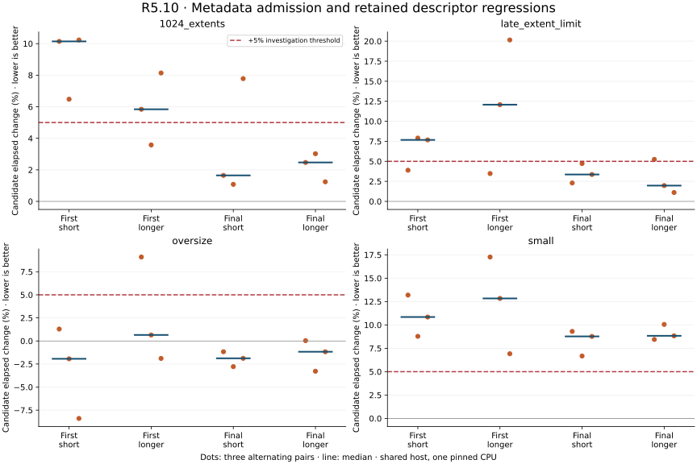
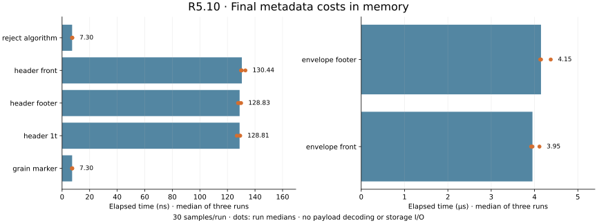

# R5.10 — StreamOptimized envelope admission

Baseline: `f756fb1`. Metadata-only Rust admission is implemented and validated.
**Performance disposition: needs investigation.** The existing small-descriptor
case remains slower in all three longer final pairs. R5.10p investigates this
before native decoding work. Earlier performance follow-ups remain open.





## Validation

- Workspace: **594 passed, one ignored**, including ten new stream tests; Clippy
  with `-D warnings` passes. Release helper and public CLI build successfully.
- Six envelopes pass Rust admission: QEMU front images and authored footer
  variants, with zero, populated and two-table layouts. QEMU decodes all six to
  the exact authored RAW bytes. Unaligned capacity fails; current public CLI
  rejects all seven compressed images. This does not qualify Rust decoding.
- The retained ESXi export passes the final Rust envelope helper: 30 GiB capacity,
  64 KiB grains, 512-byte descriptor, footer profile, **3584 metadata bytes read**.
  Directory entries, table content and compressed data are not validated here.
- Initial live admission rejected `ddb.toolsInstallType`; the retained diagnostic
  precedes a stream-only informational-key correction and explicit regression test.
  Local and remote final helper hashes match. No new vSphere API/power/lease calls
  were made. The private export remains on the authorized runner.

## Measurements and interpretation

Each design has three alternating baseline/candidate pairs with 30 Criterion
samples per case, 0.2 s warmup and 0.5 s measurement. Any >5% adverse observation
triggers three further alternating pairs at 2 s measurement. Both designs triggered
this repeat. Runs share one pinned CPU; the host, caches and governor are uncontrolled.
Compiling, reference conversion and plotting occurred outside these timed runs.
These are synthetic in-memory measurements, not storage/decompression throughput.

Final longer paired elapsed changes:

| Existing descriptor workload | Pair 1 | Pair 2 | Pair 3 |
|---|---:|---:|---:|
| small | +8.45% | +10.05% | +8.83% |
| 1024 extents | +2.47% | +3.02% | +1.24% |
| late extent limit | +5.25% | +1.97% | +1.11% |
| oversize | +0.03% | −3.28% | −1.17% |

The first candidate also regressed; its enum expansion was removed and its
descriptor representation narrowed. Both designs and every pair remain in the
plots and raw samples. This does not demonstrate that the revision caused an
improvement. A repeated small-input regression remains despite longer runs;
R5.10p must investigate parser code generation and controlled repeatability,
without weakening grammar or bounds. The isolated late-rejection +5.25% result
also remains visible. No performance gate is cleared by this report.

Final new-case median of three run medians: front header 130.44 ns, footer header
128.83 ns, 1 TiB header 128.81 ns, algorithm rejection 7.30 ns, grain marker 7.30 ns,
front envelope 3.953 µs, footer envelope 4.150 µs. The envelope fixtures have
20-sector descriptors. These are initial observations without a prior equivalent
implementation, not speedup claims. Fixed read bounds are tested independently;
process CPU/RSS and actual disk throughput remain future decoder qualification.

## Audit and reproduction

`initial/` and `final/` hold the raw samples, logs, binary hashes, affinity and
paired summaries: 69 runs per design, 30 samples each, 4140 samples total.
`descriptor-before.txt` is an earlier unpinned 20-sample diagnostic, excluded from
paired decisions but retained. `initial-descriptor.patch` reconstructs the first
descriptor design relative to the baseline; `initial-source-sha256.json` identifies
its parser/stream library files. `source-sha256.json` identifies final source.
The benchmark driver scripts retain exact executed commands and phase ordering;
their executable paths refer to ignored local build artifacts and require rebuilding.
Initial stream/header/library code is otherwise the same as the final source.
Text logs normalize trailing whitespace and terminal blank lines only. The initial
source diff uses zero context and was reapplied to verify its recorded source hash.

`qemu-reference-final.json` records synthetic hashes, producer version and helper
identity. It contains no guest-derived image digest. `live-validation.json` and
`live-envelope-final.json` retain safe numeric observations only. Workspace logs
and `validation.json` record checks; `audit.json` verifies the retained artifacts.
`plots/computed.json` recomputes every paired result directly from raw samples.

Reproduce fixtures using the [admission contract](../../vmdk-stream-admission.md).
Regenerate figures with:

```sh
target/benchmark-plots/bin/python scripts/benchmarks/plot_stream_admission.py \
  docs/benchmark-results/2026-10-02-r510
```

The production implementation and live metadata reader are Rust. The Python tools
only handle offline fixtures, benchmark orchestration and plotting.
