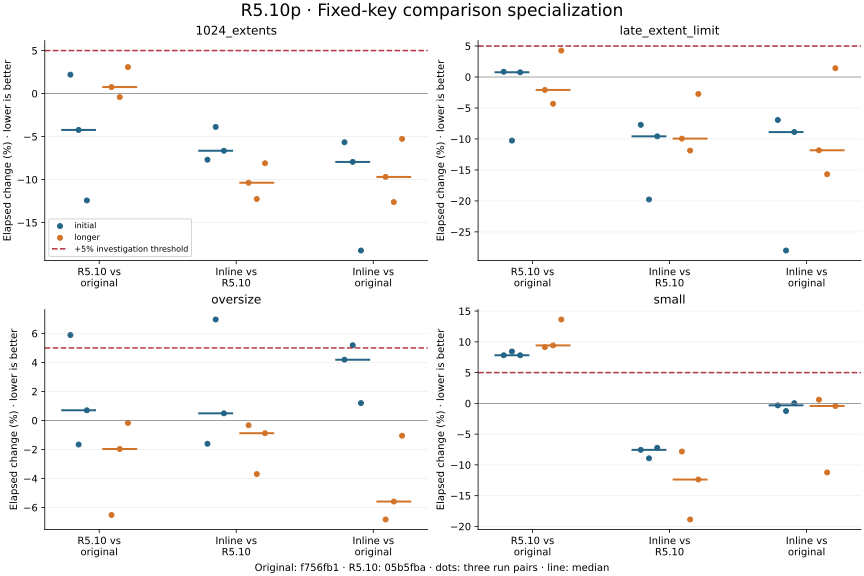
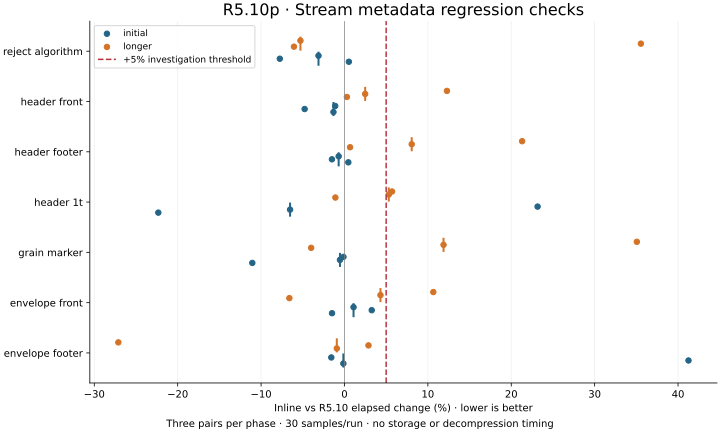
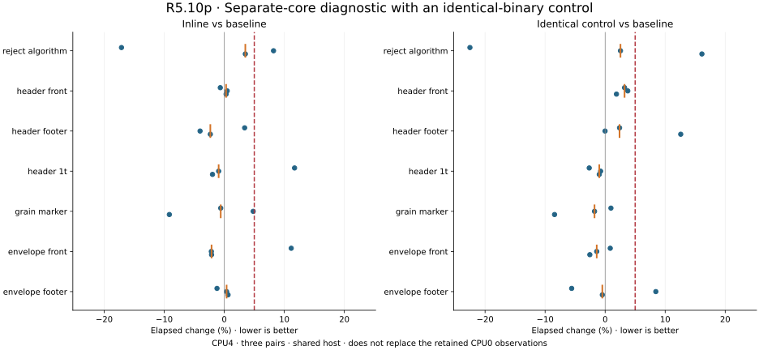

# R5.10p — Fixed-key descriptor comparison specialization

Baseline: `05b5fba` (R5.10); earlier reference: `f756fb1` (before R5.10).
The production change adds an inline hint to the existing case-insensitive keyword
comparison helper. Grammar, errors, resource limits, allocation policy and public
support remain unchanged. The benchmark harness and fixtures are unchanged.

## Investigation

The earlier and R5.10 flat parser functions both contain 5628 bytes and 1177
instructions. Normalizing code addresses and data displacements gives the same
instruction sequence, although the function moved by 48 bytes. This does not
prove identical referenced data, whole-program behavior or timing; code/data
placement remains a possible contributor, not an established cause.

The inline hint exposes constant grammar keys to optimization. The measured build
removes the general `eq` symbol from the descriptor executable and increases the
parser function by 2926 bytes, to 8554. That code-size cost is explicit. No parser
bounds, acceptance rules or heap budgets changed. This step does not implement
stream grain maps, payload decoding or public compressed CLI reads.

## Measurement method

Saved executables preserve the original, R5.10 and candidate builds. Three rounds
run the same four descriptor cases against all three executables with rotated and
reversed orders. Three before/candidate pairs check all seven stream metadata
cases. Each run has 30 samples, 0.5 s warmup and 2 s measurement, on the same pinned
CPU used by R5.10. Any candidate adverse pair above 5% triggers three further rounds
for its entire benchmark group with 4 s measurement. All attempts and samples are
retained. Compilation, reference checks and plotting occur outside the matrix.

This is a shared host with the powersave governor and an SMT sibling, without CPU
isolation or cache flushing. Timing variance limits causal attribution. These are
in-memory microbenchmarks, not disk throughput or compressed decoding. The earlier
R5.10 evidence remains immutable; only this measured follow-up can change its
performance disposition.

## Results

The initial CPU0 run reproduced the old small-descriptor cost and the candidate
recovered it in all three comparisons. Oversize rejection had an adverse +6.96%
pair; the footer envelope had +41.25%, and the 1 TiB header +23.16%. Both groups
therefore received the planned longer repeats.

Longer descriptor results (elapsed change, lower is better):

| Descriptor case | Reference | Pair 1 | Pair 2 | Pair 3 |
|---|---|---:|---:|---:|
| small | R5.10 | -7.83% | -18.87% | -12.38% |
| small | pre-R5.10 | +0.60% | -11.23% | -0.43% |
| 1024_extents | R5.10 | -10.37% | -12.26% | -8.10% |
| 1024_extents | pre-R5.10 | -9.69% | -12.62% | -5.27% |
| late_extent_limit | R5.10 | -9.94% | -11.88% | -2.73% |
| late_extent_limit | pre-R5.10 | -11.83% | -15.69% | +1.42% |
| oversize | R5.10 | -0.33% | -3.70% | -0.88% |
| oversize | pre-R5.10 | -6.83% | -5.59% | -1.05% |

The small-descriptor regression is recovered in this measured build, with a
−12.38% median paired change against R5.10 and −0.43% against the earlier build.
The initial oversize adverse pair did not persist. This is a local observation,
not a universal compiler/platform speedup.

The longer stream matrix still has adverse observations: grain marker median
+11.88%, 1 TiB header +5.31%, footer header +8.06%; individual results include
algorithm rejection +35.54% and front envelope +10.65%. These are not cleared by
the descriptor improvement. Header/marker generated instruction shapes remain
unchanged, but that does not eliminate layout effects. The separate-core diagnostic below adds a bit-identical baseline/control
binary; it does not replace or clear the primary observations.

Workspace rerun: 594 passed, one ignored; Clippy across all targets, fmt, release
builds and seven QEMU/public-CLI cases pass. The first workspace run failed an
unchanged export-cleanup fixture (`Unconfirmed` versus `Aborted`); its exact
focused rerun and full rerun passed. Failure and command logs are retained. The
cause is unproven; no test timeout or production cleanup policy was changed.

## Separate-core diagnostic and disposition

Three further rounds on CPU4 rotate baseline, identical control and candidate
through every order position, using the same 4 s/30-sample settings. Baseline and
control use the same executable bytes. Their differences demonstrate process and
measurement variability without a code change; they do not prove that every
candidate difference is noise or rule out code/data placement effects on CPU0.

| Stream case on CPU4 | Candidate pairs vs baseline | Identical-control pairs vs baseline |
|---|---|---|
| envelope_footer | +0.63%, +0.39%, -1.21% | -0.47%, +8.44%, -5.58% |
| envelope_front | -2.12%, -2.16%, +11.15% | -2.55%, -1.40%, +0.85% |
| grain_marker | -9.15%, +4.82%, -0.59% | -8.43%, -1.77%, +0.97% |
| header_1t | -1.96%, -0.94%, +11.71% | -0.97%, -0.75%, -2.65% |
| header_footer | -2.32%, -4.03%, +3.39% | +12.59%, -0.01%, +2.40% |
| header_front | +0.30%, +0.49%, -0.66% | +1.89%, +3.77%, +3.23% |
| reject_algorithm | +3.51%, +8.20%, -17.12% | +16.12%, +2.55%, -22.52% |

All candidate per-case median changes in this diagnostic are below +5%, but
individual adverse pairs remain. The primary CPU0 results also remain unresolved.
**Accept the inline hint as a scoped flat-descriptor improvement with the stated
code-size cost; do not claim blanket stream performance clearance.** PERF.0 retains
a controlled-runner follow-up: isolate a core and its SMT sibling, record frequency
and competing load, and retain identical-binary controls and layout/ASLR conditions.
R5.11 can proceed with bounded map validation before decompression; its own
throughput/CPU/RSS qualification must retain these limitations.







The evidence contains 219 runs and 6570 Criterion samples: 156 primary runs and
63 diagnostic runs. All initial, longer and diagnostic observations are retained.
The earlier R5.10 evidence is unchanged. No storage or decompression speedup is
claimed. `validation.json` retains the initial test failure alongside passing
reruns; `audit.json` checks samples, comparisons, hashes and execution chronology.
Text logs/disassembly normalize trailing whitespace and terminal blank lines only.

## Reproduction

`measure.py` records the executed commands, ordering, durations and raw Criterion
samples; `environment.json` records binary hashes, affinity and environment.
Its local executable paths must be rebuilt/copied before replay. `inspect_codegen.py`
records the bounded disassembly and precisely describes normalization. Original
and before disassembly are retained, including the empty normalized diff.

Regenerate the diagrams after installing the plotting requirements:

```sh
target/benchmark-plots/bin/python scripts/benchmarks/plot_descriptor_specialization.py \
  docs/benchmark-results/2026-10-02-r510p
```

The generator recomputes all run medians and pair changes from retained samples.
No VMware API calls, guest credentials or guest image data are involved.
