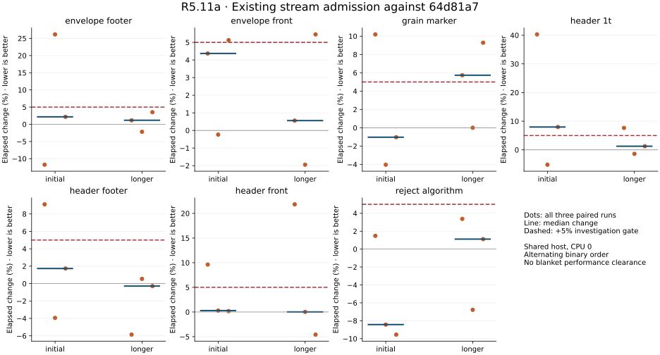
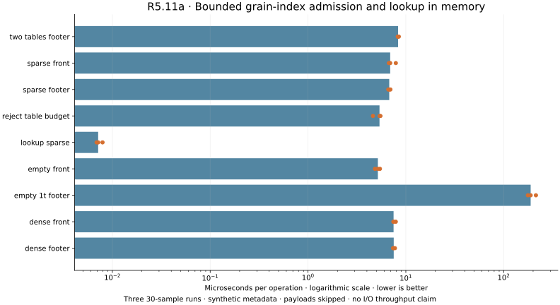

# R5.11a — Bounded stream grain-index qualification

Baseline: `64d81a7`. Rust map validation is complete for the
[documented ordered subset](../../vmdk-stream-map.md). Payload decoding and logical
reads remain R5.11b; public CLI integration remains R5.12.

## Correctness and independent references

- Fourteen new map tests cover sparse/dense/empty images, absent and multiple
  tables, optional front redundancy, unused slots, aliases, ownership, LBA binding,
  malformed lengths/markers, aggregate resource boundaries, traced reads,
  truncation, selected acquisition mutations and final length rechecks.
- Empty 1 TiB footer capacity uses 131,136 requested map slot bytes and zero
  table work. This is bounded directory/scratch accounting, not process RSS.
- Six QEMU/front-and-authored-footer fixtures match independently enumerated
  records. QEMU decoding matches each authored RAW source. Unsupported unaligned
  capacity fails, and the public CLI rejects all seven compressed fixtures.
  See [QEMU envelope/byte checks](qemu-envelope.json) and [map checks](qemu-map.json).
- The retained 30 GiB ESXi export passes: 57,295 grain records, 1,205,620 requested
  metadata bytes, 126,976 examined table slots, and 693,684 requested map slot
  bytes. Only aggregate metadata is reported; payloads remain unvalidated.
  See [sanitized live admission](live-map.json). A second retained export also
  [passes](live-map-second.json). Its first supplemental probe was interrupted
  by closing the SSH control connection; the retry completed successfully.
  [All live attempts](live-attempts.json) retain this driver interruption.
  No export/lease/power operation
  or VMware API call was required.

The initial Clippy check caught duplicate fixture module inclusion; the shared
fixture import was corrected. Its failure log and final passing check are
retained. The prior export-cleanup fixture failure did not recur in this package.

Final validation: **608 workspace tests passed, one ignored**; Clippy across all
targets with `-D warnings`, formatting and release builds pass. The 14 map tests
are included in that total. Forked child-test summaries are excluded from counts.

## Measurement scope and disposition

Three alternating binary pairs compare the unchanged seven-case `stream` harness
against the frozen baseline. Any initial adverse observation above +5% triggers
three longer pairs for the whole group; all observations remain present. Nine new
`stream_map` cases run three times. Every run retains 30 Criterion samples.
Initial/new measurements use 0.5 s warmup and 2 s measurement; longer repeats use
4 s measurement. CPU affinity is 0 on the shared host with unchanged governor
and SMT configuration. Compilation, tests, QEMU and plotting run outside the
matrix. No CPU isolation, cache flushing or frequency control is claimed.

These are synthetic in-memory parsing/indexing and lookup costs. Fixtures are
built outside timed loops, with deliberately unvalidated payload bytes. Timed
admission includes allocations and dropping the map. There is no storage,
decompression, guest-byte throughput, process RSS or speedup claim for the new API.

The longer grain-marker pairs are **+5.74%, approximately 0%, +9.29%**; their
median remains adverse. Other cases have individual adverse observations too.
Keep PERF.0 controlled-runner/layout investigation open. The additive map feature
and its correctness qualification do not clear earlier stream timing concerns or
this repeated marker observation. [Disassembly comparison](codegen.json) shows
unchanged normalized header/marker instruction shapes, with changed placement.
That does not rule out layout, relocation or data effects and is not proof of
unchanged runtime behavior. Historical R5.10/R5.10p evidence is unchanged.



| In-memory case | Median of three run medians (µs) |
|---|---:|
| `dense_footer` | 7.521 |
| `dense_front` | 7.494 |
| `empty_1t_footer` | 188.810 |
| `empty_front` | 5.178 |
| `lookup_sparse` | 0.007 |
| `reject_table_budget` | 5.382 |
| `sparse_footer` | 6.768 |
| `sparse_front` | 6.920 |
| `two_tables_footer` | 8.335 |



Dots retain every run median; lines/bars summarize medians. The map chart uses a
logarithmic time axis so lookup and large-directory scanning stay visible. The
+5% line is an investigation threshold, not a statistical significance claim.

## Reproduce and audit

[Raw samples](measurements.json), [pair summary](summary.json),
[environment and exact commands](environment.json),
[plot values](plots/computed.json), [plot hash audit](plots/audit.json).
The report retains all 111 runs / 3330 samples, including every initial and longer
comparison. Binary hashes distinguish the frozen baseline and final candidate. Text logs
normalize trailing whitespace only; raw timed samples and adverse results are
preserved. SVG output is normalized the same way by the plot generator.

```sh
cargo test --workspace
cargo clippy --workspace --all-targets -- -D warnings
cargo bench -p rvvdk-vmdk --bench stream --bench stream_map
python scripts/benchmarks/plot_stream_map.py docs/benchmark-results/2026-10-02-r511a
```

The archived `measure.py` records the exact paired matrix and expected frozen
binary paths under ignored `target/r511a/reference`; it does not rebuild the
baseline automatically. Reconstruct that baseline from its commit in a separate
checkout, preserving toolchain/profile settings and binary provenance. The
[map contract](../../vmdk-stream-map.md) links the offline fixture commands.
Python only generates/orchestrates reference fixtures, measurement reports and
plots; map parsing and VMware functionality are Rust.
