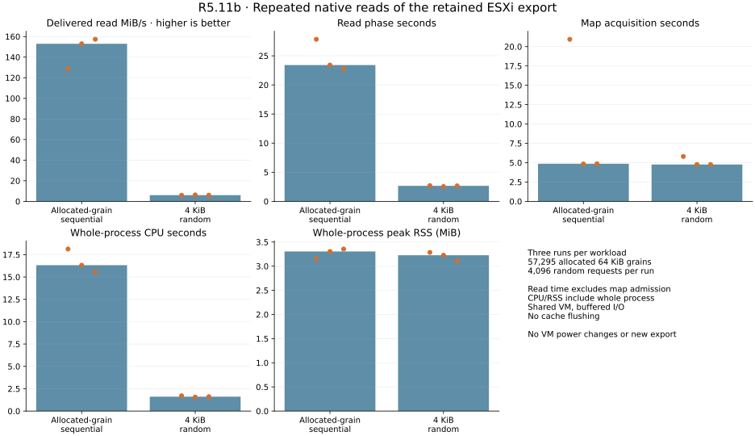
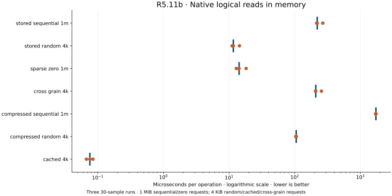
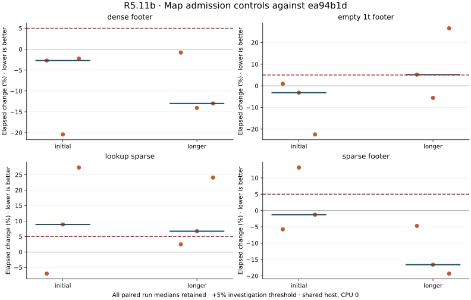

# R5.11b — Bounded native compressed reads

Baseline: `ea94b1d`. The native read subset is qualified; overall performance is
**not cleared**. Two existing map controls retain repeated adverse observations,
and live map acquisition varies substantially. [Contract](../../vmdk-stream-reads.md),
[decision](../../adr/0054-bounded-native-stream-reads.md).

## Correctness

**617 workspace tests passed, one ignored**, including nine new decoder/read tests.
Clippy across all targets with `-D warnings`, formatting and release builds pass.
The tests cover exact checksummed zlib input/output, stored/dynamic code fixtures,
truncation, trailing and concatenated streams, raw/gzip/dictionary rejection,
high expansion ratios, wrong output sizes, cache failures, partial backend reads,
resource boundaries, zero/cross-grain reads, endpoint aliases and concurrency.
The first concatenation fixture exceeded the map compressed-size limit; it was
corrected to append a smaller valid second stream so the decoder check is reached.
[That test failure](tests-first.txt) is retained. No production limit was relaxed.

Six complete synthetic QEMU/front and authored/footer images match independently
authored RAW bytes. Unaligned capacity rejects, and all seven compressed fixtures
remain rejected by the public CLI. [Reference checks](qemu-reads.json).

On the authorized runner, native Rust reads match **all 32,212,254,720 logical bytes**
of the retained export against QEMU decoding, and **all 8,388,608 bytes** of the
independently mapped guest fixture. These establish logical decoder agreement
and the separate known guest-byte oracle; they do not establish whole-VM consistency
or production backup recovery. [Sanitized live checks and measurements](live.json).
The temporary sparse RAW reference was removed after comparison. No new export,
VMware API, lease or power operation occurred. Private images, oracle mappings,
content digests, endpoint details and credentials remain outside Git.

## Live reads, CPU and RSS

Three runs per workload, alternating order, follow the reference checks. The
sequential workload reads all 57,295 allocated grains: 3,580.9375 MiB of delivered
logical data per run. It skips unallocated capacity. The random workload issues
4,096 deterministic 4 KiB requests within populated grains: 16 MiB per run;
a cache miss decompresses a whole 64 KiB grain. No concurrent decode throughput
claim is made. A single shared decoder/cache bounds memory across callers.

| Metric, median of three runs | Allocated-grain sequential | Random 4 KiB |
|---|---:|---:|
| Read-phase throughput (MiB/s) | 152.957 | 6.009 |
| Read-phase seconds | 23.411 | 2.663 |
| Map acquisition seconds | 4.859 | 4.765 |
| Whole-process CPU seconds | 16.32 | 1.61 |
| Whole-process peak RSS (MiB) | 3.305 | 3.227 |

Read throughput excludes map acquisition. GNU time CPU/RSS include process startup,
map acquisition and reads. Requested decode storage is 141,679 bytes; this counter
excludes separately bounded metadata, backend/caller buffers and allocator/stack
costs and must not be equated with RSS. The two reference comparisons also use a
second 1 MiB comparison buffer; their observed RSS is about 5.1–5.2 MiB.

The first sequential acquisition takes **20.947 seconds**, versus about 4.8 seconds
in later sequential runs. Read time also varies 22.763–27.836 seconds. This shared
VM uses buffered I/O without cache flushing or isolation. Comparisons and earlier
runs affect later cache state; no cold-cache, pure-storage, network-export or
end-to-end conversion throughput claim is made. Preserve this admission/cache
sensitivity as a concrete performance follow-up.



## In-memory costs and existing map controls

Seven new Criterion cases use synthetic images already in memory. Setup, map
acquisition and fixture construction occur outside read timing. Compressed cases
use an independent zlib-generated structured 64 KiB pattern; stored cases use
independently authored stored DEFLATE blocks. Sequential calls read 1 MiB across
16 grains. Random calls select 4 KiB slices among 64 populated grains. The cached
case repeatedly hits one already decoded grain; the cross-grain case touches two
grains. Sparse-zero cost is memory filling, not decompression throughput.

| Native read case | Median of three run medians (µs) |
|---|---:|
| `cached_4k` | 0.076 |
| `compressed_random_4k` | 105.395 |
| `compressed_sequential_1m` | 1725.242 |
| `cross_grain_4k` | 209.279 |
| `sparse_zero_1m` | 14.220 |
| `stored_random_4k` | 11.607 |
| `stored_sequential_1m` | 220.354 |




Three alternating pairs compare four unchanged map cases against the frozen
baseline: sparse footer, dense footer, empty 1 TiB footer and sparse lookup.
Initial observations above +5% trigger three longer paired repeats for the same
four cases. All runs retain 30 samples, with 0.5 s warmup and 2 s initial/new or
4 s longer measurement. CPU affinity is 0; the shared host's governor and SMT
configuration are unchanged. Compilation, tests, QEMU, live probes and plotting
finish outside this timed matrix. No controlled-core isolation is claimed.

Longer empty-1-TiB changes are **+5.17%, −5.56%, +26.59%** (median +5.17%);
lookup changes are **+2.45%, +6.70%, +24.08%** (median +6.70%). Both remain
**needs investigation**. Dense/sparse-footer observations improve, but do not
cancel the adverse cases or prove implementation speedups. The
[normalized map/lookup instruction shapes](codegen.json) match, with changed
placement. That is not proof of identical execution/data/layout behavior or
unchanged performance. Keep these results, earlier marker/stream concerns and
PERF.0 controlled timing/layout investigation open.



## Evidence and reproduction

All **69 Criterion runs / 2070 samples** are retained alongside eight live
qualification/workload runs. [Raw samples](measurements.json),
[pair summary](summary.json), [environment and exact commands](environment.json),
[computed plot values](plots/computed.json), [plot audit](plots/audit.json).
Log trailing whitespace is normalized; raw samples and adverse results are
unchanged. Binary/source hashes bind the measured implementation. The prior
R5.11a map binary hash is checked against its archived measurement environment.

```sh
cargo test --workspace
cargo clippy --workspace --all-targets -- -D warnings
cargo bench -p rvvdk-vmdk --bench stream_map --bench stream_reads
python scripts/benchmarks/plot_stream_reads.py docs/benchmark-results/2026-10-02-r511b
```

The archived `measure.py` expects frozen binaries under ignored
`target/r511b/reference`; rebuild its baseline in a separate checkout with the
same toolchain/profile to reproduce comparisons. The [read contract](../../vmdk-stream-reads.md)
links synthetic reference commands. `generate_stream_payloads.py` regenerates
only the committed synthetic payload fixtures using system zlib.

For private qualification, keep files in an explicitly selected private work
directory. Validate the existing independent map/fixture with
`verify_guest_fixture.py`; convert its extents to TSV rows containing disk offset,
fixture offset and length. The native helper checks contiguous reference coverage.
The measured sequence is:

```sh
stream_read_probe IMAGE ranges FIXTURE PRIVATE_RANGES_TSV
qemu-img convert -f vmdk -O raw -S 4k IMAGE PRIVATE_RAW
stream_read_probe IMAGE compare PRIVATE_RAW
# Remove only the newly created private RAW after successful comparison.
# Run sequential/random, random/sequential, sequential/random in that order.
/usr/bin/time -f '{"wall_seconds":%e,"user_seconds":%U,"system_seconds":%S,"max_rss_kib":%M}' \
  -o PRIVATE_METRICS stream_read_probe IMAGE sequential
/usr/bin/time -f '{"wall_seconds":%e,"user_seconds":%U,"system_seconds":%S,"max_rss_kib":%M}' \
  -o PRIVATE_METRICS stream_read_probe IMAGE random
```

Use unique output files for each run. The public report contains aggregate helper
JSON and time metrics only. Python orchestrates offline references/measurements;
VMware access and native logical reads remain Rust. R5.12 still gates public CLI
conversion, cancellation and durable publication qualification.
