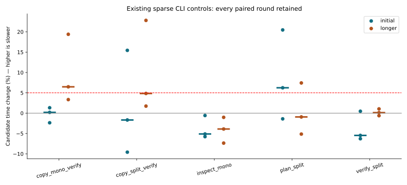
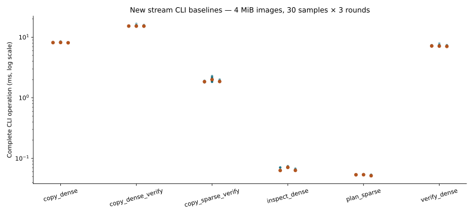
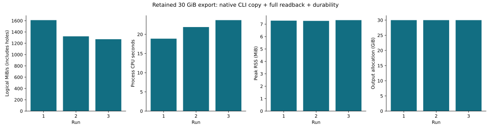

# R5.12 — Local CLI streamOptimized conversion

Baseline: `d65b098`. Local conversion of the admitted base subset is qualified;
overall performance remains open. [CLI contract](../../cli-vmdk.md),
[decision](../../adr/0055-local-cli-stream-conversion.md).

## Correctness

**623 workspace tests passed, one ignored.** Six new CLI integration tests cover
both directory profiles, sparse logical bytes, cross-grain requests, threaded/auto
execution, multiple workers, overwrite tails, aliases, symlinks, source mutation,
lazy payload checks, unsupported versions/flags/parents, memory/request/backend
rejection, cancellation and publication collisions. Final Clippy across all targets
with `-D warnings` and formatting pass. Initial Clippy found duplicate fixture
`allow(dead_code)` attributes; removing the redundant outer attributes fixed it.
The [failed check](clippy.txt) is retained; no production constraint was loosened.
The previously observed export-cleanup test failure did not recur.

[Six synthetic conversions](qemu-cli.json) match both independently authored RAW
and QEMU logical bytes, with 65,537-byte copy blocks, four workers, readback and
131,071-byte standalone verification blocks. Unsupported unaligned capacity rejects.
Temporary synthetic RAW outputs are removed after successful comparison.

Inspect/plan validate metadata and expose `payload_validation: on_read`; they do
not checksum every compressed grain. Corrupt payloads prevent new publication;
failed explicit overwrite may leave partial changes. Source quiescence is required.
The 64 MiB stream block-size limit is checked before destination preparation.

## Local conversion and regression controls

[All raw samples](measurements.json), [pairs](summary.json),
[environment and binary hashes](environment.json), [hardware](hardware.json).
The matrix retains **78 runs / 2,340 Criterion samples**: three initial alternating
pairs and three longer pairs for five unchanged hosted-sparse CLI cases, plus
three rounds of six new stream CLI cases. Any initial adverse pair above 5%
triggered the longer group; no rounds or outliers were discarded.

CPU 0 affinity, shared i7-11850H host, powersave governor, SMT sibling 8; no CPU
isolation, frequency control or cache flushing. Fixtures and output use `/tmp`
**tmpfs**, so local timings measure buffered CLI/decoder overhead rather than
physical storage durability latency. All builds/tests/QEMU/live probes/plotting
finished outside this matrix. Initial runs use 0.5 s warmup / 2 s measurement;
longer runs use 4 s measurement; all use 30 samples. Commands include normal
acquisition, planning and reporting, and copy includes publication/sync calls.
Fixture creation, output byte comparisons and deletion occur outside timed regions.

| Existing control | Longer paired changes, rounds 1 / 2 / 3 | Median change |
|---|---|---:|
| copy mono + verify | +19.40%, +6.48%, +3.33% | **+6.48%** |
| copy split + verify | +22.81%, +4.84%, +1.73% | +4.84% |
| inspect mono | −7.36%, −3.90%, −1.02% | −3.90% |
| plan split | +7.43%, −5.14%, −0.93% | −0.93% |
| verify split | +1.05%, −0.62%, +0.14% | +0.14% |

Positive means slower. The monolithic copy/readback control remains adverse by
median, with substantial round variation. Causality is unresolved: do not label
this harmless noise or claim performance clearance. PERF.0 retains controlled-core,
SMT/frequency and identical-binary/layout investigations alongside prior stream,
R4.4 and discovery/TLS follow-ups. No speculative tuning or resource-limit relaxation
was introduced to hide the observation.



New stream cases use 4 MiB virtual images, independently compressed patterned
grains, a footer map, 64 KiB blocks and four copy workers. Dense has 64 allocated
grains; sparse has one. Medians below summarize the three run medians.

| Complete CLI operation | Median |
|---|---:|
| inspect dense | 0.06342 ms |
| plan sparse | 0.05367 ms |
| copy dense | 8.14931 ms |
| copy dense + verify | 15.25205 ms |
| copy sparse + verify | 1.85864 ms |
| verify dense | 7.13663 ms |

These are new baselines, not improvements over an earlier stream CLI implementation.
The shared decoder serializes allocated-grain reads; four workers do not imply
parallel decompression. R5.11b's [map/read measurements](../2026-10-02-r511b/README.md)
remain distinct from these complete command timings.



## Retained export conversion

The [first runner attempt](live-runner-attempt.json) failed with ENOSPC while
zeroing after 21.55 s wall / 9.52 s process CPU, before verification or publication.
Peak RSS was 7.29 MiB. Its 15 GiB XFS root had about 7.5 GiB
free. The existing `ZERO_RANGE` path allocated space for logical zeros; the
unpublished temporary file was removed and no output remained. No VM volume
was resized and no production zero semantics were changed. This establishes a
practical output-capacity limitation. **R5.12p is next**, before R6.1, to qualify
space-efficient zero output and revisit the copy control; see the
[saved package plan](../../implementation-log.md#next-session).

The retained export and private oracle were then copied into the ignored local
qualification directory on the development host, with sufficient space. Completed
results are recorded in [sanitized observations](live.json). The CLI performs
three new-output `copy --verify --backend auto` operations with default 1 MiB
blocks and one worker. Complete operation time includes map admission, conversion,
full logical readback and durable publication. CPU and peak RSS cover the whole
Rust process, including startup. QEMU and guest-oracle checks run separately after
the first copy. Reads are buffered on the shared development host, on Btrfs, without CPU affinity
or cache flushing. QEMU is 10.2.2. These are local retained-export measurements,
not matched timings against the prior VM runner.

All three conversions and their complete readback passed. QEMU agrees for all
**32,212,254,720 logical bytes**; the independently mapped guest oracle agrees for
all **8,388,608 bytes**, and standalone CLI verify also passed. Temporary local RAW
outputs were removed after each round. Private encoded/oracle inputs remain in
ignored storage for future qualification; no credentials or content digests are
included here. No VMware API, new export, lease or power change was needed.

| Local retained-export copy + verify | Run 1 | Run 2 | Run 3 |
|---|---:|---:|---:|
| Complete command elapsed | 19.084 s | 23.219 s | 24.148 s |
| Process CPU | 18.87 s | 21.90 s | 23.70 s |
| Peak RSS | 7.285 MiB | 7.266 MiB | 7.324 MiB |
| Output allocation (`st_blocks × 512`) | 30 GiB | 30 GiB | 30 GiB |

Median complete command throughput is **1,323.03 logical MiB/s**, including
28,457,369,600 zero-output bytes. Only 3,754,885,120 bytes are Data work. This is
neither encoded-read throughput nor network/decoder throughput. The complete
command times vary across rounds; preserve that shared-host/cache sensitivity.
Btrfs allocated the full logical capacity in every round, confirming the allocation
follow-up also matters outside XFS. Requested map/decode reservations are 693,684 /
141,679 bytes and are not total RSS. The first local inspect and subsequent plan
have their own acquisition timings in the JSON; they are not cold-cache claims.



## Reproduce

```sh
cargo test --workspace
cargo clippy --workspace --all-targets -- -D warnings
cargo fmt --all -- --check
cargo build --release -p rvvdk-cli
cargo bench -p rvvdk-cli --bench sparse --bench stream
python3 scripts/vmdk/compare_stream_cli.py \
  --cli target/release/rvddk --directory target/r511a/reference/qemu-fixtures \
  --report target/r512-qemu-cli.json
python3 docs/benchmark-results/2026-10-02-r512/measure.py
python3 scripts/benchmarks/plot_stream_cli.py docs/benchmark-results/2026-10-02-r512
```

Build and freeze `sparse-before` from the baseline commit before rebuilding, then
freeze `sparse-candidate` and `stream` under `target/r512/reference/`. The measurement
script writes this evidence directory; use a fresh copy for independent reruns.
The historical `compare_stream_envelope.py` corpus generator and
`compare_stream_reads.py` retain their original pre-R5.12 CLI-rejection checks;
pass an archived baseline CLI to those historical scripts, then use the new CLI
conversion script for current behavior. QEMU and Python only generate/check lab
references and plots. Production logical conversion remains Rust.

Private lab execution uses the same public CLI commands against a retained export.
Validate its temporary RAW with `qemu-img compare -f vmdk -F raw`, and independently
compare the authorized guest oracle's validated mapped byte ranges. Preserve only
aggregate outcomes/timing; keep endpoints, identities, oracle mappings, guest data
and private content digests outside Git. Remove only the qualification's temporary
RAW after success. This step requires no new VMware export, lease or power action.
