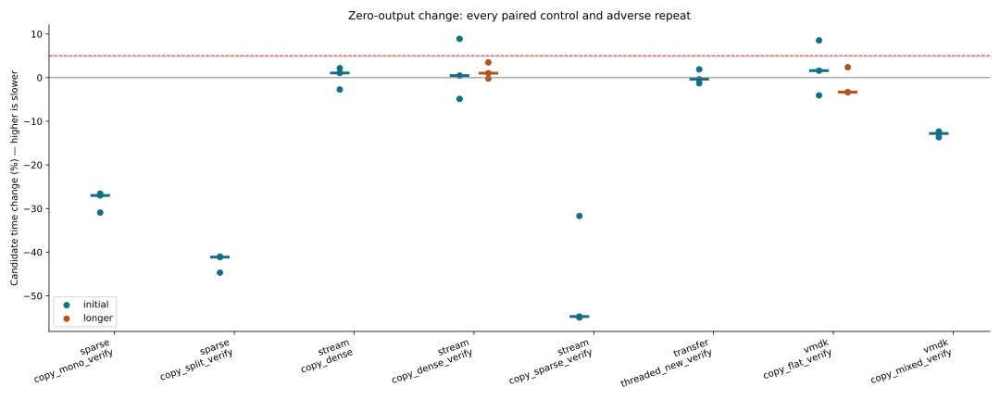
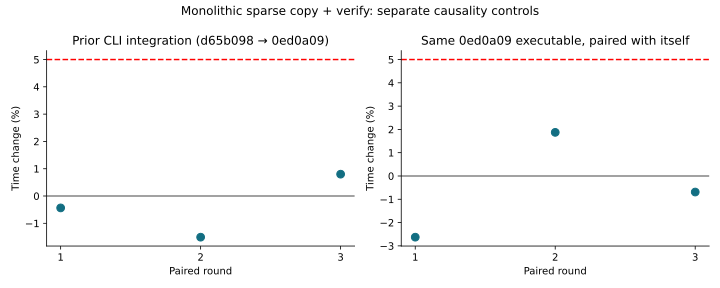
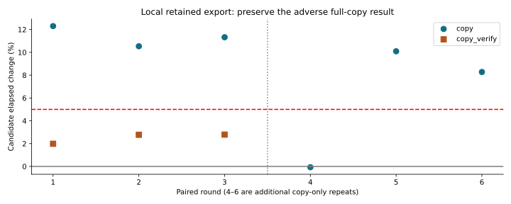
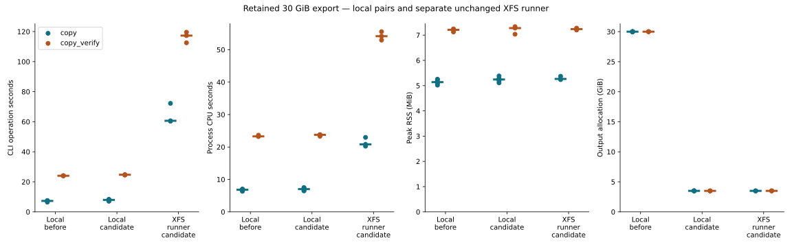

# R5.12p — Space-efficient local zero output

Baseline: `0ed0a09`. [Decision](../../adr/0056-space-efficient-local-zero-output.md),
[local output contract](../../local-sparse-output.md).

`write_zero_at` now prefers hole punching on writable regular files, retaining
zero-range acceleration and bounded writes for explicitly unsupported kernel
modes. Source Zero/Hole labels, endpoint capabilities and operation-based counters
remain unchanged. Physical allocation is measured separately from logical bytes.

## Correctness and allocation

**625 workspace tests passed, two storage tests ignored in the default run.**
Both ignored checks were run explicitly with the other storage integration tests.
Clippy across all targets with `-D warnings` and formatting pass. No failing tests
or checks were discarded. The prior export-cleanup flake did not recur.

New unit cases cover punch-first success, secondary zero-range acceleration and
shared unsupported-mode caching. Existing forced-error checks now exercise both
zero and discard through interruptions and real errors, including ENOSPC and
partial effects. One access guard spans every attempt and bounded fallback. Only
EOPNOTSUPP/ENOSYS permit fallback; real failures propagate. Existing CLI tests
retain overwrite tails, source observations, cancellation and publication cleanup.

[Six complete synthetic conversions](qemu-cli.json) match independent RAW and
QEMU. [Btrfs allocation/readback tests](allocation-btrfs.txt) show an 8 MiB populated
file falls from 16,384 to 4,096 allocated 512-byte blocks after zeroing its middle
6 MiB, just as explicit discard does. A fresh sparse 8 MiB file retains 16 blocks
while zeroing between two partial-block edge sentinels. Bytes, size and neighbors
are checked for both buffered and direct-open handles.

The [unchanged XFS runner](allocation-xfs.txt) passes all four storage tests,
including both explicit allocation checks, with the same 16,384 → 4,096 and
16 → 16 block results. Retained-export conversion is recorded below. R5.12's [failed ENOSPC attempt](../2026-10-02-r512/live-runner-attempt.json)
remains the baseline evidence; no runner filesystem expansion is used. Fallbacks
and partial blocks may allocate, so this is not a universal storage-space bound.

## Local CLI performance controls

[Raw Criterion samples](measurements.json), [recomputed paired changes](summary.json),
[commands, binary hashes and environment observations](environment.json).
Eight unchanged cases cover RAW, FLAT, mixed ZERO, hosted sparse and stream input.
Three alternating pairs use 30 samples, 0.5 s warmup and 2 s measurement. Every
case with any adverse pair above 5% receives three longer 4 s pairs. Nothing is
removed as an outlier. Baseline and candidate use identical benchmark harnesses.

The existing fixtures use tmpfs; these measure buffered command/decoder overhead,
not physical storage durability latency. CPU 0 affinity and the existing powersave
governor are retained on the shared i7-11850H host. SMT sibling 8 is not isolated.
Frequency, load and CPU tick snapshots bracket each process; they are observations,
not continuous tracing or proof of exclusive execution. No tests, builds, QEMU,
retained-export runs or plotting overlap the timed matrix. Fixture setup, output
comparison and removal remain outside each timed command.

The matrix retains **72 runs / 2,160 samples**. Percentages below summarize the
three paired changes; positive means slower. Dense stream readback and FLAT
readback are the two cases that triggered longer repeats.

| Control | Initial median | Longer pairs (rounds 1 / 2 / 3) | Longer median |
|---|---:|---|---:|
| hosted sparse mono + verify | −27.00% | not triggered | — |
| hosted sparse split + verify | −41.13% | not triggered | — |
| stream dense copy | +1.06% | not triggered | — |
| stream dense copy + verify | +0.47% | −0.22%, +1.02%, +3.49% | +1.02% |
| stream sparse copy + verify | −54.74% | not triggered | — |
| RAW threaded copy + verify | −0.37% | not triggered | — |
| FLAT copy + verify | +1.60% | −3.32%, +2.38%, −3.34% | −3.32% |
| mixed FLAT/ZERO copy + verify | −12.80% | not triggered | — |

The initial adverse rounds (+8.89% dense stream and +8.52% FLAT) remain visible.
No longer pair exceeds +5%. This qualifies the measured scope, not every workload
or filesystem. The strongest tmpfs gains are concentrated in cases with logical Zero work.



## Previous copy slowdown and identical-binary controls

The +6.48% R5.12 monolithic sparse copy/readback median remains in its original
report. This step separately repeats that historical `d65b098` → `0ed0a09` pair,
and pairs the exact same `0ed0a09` executable path with itself. Both controls use
three alternating pairs with 4 s measurements, the same CPU and unchanged fixture.
They investigate variability; they cannot retroactively erase prior observations
or establish that code placement, frequency or load caused a particular result.

Historical pairs are −0.44%, −1.51%, +0.80% (median −0.44%). Identical-executable
pairs are −2.63%, +1.87%, −0.69% (median −0.69%). The earlier +6.48% median does
not reproduce here. These observations resolve this bounded recheck without
establishing the cause of the older result. Broader controlled-host/layout work
and other previously adverse stream controls remain open under PERF.0.



## Retained 30 GiB export

[Local before/candidate pairs](live-local.json) measure three alternating pairs of
copy-only and copy+verify on Btrfs, followed by three additional copy-only pairs
after an adverse observation. [Separate runner observations](live-runner.json)
measure the candidate's same two modes three times on the unchanged small XFS root.
The runner's prior baseline failed with ENOSPC; it has no successful baseline time
for speedup calculation. Do not compare local and VM timings as matched speedups.

CLI-reported operation elapsed includes admission, conversion, publication and
durability; copy+verify includes full readback. It excludes argument parsing and
final report output. External process wall time is also retained; CPU and peak
RSS cover the entire Rust process.
Defaults are one worker and 1 MiB blocks, buffered I/O, no affinity or cache flushing.
Copy-only outputs also receive standalone verification outside their timed region.
The first copy per binary/environment is compared completely with QEMU and the
independent guest oracle. Reference checks and earlier commands affect cache state.
Logical throughput includes zero ranges and is not network or compressed-read rate.

Local initial-run medians (three per row) separate elapsed time from process CPU:

| Btrfs variant / operation | Elapsed | CPU | Peak RSS | Output allocation |
|---|---:|---:|---:|---:|
| Before, copy | 7.184 s | 7.00 s | 5.121 MiB | 30 GiB |
| Candidate, copy | 7.941 s | 6.94 s | 5.258 MiB | 3.497 GiB |
| Before, copy + verify | 24.023 s | 23.28 s | 7.211 MiB | 30 GiB |
| Candidate, copy + verify | 24.690 s | 23.75 s | 7.277 MiB | 3.497 GiB |

Every local candidate output allocates **3,754,885,120 bytes**, an **88.343% reduction**
from 32,212,254,720 bytes locally. The same logical Data/Zero work is preserved:
3,754,885,120 Data bytes, 28,457,369,600 Zero bytes, and zero discarded-byte counters.
The local first outputs of both binaries match all 30 GiB against QEMU and all
8 MiB against the independent guest oracle. All copy-only runs pass separate
full CLI verification; all copy+verify commands pass their internal readback.

The initial local copy-only pairs are **+12.30%, +10.54%, +11.33%** (median
**+11.33%**). Three additional fixed-image pairs retain **−0.07%, +10.09%, +8.28%**
(median **+8.28%**). Copy+verify pairs are +1.99%, +2.78%, +2.79% (median +2.78%).
The copy-only latency disposition stays open despite allocation and tmpfs gains.
These repeats use the same complete image; there is no adjustable longer sample
window for this workload. Every additional run and untimed readback is retained.



A separate `strace -f -c -e trace=fallocate` diagnostic observes 22 successful
fallocate calls per copy: [baseline](profile-before.txt) 0.000403 s syscall CPU,
[candidate](profile-candidate.txt) 0.000036 s. This instrumented single pair does
not measure normal wall-clock syscall latency or delayed filesystem work and
cannot explain the end-to-end difference. No syscall failure or count increase
was observed. Profiled commands are excluded from the benchmark medians; their
RAW outputs were removed. R5.12q must investigate decode/layout and destination
write/flush costs before selecting a further optimization or assigning a cause.

All six candidate conversions on the unchanged XFS runner succeed, including
complete internal readback for copy+verify and standalone readback for every
copy-only output. Its first output matches all **32,212,254,720 logical bytes**
with QEMU and all **8,388,608 guest-oracle bytes** independently.

| XFS candidate operation | Elapsed seconds, rounds 1 / 2 / 3 | Median CPU | Peak RSS range |
|---|---|---:|---:|
| copy | 72.216 / 60.628 / 60.376 | 20.82 s | 5.238–5.371 MiB |
| copy + verify | 117.311 / 119.576 / 112.543 | 54.16 s | 7.203–7.277 MiB |

Every XFS output reports **3,754,889,216 allocated bytes**, about 3.497 GiB;
this includes 4 KiB more filesystem-reported allocation than local Btrfs. The
previous ENOSPC failure is resolved for this qualified image and runner without
resizing its filesystem. The slower first copy and the local/VM timing difference
remain visible; no cold-cache or cross-host speedup claim is made.



Temporary RAW outputs are removed after each verified run. Private source images,
oracle mappings/content, endpoint identities, credentials and private content hashes
remain in ignored storage. Sanitized observations contain aggregate counters only.
No VMware API, export, lease, power operation or filesystem resize is needed.

## Reproduce

```sh
cargo test --workspace
cargo clippy --workspace --all-targets -- -D warnings
cargo fmt --all -- --check
RVVDK_TEST_DIR="$PWD/target/r512p/storage-tests" \
  cargo test -p rvvdk-local --test sparse_write -- --include-ignored --nocapture
cargo build --release -p rvvdk-cli
cargo bench -p rvvdk-cli --bench sparse --bench stream --bench transfer --bench vmdk
python3 scripts/vmdk/compare_stream_cli.py \
  --cli target/release/rvddk --directory target/r511a/reference/qemu-fixtures \
  --report target/r512p-qemu-cli.json
python3 docs/benchmark-results/2026-10-02-r512p/measure.py
python3 scripts/benchmarks/plot_zero_output.py docs/benchmark-results/2026-10-02-r512p
```

Freeze each benchmark executable from `0ed0a09` as `<group>-before` and the new
build as `<group>-candidate` under `target/r512p/reference/`; preserve `d65b098`'s
`sparse` executable as `sparse-historical`. Historical binary hashes are bound to
previous committed reports. The measurement script writes this evidence directory;
use a separate copy for independent reproduction. Private lab orchestration uses
the public CLI, `/usr/bin/time`, `stat`, QEMU and the validated guest map; only Rust
performs production disk conversion. Python orchestrates qualification and plotting.

R5.12q will investigate the remaining local full-copy latency before R6.1a
explicit source identity/artifact contracts. PERF.0, bounded decode
scaling, random whole-grain amplification, R4.4 and discovery/TLS concerns remain
independent follow-ups; this package claims the measured local zero-output change.
