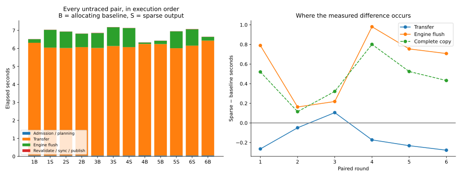
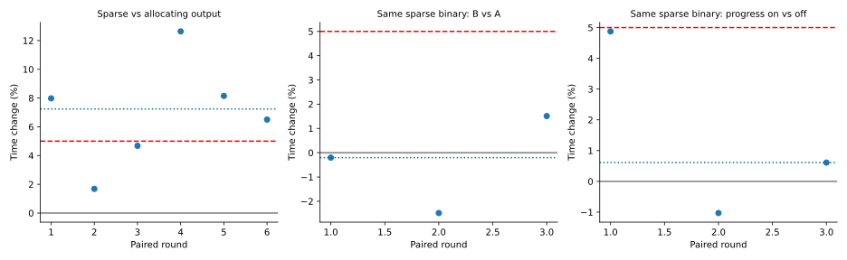
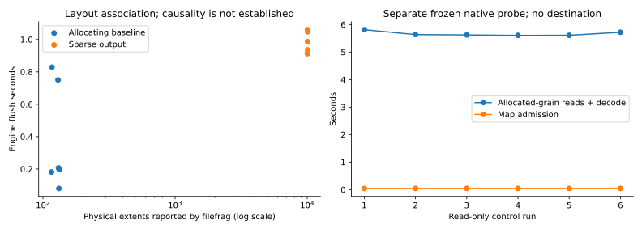

# R5.12q — Retained-export copy latency investigation

This package investigates the R5.12p Btrfs copy-only slowdown using the exact
frozen allocating and sparse-output executables. Production Rust code, zero-range
semantics, cancellation, verification and durability are unchanged. This is a
bounded diagnostic disposition, not a latency recovery claim.

## Method and evidence boundaries

[Measurements](measurements.json) retain every complete-copy result, CPU time,
maximum RSS, physical allocation, physical extent count, lifecycle timestamps and
host observations. [Recomputed summaries](summary.json) and [plot audit](plots/audit.json)
are generated from those observations. The report manifest binds the evidence.

The same private, quiescent 30 GiB retained export and output directory on Btrfs
are used throughout. Each output is newly created and durably published. Every
copy receives a full 30 GiB native readback outside the timed interval, then its
temporary RAW is removed. This step makes no VMware calls or guest changes.
The independent QEMU/guest-oracle qualifications of these exact executables remain
in [R5.12p](../2026-10-02-r512p/README.md); those checks are not claimed as new runs.

- Six alternating baseline/sparse pairs include three initial pairs and three
  additional complete pairs; adverse observations remain in the dataset.
- Three alternating pairs use the same sparse executable for both labels.
- Three alternating pairs compare progress disabled/enabled on that executable.
- Two alternating pairs run under `strace -f -qq -c -w`, selecting `pread64`,
  `pwrite64`, `fallocate`, `fdatasync` and `fsync`. These instrumented observations
  are separate from the untraced timing matrix. `-w` reports syscall wall time,
  unlike the previous package's syscall CPU summary.
- Six separate native probe runs admit the map and read/decode all 57,295
  allocated grains, without a destination. The frozen probe is the existing
  R5.11b qualification executable, bound by SHA-256. These are source-only controls,
  not a subtraction-based estimate of decoder time within either CLI binary.

Commands run with CPU 0 affinity, one copy worker, 1 MiB blocks and Auto selecting
the threaded backend. The shared i7-11850H host retains its powersave governor;
SMT sibling 8 is not isolated. Frequency/load/CPU snapshots are observations, not
continuous monitoring or exclusive execution. Buffered I/O, existing caches and
storage state are retained; no cache eviction, preallocation, defragmentation,
volume resizing or governor changes occur. Full readbacks between runs influence
cache state. No builds, tests, QEMU or plotting overlap the timing matrix.

The original R5.12p retained-export runs had no CPU affinity or progress output.
This matrix changes those diagnostic controls, so its absolute times and paired
percentages do not replace the older +8.28% median. It investigates phase behavior
on the same image and binaries. Identical-binary controls expose observed
variation; they do not isolate linker layout or prove a filesystem cause.

Progress events provide bounded existing instrumentation: admission/planning
ends at `copy_started`; transfer ends at `copy_flushing`; engine flush ends at
`copy_flushed`. Subsequent intervals cover source revalidation, the additional
file sync, publication, directory sync and completion. They include small event
serialization/callback overhead. The standalone native probe separates source
admission and allocated-grain reads; reads include physical I/O and decompression.
Selected syscall wall times separate destination writes and durability under
tracing; unaccounted process time is not labeled as pure decoder time.

`filefrag` runs after the timed durable copy and before readback. Only its physical
extent count is retained; paths and physical offsets stay private. Extent count
is a layout observation, not a direct measurement of fragmentation's causal cost.
All outputs preserve the same logical operation counters, and sparse output
retains the previously qualified 3,754,885,120-byte allocation.

## Results and disposition

All **28 complete copies and 28 full native readbacks passed**, with six additional
source-only controls. No measured command failed. The retained source stamp and
all frozen executable hashes are unchanged at the end. Temporary RAWs are removed.
No Rust implementation changes are made, so the previous workspace/XFS/QEMU/guest
qualification is preserved; this package does not claim a new workspace test run.

| Untraced six-run median | Allocating baseline | Sparse output |
|---|---:|---:|
| Complete CLI copy | 6.583 s | 7.059 s |
| Admission / planning | 0.0456 s | 0.0449 s |
| Transfer | 6.198 s | 6.014 s |
| Engine durability flush | 0.202 s | 0.961 s |
| Subsequent file sync | 0.000225 s | 0.000265 s |
| Directory sync / finish | 0.00648 s | 0.00665 s |
| Whole-process user + system CPU | 6.400 s | 6.375 s |
| Peak RSS | 5,292 KiB | 5,350 KiB |
| Physical output allocation | 30 GiB | 3.497 GiB |
| Physical extent count | 130.5 | 10,060 |

Medians of different phases are not additive. Paired total changes are **+7.98%,
+1.68%, +4.68%, +12.64%, +8.15%, +6.50%**; median **+7.24%**. Initial three-pair
median is +4.68%; additional three-pair median is +8.15%. The flush interval is
longer for sparse output in every pair. Physical extent ranges are 116–133 versus
10,047–10,079. This places the measured extra latency mainly in the engine flush,
with an associated layout difference; it does not prove the cause inside Btrfs.



Identical sparse-executable pairs are −0.20%, −2.49%, +1.51% (median −0.20%).
Progress-enabled versus disabled pairs are +4.88%, −1.03%, +0.61% (median +0.61%).
The six policy pairs include complete repeats of adverse observations; no control
pair exceeds +5%. These small controls bound observed variation only, without
claiming a universal noise floor or a confidence interval.



The separate wall-time syscall summaries retain two pairs in alternating order:

| Syscall wall seconds | Baseline 1 | Sparse 1 | Baseline 2 | Sparse 2 |
|---|---:|---:|---:|---:|
| `pread64` (114,977 calls) | 0.795104 | 0.770163 | 0.776600 | 0.789073 |
| `pwrite64` (3,596 calls) | 0.391739 | 0.377133 | 0.372402 | 0.371226 |
| `fallocate` (22 calls) | 0.003036 | 0.000234 | 0.002471 | 0.000234 |
| `fdatasync` (one call) | 0.696211 | 0.918358 | 0.787084 | 1.000483 |
| `fsync` (two calls) | 0.006519 | 0.006275 | 0.006357 | 0.006161 |

All selected calls succeed. Destination write time is close in these observations,
and the direct zero-call wall time is small. Both traced pairs show longer sparse
`fdatasync`. Tracing materially changes phase timing, especially admission; these
numbers are not substitutes for the untraced matrix. Kernel writeback overlap and
storage scheduling are not resolved by aggregate syscall durations.

The separate native source probe admits the map in median **0.0418 s** and reads /
decodes all 3,754,885,120 allocated bytes in median **5.630 s** (range 5.607–5.813 s),
using the same fixed 141,679-byte decoder workspace. This is consistent with source
work dominating transfer, but does not isolate pure decode CPU, cache misses or
CLI binary-layout effects. Full native readback checks logical Zero ranges too.



**Disposition:** retain punch-first zero output and all durability barriers. Its
88.343% allocation reduction remains necessary for the previously qualified small
XFS runner. A controlled-storage PERF.0 follow-up should investigate allocation
layout and delayed writeback, including a bounded Data-range reservation experiment
if justified. Do not preallocate Zero ranges, omit durability, or weaken exact-range
zero semantics to recover one timing number. Any implementation experiment must
repeat arbitrary-range/nonzero-tail, access/fallback/error/cancellation/publication
checks and matched allocation, CPU/RSS, full QEMU and guest-oracle qualification on
Btrfs and XFS separately. No portable mitigation is established by this package.

R5.12q is complete as a measured investigation. **Next is R6.1a**, explicit source
identity and versioned artifact contracts, followed by durable ownership/recovery.
The remaining storage and stream performance work stays visible under PERF.0.

## Reproduce

Keep the retained source and work directory private. Supply paths locally; the
harness stores raw CLI output only in the private work directory and emits
sanitized aggregate evidence. Use a new report directory and at least 33 GiB free
on the output filesystem for the allocating baseline. The command is destructive
only to its own successfully verified temporary `converted.raw` output.

```sh
python3 scripts/benchmarks/measure_copy_phases.py \
  --source "$PRIVATE_SOURCE" --before "$FROZEN_BASELINE" \
  --candidate "$FROZEN_SPARSE_CLI" --probe "$FROZEN_READ_PROBE" \
  --work "$PRIVATE_NEW_WORK_DIRECTORY" --report "$NEW_REPORT_DIRECTORY" --cpu 0
target/benchmark-plots/bin/python scripts/benchmarks/plot_copy_phases.py "$NEW_REPORT_DIRECTORY"
```

The plot command uses the existing matplotlib environment described in
[scripts/benchmarks](../../../scripts/benchmarks/README.md). The initial plot
invocation with system Python lacked matplotlib; it produced no plots and touched
no measurement data. The configured environment completed the audit and plots.

The native binaries perform all VMDK admission, decoding, copying and readback;
Python only orchestrates the offline experiment and plots its results.
