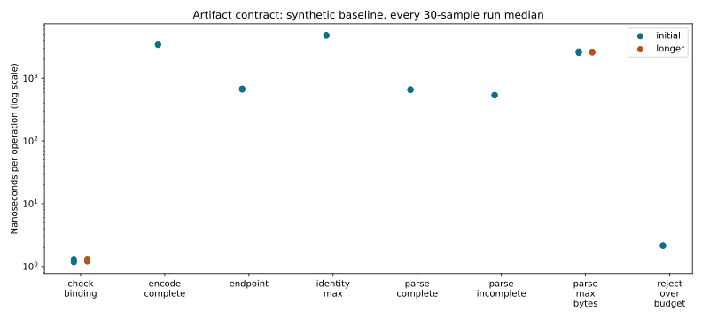

# R6.1a — Source identity and artifact contract qualification

The new pure Rust contract requires explicit endpoint trust, VM reference/UUID,
disk key/backing and expected logical capacity. It persists bounded artifact claims
with separate encoded/logical sizes and no operational paths or credentials.
The existing qualification exporter and disk-copy engine are unchanged.
[Contract](../../export-artifact-contract.md), [ADR-0057](../../adr/0057-source-identity-and-artifact-contract.md).

## Correctness

[Final workspace run](workspace-final.txt): **635 passed, two filesystem-specific
tests ignored**, with no failures. Counts exclude nested filtered subprocess runs
used by existing executor fault tests. [Focused vSphere run](vsphere-tests.txt):
57 passed. [Clippy across all targets](clippy.txt) and [formatting](fmt.txt) pass.
The [earlier workspace run](workspace-initial.txt) passed 634 tests before the final
golden-vector test and bounded-inventory guard were added; final evidence includes
both. No ignored storage test or live ESXi run is claimed for this contract step.

Ten new contract tests cover exact selection, same-capacity impostors, duplicate
references, endpoint/pin/provenance changes, changed UUID/key/backing/capacity,
all retained power/topology/backing scope gates, strict input budgets and private
identity access. Round-trip and golden-vector checks preserve the schema/binding.
Malformed versions, duplicate/unknown fields, invalid enum/hex/size values,
truncations, trailing/nested JSON and incomplete/verification contradictions fail
closed. Every validation claim still requires fresh size/digest comparison.
Debug/errors and existing inventory serialization omit private identities.

Operational trust remains explicit: caller-supplied inventory must come from the
admitted connection; successful metadata parsing or comparison grants no remote
lease ownership, cleanup authority, durability or permission to skip validation.
The fixed golden input uses synthetic names and bytes only.

## New performance baseline

[Raw Criterion samples](measurements.json), [run medians](summary.json),
[commands, binary hash, CPU/RSS and host observations](environment.json),
[plot/data audit](plots/audit.json). No previous implementation of these operations
exists, so these observations establish a baseline rather than a speedup or
regression comparison. No data-copy or VMware transport hot path changes.

Eight synthetic in-memory cases each run three times with 30 samples, 0.5 s warmup
and 2 s measurement. A greater-than-5% spread between run medians triggers three
additional 4 s runs for that case. All attempts/outliers remain in the report:
**30 case runs / 900 samples**. Builds, tests and standalone plotting occur outside
the timed matrix. Criterion's own analysis is included in whole-process metrics.

CPU 0 affinity, shared host, powersave governor, unisolated SMT sibling and warm
in-memory inputs limit generalization. Snapshot observations do not prove an
idle host or fixed frequency. No network or disk payload operations occur.

| Operation | Initial median of run medians | Longer repeat median |
|---|---:|---:|
| Construct pinned endpoint binding | 0.676 µs | — |
| Construct maximum-sized source identity | 4.839 µs | — |
| Parse complete artifact | 0.654 µs | — |
| Parse incomplete artifact | 0.537 µs | — |
| Parse metadata padded to 4 KiB | 2.615 µs | 2.619 µs |
| Serialize complete artifact | 3.476 µs | — |
| Compare precomputed source binding | 1.198 ns | 1.209 ns |
| Reject 4,097-byte input before parsing | 2.168 ns | — |

The binding case compares already constructed identities; it does not measure
hashing, inventory discovery or authentication. Maximum identity includes a
256-byte reference and 4,096-byte backing plus endpoint-policy cloning. Maximum
metadata uses legal trailing whitespace to exercise the full admission budget.
Serialization includes private hex fields and JSON allocation; these are bounded
per-artifact costs, separate from per-block copy work.

The 4 KiB parse spread falls to 2.83% in longer repeats. The very small binding
comparison retains **8.62% spread** (1.208–1.312 ns) after repeats; retain this
variation without attributing a cause or claiming precise nanosecond guarantees.
Whole-Criterion process peak RSS is 13,324–13,756 KiB, including framework/setup/
warmup/analysis. It is not a per-operation allocation measurement. CPU and wall
time for each process are retained alongside the samples.



```sh
cargo test --workspace
cargo clippy --workspace --all-targets -- -D warnings
cargo fmt --all -- --check
cargo bench -p rvvdk-vsphere --bench contract --no-run
# Supply the emitted release executable; use a fresh report directory.
target/benchmark-plots/bin/python scripts/benchmarks/measure_artifact_contract.py \
  --binary "$CONTRACT_BENCH_BINARY" --report "$NEW_REPORT_DIRECTORY"
# Regenerate and audit plots from the committed raw measurements:
target/benchmark-plots/bin/python scripts/benchmarks/measure_artifact_contract.py \
  --plot-only --report docs/benchmark-results/2026-10-02-r61a
```

Only synthetic contract data is committed. ESXi credentials, guest names, endpoint
details and retained-image content digests are absent. No power, lease or export
operation was needed. R6.1a is complete; next is R6.1b durable resource ownership
and process-loss reconciliation, followed by R6.1c workflow integration. Existing
PERF.0 stream and Btrfs layout/flush follow-ups remain open.
