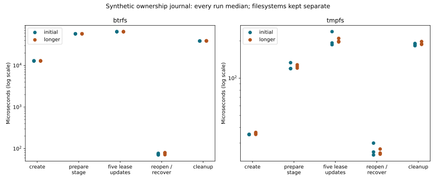

# R6.1b — Durable ownership and recovery foundation

The Linux job store provides private atomic records, explicit intent/acknowledgment
states, descriptor-bound staging, conservative crash assessment and bounded local
cleanup. It grants no remote capability from a saved artifact or job record.
[Contract](../../durable-job-ownership.md), [ADR-0058](../../adr/0058-durable-job-ownership.md).

## Correctness and failure evidence

[Workspace tests](workspace-tests.txt): **649 passed, two storage-specific tests
ignored**, excluding nested filtered executor subprocess counts. Fourteen new
ownership tests pass on [tmpfs](ownership-tests-final.txt) and explicitly on
[Btrfs](ownership-btrfs.txt). [Clippy across all targets](clippy.txt),
[formatting](fmt.txt) and the release probe build pass.

The tests cover:

- Sixteen actual child-process exits across initial reservation, partial record
  writes, file sync, atomic rename, parent sync, stage creation and cleanup. Exits
  bypass destructors. Committed records remain parseable; unknown temporary/stage
  resources are retained and uncertain states cannot authorize cleanup.
- Five injected record I/O failures poison the writer; recovery sees old or new
  complete state, and leftover transactions are never replayed.
- Interrupted payload/metadata/marker/directory removal can continue only from
  durable cleanup intent, using fresh ownership checks.
- Changed source/operation/store identity, corruption, bad schema/state/sequence,
  replacement paths, symlinks, hardlinks, marker mismatch and unknown entries.
- A competing process cannot acquire the store lock; terminal tombstones prevent
  artifact-ID reuse. Lease/publication uncertainty never permits automatic action.

The first development test run found a transient `Busy` when a parallel fork/exec
child inherited the parent's file description just as the parent dropped its store.
Explicit lock release in `JobStore::drop` fixed this; no files are removed on Drop.
[Ten repeated ownership suites](lock-stress.json), totaling 140 test executions,
then passed while retaining the child-process concurrency cases. The final Btrfs
suite also passes. Same-UID malicious writers and shared inherited stores after
fork remain outside the ownership model; this is not a claim of distributed locking.

These tests qualify **process-loss behavior**, not physical power-cut/controller
fault recovery. Parent/file fsync barriers remain in place. The live qualification
exporter and copy engine are unchanged, and no ESXi/guest operation occurred.
Remote reconciliation is intentionally an unresolved assessment until a future
workflow obtains qualified fresh evidence; no resume or lease-abort API is added.

## Synthetic local performance baseline

[All 12 runs / 576 jobs](measurements.json), [repeat selection](summary.json),
[commands, CPU/RSS and host snapshots](environment.json), [plot audit](plots/audit.json).
Each synthetic job executes ten durable record commits, creates empty owned members,
records simulated lease observations, closes/reopens the store, checks recovery,
and cleans only its owned stage. No network or payload transfer is simulated as
timed I/O. Terminal journal files remain until fixture removal outside timed phases.

Three alternating filesystem rounds use 32 jobs per run. Any greater-than-5% spread
between phase run medians triggers three longer 64-job runs on that filesystem;
both filesystems trigger. No attempts or outliers are removed. This is a new
baseline, not a before/after performance claim. CPU 0 affinity, powersave, shared
host and unisolated SMT sibling are retained. No cache flushing, builds, tests or
standalone plots overlap measurements. Keep Btrfs and volatile tmpfs separate;
tmpfs success does not establish storage durability.

| Phase (median of longer run medians) | Btrfs | tmpfs |
|---|---:|---:|
| Initial record creation | 12.925 ms | 35.89 µs |
| Stage preparation, including two records | 57.793 ms | 124.41 µs |
| Five lease-observation record updates | 65.044 ms | 197.89 µs |
| Reopen and assess recovery | 77.65 µs | 24.91 µs |
| Cleanup, including two records | 39.080 ms | 188.47 µs |

The Btrfs persistence phases have 0.6–1.3% spread in longer run medians; reopen /
recovery retains **12.1%**. Tmpfs phase spreads remain **3.8–10.0%**. Preserve these
variations without attributing a cause or claiming fixed latency. Every raw job
phase observation remains available. Whole-process peak RSS is 2,612–2,964 KiB;
CPU/RSS include setup and fixture removal, not just individual journal operations.

The largest observed committed record is 743 bytes against the 8 KiB input bound.
Terminal journal files report 4,096 allocated bytes per job on both filesystems,
excluding directory/filesystem metadata. Source/disk capacity does not grow these
records or the fixed three-member ownership list. Caller-managed tombstone retention
is a future concern; the store does not silently recycle operation/artifact IDs.



Durable metadata cost is material on this host. Keep all barriers and measure the
integrated workflow before optimizing journal placement or scheduling. Do not
silently batch away the intent-before-action boundary. The prior Btrfs copy-flush,
stream timing and other PERF.0 investigations remain distinct open work.

```sh
cargo test --workspace
cargo test -p rvvdk-vsphere ownership --lib
# For filesystem-specific fault tests, provision an empty test parent first:
RVVDK_OWNERSHIP_TEST_PARENT="$BTRFS_TEST_PARENT" cargo test -p rvvdk-vsphere ownership --lib
cargo clippy --workspace --all-targets -- -D warnings
cargo build -p rvvdk-vsphere --release --example ownership_probe
target/benchmark-plots/bin/python scripts/benchmarks/measure_ownership.py \
  --binary target/release/examples/ownership_probe --report "$NEW_REPORT_DIRECTORY" \
  --btrfs-parent "$NEW_BTRFS_FIXTURE_PARENT" --tmpfs-parent "$NEW_TMPFS_FIXTURE_PARENT"
target/benchmark-plots/bin/python scripts/benchmarks/measure_ownership.py \
  --plot-only --report docs/benchmark-results/2026-10-02-r61b
```

Synthetic fixture directories were removed after success; retained report data has
no operational endpoints, credentials, VM identities or guest-content digests.
R6.1b's local ownership/recovery foundation is complete. R6.1c will integrate
explicit source selection, actual lease handling, verified payloads and no-replace
publication; automatic remote recovery is not claimed by this package.
