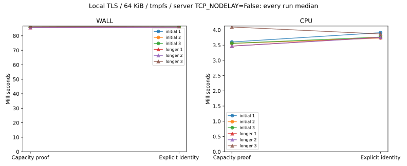
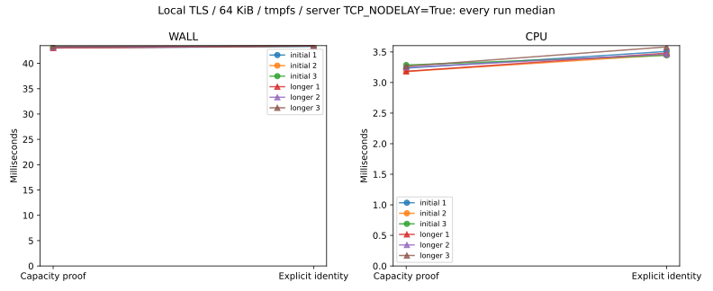

# R6.1c.1 — Explicit export selection

`export_selected_vm` derives the connection from explicit source identity and adds
fresh identity/scope observations before acquisition, download and completion.
The capacity-selected proof remains available. This is a bounded integration step;
full durable R6.1c export/conversion remains open.
[Contract](../../explicit-export-selection.md), [ADR-0059](../../adr/0059-explicit-export-selection.md).

## Correctness

[Workspace](workspace-tests.txt): **658 passed, three ignored**, zero failures.
Counts exclude nested filtered child-process test executions. The ignored tests
are two filesystem qualifications and the new opt-in synthetic performance matrix.
[Final mock harness run](final-harness-tests.txt): all 48 discovery/export tests pass,
one benchmark ignored. [All-target clippy](clippy.txt), [format](fmt.txt), and the
[example help](example-help.txt) pass. The performance matrix was subsequently run
explicitly in release mode for both conditions below.

Nine new integration tests cover equal-capacity disambiguation, operation ordering,
30 UUID/key/backing/capacity/power/disabled-method changes across five boundaries,
missing identity, invalid options before connection, cancellation during each of
the three added reads, slow live-lease reads, cursor cleanup before abort, pin
rejection before credentials, and probe acquire/abort without an artifact. Existing
transfer, timeout, redaction, manifest and publication tests remain passing. The
explicit operation future remains Send. A development test initially expected a
TLS failure as an outer Result error; it was corrected to assert the established
ExportReport error contract. No production TLS behavior was changed.

No real ESXi, guest or retained image was used. The benchmark body has a recognized
header and synthetic bytes, not a valid VMDK image. It tests export transfer and
full file byte equality, not logical VMDK decoding or container format validity.

## Matched synthetic measurements

Both paths run in the same release executable with alternating order per pair,
64 KiB bodies, local TLS and tmpfs output. Fixtures/credentials/certificates are
created before each timed operation. File readback and removal happen afterward.
CPU includes the in-process mock server threads; RSS is process lifetime, not a
per-operation heap allocation measurement. Whole-process CPU/RSS also include
setup, verification and removal and are saved separately.

Each condition has three 32-pair initial runs. A greater-than-5% adverse wall/CPU
pair or between-run median spread triggers three 64-pair repeats. Both conditions
triggered repeats. **12 runs, 576 pairs, 1,152 exports** are retained without outlier
removal. Every export passed full byte comparison, wrote 65,536 bytes and allocated
65,536 payload bytes on tmpfs. Directory/manifest allocation is not included.

| Longer-run median of medians | Legacy capacity proof | Explicit identity | Difference |
|---|---:|---:|---:|
| Original mock wall | 85.708 ms | 86.025 ms | +0.318 ms / +0.37% |
| Original mock CPU | 3.471 ms | 3.760 ms | +0.290 ms / +8.34% |
| TCP_NODELAY control wall | 43.154 ms | 43.449 ms | +0.295 ms / +0.68% |
| TCP_NODELAY control CPU | 3.248 ms | 3.480 ms | +0.232 ms / +7.13% |

The explicit path makes five VM property reads rather than two, including initial
inventory, and refreshes progress before the final added read. Extra heartbeat
requests may vary with scheduling. CPU overhead is retained as the measured cost
of the stronger checks; no hot-path speedup or universal performance clearance is
claimed. No file-sync barrier or source check was removed to improve these numbers.

The original mock's wall time was much larger than CPU time. Enabling TCP_NODELAY
on accepted server sockets approximately halved that floor. This supports a mock
transport-delay explanation, but the remaining approximately 43 ms floor is not
fully isolated. These wall percentages must not be extrapolated to ESXi network
latency, large-image throughput or journal/storage durability. The control also
normalizes the legacy fixture's disabledMethod field to the same empty value as
the explicit fixture; the original fixture contained ExportVm, which the legacy
proof does not gate on. Production transport and source-selection code are
identical between both matrices. The exact earlier test-harness differences are
retained in [original-mock.patch](original-mock.patch); both executable hashes are
recorded in their environments.

Original longer-run CPU medians retain **18.10% legacy spread** and 3.12% explicit
spread. The TCP_NODELAY control retains 2.61% legacy and 3.41% explicit CPU spread;
wall spreads are 0.64% and 0.08%. Retain the original adverse/variable observations.
Per-export observed process peak RSS spans 7,132–8,988 KiB across both conditions.
Shared CPU 0, powersave governor, unisolated SMT and uncontrolled host load limit
attribution. Builds, tests and plots did not overlap the timed matrices. tmpfs is
volatile and does not qualify physical storage durability.

[Original raw samples](measurements.json), [summary](summary.json),
[commands, binary hash and host/whole-process observations](environment.json),
[plot audit](plots/audit.json).



[TCP_NODELAY raw samples](tcp-nodelay/measurements.json),
[summary](tcp-nodelay/summary.json), [environment](tcp-nodelay/environment.json),
[plot audit](tcp-nodelay/plots/audit.json).



```sh
cargo test --workspace
cargo clippy --workspace --all-targets -- -D warnings
cargo fmt --all -- --check
cargo test -p rvvdk-vsphere --test discovery --release --no-run
# Use the emitted executable and a fresh report directory; /tmp must be tmpfs.
target/benchmark-plots/bin/python scripts/benchmarks/measure_selected_export.py \
  --binary "$DISCOVERY_TEST_BINARY" --report "$NEW_REPORT_DIRECTORY" --server-nodelay
# Omit --server-nodelay to measure the default mock socket mode.
# Regenerate plots without rerunning exports:
target/benchmark-plots/bin/python scripts/benchmarks/measure_selected_export.py \
  --plot-only --report docs/benchmark-results/2026-10-02-r61c1/tcp-nodelay
```

[Final source hashes](source-hashes.json) and [report artifact hashes](artifacts.json)
bind the saved evidence. Only synthetic data is committed; credentials, operational
VM identities/endpoints and guest content digests are absent. Next R6.1c.2 connects
real leases and owned resources to durable intents, then artifact validation,
conversion and publication. Existing PERF.0 storage/stream/journal follow-ups remain
open, together with these fixed per-export RPC costs and transport timing controls.
