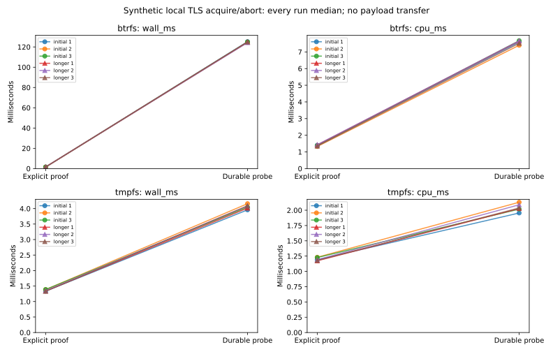

# R6.1c.2a — Durable acquire/abort integration

The new Rust `probe_owned_export` API binds a real acquire/abort lease to durable
intent and an owned empty stage. A blocking owner serializes journal commands;
ready-lease heartbeats remain async, and accepted writes are drained before return.
No payload transfer, completion, conversion or publication is claimed.
[Contract](../../durable-export-probe.md), [ADR-0060](../../adr/0060-durable-export-lease-probe.md).

## Correctness and failure qualification

[Workspace](workspace-tests.txt): **676 passed, four ignored**, zero failures.
Counts exclude nested filtered child-process test executions. The four ignored
tests are two filesystem-specific tests and two opt-in benchmark matrices. The
new performance matrix was run explicitly below. [Clippy](clippy.txt) and
[formatting](fmt.txt) pass across the workspace.

Eighteen additional tests, including one inert child-process entry point, cover:

- Durable AcquireIntent and AbortIntent observed by the mock server before their
  corresponding RPC, a seven-commit successful probe, private report serialization,
  empty owned payload/metadata files, lock release and explicit checked cleanup.
- Source change or cancellation after acquisition intent, cancellation after a
  live lease response, existing artifact-ID rejection before connecting, malformed
  lease references, server faults and truncated/lost acquisition or abort replies.
- Journal failure before LeaseHeld prevents abort. Failure to persist an abort
  acknowledgment retains AbortIntent even when the remote abort succeeded. Unknown
  states and surviving transactions block local cleanup; no automatic retry occurs.
- Actual SIGKILL of a test child at acquisition and abort request boundaries,
  bypassing destructors. Reopened records retain the corresponding durable intent
  and expose no recovered lease capability.
- Injected 1.3-second worker stalls before LeaseHeld/AbortIntent updates while real
  local TLS progress calls continue. Cancellation preserves heartbeats and drains
  the accepted command before abort. A failed progress RPC still drains that command
  and permits exactly one abort after durable intent.
- A cancelled command waiter retains the store lock until accepted work finishes;
  a worker error stops later commands, and a worker panic releases handles and
  reports uncertainty.

The [Btrfs rerun](btrfs-fault-tests.txt) passes all 15 owned-probe tests (three unit
and twelve integration, including the inert child entry point), one benchmark
ignored. The workspace run uses tmpfs fixtures. Worker stalls are injected before
commands; these tests do not claim controller power-cut or arbitrary blocked-kernel
I/O qualification. Existing R6.1b record write/sync/rename/process-loss tests also
remain passing. The TLS fixture was shared between unit and integration tests so
slow journal behavior is tested with the actual probe coordinator.

No ESXi endpoint or guest was used. All certificates, credentials, IDs and responses
are synthetic; no operational identities or guest content digests are committed.

## Matched lifecycle cost

[Raw samples](measurements.json), [summary](summary.json),
[commands, executable hash, host snapshots and process CPU/RSS](environment.json),
[plot/data audit](plots/audit.json), [hardware](hardware.json).

Both paths run in the same release executable with alternating per-pair order,
CPU 0 affinity and a local TLS server using TCP_NODELAY. The baseline is the explicit
selection acquire/abort proof. The new probe adds a readiness read, worker dispatch,
seven durable record commits, owned-stage creation and a final recovery assessment.
This comparison measures their combined fixed cost, not isolated fsync latency.
Fixture/store opening is before timing. Explicit cleanup, record/empty-file checks,
and removal of these newly created synthetic fixtures are afterward. Per-probe
CPU includes server and worker threads; whole-process metrics include setup and
cleanup. Peak RSS is process lifetime, not a per-operation heap profile.

Each filesystem runs three initial rounds of 16 pairs. A greater-than-5% adverse
wall/CPU comparison or between-run median spread triggers three 32-pair repeats.
Both triggered: **12 runs, 288 pairs, 576 probes**, including 288 owned stages and
2,016 in-probe record commits. Explicit cleanup adds two journal commits per stage,
measured separately. All observations and outliers are retained.

| Longer-run median of medians | Explicit proof | Durable probe | Added cost |
|---|---:|---:|---:|
| Btrfs wall | 1.590 ms | 124.832 ms | 123.242 ms |
| Btrfs CPU | 1.421 ms | 7.648 ms | 6.227 ms |
| tmpfs wall | 1.338 ms | 4.087 ms | 2.749 ms |
| tmpfs CPU | 1.179 ms | 2.037 ms | 0.858 ms |

Separate checked cleanup medians are **38.231 ms on Btrfs** and **0.186 ms on tmpfs**.
Each owned stage had empty payload and metadata files, 748–792 total logical bytes
across its record/marker/files and 8,192 allocated file bytes before cleanup.
Allocation excludes directories and filesystem metadata. Every checked cleanup
reached Cleaned; benchmark fixtures were removed outside the probe timer.
Observed process peak RSS spans **7,176–8,000 KiB**.

The Btrfs fixed cost is substantial and consistent with the prior durable-journal
baseline; it is retained as a performance cost, not declared solved. Longer owned
run spreads are 0.51% wall/1.92% CPU on Btrfs and 1.83% wall/3.03% CPU on tmpfs.
Btrfs baseline proof variation remains 5.48% wall/6.23% CPU after repeats. Shared
host load, powersave governor, unisolated SMT and local TLS scheduling constrain
attribution. No builds, other tests or plotting overlapped the timed matrix.

Keep every durability barrier. These are lifecycle probes with no payload, so they
say nothing about image throughput or decoded byte equivalence. tmpfs is volatile;
its successful sync calls do not demonstrate persistent-storage durability. Actual
lab compatibility and transfer/completion costs remain later integration gates.



```sh
cargo test --workspace
cargo clippy --workspace --all-targets -- -D warnings
cargo fmt --all -- --check
cargo test -p rvvdk-vsphere --test discovery --release --no-run
# Use the emitted test executable and fresh output paths.
target/benchmark-plots/bin/python scripts/benchmarks/measure_owned_probe.py \
  --binary "$DISCOVERY_TEST_BINARY" --report "$NEW_REPORT_DIRECTORY" \
  --btrfs-parent "$BTRFS_FIXTURE_PARENT" --tmpfs-parent "$TMPFS_FIXTURE_PARENT"
# Regenerate and audit committed plots without rerunning probes.
target/benchmark-plots/bin/python scripts/benchmarks/measure_owned_probe.py \
  --plot-only --report docs/benchmark-results/2026-10-02-r61c2a
```

[Final source hashes](source-hashes.json) and [artifact hashes](artifacts.json)
bind the report. Next R6.1c.2b connects payload writers and conservative completion,
followed by verified private metadata, conversion and real journal-bound publication.
R6.1c and production recovery remain open; prior PERF.0 follow-ups remain visible.
