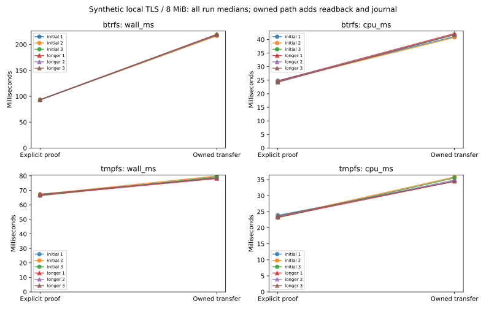

# R6.1c.2b — Owned transfer and conservative completion

Rust `transfer_owned_export` downloads into the journal-owned payload, checks its
manifest, syncs and independently rereads the container, then completes the lease
under durable intent. A failed or uncertain completion never triggers automatic
abort or retry. The successful stage remains private with an empty metadata file;
VMDK structure/logical validity, conversion and publication are later gates.
[Contract](../../durable-owned-transfer.md), [ADR-0061](../../adr/0061-owned-transfer-and-conservative-completion.md).

## Correctness and failure qualification

[Workspace](workspace-tests.txt): **690 passed, five ignored**, zero failures.
Counts exclude nested filtered child-process executions. Ignored tests are two
filesystem-specific tests and three opt-in performance matrices; this package's
matrix ran explicitly below. [All-target clippy](clippy.txt) and [formatting](fmt.txt)
pass. [Btrfs fixtures](btrfs-fault-tests.txt) pass all nine new transfer integration
tests, with the benchmark ignored; the full workspace run uses tmpfs fixtures.

Fourteen added tests, including an inert child-process helper, cover:

- Durable CompleteIntent observed before the RPC, equal byte counters, independent
  byte comparison, report privacy, empty metadata, lock release and checked cleanup.
- Payload, member-inode and marker tampering; truncated/over-budget data and bad
  manifests; no completion after failed byte verification.
- Cancellation and source drift before/after completion intent, slow writes and
  seal/intent operations, ongoing heartbeats, and draining an accepted write after
  its reply waiter is cancelled.
- Payload-write failure with a still-usable journal, bounded worker commands,
  failed completion intent/acknowledgment, server faults and lost completion replies.
  Pending completion never authorizes abort, retry or local cleanup.
- Actual SIGKILL of a child at the completion request boundary, bypassing destructors.
  Reopening retains CompleteIntent and private bytes, without restoring a lease.

An initial workspace run exposed a pre-existing slow-probe fixture race: the mock's
300 ms idle timeout coincided with the interval between its last heartbeat and
completion of an injected 1.3-second journal stall. Production reported uncertain
abort correctly. The unmodified exact rerun passed. Slow unit fixtures now use a
three-second idle window; the default mock and production timeouts/retry behavior
are unchanged. The final workspace run and [five exact repeats](slow-fixture-repeats.json)
pass. The initial failure log was overwritten during development; this paragraph
records the observation, not a retained raw failure artifact.

Faults and stalls are injected around worker commands; this does not qualify
arbitrary blocked kernel I/O, physical power cuts or controller behavior. No ESXi,
guest, real credential or private disk content was used for this package.

## Matched 8 MiB container-transfer cost

[Raw samples](measurements.json), [summary](summary.json),
[commands, binary hash, host snapshots and process CPU/RSS](environment.json),
[plot/data audit](plots/audit.json), [hardware](hardware.json).

The same release executable runs both paths against local TLS with TCP_NODELAY,
alternating per-pair order on CPU 0. Both transfer identical synthetic 8 MiB bodies
with a KDMV prefix. These fixtures are **not valid VMDKs**. The explicit proof writes
and publishes its qualification artifact. The owned path adds worker dispatch,
eight journal commits, payload sync and independent full readback, source checks,
and recovery assessment; it retains a private stage. Different guarantees mean
this measures combined lifecycle cost, not isolated fsync or readback latency.

Certificate/mock preparation, body hash construction and store opening precede the
timer. The entire API call, including the owned path's independent readback, is timed.
An additional benchmark byte comparison, allocation check and cleanup follow it.
Per-transfer CPU includes mock-server and worker threads. Whole-process CPU/RSS
includes fixture body copies, setup and cleanup; RSS is a process-lifetime peak,
not a per-operation heap profile or proof of the library's bounded buffers.

Each filesystem ran three initial rounds of eight pairs. A greater-than-5% adverse
wall/CPU comparison or between-run median spread triggers three longer rounds of
16 pairs. Both triggered: **12 runs, 144 pairs, 288 transfers**, including 144 owned
stages and 1,152 in-transfer journal commits. Separate checked cleanup adds another
288 commits. All observations are retained.

| Longer-run median of medians | Explicit proof | Owned transfer | Added cost |
|---|---:|---:|---:|
| Btrfs wall | 93.275 ms | 219.680 ms | 135.52% |
| Btrfs CPU | 24.541 ms | 41.896 ms | 70.72% |
| tmpfs wall | 67.040 ms | 78.489 ms | 17.08% |
| tmpfs CPU | 23.455 ms | 34.479 ms | 47.00% |

Separate checked cleanup medians are **38.640 ms on Btrfs** and **0.720 ms on tmpfs**.
Every payload compares byte-for-byte and allocates exactly 8,388,608 file bytes.
Allocation excludes journal/marker/directory/filesystem metadata. Every owned
cleanup reaches Cleaned; synthetic fixture paths are removed outside the API timer.
Whole-process peak RSS spans **75,052–86,200 KiB**; per-call snapshots span
64,640–86,200 KiB and include the process's prior peaks.

Longer owned run spreads are **0.42% wall / 0.85% CPU on Btrfs** and **0.63% / 1.18%
on tmpfs**. Longer proof spreads are 0.39% / 2.20% and 0.81% / 1.60%, respectively.
The repeat confirms substantial added cost; it does not explain each component.
Shared host load, powersave governor, unisolated SMT, cached reads and local TLS
scheduling limit attribution. No builds, other tests or plotting overlapped timing.
No cache flush or power cut was performed. tmpfs is volatile and successful sync
calls do not demonstrate persistent-storage durability.

Keep the durability barriers and retain journal/readback cost in PERF.0 alongside
prior stream and sparse-output findings. These small synthetic transfers cannot
establish large-image or ESXi throughput.



## Reproduction and provenance

```sh
cargo test --workspace
cargo clippy --workspace --all-targets -- -D warnings
cargo fmt --all -- --check
cargo test -p rvvdk-vsphere --test discovery --release --no-run
# Use the emitted executable and fresh output paths.
target/benchmark-plots/bin/python scripts/benchmarks/measure_owned_transfer.py \
  --binary "$DISCOVERY_TEST_BINARY" --report "$NEW_REPORT_DIRECTORY" \
  --btrfs-parent "$BTRFS_FIXTURE_PARENT" --tmpfs-parent "$TMPFS_FIXTURE_PARENT"
# Regenerate and audit plots without rerunning transfers.
target/benchmark-plots/bin/python scripts/benchmarks/measure_owned_transfer.py \
  --plot-only --report docs/benchmark-results/2026-10-02-r61c2b
```

[Final source hashes](source-hashes.json) and [artifact hashes](artifacts.json)
bind the report. The measured executable was frozen before the slow-unit-fixture
idle adjustment described above; the production paths and default benchmark mock
behavior are the same. The final source manifest includes that fixture correction.
The environment description was clarified afterward to distinguish API readback
(included) from the extra benchmark comparison (excluded); timings are unchanged.

Next **R6.1c.3** adds private artifact metadata and bounded native VMDK admission,
then confined conversion and real journal-bound publication. No logical-validation,
remote-resume or complete live-workflow qualification is claimed here.
