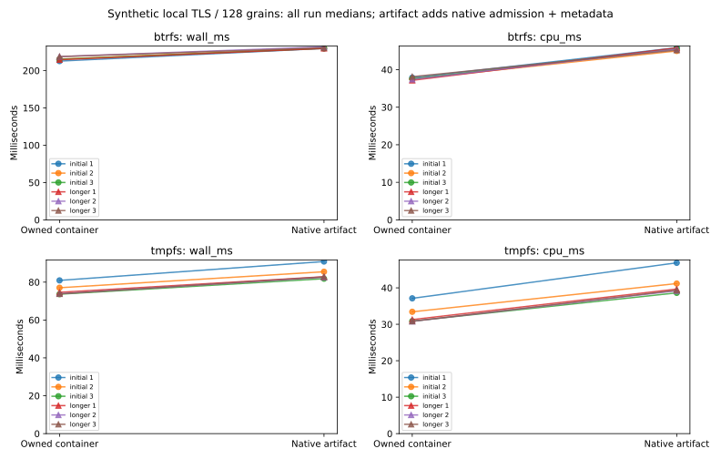

# R6.1c.3 — Private native artifact admission

`transfer_owned_artifact` validates the native stream map and every present grain,
rechecks the sealed container hash, and persists private artifact metadata before
TransferComplete. Metadata records ContainerDigestVerified; native decodability
does not imply comparison against a logical source oracle. The existing container
API remains available. Both retain a private stage for later admitted consumption.
[Contract](../../owned-artifact-admission.md), [ADR-0062](../../adr/0062-private-native-artifact-admission.md).

## Correctness and failure qualification

[Workspace](workspace-tests.txt): **701 passed, six ignored**, zero failures.
Counts exclude nested filtered subprocess executions. The ignored tests are two
filesystem-specific tests and four opt-in benchmark matrices; this package's matrix
ran explicitly below. [Strict all-target clippy](clippy.txt) and [formatting](fmt.txt)
pass. Btrfs reruns pass [seven admission unit tests](btrfs-unit-tests.txt) and
[three integration tests](btrfs-integration-tests.txt), with one benchmark ignored.
Workspace temporary fixtures use tmpfs.

Eleven added tests, including an inert crash helper, cover:

- Direct-directory/footer layouts, empty and present grains, read-only descriptor
  adoption, source/artifact/digest binding and conservative private metadata claims.
- Matching container hashes with invalid format/payload/capacity or exceeded native
  limits; changed sealed bytes, stage members and ownership marker; preservation
  of existing metadata and foreign replacement files.
- Partial metadata writes, injected errors before/after sync, readback tampering,
  cancellation before admission/between grains/after sync and expired deadlines.
  Failed admission cannot acknowledge metadata durability or advance the job.
- Actual SIGKILL during partial metadata write and after sync. Reopened records stay
  LeaseHeld and cannot authorize cleanup, regardless of whether the JSON parses.
- Real local TLS integration: metadata observed before completion, malformed native
  containers rejected after valid manifest/readback, and lost completion remaining
  CompleteIntent with no automatic abort or retry.
- A 1.3-second native-worker stall with progress heartbeats, successful completion,
  cancellation and worker failure. The coordinator drains accepted work before
  abort/return. A stalled syscall itself is not interruptible by these tests.

The shared TLS fixture now sends arbitrary binary bodies, preserving prior SOAP
and chunked-response behavior. Native fixtures reuse the independently authored
stored-DEFLATE generator from the already qualified VMDK tests, not a production
encoder. Full workspace checks retain that decoder's broader regression coverage.
Faults are injected around persistence calls; physical power-cut/controller behavior
and arbitrary blocked-kernel I/O are outside this evidence. No ESXi or guest was used.

## Matched native admission cost

[Raw samples](measurements.json), [summary](summary.json),
[commands, executable hash, host snapshots and process CPU/RSS](environment.json),
[plot/data audit](plots/audit.json), [hardware](hardware.json).

Both paths run in the same release executable against local TLS with TCP_NODELAY,
alternating order in every pair, pinned to shared CPU 0. Both perform owned transfer,
manifest checks, sync/readback, eight journal commits and conservative completion.
The artifact path additionally loads native metadata, decodes every present grain,
rehashes the container and writes/syncs/rereads the private metadata. Neither path
publishes. This measures their combined additional cost, not an isolated decoder
or sync microbenchmark.

Each fixture has 128 present 64 KiB grains (8 MiB authored logical data), encoded
with checksummed stored-DEFLATE, plus a trailing zero region up to 30 GiB logical
capacity. The container is **8,528,384 bytes**. Store opening, fixture/certificate
preparation and server body-hash construction precede timing. All API checks are
inside timing. Additional complete container comparison, independent authored-byte
comparison of every decoded present grain, two trailing-hole samples, allocation
checks and cleanup follow the timer on both paths. Native decoding during the API
checks record validity; the extra benchmark oracle comparison is separate evidence.

Per-call CPU includes mock-server and worker threads. Whole-process CPU/RSS includes
setup, extra comparisons and cleanup. Peak RSS includes retained fixture copies and
prior peaks; it is not a per-call heap profile or a buffer-bound assertion. Data and
metadata reads use ordinary caches; no cache flush was performed.

Three initial rounds of eight pairs per filesystem trigger three longer 16-pair
rounds after a greater-than-5% adverse wall/CPU comparison or between-run spread.
Both triggered: **12 runs, 144 pairs, 288 transfers**, including 144 native artifact
admissions. There are 2,304 in-transfer journal commits and another 576 cleanup
commits. All transfers pass container comparison, decoded authored-grain checks,
zero samples, report counters, final state checks and explicit checked cleanup.

| Longer-run median of medians | Owned container | Native artifact | Added cost |
|---|---:|---:|---:|
| Btrfs wall | 218.729 ms | 230.586 ms | 5.42% |
| Btrfs CPU | 37.418 ms | 45.465 ms | 21.50% |
| tmpfs wall | 73.888 ms | 82.769 ms | 12.02% |
| tmpfs CPU | 30.840 ms | 39.357 ms | 27.62% |

The native path adds **11.857 ms / 8.881 ms wall** and **8.047 ms / 8.517 ms CPU**
on Btrfs/tmpfs. Separate native-artifact cleanup medians are 38.969 ms / 0.848 ms.
Payload allocation is **8,531,968 bytes** in every case. Native metadata is 441
logical bytes; baseline metadata stays empty. Payload allocation excludes metadata,
journal, marker and directory/filesystem overhead. Every checked cleanup reaches
Cleaned and synthetic fixture directories are removed outside the timer.

Whole-process peak RSS is **55,700–69,220 KiB**; per-call snapshots span
44,280–69,220 KiB. The report stores no private artifact metadata or content hashes.
All committed identities/certificates/responses are synthetic.

Initial tmpfs spreads were 9.91% / 11.08% wall and 20.27% / 21.34% CPU for
container/artifact, so the longer repeats matter. Longer artifact spreads narrow
to **0.91% wall / 1.36% CPU on Btrfs**, **0.32% / 1.20% on tmpfs**; baseline spreads
are 2.00% / 2.63% and 1.11% / 1.55%. Initial observations remain in the plots and raw
files. Shared host load, powersave governor and unisolated SMT constrain attribution.
No builds, other tests or plots overlapped timing. These small stored-DEFLATE
fixtures do not establish large-image, compression-ratio or ESXi throughput.
tmpfs is volatile and does not demonstrate persistent-storage durability.

Keep the full validation/durability sequence and track its cumulative cost in
PERF.0. Larger representative images, native map/decode/cache controls and composed
live qualification remain later work; no barrier is removed to recover timing.



## Reproduction

```sh
cargo test --workspace
cargo clippy --workspace --all-targets -- -D warnings
cargo fmt --all -- --check
cargo test -p rvvdk-vsphere --test discovery --release --no-run
# Use the emitted executable and fresh output paths.
target/benchmark-plots/bin/python scripts/benchmarks/measure_owned_artifact.py \
  --binary "$DISCOVERY_TEST_BINARY" --report "$NEW_REPORT_DIRECTORY" \
  --btrfs-parent "$BTRFS_FIXTURE_PARENT" --tmpfs-parent "$TMPFS_FIXTURE_PARENT"
# Regenerate/audit plots without rerunning the matrix.
target/benchmark-plots/bin/python scripts/benchmarks/measure_owned_artifact.py \
  --plot-only --report docs/benchmark-results/2026-10-02-r61c3
```

[Source hashes](source-hashes.json) include native/local dependencies and fixture
sources; [artifact hashes](artifacts.json) bind this report. Next **R6.1c.4** admits
retained artifacts freshly for confined local conversion; actual publication and
composed live qualification follow. A completed metadata record cannot reopen Job,
restore a lease or authorize a local consumer by itself.
