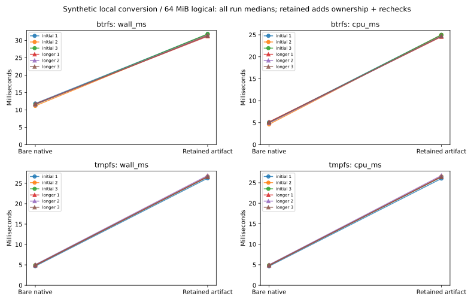

# R6.1c.4 — Retained artifact admission and local conversion

`ownership::RetainedArtifact` freshly admits a CompletedLease artifact into a
confined native source while retaining its store lock. Conversion re-admits it,
uses controlled DataMover with a caller-owned buffered RAW file, and checks source
content again after output flush. The source journal remains unchanged; destination
ownership, publication and resume are not inferred.
[Contract](../../retained-artifact-conversion.md), [ADR-0063](../../adr/0063-retained-artifact-local-conversion.md).

## Correctness and failure qualification

[Workspace](workspace-tests.txt): **711 passed, seven ignored**, zero failures.
Counts exclude nested filtered child-process executions. The ignored tests are two
filesystem-specific tests and five opt-in performance matrices; this package's
matrix ran explicitly below. [All-target clippy](clippy.txt) and [formatting](fmt.txt)
pass. Btrfs reruns pass [nine retained-artifact unit tests](btrfs-retained-tests.txt)
and [one transfer/conversion integration test](btrfs-integration-tests.txt). Workspace
fixtures use tmpfs. The ten new tests include one inert crash entry point.

Coverage includes:

- Lock retention through admission, single/concurrent-worker conversion, output
  flush and final checks; source journal byte preservation and separate explicit
  cleanup after releasing the capability. Complete logical output matches authored
  bytes, including replacing dirty destination bytes in a logical zero range.
- Pending transactions, uncertain journal state, wrong source/store, corrupt records,
  stale hashes, invalid native content/capacity despite forged verified claims,
  unknown metadata fields, wrong IDs, over-budget metadata, changed ownership marker,
  replaced/symlinked/hardlinked members and preservation of foreign resources.
- Every serialized validation claim still undergoing fresh checks. Changes after
  initial admission fail before destination writes. Source alias, insufficient copy
  budget and short destination preserve an existing destination sentinel.
- Cancellation at preparation, transfer and flush, expired admission deadline and
  source mutation after engine flush. Wrapper success is rejected even if the engine
  has already emitted Completed; callers must await the returned Result.
- Actual SIGKILL during conversion. The lock is released, source journal is unchanged
  CompletedLease, output remains caller-owned/possibly partial, and a new explicit
  source admission succeeds without recreating Job or a remote capability.
- Synthetic local TLS export through private artifact metadata, followed by fresh
  retained admission and RAW conversion with complete logical byte comparison.

Fault/process tests do not claim physical power-cut/controller qualification or
forced cancellation of blocked kernel I/O. Advisory-lock cooperation, private store
and trusted ancestors remain required. No ESXi host, guest, credential or private
image was used. Authored fixtures reuse the independently written stored-DEFLATE
fixture generator; production conversion remains Rust.

## Matched local conversion cost

[Raw samples](measurements.json), [summary and phase medians](summary.json),
[commands, executable hash, host snapshots and CPU/RSS](environment.json),
[plot/data audit](plots/audit.json), [hardware](hardware.json).

Both paths run in the same release executable, alternating each pair's order on
shared CPU 0. A fixture has **64 MiB logical capacity**, 128 present 64 KiB grains
(8 MiB authored data) across two grain-table groups, and 56 MiB structural zeros.
Its encoded size is **8,527,360 bytes**. Both paths use identical CopyOptions and
controlled portable DataMover and include destination flush and source release.

The baseline opens the container, loads StreamDisk metadata and converts it. The
retained path opens the admitted capability, then calls convert_to: it performs
native grain validation and container hashing on open, repeats admission before
copy, and hashes the container again after flush. This includes two additional
present-grain validation passes and three container hash passes over the baseline,
as well as ownership/metadata checks. It measures their combined cost, not isolated
lock, hash or decoder overhead. Both leave caller-owned RAW output unpublished.

Private store/stage/journal setup, fixture construction/sync, destination creation
and sizing precede the timer. Store opening precedes timing on the retained path;
baseline source-file opening is timed. Complete independent logical byte comparison,
encoded source comparison, allocation checks and explicit checked source cleanup
follow timing on both paths. Initial admission is measured separately; conversion
phase includes re-admission, copy, final checks and source/store release. Separately
computed medians need not sum exactly to the total median.

Per-call CPU includes worker threads; whole-process CPU/RSS also includes fixture
construction, journal setup, independent checks and cleanup. RSS is process-lifetime
peak, not a per-operation heap profile. Ordinary caches are used, with no cache flush.
No builds, other tests or plotting overlapped the timed matrix.

Three initial eight-pair rounds per filesystem trigger three longer 16-pair rounds
when an adverse wall/CPU comparison or between-run median spread exceeds 5%. Both
triggered: **12 runs, 144 pairs, 288 conversions**. Every conversion passed complete
64 MiB logical comparison (18 GiB total), encoded source comparison, unchanged
CompletedLease/sequence checks and explicit cleanup to Cleaned. Timing excludes the
fixture journal's setup/cleanup commits; admission/conversion makes no journal writes.

| Longer-run median of medians | Bare native | Retained artifact | Added cost |
|---|---:|---:|---:|
| Btrfs wall | 11.643 ms | 31.354 ms | 169.31% |
| Btrfs CPU | 5.084 ms | 24.690 ms | 385.68% |
| tmpfs wall | 4.973 ms | 26.625 ms | 435.36% |
| tmpfs CPU | 4.919 ms | 26.487 ms | 438.46% |

Additional wall time is **19.712 ms on Btrfs / 21.652 ms on tmpfs**; additional CPU
is 19.606 / 21.568 ms. Retained admission medians are **7.628 / 8.726 ms**, with the
remaining conversion-phase medians **23.829 / 17.926 ms**. This is substantial
revalidation cost, not a performance improvement. Preserve it in PERF.0 and profile
larger representative workloads before proposing any change to trust/lifetime rules.

All outputs allocate exactly **8,388,608 bytes** for 64 MiB logical capacity. Encoded
sources allocate **8,527,872 bytes**. Each copy reports 8 MiB read/written plus 56 MiB
zeroed. Allocation excludes metadata, journal, directory and filesystem overhead.
All newly created benchmark fixture trees were removed after checked cleanup.
Whole-process peak RSS spans **30,936–32,248 KiB**; per-call snapshots span
23,588–32,096 KiB and include earlier peaks in the process.

Longer retained spreads are **0.99% wall / 0.72% CPU on Btrfs** and **1.11% / 1.19%
on tmpfs**. Baseline spreads are 1.16% / **5.44%** and 3.78% / 3.24%. The Btrfs
baseline CPU spread remains above 5% after repeats and is retained, not hidden.
Initial Btrfs baseline spread was 6.07% wall / 10.26% CPU. Shared load, powersave
and unisolated SMT constrain attribution. These small stored-DEFLATE fixtures do
not establish ESXi throughput or broad compression/layout performance. tmpfs is
volatile and cannot qualify persistent-storage durability.



## Reproduction

```sh
cargo test --workspace
cargo clippy --workspace --all-targets -- -D warnings
cargo fmt --all -- --check
cargo test -p rvvdk-vsphere --lib --release --no-run
# Use the emitted library-test executable and fresh output paths.
target/benchmark-plots/bin/python scripts/benchmarks/measure_retained_conversion.py \
  --binary "$VSPHERE_TEST_BINARY" --report "$NEW_REPORT_DIRECTORY" \
  --btrfs-parent "$BTRFS_FIXTURE_PARENT" --tmpfs-parent "$TMPFS_FIXTURE_PARENT"
# Regenerate/audit plots without repeating conversion.
target/benchmark-plots/bin/python scripts/benchmarks/measure_retained_conversion.py \
  --plot-only --report docs/benchmark-results/2026-10-02-r61c4
```

[Source hashes](source-hashes.json) and [artifact hashes](artifacts.json) bind the
report. Next **R6.1c.5** defines actual output ownership and no-replace durable
publication, followed by composed live qualification. No guest or journal metadata
is committed with these synthetic timing results.
