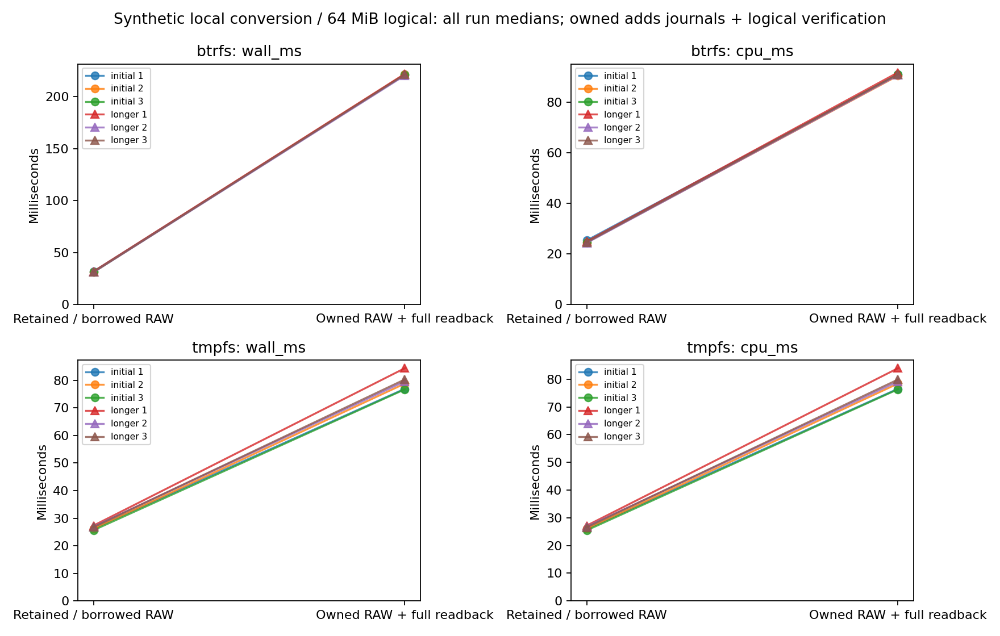

# R6.1c.5a — Private owned RAW output and full logical verification

A separate private output journal now owns RAW creation, conversion, complete logical
readback and durable metadata while retaining the source store lock. The source
journal remains unchanged. Output is retained privately; actual no-replace publication,
output cleanup and restart remain R6.1c.5b work. No ESXi or guest operation was used.

[Contract](../../owned-raw-output.md), [ADR-0064](../../adr/0064-private-owned-raw-output.md).

## Correctness and failure qualification

[Workspace](workspace-tests.txt): **719 passed, eight ignored**, zero failures.
Totals exclude nested filtered child executions. Ignored tests are two filesystem
checks and six opt-in benchmark matrices; this package's matrix ran explicitly below.
[All-target clippy](clippy.txt), [formatting](fmt.txt) and [Btrfs output tests](btrfs-output-tests.txt)
pass. Workspace fixtures use tmpfs. Eight added tests include one inert crash helper;
the existing synthetic TLS transfer/conversion test also exercises owned output.

Coverage includes:

- Complete RAW byte equality against independently authored expected bytes, including
  zeros, private member permissions, RAW digest/metadata agreement, source journal
  preservation, lock exclusion, single/concurrent copy workers and reserved IDs.
- **35 journal fault combinations**: partial write, full write, file sync, rename and
  directory-sync acknowledgment at each of seven states. Uncertain writes return
  failure; surviving durable prefixes and pending transactions are assessed without
  continuing mutations or granting recovery authority.
- Cancellation during staging, after copy drain, during verification and after
  metadata sync; initial cancellation, deadline expiry and cancellation at engine
  Completed. Engine flush is insufficient for wrapper success.
- Changed RAW bytes/length, foreign replacement inode, changed marker, occupied or
  changed metadata; foreign content is retained. Bad checksums, unknown version,
  inconsistent sequence/source binding, public journal permissions and transaction
  collisions fail closed.
- Interrupted stage creation/durability, copy drain, verification chunks and partial/
  full/synced metadata; all stages remain. SIGKILL during stage creation, actual copy,
  partial metadata and Verified record rename leaves the expected observed prefix,
  unchanged source journal and no reconstructed mutating capability.
- Synthetic TLS export through native artifact admission, retained conversion and
  owned RAW conversion, with complete independent 8 MiB logical oracle comparisons.

Hooks inject failures at persistence boundaries; they do not reproduce every kernel
short-write/fsync failure or physical power loss. SIGKILL releases the process lock
but does not test controller caches. Advisory lock cooperation, private local store
and trusted ancestors remain required. Metadata hashes are consistency evidence,
not authentication or offline rollback protection. tmpfs is volatile.

## Matched complete-operation timing

[Raw samples](measurements.json), [summary and phase medians](summary.json),
[commands, executable hash, load/frequency snapshots and process CPU/RSS](environment.json),
[hardware](hardware.json), [plot audit](plots/audit.json).

Both paths use the same frozen release executable, alternating order within each
pair, pinned to shared CPU 0 with powersave and unisolated SMT. The authored fixture
has **64 MiB logical capacity**, 128 present 64 KiB stored-DEFLATE grains across two
table groups (**8 MiB data**) and 56 MiB zeros; encoded size is **8,527,360 bytes**.
Ordinary caches are used; no build, tests or plotting overlap the timing matrix.

The baseline admits RetainedArtifact and calls convert_to into a caller-owned RAW
file. The owned path also admits RetainedArtifact, then includes private stage/file
creation, seven output journal commits, conversion, complete source/output logical
readback, RAW SHA-256, another encoded source recheck and metadata sync/readback.
Both include source admission, conversion re-admission, copy/flush, final source
checks and all source/destination handle releases. Their guarantees differ; this
comparison measures the aggregate added work, not an isolated decoder or fsync cost.

Source fixture/journal preparation and store lock acquisition precede both timers.
Baseline destination creation/sizing precedes its timer; owned destination preparation
is timed because it is part of the durable operation. Complete independent logical
comparison, encoded source comparison, source journal comparison, allocation checks
and synthetic fixture-tree deletion follow timing. Fixture deletion is test-only;
there is no production output cleanup API in this package.

Per-call CPU includes worker threads. Process CPU/RSS also includes fixture setup,
oracle checks and test cleanup. RSS is process-lifetime high water, not an operation
allocation profile. Verification uses two fixed 1 MiB buffers separately from copy
payload and native-map limits. Initial admission is timed separately; the remaining
phase includes conversion and all owned output checks/journals. Medians do not
necessarily sum exactly. Neither path publishes output or contacts a live host.

Three initial eight-pair rounds per filesystem trigger three longer 16-pair rounds
when adverse wall/CPU comparisons or between-run median spread exceed 5%. Both
triggered: **12 runs, 144 pairs, 288 conversions**, all retained. Independent oracle
comparisons cover **18 GiB** total; owned in-timer logical readback covers another
9 GiB. All encoded source bytes and source journals remain unchanged.

| Longer-run median of medians | Retained / borrowed RAW | Owned RAW + full readback | Added cost |
|---|---:|---:|---:|
| Btrfs wall | 31.421 ms | 221.464 ms | 604.84% |
| Btrfs CPU | 24.691 ms | 91.129 ms | 269.07% |
| tmpfs wall | 26.909 ms | 80.366 ms | 198.66% |
| tmpfs CPU | 26.765 ms | 79.921 ms | 198.60% |

Additional wall time is **190.044 ms on Btrfs / 53.457 ms on tmpfs**. Owned initial
admission medians are **7.785 / 8.666 ms**; the remaining operation phase is
**213.877 / 71.455 ms**. Full logical verification scales with logical capacity, not
present-data size. Seven journal commits and output preparation add durability work.
This matrix does not isolate their individual costs; phase profiling is a PERF.0
follow-up before proposing changes to barriers, hashes or lifetime rules.

All RAW outputs allocate **8,388,608 bytes**, preserving sparse-zero savings. Source
allocation is **8,527,872 bytes**; owned output metadata is **607 bytes**. These values
exclude journal/marker/directory allocation. Process peak RSS across samples is
**24,204–32,900 KiB**. Each owned call acknowledges seven output journal commits;
source setup commits and test cleanup are excluded from timing.

Longer Btrfs run-median spread is at most **2.46%**; longer tmpfs owned wall/CPU spread
remains **6.00% / 6.05%**, despite repeats. Keep all observations and the environment
snapshots. The regression reflects additional guarantees and remains an explicit
performance issue; it is not a speedup or evidence that tuning is complete. Keep
PERF.0's existing storage/layout, stream/map/cache, CPU/SMT/frequency and cumulative
admission/hash work open alongside this full-readback/journal cost.



[Standalone SVG](plots/owned-output.svg).

## Reproduction and integrity

Build the vsphere library test executable in release mode and freeze the resulting
`rvvdk_vsphere` executable. The exact measured binary hash and all commands are in
[environment.json](environment.json); the build log is [build.txt](build.txt).

```sh
cargo test -p rvvdk-vsphere --lib --release --no-run --message-format=json
target/benchmark-plots/bin/python scripts/benchmarks/measure_owned_output.py \
  --binary "$PWD/target/r61c5a/reference/vsphere" \
  --report target/r61c5a-reproduction \
  --btrfs-parent "$PWD/target/r61c5a/bench" \
  --tmpfs-parent /tmp/rvddk-r61c5a-bench
```

Use a new report directory and a Python environment containing matplotlib. The
runner verifies filesystem type, alternates sample order, saves all raw rows and
process metrics, repeats qualifying comparisons and audits plots against samples.
The ignored Rust benchmark performs all VMware/native conversion work. Python only
orchestrates offline runs and plots results.

[Source hashes](source-hashes.json) bind measured Rust/configuration and runner
inputs; [artifact manifest](artifacts.json) hashes every report file except itself.
The ignored target contains the frozen executable; no executable, credentials,
private content digest, host endpoint or guest identity is committed.
