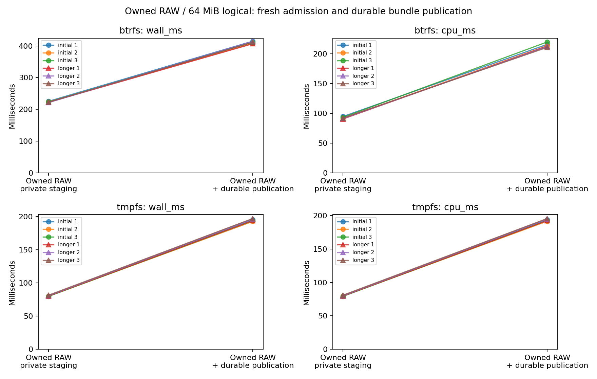
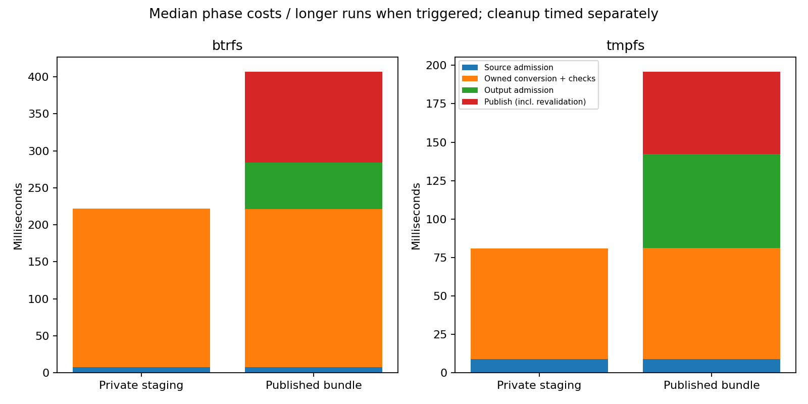

# R6.1c.5b — Durable RAW bundle publication and explicit checked cleanup

VerifiedOutput freshly admits source and RAW content before atomic whole-bundle
RENAME_NOREPLACE publication into a locked private destination outside the store.
Publication revalidates bytes, syncs members, journals intent, renames, syncs both
parents and acknowledges Published. Explicit cleanup supports checked partial
removal; uncertain publication, pending transactions and unstamped stages remain
blocked. Source journals stay unchanged. No ESXi or guest operation was used.

[Contract](../../durable-output-publication.md),
[ADR-0065](../../adr/0065-durable-raw-bundle-publication.md).

## Correctness and fault qualification

[Workspace](workspace-tests.txt): **730 passed, nine ignored**, zero failures.
Totals exclude nested filtered child executions. Ignored tests are two filesystem
checks and seven opt-in benchmark matrices; this package's matrix ran explicitly.
[All-target clippy](clippy.txt), [formatting](fmt.txt) and
[Btrfs output tests](btrfs-output-tests.txt) pass. Btrfs reruns cover all 19 output
tests, including the previous eight. Workspace fixtures use tmpfs.

Eleven added tests include an inert crash helper and cover:

- Canonical version-1 compatibility, version/state gates, explicit bindings, source
  availability, metadata/RAW changes, forged RAW hash claims, unknown members,
  symlinks, hardlinks, pending transactions and stale capability content.
- Atomic movement of RAW/metadata/marker with inode preservation, independent full
  authored-byte comparison, source journal preservation, store/destination lock
  exclusion and separately requested source/output cleanup.
- Private destination permissions, ancestry exclusion, cross-filesystem rejection,
  wrong destination binding and file/directory/symlink collisions. A target created
  immediately before the rename remains untouched and leaves PublishIntent.
- Ten publication journal faults across intent/acknowledgment: partial/full write,
  file sync, rename and directory-sync acknowledgment. A renamed record may be
  observed without the operation having succeeded; pending transactions block actions.
- Member/bundle sync, pre/post-rename and both parent-sync boundaries; cancellation
  before and after rename and source-member replacement before publication. A renamed
  bundle is never automatically rolled back or deleted after failure.
- Cleanup from five stamped private states, Published and partial CleanupIntent;
  refusal of unstamped/uncertain states. Twelve removal/sync failure combinations
  across private/published cleanup and eight cleanup journal boundary faults.
  Unknown/replaced members are preserved; cancellation retains a recoverable intent.
- Actual SIGKILL before rename, after rename, after each parent sync, after RAW unlink
  and after directory removal. Assessment never replays publication. Explicit cleanup
  can finish checked partial removal and syncs the parent even if the directory is
  already absent before acknowledging Cleaned.

The existing synthetic TLS integration now exercises export, native admission,
owned conversion, fresh output admission, actual publication, complete 8 MiB logical
comparison against authored bytes, and explicit output cleanup. Independent expected
bytes qualify the output; production admission/verification shares the native decoder.

Fault hooks inject failure at persistence boundaries; they do not emulate all kernel
short-write/fsync errors or physical storage-controller failure. SIGKILL is process
loss, not power loss. Advisory-lock cooperation, trusted stable ancestors and private
local storage remain required. tmpfs is volatile. General uncertain-publication and
transaction reconciliation are outside this package's explicit cleanup subset.

## Complete-operation benchmark

[Raw samples](measurements.json), [summary/phase medians](summary.json),
[commands, executable hash, frequency/load snapshots and process CPU/RSS](environment.json),
[hardware](hardware.json), [plot audit](plots/audit.json).

Both paths use the same frozen release executable, alternating order within each
pair, on shared CPU 0 with powersave and unisolated SMT. Ordinary caches are used;
no builds, tests or plotting overlap timing. The fixture has **64 MiB logical capacity**,
128 present 64 KiB stored-DEFLATE grains across two table groups (**8 MiB data**),
56 MiB zeros and **8,527,360 encoded bytes**.

Both paths freshly admit RetainedArtifact and convert_owned, including private stage
creation, seven output journal commits, copy/flush, source rechecks, complete logical
readback, RAW hashing and durable output metadata. The baseline stops at Verified
private staging. The published path then opens VerifiedOutput, re-admitting source
and checking all RAW/source bytes, and publishes after another full verification,
member/bundle syncs, two journal commits, atomic rename and both parent syncs.
Thus their guarantees differ. This is the aggregate cost of publication capability
admission and durable publication, not a comparison with bare rename.

Source fixture/journal preparation, destination directory creation and initial locks
precede timing. Reopening the source store for VerifiedOutput is timed. Both release
source/output/destination capabilities before the main timer ends. Full independent
logical comparison, encoded source comparison, unchanged-source-journal comparison
and allocation checks follow timing. Explicit checked output cleanup is timed
separately after these checks, excluding lock acquisition; both modes include two
cleanup commits and reach Cleaned. Remaining synthetic source fixtures are removed
by test infrastructure outside timing. No remote operation is measured.

Per-call CPU includes workers; whole-process CPU/RSS includes fixtures, oracle and
cleanup. RSS is process-lifetime peak, not a per-operation heap profile. Verification
uses two fixed 1 MiB buffers plus separately bounded native/copy memory. Admission,
conversion, publication admission, publication and cleanup phases are retained;
publication itself includes revalidation. Phase medians need not sum to the total.

Three initial eight-pair rounds per filesystem trigger three longer 16-pair rounds
if the adverse whole-operation wall/CPU comparison or run-median spread exceeds 5%.
Both triggered: **12 runs, 144 pairs, 288 conversions and explicit cleanups**. All
independent full logical comparisons pass (**18 GiB** total). In-timer logical
verification scans 36 GiB: one 64 MiB pass per baseline, three per published call.
All encoded source and source journal comparisons pass; cleanup reaches Cleaned in
both modes. Output IDs remain reserved in the terminal journals.

| Longer-run median of medians | Owned RAW / private staging | Owned RAW + publication | Added cost |
|---|---:|---:|---:|
| Btrfs wall | 222.060 ms | 411.462 ms | 85.29% |
| Btrfs CPU | 91.080 ms | 212.218 ms | 133.00% |
| tmpfs wall | 80.584 ms | 196.393 ms | 143.71% |
| tmpfs CPU | 80.062 ms | 195.206 ms | 143.82% |

Added wall time is **189.401 ms on Btrfs / 115.809 ms on tmpfs**. The added output
admission phase is **63.010 / 61.158 ms** and publication (including revalidation)
is **122.360 / 53.315 ms**. This isolates call phases, not individual syscalls or
hash/decode costs. Repeated verification is substantial O(logical-capacity) work.
Keep PERF.0 open; any reduction requires an explicit lifetime/trust argument and
matching fault tests, not skipping durability or validation to improve the graph.

Separately timed cleanup wall medians are **39.979 → 41.608 ms on Btrfs** and
**0.763 → 0.834 ms on tmpfs**, private versus published. Cleanup CPU medians are
**2.754 → 4.432 ms** and **0.753 → 0.819 ms**, respectively. These are outside the
main wall/CPU table. Publication cleanup validates the separately locked destination
and its ancestors in addition to local resource checks/removal.

All RAW outputs allocate **8,388,608 bytes**, including after rename. Source allocation
is **8,527,872 bytes** and output metadata is **607 bytes**. These exclude journal,
marker and directory allocations. Process peak RSS ranges **26,332–32,084 KiB**.
Main timing includes seven output commits for staging or nine for published output;
cleanup adds two separately timed commits. Source setup commits are excluded.

Whole-operation longer-run spreads are below **1.87%**, and publication phase spreads
below **1.27%**. Cleanup still varies after repeats: Btrfs private/published CPU
spread **6.78% / 20.41%**; tmpfs private wall/CPU **8.05% / 7.91%**, published wall/CPU
**5.58% / 5.64%**. Preserve these observations and all samples; the small cleanup
CPU figures are not cleared as stable. Prior stream/layout/flush, map/cache,
CPU/SMT/frequency and cumulative verification work remains in PERF.0.





Standalone SVGs: [whole operation](plots/publication.svg), [phases](plots/publication-phases.svg).

## Reproduction and integrity

Build the vsphere library test executable in release mode and freeze the resulting
`rvvdk_vsphere` executable. [build.txt](build.txt) records compilation;
[environment.json](environment.json) records its exact hash and all timed commands.

```sh
cargo test -p rvvdk-vsphere --lib --release --no-run --message-format=json
target/benchmark-plots/bin/python scripts/benchmarks/measure_publication.py \
  --binary "$PWD/target/r61c5b/reference/vsphere" \
  --report target/r61c5b-reproduction \
  --btrfs-parent "$PWD/target/r61c5b/bench" \
  --tmpfs-parent /tmp/rvddk-r61c5b-bench
```

Use a fresh report directory and a Python environment with matplotlib. Python only
orchestrates offline execution, audits and plots; VMware/native conversion and
publication are Rust. The runner checks filesystem type, alternates pairs, retains
raw rows/process metrics, repeats qualifying observations and audits plots.

[Source hashes](source-hashes.json) bind measured implementation/configuration and
runner inputs; [artifact manifest](artifacts.json) hashes all report files except
itself. The ignored target contains the frozen binary. No executable, credentials,
private source image hash, real host endpoint or guest identity is committed.
