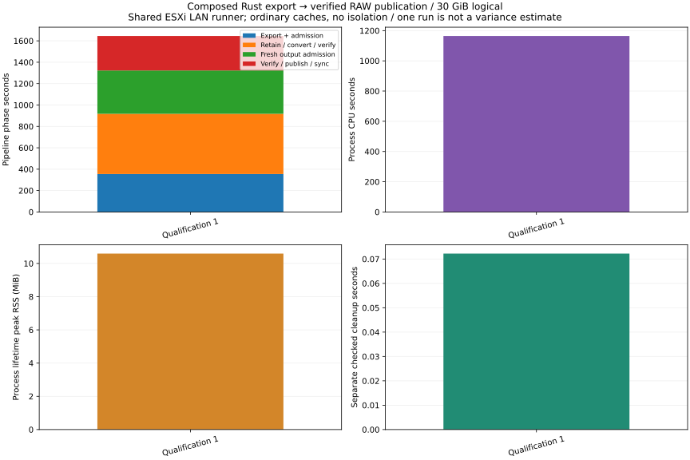
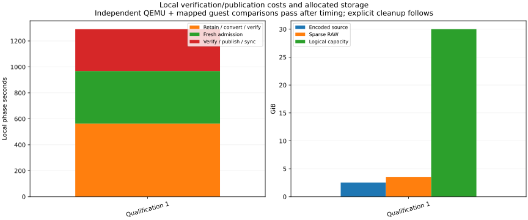

# R6.1c.5c — composed Rust pipeline on the authorized ESXi LAN

This records one complete live qualification observation: explicit powered-off selection → owned
HTTP NFC export → fresh retained admission → owned sparse RAW → fresh verification →
atomic durable publication → independent comparisons → separate checked cleanup.
It is not a matched speedup/regression against older export-only or local fixtures.

## Observed result

**One complete live run passed**, including manifest/container/native checks,
Complete/Logout, owned RAW verification, no-replace publication and both directory
syncs. QEMU independently compared all 30 GiB of logical content; the separately
mapped 8 MiB guest fixture matched. Explicit output/source cleanup passed and kept
two Cleaned journals. [Raw sanitized observation](run-1.json),
[QEMU result](qemu-compare.txt), [pre/postflight checks](lab-checks.json),
[computed values](summary.json).

| Measurement | Observed value |
|---|---:|
| Whole pipeline | 1645.252 s (27.42 min) |
| Export, artifact admission, Complete/Logout | 354.645 s |
| Retained admission, conversion and RAW verification | 563.046 s |
| Fresh publication admission | 405.367 s |
| Publication, including full revalidation and sync | 322.192 s |
| Pipeline process CPU | 1164.358 s |
| Pipeline lifetime peak RSS | 10.594 MiB |
| Encoded source / allocated source | 2,727,380,992 / 2,727,383,040 bytes |
| RAW logical / allocated | 30 GiB / 3.497 GiB |
| Separate QEMU comparison | 50.745 s |
| Separate checked cleanup wall / CPU | 72.228 / 46.183 ms |

Local admission/conversion/verification/publication totals
1290.604 s,
about 78.4% of pipeline wall time.
The current architecture performs three full logical source/RAW comparisons and RAW
hash passes, plus repeated encoded/native admission. Their individual CPU/IO costs
are not isolated by this run. The next **R6.1c.5p** package will repeat and profile
these costs before proposing tuning; no verification or durability gate was removed.

Final Rust inventory/inspection confirms the same explicit source binding, source
powered off, runner powered on, no recent tasks and successful Logout. Checked cleanup
returned available runner space to 7,965,962,240 bytes. No images or unfamiliar job
resources were deleted outside this run's checked cleanup capability.



[PNG](plots/pipeline.png).



[PNG](plots/local-and-allocation.png).

## Provenance and conditions

Parent commit `3178b2e`, plus the exact [Rust source manifest](source-hashes.json).
The immutable [release binary hashes](binary.json) distinguish the canceled pilot
from the final runner (which adds an explicit aborted-source cleanup command).
The source manifest covers the final runner; a separate pilot example source snapshot
was not retained. Its binary is preserved privately and its hash is recorded; the
pilot is used only for lifecycle evidence, not timing comparisons.
[Environment](environment.json): ESXi 8.0.3/build 24677879, one powered-off 30 GiB VM,
no snapshot; an already-authorized powered-on Fedora VM is the LAN runner. Its one
vCPU exposes Xeon Silver 4116, about 2 GiB RAM, kernel 6.19.10 and XFS. QEMU 10.2.2
provides independent VMDK decoding. No VM power changes were requested or performed.
Fresh TLS identity matched the previously recorded exact pin. Commercial license
edition was observed; successful exports demonstrate capability for these runs,
without claiming license expiry/assignment from edition enumeration alone.

Shared-host CPU, storage, network and caches are uncontrolled. No cache drops,
frequency/SMT isolation or concurrent build/test/plot work. Only one artifact/output
pair is present at a time; explicit checked cleanup frees it before the next run.
Before the first run, the runner had about 7.96 GB free. Source and output must fit
together; no second complete RAW is created for independent comparison.

## Method and timing boundaries

The actual host identity/configuration, VM/disk identities, private metadata,
image/fixture hashes, journals and images stay outside Git. Passwords are entered
through the Rust runner's non-echoing terminal prompt and never saved in config,
arguments or environment. Rust implements VMware access and the entire disk path.
Python is used only for JSON measurement orchestration, the existing offline
known-byte comparison and plotting.

The pipeline's `data.elapsed_ms` excludes password entry and includes all awaited
export/local work. Runner process CPU spans the command after configuration and
includes the prompt wait's negligible CPU; RSS is the lifetime peak. Outer runner
wall time includes password entry and is retained but **not** used as pipeline time.
`export_ms` includes discovery/binding checks, lease/download/manifest, file sync,
independent encoded readback, native present-grain validation and complete/logout.
It does not isolate network transfer. `conversion_ms` includes fresh source admission,
owned RAW creation, conversion/flush, full logical readback and metadata/journal work.
`publication_admission_ms` freshly verifies source and output again;
`publication_ms` includes another verification plus bundle sync, intent, no-replace
rename, both parent syncs and durable acknowledgment.

After timing, each run uses `qemu-img compare -f vmdk -F raw SOURCE RAW` for full
logical equality with an independent decoder. The existing
`verify_guest_fixture.py RAW PRIVATE_MAP PRIVATE_FIXTURE` also verifies the guest's
independently mapped 8 MiB known-byte fixture. This second check proves only the
mapped fixture; QEMU comparison provides whole-disk logical equivalence. Allocation
is `st_blocks * 512`, logical capacity is `st_size`. The published bundle contains
exactly RAW, metadata and owner marker; journals are CompletedLease / Published.
Only after comparisons pass does the explicit Rust `cleanup` command remove this
run's checked output and source, preserving both Cleaned journals. Cleanup wall/CPU
is recorded separately; it includes command startup/configuration/lock acquisition.

This implementation package is bounded to one complete live observation plus the
separate cancellation pilot. Full verification on this one-vCPU guest is substantial;
this single observation is **not a variance estimate or performance clearance**.
No matched before/after comparison exists, so no speedup/regression is claimed.
The next performance package will retain at least three comparable observations;
any initial phase/wall/CPU/cleanup spread `100 * (max/min - 1)` above 5% requires three
further observations. Keep groups and all raw samples; do not infer confidence from
repeats or drop slow results. The plotter supports both bounded and repeated series.

Reproduce figures from saved sanitized evidence (no live access needed):

```sh
target/benchmark-plots/bin/python scripts/vsphere/plot_pipeline.py docs/benchmark-results/2026-10-02-r61c5c
```

The generator checks nested success/recovery states, byte counts, comparison and
cleanup evidence before rendering. [Plot audit](plots/audit.json) records generator,
inputs and artifact hashes. Live reproduction additionally requires explicit private
selection/configuration and independently obtained guest fixture/map; the committed
records are intentionally insufficient to reconstruct private lab identities.

## Cancellation and test evidence

A separate workstation-link pilot was deliberately canceled with Ctrl-C after
312,285,099 received bytes. The awaited report confirms `Cancelled`, Abort and Logout
acknowledgments and an AbortedLease journal. No conversion/publication started.
The final runner's explicit `cleanup-aborted` removed the checked partial source and
retained its Cleaned journal. [Full sanitized cancellation evidence](cancellation-pilot.json).
This pilot is a lifecycle check, not a LAN throughput sample.

Test logs retain their output with trailing whitespace trimmed only.
Workspace: **735 passed, nine ignored**, [final log](workspace-tests.txt), clean
[Clippy](clippy.txt), [formatting](fmt.txt) and [release build](build.txt).
Five new pipeline tests exercise full synthetic logical bytes, explicit cleanup,
collisions before/after export, cancellation, local failure/deadline, uncertain
remote completion and store-path substitution. They also pass with Btrfs temporary
storage ([log](btrfs-pipeline-tests.txt)). Existing publication crash/fault tests run
in the workspace suite.

One repeated workspace run hit the existing transfer test's Abort-versus-Unconfirmed
assertion ([retained failure](workspace-tests-first-repeat-failure.txt)). The
[focused rerun](transfer-recheck.txt) and complete workspace rerun passed. The mock's
300 ms I/O timeouts are a possible load-sensitive cause, **not a proven diagnosis**;
no production timeout or test assertion was weakened. Keep this failure visible if
it recurs.

Production recovery remains open: uncertain publication, pending transactions,
unstamped stages and remote outcome reconciliation gain no new authority here.
[Contract](../../composed-export-pipeline.md), [ADR](../../adr/0066-awaited-export-pipeline.md).
