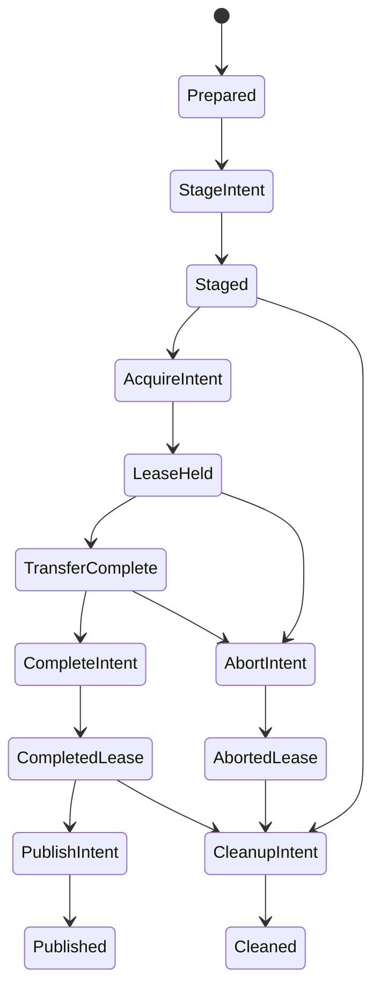

# Durable job ownership (R6.1b)

Linux `rvvdk_vsphere::ownership` separates a private job journal from R6.1a's
untrusted artifact claims. It implements local persistence, resource ownership,
crash assessment and bounded cleanup. No method contacts VMware, resumes a stream,
aborts a remote lease or publishes an artifact. Those actions remain under the
future integrated workflow's control.

## Store and operation ownership

The caller provisions a durable local directory with trusted ancestors, owned by
the effective UID and inaccessible to group/other users. `JobStore::open` refuses
a symlink at the directory entry and holds a nonblocking exclusive `flock` on the
directory inode. All cooperating writers use that lock. It is released explicitly
when the store drops; files and resources are not automatically removed. Store-wide serialization is
intentional for the initial single-workflow scope; parallel job scheduling is not
qualified by this package.

`create` requires an explicit artifact ID and `SourceSelection`. A new random
16-byte operation ID comes from `getrandom`, with no timestamp/PID fallback. The
record binds the source fingerprint, artifact/operation IDs and store device/inode.
Both an existing job and a surviving transaction refuse another creation with
the same artifact ID. Terminal records remain as tombstones. No unbounded scan or
in-memory list of jobs is required; retention policy is future work.

Each JSON envelope is at most 8 KiB before deserialization and has fixed fields,
fixed-size IDs and arrays, strict version/field/state/sequence checks, and a
SHA-256 checksum over canonical serialized record fields. The checksum detects
corruption; it is not an authentication signature. Runtime endpoint/name strings,
credentials, cookies, ticket URLs and usable lease handles are absent. Source and
lease fingerprints are still private, correlatable data and do not belong in logs.

## Durable ordering

A record update creates `txn-<artifact-id>.json` exclusively with private mode,
writes it fully, syncs the file, renames it to `job-<artifact-id>.json`, and syncs
the store directory. The initial rename refuses replacement. Subsequent updates
hold the same store lock. A failed update returns `Uncertain` and blocks further
mutation through that store handle. Recovery reads the committed old or new
record; a leftover transaction is never replayed or removed automatically.

The caller must wait for a successful intent commit before performing an external
operation. For example, `begin_acquire` must finish before `ExportVm`; the actual
lease capability stays with that live invocation. `acknowledge_lease` records only
a fingerprint after the caller has received the lease. A crash between those
steps leaves `AcquireIntent`, regardless of whether the server acted.

Transitions are forward-only. Acquisition, completion, abort and publication have
separate durable intent/acknowledgment states. Acknowledgments record the live
caller's observation; the journal does not independently perform or prove an RPC,
content verification or filesystem publication. It cannot complete an uncertain
release by blindly issuing the other operation.

## Local resources and cleanup

`prepare_stage` persists `StageIntent`, exclusively creates a private directory
named from the random operation ID and fixed members `disk-1.vmdk`, `manifest.json`
and `owner`, then syncs those files, the stage and store. The owner marker contains
the operation ID. Only afterward does `Staged` record directory/member device and
inode identities. A failed preparation leaves unknown resources for inspection;
the name alone never supplies cleanup authority.

A fresh `Job` can return handles to its payload and metadata members after checking
their identities. These are ordinary file handles: the caller must coordinate and
close outstanding writers, validate bytes and perform payload durability before
claiming transfer/publication. The journal itself does not freeze content or revoke
returned handles. R6.1c must implement that coordination.

`cleanup_local` requires the expected operation and source, an admitted store
record with no pending transaction, and an eligible state. Before acquisition or
after an acknowledged completion/abort, it freshly checks the stage and all known
members, private ownership/modes, single-link regular files, inode identities and
the marker. Symlinks, replacement files/directories, hardlinks and marker mismatch
are refused. It commits `CleanupIntent` before deletion, unlinks only those three
members, syncs the stage, removes the directory nonrecursively, syncs its parent,
then commits `Cleaned`. Unknown entries survive and prevent `rmdir`.

After a crash, missing resources are tolerated only for an already durable
`CleanupIntent`. Remaining entries are checked again. An interrupted removal of
the marker or directory is therefore recoverable without guessing ownership of
another path. I/O uncertainty stops the writer until reopen. `Cleaned` describes
the namespace; caller-held open file descriptions can outlive unlinking.

## Recovery assessment

`recover` returns an assessment plus the operation ID, sequence and pending-
transaction flag. It never produces a live `Job` or remote capability.

| Persisted state | Recovery assessment / permitted boundary |
|---|---|
| Prepared | No resources recorded; retain reservation |
| StageIntent | Local preparation unknown; no automatic cleanup |
| Staged | Check owned local resources; explicit cleanup can be requested |
| AcquireIntent, LeaseHeld, TransferComplete, CompleteIntent, AbortIntent | Remote outcome unknown; no resume/abort/cleanup authorization |
| CompletedLease, AbortedLease | Check owned local resources; explicit local cleanup can be requested |
| PublishIntent | Publication unknown; do not remove either possible output |
| Published | Validate published artifact independently |
| CleanupIntent | Cleanup may be partial; freshly check before continuing |
| Cleaned | Terminal tombstone; artifact ID remains reserved |
| Pending transaction or unreadable/corrupt/mismatched record | No replay or automatic removal; retain evidence |

Changing source, operation, store identity or record integrity prevents cleanup.
The scheme assumes a trusted private local namespace and cooperating writers.
It cannot detect an authorized writer restoring an old valid record or whole-store
snapshot, and it does not support transparent migration/device renumbering. Do not
share inherited `JobStore` objects across fork; new processes open their own store.
Ancestors must be trusted: only the final directory component uses `O_NOFOLLOW`.

## Qualification and continuation

Tests inject partial writes and errors around record write/sync/rename/directory
sync, use child-process exits to bypass destructors, interrupt local cleanup,
exercise concurrent processes and preserve unknown/replaced resources. These
qualify process-loss behavior, not physical power-cut/controller fault recovery.
Btrfs and volatile tmpfs timing are separate synthetic baselines; successful
tmpfs sync calls do not imply persistent storage durability.

R6.1c.1 now adds [explicit export selection](explicit-export-selection.md) and
fresh source checks to the proof. [R6.1c.2a](durable-export-probe.md) now binds acquire/abort to these intents and
an owned empty stage. [R6.1c.2b](durable-owned-transfer.md) now integrates owned
transfer, container-byte readback and conservative completion. [R6.1c.3](owned-artifact-admission.md)
now persists private metadata and admits native structure/grains during LeaseHeld.
R6.1c.4 next admits retained read-only artifacts for conversion, before publication.
The capacity-selected proof remains available.
Do not promote its manifest to job ownership or claim resumable remote export.

[ADR-0058](adr/0058-durable-job-ownership.md),
[tests, process-loss checks and benchmark plots](benchmark-results/2026-10-02-r61b/README.md).

`RecoveryReport` now serializes only its state, sequence, recovery action and pending
transaction flag; its operation identifier is omitted. Ownership errors serialize
as a closed vocabulary. A serialized report grants no cleanup or remote authority.
