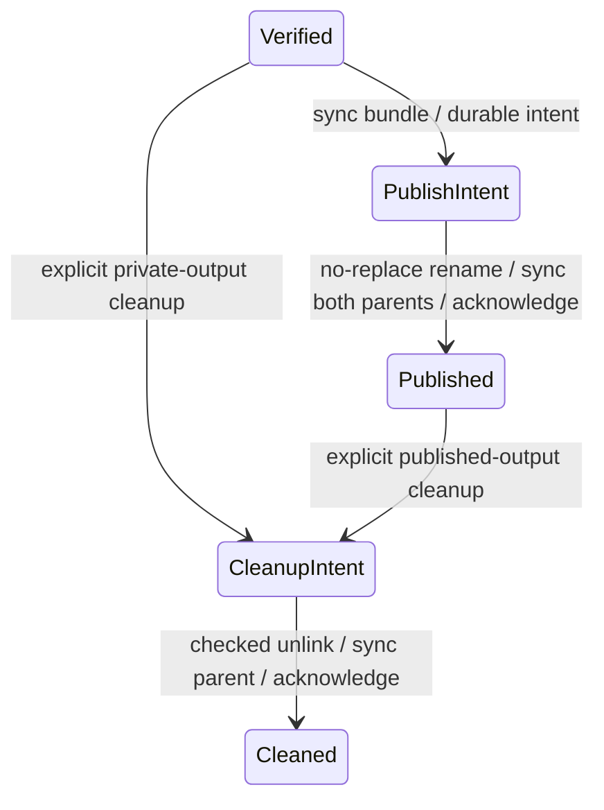

# Durable RAW bundle publication and explicit cleanup (R6.1c.5b)

`ownership::VerifiedOutput` admits a retained private RAW output and publishes its
whole directory with Linux `renameat2(RENAME_NOREPLACE)`. The final bundle contains
`disk.raw`, `output.json` and `owner`; all three move atomically without replacing an
existing target. The source artifact journal remains unchanged. Source and output
operations remain Rust; this package makes no network calls.

## Capability and destination

`VerifiedOutput::open(store, output_id, artifact_id, source, options)` consumes the
locked JobStore and requires a healthy Verified output with no pending transaction.
The original source must still be retained and admissible as CompletedLease. Admit
it through RetainedArtifact, check output binding to its canonical container metadata,
check bounded RAW metadata, then compare every logical source/output byte, including
zeros, and recompute the RAW digest. Recheck encoded source content, metadata,
output members and journal identity before returning the confined capability.
Stored verification claims never replace these checks. This shares the native
source decoder; independently authored expected RAW bytes qualify tests.

`PublicationDirectory::open(path)` pins and locks an existing caller-selected private
directory, without creating it. It must be owned by the current user, inaccessible
to group/other users, on the source filesystem and outside the job store. A bounded
ancestor walk rejects the store and descendants, including source/output stages.
The final component is generated by `OutputId::bundle_name()` as `raw-<hex-id>`.
No path from metadata or a journal is resolved. All bundle accesses are relative to
pinned directory descriptors. Unknown members, symlinks, hardlinked regular files,
wrong identities or changed ownership markers fail closed.

Ancestors must stay trusted and stable. Advisory locks require cooperating writers;
same-user hostile mutation and offline rollback remain outside the private-store
model. Equal device IDs are a precondition, not proof that every mount/subvolume
combination supports rename. An actual unsupported/cross-mount rename is retained
as an uncertain publication outcome; there is no copy fallback.

`publish(self, destination, options)` consumes both capabilities. It freshly checks
all RAW/source bytes again, allowing admission and publication to be separate calls
without trusting content observed earlier. All three members and their directory
are synced before publication intent. No writer or remote lease escapes; the caller
must await this synchronous operation from a blocking context.

## Journal versions and publication ordering

Conversion continues to write version-1 records. Their canonical checksum encoding
is preserved by omitting absent new fields. Version 1 cannot contain publication or
cleanup states. Only actual lifecycle transitions produce version 2, binding the
destination parent identity or recording the cleanup origin. Unknown versions,
fields, invalid identity stamps, state/sequence combinations or bindings fail closed.
An older reader rejects new states rather than interpreting them as conversion.

PublishIntent is sequence 7 and Published is sequence 8. The sequence is:

1. Check destination constraints/collision, current output/source bytes, metadata and
   journal, then sync RAW, metadata, marker and bundle directory.
2. Persist version-2 PublishIntent bound to the destination parent inode/device.
   Journal commits use exclusive transaction creation, file sync, rename and store
   directory sync. A commit error ends mutation; no retry or transaction replay.
3. Check cancellation/deadline and namespaces, then rename the whole bundle with
   RENAME_NOREPLACE between pinned source/destination directory descriptors.
4. Record successful rename in the returned report, sync the source store directory
   and destination directory, and recheck final bundle identity and absent staging.
5. Persist Published and perform the final control check before returning success.

A preflight collision leaves Verified. A collision racing the rename preserves the
foreign destination and leaves PublishIntent. Every existing target type is protected.
After successful rename, both directory syncs are attempted in order before observing
cancellation; a sync failure stops immediately. Cancellation or failure after intent
never rolls back the rename or automatically deletes either location.

PublicationReport separates rename observation, both-directory sync completion,
primary error and assessment error. Success also requires observed Published, no
transaction, absent staging and the owned final bundle. A visible Published record
after an interrupted rename/sync/acknowledgment is not independently proof of durable
publication. Cooperative deadlines cannot interrupt blocked kernel I/O.

## Assessment and explicit cleanup

`assess_output` returns the validated record state/sequence and transaction presence.
It checks intact staged members for pre-publication, pre-cleanup records. It does not
reconstruct a writer or inspect moved/partially removed members without a destination.
`assess_publication(..., &destination)` additionally verifies the recorded destination
identity, then reports each namespace as Absent, Owned or ForeignOrInvalid. Owned
means the expected directory/members/marker are present; it does not verify their
contents or establish durability. Partial cleanup is not an intact Owned bundle.

`cleanup_output(..., destination, options)` is an explicit local deletion request:

- Staged, ConvertIntent, Converted, VerifyIntent and Verified are eligible only at
  their recorded private stage, with no destination supplied. Reacquiring the store
  lock excludes the original live conversion owner.
- Published requires the original locked PublicationDirectory and absent staging.
  The source artifact may already have been explicitly cleaned. Source binding and
  output journal/resource identities remain required.
- Prepared, unstamped StageIntent, PublishIntent and every pending transaction are
  refused. These need future explicit reconciliation; names or record claims alone
  never justify adopting, publishing or removing uncertain resources.
- Persist version-2 CleanupIntent with the eligible origin and incremented sequence.
  Check every remaining member immediately before unlinking; remove RAW, metadata,
  marker and then the empty directory. Unknown entries and foreign replacements are
  preserved. No recursive removal or automatic Drop cleanup occurs.
- A freshly checked CleanupIntent permits missing members/directory so an explicit
  retry can finish interrupted removal. Sync the parent even when the directory is
  already absent, then acknowledge Cleaned. Its sequence is origin sequence + 2;
  the journal remains as an ID reservation. A Cleaned retry checks namespace absence.

Cleanup of acknowledged Published intentionally removes that selected published
bundle. It is never invoked automatically by conversion or publication. Assessment
alone is not a cleanup request. I/O/uncertain cleanup errors poison the current
store; reopen and reassess before another explicit action. Content corruption does
not turn an owned inode into a foreign one, while replaced inodes are never deleted.

## Resources, qualification and continuation

Verification uses two fixed 1 MiB buffers plus the existing separately bounded
native map/decoder. Open and publish each have cooperative RetainedOptions deadlines;
these are separate invocations. Publication adds two journal commits and full
revalidation; cleanup adds two more commits, measured separately. No barriers or
hash passes were removed for performance.

[ADR-0065](adr/0065-durable-raw-bundle-publication.md),
[tests, timings and plots](benchmark-results/2026-10-02-r61c5b/README.md),
[private conversion contract](owned-raw-output.md).

Local synthetic qualification covers actual rename, failure boundaries and SIGKILL;
it does not claim physical power-loss/controller qualification. R6.1c.5c is next:
a Rust entry point and bounded composed live ESXi export, verified publication and
explicit cleanup. Uncertain publication reconciliation, transaction repair and
unstamped-stage adoption remain future work; no remote request is reconstructed or
replayed from these records. Overall production recovery remains open.
