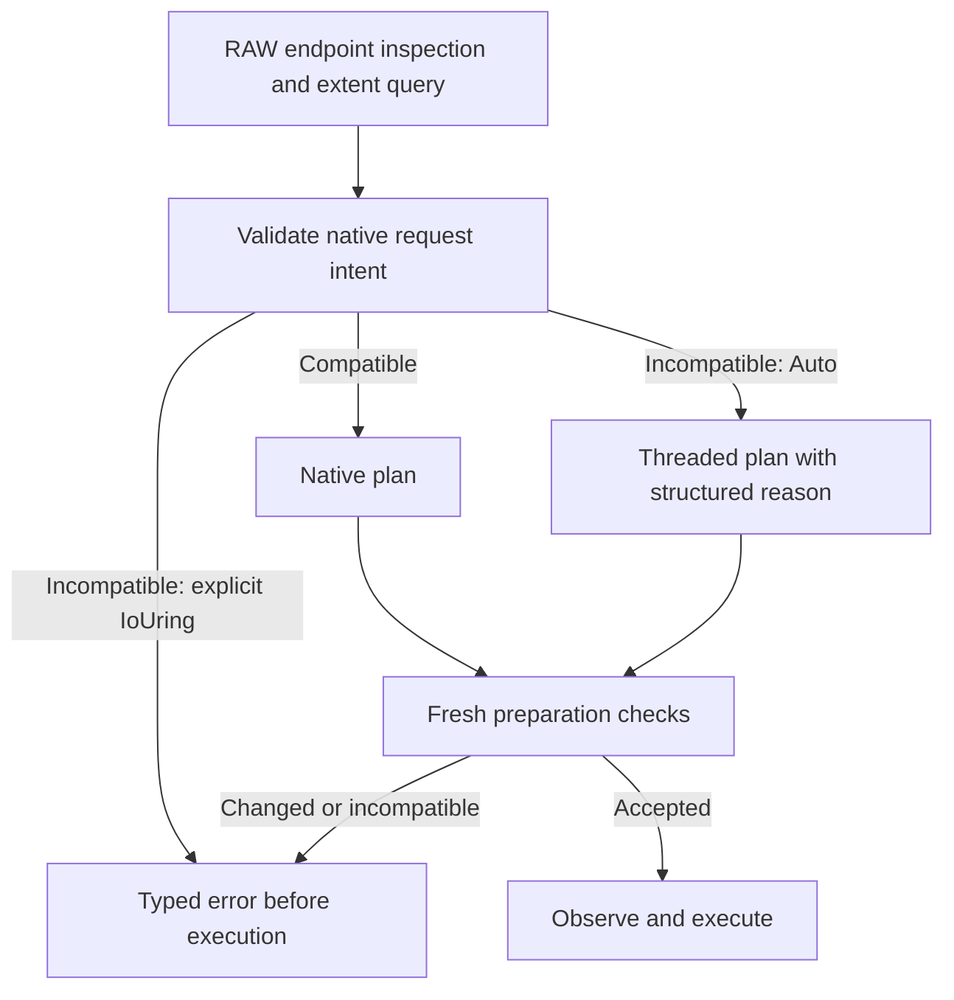

# Native request compatibility (R2.4)

DataMover's Linux RAW planner checks complete native request intent before
selecting io_uring. Compatible requests retain native execution. Auto selects
Threaded for the **entire plan** when request restrictions prevent native use;
explicit IoUring returns `Error::NativeRequestIncompatible(NativeRequestIssue)`.
The decision occurs before callbacks or destination writes. Callers matching the
new error variant receive a boxed diagnostic; the selection reason stores the
same issue by value. Update exhaustive core Error matches for the new variant.

## Checked restrictions

| Check | Behavior |
| --- | --- |
| SQE width | Block size must be nonzero and fit u32, even for empty/sparse-only plans |
| File range | Start and exclusive end must fit the nonnegative i64 domain; addition must not overflow |
| Alignment declarations | Both endpoint memory/offset alignments must be nonzero powers of two |
| Buffer layout | The maximum endpoint/mover alignment must describe a valid allocation with the block size |
| Direct Data range | Each Data offset and length must satisfy each direct endpoint's offset alignment |
| Direct block split | Block size must satisfy offset alignment when an extent spans multiple blocks |
| Descriptor mode | Fresh O_DIRECT flags must agree with backend declarations during RAW planning and preparation |

Memory alignment and offset alignment are distinct. A backend requiring 4096-byte
buffer addresses and 512-byte file offsets permits 512-byte requests with an
appropriately aligned buffer. A 4097-byte block size can still copy a single
4096-byte extent natively because that unused split boundary is never submitted.
Buffered endpoints impose no direct offset/tail restriction. Mixed endpoint pairs
check the direct side, even though `IoUringCompatibility::direct_io()` continues
to mean **both** descriptors are direct.

Only Data extents become native Read/Write requests. Zero/Hole boundaries need
not satisfy direct alignment: they use the existing destination backend policy.
Whole-plan structural validation, endpoint identity/access/capacity checks,
source-map fingerprints, and budgets remain required. Unknown allocation state
and failed inspection are not reasons to silently downgrade integrity checks.

Linux permits filesystem-dependent restrictions on buffer addresses, offsets,
and lengths, and a kernel may reject or buffer misaligned direct I/O. We enforce
the backend's declared restrictions rather than relying on a kernel fallback.
See [open(2), O_DIRECT](https://man7.org/linux/man-pages/man2/open.2.html).

## Selection, preparation, and observability

`plan.execution_selection().reason()` exposes
`ExecutionSelectionReason::RawRequestsIncompatible(issue)` for Auto fallback.
`NativeRequestIssue` distinguishes SQE block width, signed range, invalid
alignment declaration/layout, direct range, and direct block split. It carries
relevant endpoint/range/alignment values by value in the selection reason. The
Error variant boxes the diagnostic only on failure, preserving the shared Error
layout; the checker and compatible path do not allocate. Report and
progress backend fields consistently identify Threaded for a fallback plan;
its payload budget uses the existing threaded executor calculation.

Preparation rereads backend declarations and validates the native plan before
cloning native extent storage, observing progress, or executing sparse prefixes.
If a previously native plan becomes incompatible, execution **rejects it** for
both Auto and explicit IoUring. Replanning with Auto against stable endpoints can
select Threaded. Preparation does not silently change the existing plan's backend,
alignment, or resource accounting. As established in R1.4, an already Threaded
plan remains Threaded when passed to another mover; selection records planning
provenance, not the executing mover's historical intent.

Descriptor O_DIRECT mismatch is an endpoint error, not an Auto compatibility
fallback. The existing fresh fcntl inspection now records that flag, adding no
new descriptor inspection syscall. Source/destination identity and access errors
remain errors. Backend declarations are trusted alignment contracts, not a fresh
statx query: the local backend discovers alignment at open. The caller must
prevent concurrent endpoint/content/status changes during copying.

## API boundaries and remaining work

- `plan_raw_with_destination`, both RAW plan execution APIs, and their public
  copy wrappers share the new policy.
- `copy_native_with_report` also checks declared request restrictions. It is an
  explicitly native FD-only API even when the mover uses Auto; it cannot invoke
  logical threaded backend methods and returns the typed error instead.
- Portable APIs retain their existing behavior: Auto selects Threaded, and
  explicit native requests are unsupported.
- Standalone low-level `io_uring::copy_*` functions retain their existing
  configuration/range contracts. They have borrowed FDs rather than the backend
  alignment declarations; callers remain responsible for direct compatibility.
- R2.5 now [prepares runtime resources](native-runtime-preparation.md) before
  observation, reuses them per job, and reports Auto fallback for defined ring
  unavailability. Request incompatibility still requires replanning; no retry
  after mutation is permitted.
- Threaded fallback invokes logical backend methods; custom backends must
  support those requests or propagate their usual errors. Local fallback uses
  existing aligned/direct or unaligned/buffered backend methods. This step exercises one/four-worker nonoverlapping requests;
  it does not establish a general policy for concurrent buffered/direct aliases
  or external writers to the same file.

## Evidence

Eleven new tests cover request math, mixed modes, odd/tiny/unaligned copies,
sparse prefixes, changing declarations/flags before preparation, observer parity,
whole-plan fallback, and its budget. Integration cases pass on tmpfs and the
recorded Btrfs mount. The [R2.4 report](benchmark-results/2026-09-29-r24/README.md)
retains validation, matched benchmarks, plots, and candidate-only tail fallback.
