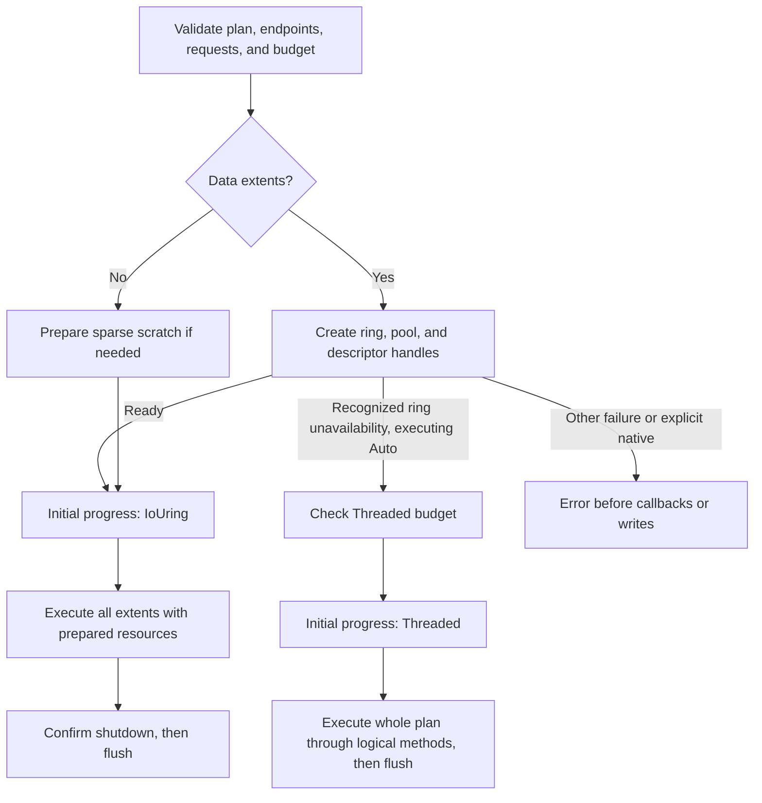

# Native runtime preparation (R2.5)

DataMover's RAW execution now prepares native resources after endpoint, extent,
request, and budget validation and **before the first observer callback or write**.
One owned ring, bounded buffer pool, and duplicated descriptor pair serve every
Data extent in the invocation. Preparation transfers these resources into
execution; it does not probe and discard a ring. CopyPlan remains reusable
structural metadata, with no live kernel resources and no snapshot guarantee.

## Fallback contract

Only an error from ring construction with `ENOSYS`, `EPERM`, `EACCES`, or
`EOPNOTSUPP` permits Auto to use Threaded. These cover unavailable/denied native
execution. `EINVAL`, `ENOMEM`, `EMFILE`, other errors, buffer allocation failures,
and descriptor duplication failures remain errors. Eligibility is tied to the
setup stage, not merely an errno observed anywhere in the copy. Linux documents
invalid configuration, resource limits, and disabled-ring errors in
[io_uring_setup(2)](https://man7.org/linux/man-pages/man2/io_uring_setup.2.html).

The **executing mover's** strategy controls runtime fallback. An explicit
IoUring executor always returns the setup error; Auto may fall back even when
the plan was originally created with explicit native selection. A previously
Threaded plan remains Threaded. Request incompatibility detected during fresh
preparation still requires replanning, as established by R2.4; runtime fallback
does not weaken endpoint, source-map, alignment, or identity checks.

On success, `CopyReport::runtime_fallback()` returns
`Some(NativeRuntimeFallback::RingUnavailable { os_error })` for runtime fallback.
It returns `None` otherwise, including planning-time Threaded selection.
`CopyPlan::execution_selection()` retains planning provenance; the returned
report and **every** progress snapshot identify the executor actually used.
Existing portable reports retain their behavior. The runtime diagnostic API is
Linux-only. Fallback errors retain ordinary Threaded error context; a report
is returned only after successful execution and flush.

The original native plan must pass its budget and live validation first. If
ring construction is unavailable, native-only extent storage is dropped and the
Threaded payload requirement is checked independently before observation. A
fallback requiring more buffers/workers can therefore fail budget admission.
Fallback uses the mover's logical buffer alignment, concurrency, and queue
settings, not the native plan's buffer alignment. Threaded allocation remains
part of its existing execution lifecycle.

## Ownership, sparse operations, and cleanup

- Native setup owns the engine, pool, and file handles for one invocation.
  Completed Data ranges drain before the next extent. Queue depth/read-window
  defaults and payload scheduling are unchanged.
- Data jobs borrow and clear a free pool buffer for sparse write fallback.
  This reuses payload memory instead of retaining a separate scratch block
  alongside the pool. Sparse-only jobs allocate one zeroed block before
  observation; empty jobs need neither a ring nor scratch storage.
- Sparse-only/empty native plans still report IoUring as the selected executor,
  although they submit no native payload requests. They succeed when ring setup
  is unavailable. This preserves established plan/backend semantics.
- Explicit shutdown runs once after the extent loop, on success or failure.
  Existing ownership retention on unconfirmed cleanup remains intact; original
  failure context includes prior completed extents. A backend sparse error also
  closes the prepared ring. Drop preserves cleanup during observer panic/unwind.
- No runtime error after submission or sparse mutation can cause Threaded retry.
  Successful native shutdown precedes the destination flush and final callback.

Native resources are held through sparse extents. The payload budget is unchanged:
a Data pool supplies fallback scratch; sparse-only jobs use one block. Metadata,
allocator overhead, kernel mappings, and quarantine exclusions still apply as
described in [copy memory accounting](copy-memory.md). General Rust container
allocation retains the existing allocator behavior; this is not an RSS cap or
an exhaustive recoverable-OOM interface.

## API scope and timing

Both RAW plan execution APIs consume invocation-scoped prepared ownership.
Standalone `copy_extent_plan` and `copy_extent_plan_with_destination` also prepare
once and reuse their resources; the latter prepares before a sparse prefix.
Single-range native copy uses the same session lifecycle. Low-level FD APIs
remain explicitly native and never fall back, even when the FD-only DataMover
wrapper's strategy is Auto. Their direct alignment obligations are unchanged.

Native `CopyStats::elapsed` includes native resource setup, execution, shutdown,
and flush; it excludes structural validation and observer callback time as before.
Public-call benchmark timers also include preparation and live validation.
The stats timer adds setup duration explicitly because setup now precedes the
initial callback. Threaded reports retain their established execution timing;
runtime fallback's failed native setup is included by public-call benchmarks,
not by the Threaded executor's own elapsed counter.

Kernel operation failures can still occur during execution, including a denied
`io_uring_enter` or an unsupported request on a particular endpoint. Preparation
is not a guarantee that future I/O succeeds. Concurrent descriptor/content
mutation outside [cooperative alias admission](local-file-concurrency.md), cross-job resource caching,
and controlled-runner performance qualification remain separate work.

## Validation and evidence

Eight isolated integration tests cover Auto/explicit setup denial, observed and
unobserved execution, one/four workers, actual-backend reporting, ring reuse
after further setup is denied, sparse-only/empty jobs, non-fallback setup errors,
descriptor duplication failure, Threaded budget admission, observer panic
cleanup, and no retry after a sparse prefix plus submission failure.
All existing engine ownership, shutdown, partial-I/O, and lifetime tests remain
required. See the [R2.5 benchmark report](benchmark-results/2026-09-29-r25/README.md)
for matched raw measurements, plots, and the injected unavailable-ring fallback.

R2.6 attaches per-file admission to every owned regular-file request. Known final
CQEs release it; unconfirmed shutdown retains it with quarantined resources.
A new admission conflict propagates through the existing failure context and
never authorizes an Auto retry. Resource preparation alone does not reserve
file ranges for the entire job.
