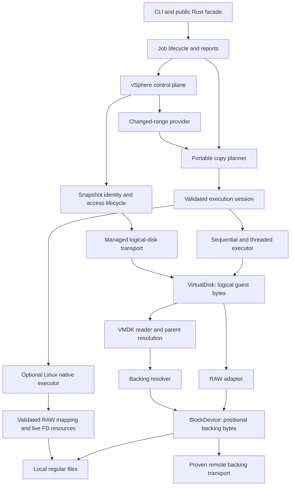

# rvddk architecture and implementation roadmap

Created: 2026-09-28. Status: proposed implementation baseline; no milestones below are completed merely by writing this plan.

Evidence and current limitations: [project review](project-review-2026-09-28.md). Existing package names remain `rvvdk-*` until a separate naming decision.

Execution history: [implementation log](implementation-log.md). Performance is a
requirement at every relevant step: follow the [benchmark policy](benchmarks.md)
and complete PERF.0 before accepting engine performance comparisons. R9 is final
qualification; benchmarking starts with R0. Each work package must record its
source revision, correctness evidence, benchmark comparison or justified N/A,
and remaining work before being marked complete.

## Direction

Build an independent Rust virtual disk toolkit with VMware as the first virtualization target. Preserve the existing core abstractions and execution engines. Stabilize the data plane, deliver local RAW/VMDK workflows, then integrate VMware control and data access through a proven transport.

“From scratch” is interpreted as implementing the disk/transport behavior in Rust without a production dependency on VMware VDDK. General-purpose Rust libraries for TLS, HTTP, parsing, and diagnostics remain reasonable building blocks. Reference tools may be used to validate fixtures, without becoming the implementation.

The first useful release should inspect and copy local RAW disks and a precisely documented subset of VMDK into RAW, report progress, terminate predictably on errors/cancellation, and verify the result. Live VMware backup is a later release with its own compatibility matrix. A VixDiskLib-compatible C ABI, all VMDK variants, SAN, HotAdd, and QCOW2 are not prerequisites for the first release.

## Architecture to preserve and extend



The arrows describe conceptual access/composition, not a requirement to create all these crates now. A remote service returning guest logical blocks can implement `VirtualDisk` directly; a service returning container-file bytes belongs below the format layer. Do not parse VMDK twice or bypass a format mapping through its container FD.

### Component responsibilities

| Component | Responsibility | Constraints |
|---|---|---|
| Existing `rvvdk-core` | Logical geometry, ranges, extent semantics, device/disk contracts, buffer ownership | No Linux FDs, VMware sessions, or required async runtime |
| Existing `rvvdk-platform` | Native resource contracts and validated I/O requirements | Preserve resource lifetime and clarify identity mapping |
| Existing `rvvdk-local` | Files, sparse discovery, zero/hole operations, direct-I/O policy | Own filesystem fallback and descriptor identity checks |
| Existing `rvvdk-datamover` | Plan validation, work scheduling, execution, cancellation, progress, copy results | Same logical behavior across executors |
| Proposed `rvvdk-vmdk` | Descriptor/binary parsing, logical mapping, parent-chain reads | Backend resolution supplied by caller; read-only first |
| Proposed `rvvdk-cli` | Inspect, plan, copy, verify; exit codes and JSON output | Thin adapter over public library workflows |
| Proposed `rvvdk-vsphere` | Authentication, inventory, snapshots, tasks, CBT | Control plane only; no hidden snapshot creation inside reads |
| Transport module/crate selected by feasibility work | Remote backing-file or logical-disk access | Name and interface follow verified protocol semantics |
| Future job/journal module | Durable state, resume, snapshot cleanup reconciliation | Extract into a crate only when independent users justify it |

### Contracts to settle before expanding backends

1. **Exact I/O:** define short reads/writes, EOF, zero progress, interruption, range errors, and request limits. Native execution should retry legitimate partial completions or clearly expose why it cannot; it must not silently treat every short read as definitive EOF. Define empty operations consistently.
2. **Sparse semantics:** Data contains resolved logical bytes; Zero and Hole both read as zero. Hole additionally permits storage deallocation when that preserves the zero-read guarantee. Child-format allocation state remains internal until parents are resolved.
3. **Capabilities:** describe actual supported operations and guarantees. Distinguish discard from zero-guaranteed deallocation; expose memory/offset/length alignment and transfer limits without assuming all values are interchangeable.
4. **Source consistency:** bind jobs to source identity and a consistency policy. A structural plan is not a snapshot. Begin with caller-guaranteed stable local sources; add snapshot identity for VMware and resumable operations.
5. **Destination identity and durability:** check write/flush policy before transfer, reject unsupported aliases, and report incomplete destinations on failure. A successful durable job includes the agreed flush boundary; a resumed journal cannot get ahead of durable output.
6. **Portable workflow:** plan/execute/report/observe must work through `VirtualDisk`. Native access is an optional validated optimization for identity-mapped ranges. Do not require every disk format to expose FDs.
7. **Failure ownership:** preserve the first cause, stop scheduling, wake blocked threads, settle in-flight operations, and return a partial report. Cancellation requests do not release buffers still referenced by the kernel.
8. **Observation:** callbacks observe completed work and lifecycle stages; they do not select semantics or bypass validation. Start with coordinator-thread callbacks, bounded aggregation, and time/byte throttling.

## Ordered milestones

Use these IDs in subsequent work so the review findings and implementation remain traceable. Effort labels are relative: S = focused change, M = several cohesive changes, L = subsystem, Research = uncertainty prevents a dependable implementation estimate.

| Milestone | Outcome | Depends on | Effort |
|---|---|---|---|
| R0 | Reliable termination, validation, and native memory/resource lifecycle | Current tree | M |
| R1 | Portable plans and shared semantic execution | R0 | M |
| R2 | Correct local sparse output and honest native selection | R0, R1 | M |
| R3 | Usable local RAW CLI with progress, cancellation, verification | R1, R2 | M |
| R4 | Read-only descriptor/flat VMDK to RAW | R1, R3 | M |
| R5 | Read-only hosted sparse VMDK and validated parent chains | R4 | L |
| V0 | VMware access feasibility decision and target matrix | Can begin after R0; does not block local VMDK | Research |
| R6 | VMware control plane plus one proven full-copy transport | V0 and relevant R3–R5 format support | L |
| R7 | Incremental copies driven by CBT | R6 and generic range planning | L |
| R8 | Durable resume and qualified restore workflow | Stable identities, R3; VMware resume also R6/R7 | L |
| R9 | Measured performance and release hardening | Apply CI early; full qualification after chosen release scope | M/L |

### R0 — Stabilize the existing engine

Deliver small, separate changes rather than a wholesale rewrite:

- [x] **R0.1: observer validation parity** — both entry points share structural validation before execution/notification; private dispatch avoids duplicate scans. Eight regressions added. Covers F03. [Evidence and performance disposition](benchmark-results/2026-09-28-r01/README.md); broad loop consolidation remains in R1.
- [x] **R0.2: worker shutdown** — coordinator receiver released; first-recorded error retained; cooperative worker stop, producer wakeup, and scoped joining verified. Eleven regressions include full-queue read/write/zero/discard failures. Covers F01. [Evidence and performance disposition](benchmark-results/2026-09-28-r02/README.md); synchronous backend calls must return for shutdown to complete.
- [x] **R0.3: io_uring lifetime repair** — removed borrowed engine I/O; operations retain buffers and owned descriptors before publication. Explicit shutdown confirms completions or reports permanent resource retention. Eighteen lifetime/error regressions and [ADR-0013 safety argument](adr/0013-io-uring-buffer-ownership.md) cover F02 and FD reuse. [Performance evidence](benchmark-results/2026-09-28-r03/README.md) is provisional; cancellation deadlines and resource reclamation after unconfirmed shutdown remain limitations.
- [x] **R0.4: entry-point validation** — native configuration and file ranges are validated before allocation or I/O, including empty and Zero/Hole-only plans. Data-only plans reject unsupported later extents before writes; owned requests reject invalid offsets before SQE publication. Eight regression tests cover F08 and mutation ordering. [Benchmark evidence and disposition](benchmark-results/2026-09-28-r04/README.md).
- [x] **R0.5: basic preflight** — shared endpoint contract; live local capacity/access checks; known aliases and native descriptor mismatches rejected before execution/observation; direct/buffered handle identity verified. Contextual errors preserve causes. Covers parts of F04/F10. [Evidence and performance disposition](benchmark-results/2026-09-28-r05/README.md).

Acceptance:

- Existing tests remain green; new reproductions fail on the old behavior and pass after the fix.
- Worker error and cancellation regressions run under bounded subprocess timeouts and cannot stall CI.
- Every plan mismatch is rejected before destination mutation, with or without observers.
- Borrowed buffers cannot be returned while the kernel may still access them; this requires an explicit safety argument plus fault-injection tests, not only successful-copy tests.
- Zero-size low-level configuration returns an error rather than spinning.

### R1 — Make planning portable and centralize semantics

R1.2 performance follow-up (PERF.0): qualify fragmented no-op observation and
sequential Hole/Zero fallback on a controlled runner. Final development-host
medians exceed 5% in these profiles; conflicting repeats are preserved in the
[R1.2 report](benchmark-results/2026-09-28-r12/README.md). R1.3 also retains
a native complete-copy pair at +9.92% (aggregate +0.25%) for controlled-runner
qualification; see its [report](benchmark-results/2026-09-28-r13/README.md).
R1.5 retains recurring +19.60%/+16.44% four-worker mixed sparse pairs despite
small aggregate costs and a tighter same-binary control. Investigate on a
controlled runner; [evidence](benchmark-results/2026-09-29-r15/README.md).

- [x] **R1.1:** Add destination-aware portable planning and execution for arbitrary `VirtualDisk` implementations, including trait objects where useful (`?Sized` or deliberate forwarding implementations).
- [x] **R1.1:** Use one canonical extent topology validator at plan construction and execution boundaries.
- [x] **R1.2:** Consolidate Data/Zero/Hole execution policy and duplicated sequential observed/unobserved loops. Preserve existing statistics and observer/flush boundaries; leave stronger deallocation guarantees to R2.
- [x] **R1.4:** Separate logical extent intent, planning selection/reasons, and invocation-scoped preparation. Both plan execution APIs prepare before observation; native strategy/alignment rejection now precedes callbacks. Runtime native resource preparation remains R2. [Evidence](benchmark-results/2026-09-28-r14/README.md); [ADR-0027](adr/0027-portable-planning.md).
- [x] **R1.3:** Share fresh local RAW descriptor inspections across logical and physical capacity/access/identity checks. Preserve custom logical checks and native binding. Measure against the preceding implementation of R0.5 preflight. [Evidence](benchmark-results/2026-09-28-r13/README.md); [ADR-0028](adr/0028-endpoint-inspection.md).
- [x] **R1.1:** Treat existing `CopyPlan` as an in-memory structural plan. Avoid promising stable serialization until identity/versioning rules are settled.
- [x] **R1.5:** Add copy operation/range/backend/cause context and confirmed partial counters across sequential, worker, and native copying. Distinguish configuration/stale/endpoint changes from corrupt metadata. [Contract](copy-errors.md); [evidence](benchmark-results/2026-09-29-r15/README.md).
- [ ] **R1.6 (next):** Define a memory budget covering buffers, queue entries, and extent metadata. Keep the initial Vec extent API, but do not claim total memory is independent of fragmentation.
- [x] **R1.1:** Make portable/native entry points explicit; migrate Linux RAW callers to named adapters. [ADR-0027](adr/0027-portable-planning.md).

Portable API acceptance **met by R1.1**: memory, local RAW, and a synthetic translated logical disk all use the same plan/execute/observer API without Linux FD requirements. A translated disk with physical offsets different from logical offsets copies correctly and cannot accidentally enter the RAW FD fast path.

### R2 — Complete local sparse semantics and native preflight

- [ ] Introduce the zero-read guarantee required by F05 and update ADR-0003/0022 through a superseding ADR.
- [ ] Implement local zeroing and hole punching, with range checks, read-only checks, partial filesystem block handling, and fallbacks on unsupported filesystems.
- [ ] Add dense extent fallback when sparse discovery is unavailable; never invent Hole extents from unknown allocation state.
- [x] Verify direct/buffered descriptors refer to the same underlying file (R0.5).
- [ ] Define how concurrent buffered/direct ranges are handled.
- [ ] Integrate runtime io_uring initialization and request compatibility into preparation. Make Auto fallback reasons observable and explicit IoUring errors precise.
- [ ] Handle unaligned native requests through an intentional policy: initially choose threaded execution for the entire plan before mutation; add aligned native bulk plus safe tails only if measured value justifies it.
- [x] Validate source READ and destination WRITE/FLUSH requirements even when native FD access bypasses backend methods (R0.5). Operation-specific sparse guarantees remain below the R2 acceptance criteria.
- [ ] Reuse a ring and bounded buffer pool per prepared job instead of recreating them per Data extent, once correctness tests pass.

Acceptance: byte equality on nonzero-prefilled destinations; demonstrable hole preservation on a supporting filesystem; safe behavior on a filesystem without sparse operations; tests for mixed direct/buffered endpoints, tiny/odd disk sizes, unaligned extent boundaries, and io_uring unavailability. Verify actual storage behavior separately from tmpfs.

### R3 — Deliver a local RAW vertical slice

Proposed commands, using the requested public spelling pending the naming decision:

```text
rvddk inspect source.raw --format raw --json
rvddk plan source.raw destination.raw --format raw --json
rvddk copy source.raw destination.raw --format raw --verify
rvddk verify source.raw destination.raw --format raw
```

- [ ] Introduce a thin CLI crate; document explicit format and destination creation/replacement behavior.
- [ ] Default new output creation to no-clobber; require an explicit overwrite option for existing destinations. Reject same-file/hard-link aliases.
- [ ] Expose actual execution backend, selection reason, logical bytes, payload read/written, zero/deallocation bytes, elapsed time, and completion state.
- [ ] Complete intermediate progress across sequential/threaded/native paths through coordinator aggregation. Distinguish 100% bytes processed from a durable Completed event.
- [ ] Add cancellation requests, partial failure reports, and meaningful process exit codes.
- [ ] Implement logical read-back verification with bounded memory. For new files, publish a temporary output only after the configured flush/verification steps; document partial-output handling for in-place destinations.

Acceptance: a user can inspect, dry-run, copy, cancel, and verify a sparse RAW image entirely through supported public APIs. Failure/cancellation never reports success. Tests cover output preservation, injected corruption, and cancellation during transfer/flush boundaries.

### R4 — First real VMDK support: descriptor and flat extents

- [ ] Add `rvvdk-vmdk` with read-only `VirtualDisk` behavior and explicit supported create/extent types.
- [ ] Parse descriptors with bounded sizes and precise errors. Validate access modes, capacities, sector-to-byte arithmetic, extent offsets, and referenced-file lengths.
- [ ] Introduce a `BackingResolver` supplied by the caller. Local resolution must handle descriptor-relative paths and reject unintended escapes/absolute-path access by default; it must not assume all backends are local files.
- [ ] Implement logical mapping across supported FLAT extents and ZERO extents, including reads crossing extent boundaries.
- [ ] Reject unsupported sparse/encrypted/managed variants clearly rather than guessing at their layout.
- [ ] Extend inspect/plan/copy to the supported VMDK subset; destination remains RAW.
- [ ] Add fixtures with documented provenance and compare decoded logical bytes against a trusted reference implementation.

Acceptance: single/multi-extent supported flat VMDK images copy to byte-equivalent RAW; malformed descriptors, arithmetic overflow, truncated backing files, unsupported types, and path-resolution attacks fail safely. No VMDK writes yet.

### R5 — Hosted sparse VMDK and parent-chain reads

- [ ] Add supported sparse headers, grain directories/tables, cross-grain reads, and bounded metadata caches.
- [ ] Validate every metadata offset/count before allocation or I/O; limit total metadata work and chain depth.
- [ ] Implement a documented subset such as `monolithicSparse`, then split sparse variants supported by the chosen format specification and fixtures.
- [ ] Add parent identity/CID checks, missing-parent errors, cycle detection, and explicit parent resolution policy.
- [ ] Resolve unallocated child grains through the parent. Emit logical Hole/Zero only when the resolved bytes are actually guaranteed zero.
- [ ] Add `streamOptimized` decompression as a separate increment if required by the selected import/export workflow. Keep VMFS sparse and seSparse as separately qualified formats.
- [ ] Fuzz descriptor/header/grain parsing and compare fixture outputs against reference decoding.

Acceptance: reads across grain and parent boundaries match known logical contents; truncated/cyclic/inconsistent chains fail deterministically; fuzzing stays within resource limits. Publish a support table for each VMDK variant and operation.

Broadcom distinguishes disk variants in its [disk-type documentation](https://developer.broadcom.com/xapis/virtual-disk-api/latest/vddkDataStruct.5.3.html). Use that and the linked format technical note to scope implementation; do not infer full modern snapshot support from a hosted sparse reader. [QEMU's image utility](https://www.qemu.org/docs/master/tools/qemu-img.html) provides conversion/comparison facilities suitable for optional fixture validation.

### V0 — Prove independent VMware access early

This research gate should begin early enough that local implementation is not mistaken for proof of live VMware access.

**Lab timing:** no ESXi host is required for R0–R5 local development. Prepare a
host for V0 after initial R0 stabilization, rather than waiting until every local
format is implemented. A standalone host and disposable VM are enough to start
direct-host research; add vCenter for vCenter-managed workflow qualification.

**License requirement, checked 2026-09-28:** Broadcom's documentation for free
ESXi 8.0U3e says the free license excludes VADP backups and vCenter management;
host-management API use is unsupported and may provide read-only information.
It is useful for basic lab/fixture work but is not sufficient to qualify the
planned managed snapshot/backup workflows. See
[Broadcom KB 399823](https://knowledge.broadcom.com/external/article/399823/vmware-esxi-80-update-3e-now-available-a.html).

For V0/R6, arrange an appropriately licensed host or a legitimately available
active evaluation. Broadcom documents API write restrictions on free hosts and
refers to an active 60-day evaluation as an alternative for deployment in
[KB 325053](https://knowledge.broadcom.com/external/article/325053).
Confirm the exact version, download/evaluation availability, active license
features, and required API operations before starting the time-limited lab.
Installing the free image does not imply that full evaluation access is active.
An independent Rust implementation does not itself change server-side capability
checks. Keep the selected workflow subject to the V0 proof.

- [ ] Choose target ESXi/vCenter versions, datastore types, disk types, and first workflow: powered-off export, snapshot-based read-only backup, or restore.
- [ ] Build a capability matrix from primary documentation and a disposable lab. Record authentication, certificates, endpoint access, privileges, snapshot requirements, and data representation.
- [ ] Distinguish standard NBD interoperability from VMware NBD/NBDSSL/NFC access. A generic NBD transport may serve other integrations, but is not evidence of ESXi compatibility.
- [ ] Test a minimal Rust proof: acquire supported access, read known bytes or a supported export, handle a failure, and release all owned resources.
- [ ] Evaluate documented HTTP NFC export/import where appropriate. Treat export streams as streams/container data unless random guest-block semantics are proven.
- [ ] Decide the first transport only after the proof; save an ADR with supported operations, limitations, and unresolved protocol details.

Gate: proceed to R6 only with reproducible independently implemented access for the selected workflow. If random snapshot reads remain unproven, deliver the qualified local/offline or documented export workflow and keep live-backup scope explicitly open. Do not silently replace the independent implementation with VDDK FFI.

Broadcom's [advanced transport APIs](https://developer.broadcom.com/xapis/virtual-disk-api/latest/vddkFunctions.6.11.html) describe managed access through VDDK and snapshot context. That documentation is not a complete independent wire-protocol implementation. Its [HTTP NFC lease API](https://developer.broadcom.com/xapis/virtual-infrastructure-json-api/latest/virtual-infrastructure/http-nfc-lease/) describes import/export leases and keepalive progress; verify workflow-specific behavior in the chosen lab.

### R6 — VMware control plane and one complete full-copy workflow

- [ ] Add a vSphere client for session/authentication, trusted TLS, inventory, disk identity/capacity/backing discovery, and asynchronous task polling. Keep secrets out of logs and reports.
- [ ] Define an access state machine: discover → acquire snapshot/access → open disk → copy/verify → close access → clean up owned resources.
- [ ] Implement the proven transport through `VirtualDisk` or `BlockDevice` according to whether it returns logical disk bytes or container bytes.
- [ ] Persist ownership of snapshots/leases/attachments so failed cleanup can be retried after process restart. Explicit close/cleanup is required; destructor cleanup alone cannot recover remote state after a crash.
- [ ] Add timeouts and bounded retries for operations known to be retryable; do not retry an ambiguous mutation blindly.
- [ ] Document crash-consistent versus guest-quiesced workflows and snapshot-consistency scope across multiple disks.

Acceptance: the chosen supported VMware workflow produces verified output in the lab; expired credentials, lost connections, task failure, process termination, and cleanup failure produce recoverable state and no falsely successful backup. Test cleanup of owned resources only.

### R7 — Incremental copy and CBT

- [ ] Introduce a separate `ChangedRange`/`ChangeSet` abstraction carrying source disk identity and baseline/target generation. A changed-range list is not a complete allocation map.
- [ ] Add generic selected-range planning. Intersect selected ranges with the resolved source logical extents; never fill unselected gaps with Zero/Hole operations.
- [ ] Implement `QueryChangedDiskAreas` pagination and validate forward progress, bounds, duplicate/overlapping ranges, and arithmetic.
- [ ] Bind CBT identifiers to the correct disk/snapshot and baseline artifact. Reject invalid or mismatched baselines and request a full copy when continuity cannot be established.
- [ ] Define incremental artifact metadata and application order. Promote a new baseline only after data and metadata are durable and verification policy succeeds.

Acceptance: full backup plus applied incrementals equals an independently read final snapshot, including blocks changed to zero or deallocated. Test invalid change IDs, disk replacement/resize, empty changes, pagination, retries, and interrupted increments.

The [QueryChangedDiskAreas API](https://developer.broadcom.com/xapis/virtual-infrastructure-json-api/latest/sdk/vim25/release/VirtualMachine/moId/QueryChangedDiskAreas/post/) identifies the interval with a change ID and snapshot, permits false positives, and describes repeated calls using returned coverage. This requires a change-selection layer separate from the current gap-free extent map.

### R8 — Durable resume and restore qualification

- [ ] Introduce a versioned job manifest with source identity/generation, destination identity, operation ranges, format/geometry, options, and verification policy.
- [ ] Checkpoint only work known durable: write data → flush agreed boundary → atomically persist checkpoint. Define journal ordering and recovery explicitly.
- [ ] Track completed regions, not a single highest offset; threaded/native completion can be out of order.
- [ ] Validate identities and snapshot availability before resume. Recopy work with uncertain completion; never trust the extent fingerprint as source-content identity.
- [ ] Test process termination at every checkpoint transition and after partial zero/deallocation work.
- [ ] Qualify restore into a new supported target before considering arbitrary in-place VMware restore or VMDK mutation. Define metadata publication and finalization order.

Acceptance: interrupted/resumed output equals uninterrupted output; stale or mismatched artifacts are rejected; no checkpoint claims undurable bytes. A documented recovery procedure handles orphaned remote resources and incomplete destinations.

Local resume may be delivered before VMware integration once local identity/consistency requirements are met. It does not require waiting for every later feature.

### R9 — Continuous validation and performance qualification

Start CI during R0; apply the remaining items as each subsystem arrives.

- [ ] Linux fmt, strict Clippy, unit/integration tests, and documentation build; pin a reproducible CI toolchain and declare MSRV.
- [ ] Separate portable core coverage from Linux native tests. Maintain at least one environment where io_uring and real storage are required, so capability skips cannot conceal all native coverage.
- [ ] Test sparse/direct paths on selected real filesystems and compare logical contents plus allocation. Keep tmpfs coverage as a distinct case.
- [ ] Use Miri where suitable for portable unsafe buffer code; use controlled fault injection/native integration for kernel I/O that Miri cannot validate.
- [ ] Property tests for range arithmetic and extent normalization; fuzz parsers; malformed fixtures and bounded-resource tests.
- [ ] Fix benchmark flush parity. Record hardware, filesystem/mount settings, encryption, cache state, toolchain, workload, memory budget, and variability.
- [ ] Measure dense, zero-heavy, sparse, highly fragmented, small-tail, and remote-latency workloads; distinguish logical throughput from bytes actually transferred.
- [ ] Optimize persistent rings, batching, registered buffers, fixed files, or caches only after identifying a measured bottleneck.
- [ ] Maintain current architecture, rustdoc examples, support matrix, changelog, workspace metadata, and reproducible reference fixtures.

Acceptance: each advertised configuration has evidence; engine defaults follow representative measurements; no release claim exceeds tested format/transport/OS support.

## ADR queue

Decisions after ADR-0024. ADR-0025 is implemented for the bounded R0.1 scope; create the remaining proposals when implementing their milestones.

| Proposed ADR | Decision |
|---|---|
| [0025](adr/0025-shared-plan-validation.md) | Accepted: shared structural plan validation; broader lifecycle/error termination remains future work |
| 0026 | Logical Hole semantics and zero-guaranteed deallocation |
| [0027](adr/0027-portable-planning.md) | Accepted: portable planning, selection reasons, and invocation preparation; full native runtime preparation remains follow-up work |
| [0028](adr/0028-endpoint-inspection.md) | Accepted: fresh descriptor inspection and current endpoint identity; persistent consistency/durability contracts remain future work |
| 0029 | VMDK support subset, backing resolver, parent-chain rules |
| 0030 | Independent VMware transport feasibility and selected first workflow |
| 0031 | Changed-range selection and CBT baseline identity |
| 0032 | Durable journals, checkpoint ordering, and resume |

## First implementation session — R0.1 completed

The following sequence is recorded in the [implementation log](implementation-log.md). R0.1–R0.5 are complete, with performance dispositions and remaining qualification work documented. R1.1 portable APIs, R1.2 shared semantic policy, R1.3 shared endpoint inspection, R1.4 logical/executor preparation separation, and R1.5 contextual failures are also complete; continue with R1.6 total memory budgets next.

R0.1 was the bounded change directly related to the observer work:

1. Preserve and review the existing uncommitted observer changes.
   Prepare PERF.0's corrected harness and baseline/source-state records alongside
   the fix; use the same harness for before/after measurements.
2. Add regression cases for mismatched block size/alignment, changed source size/extents, and smaller destination through both execution APIs.
3. Ensure rejected plans leave the destination untouched and do not emit a Completed event.
4. Factor shared validation and route observed execution through it; avoid maintaining another copy of Data/Zero/Hole policy.
5. Run the focused tests, then the workspace test/fmt/Clippy checks.
6. Record the relevant planning/observer benchmark comparison and any accepted
   tradeoff in the implementation log. Update this checklist and ADR-0025 with
   the implemented behavior and remaining limitations.

R0 and R1.1–R1.5 are complete. Start **R1.6** with a total memory-budget contract covering buffers, queues, and extent metadata before R2 native/sparse qualification. Keep PERF.0 and the R1.2 performance follow-ups open.

## Decisions to record before their milestone

These do not block R0:

- Public spelling: `rvddk` versus existing `rvvdk`; decide before CLI/package publication.
- First local VMDK variants and availability of representative fixtures; default to read-only flat, then hosted sparse.
- First supported VMware versions/workflow and access to a disposable lab; required for V0/R6 acceptance.
- Whether “from scratch” excludes optional reference testing against VDDK; default production remains independent.
- OS support: default Linux data plane first, while retaining portable core contracts.
- Whether a C ABI is a real consumer requirement; defer until the Rust API and lifecycle stabilize.

## How to maintain this plan

For each completed work package, record its commit, validation evidence, and any changed contract. Keep [the review](project-review-2026-09-28.md) as a dated baseline; update this roadmap's checkboxes and current decisions as implementation proceeds. New findings should amend the sequence when they affect correctness or feasibility. Avoid calendar promises for research-dependent VMware work until V0 is complete.

Use [implementation-log.md](implementation-log.md) for every implementation step
and link immutable benchmark evidence. Include a performance disposition even
when a step is documentation-only or its benchmark is blocked. Do not mark a
runtime change complete with unexplained missing performance validation.
