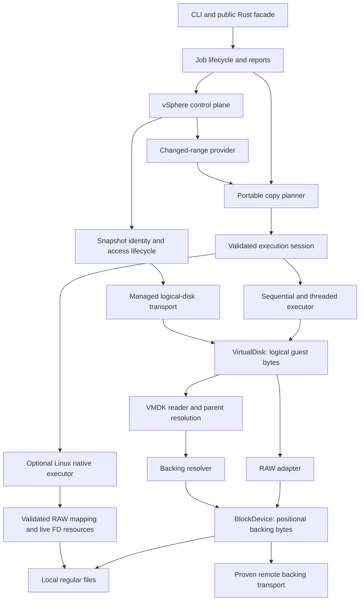

# rvddk architecture and implementation roadmap

Created: 2026-09-28. Status: proposed implementation baseline; no milestones below are completed merely by writing this plan.

Evidence and current limitations: [project review](project-review-2026-09-28.md). Existing package names remain `rvvdk-*` until a separate naming decision.

Execution history: [implementation log](implementation-log.md). Performance is a
requirement at every relevant step: follow the [benchmark policy](benchmarks.md)
and complete PERF.0 before accepting engine performance comparisons. R9 is final
qualification; benchmarking starts with R0. Each work package must record its
source revision, correctness evidence, benchmark comparison or justified N/A,
and remaining work before being marked complete.

## Direction

Build an independent Rust virtual disk toolkit with VMware as the first virtualization target. Preserve the existing core abstractions and execution engines. Stabilize the data plane, deliver local RAW/VMDK workflows, then integrate VMware control and data access through a proven transport.

“From scratch” is interpreted as implementing the disk/transport behavior in Rust without a production dependency on VMware VDDK. General-purpose Rust libraries for TLS, HTTP, parsing, and diagnostics remain reasonable building blocks. Reference tools may be used to validate fixtures, without becoming the implementation.

The first useful release should inspect and copy local RAW disks and a precisely documented subset of VMDK into RAW, report progress, terminate predictably on errors/cancellation, and verify the result. Live VMware backup is a later release with its own compatibility matrix. A VixDiskLib-compatible C ABI, all VMDK variants, SAN, HotAdd, and QCOW2 are not prerequisites for the first release.

## Architecture to preserve and extend



The arrows describe conceptual access/composition, not a requirement to create all these crates now. A remote service returning guest logical blocks can implement `VirtualDisk` directly; a service returning container-file bytes belongs below the format layer. Do not parse VMDK twice or bypass a format mapping through its container FD.

### Component responsibilities

| Component | Responsibility | Constraints |
|---|---|---|
| Existing `rvvdk-core` | Logical geometry, ranges, extent semantics, device/disk contracts, buffer ownership | No Linux FDs, VMware sessions, or required async runtime |
| Existing `rvvdk-platform` | Native resource contracts and validated I/O requirements | Preserve resource lifetime and clarify identity mapping |
| Existing `rvvdk-local` | Files, sparse discovery, zero/hole operations, direct-I/O policy | Own filesystem fallback and descriptor identity checks |
| Existing `rvvdk-datamover` | Plan validation, work scheduling, execution, cancellation, progress, copy results | Same logical behavior across executors |
| Proposed `rvvdk-vmdk` | Descriptor/binary parsing, logical mapping, parent-chain reads | Backend resolution supplied by caller; read-only first |
| Existing `rvvdk-cli` | Inspect/plan/copy/verify; safe output, exit codes and JSON reports | Thin adapter over public library workflows; public binary `rvddk` |
| Existing `rvvdk-vsphere` | Qualified authentication/inventory; snapshots, tasks and CBT are future work | Bounded control plane; no hidden mutations inside reads |
| Transport module/crate selected by feasibility work | Remote backing-file or logical-disk access | Name and interface follow verified protocol semantics |
| Future job/journal module | Durable state, resume, snapshot cleanup reconciliation | Extract into a crate only when independent users justify it |

### Contracts to settle before expanding backends

1. **Exact I/O:** define short reads/writes, EOF, zero progress, interruption, range errors, and request limits. Native execution should retry legitimate partial completions or clearly expose why it cannot; it must not silently treat every short read as definitive EOF. Define empty operations consistently.
2. **Sparse semantics:** Data contains resolved logical bytes; Zero and Hole both read as zero. Hole additionally permits storage deallocation when that preserves the zero-read guarantee. Child-format allocation state remains internal until parents are resolved.
3. **Capabilities:** describe actual supported operations and guarantees. Distinguish discard from zero-guaranteed deallocation; expose memory/offset/length alignment and transfer limits without assuming all values are interchangeable.
4. **Source consistency:** bind jobs to source identity and a consistency policy. A structural plan is not a snapshot. Begin with caller-guaranteed stable local sources; add snapshot identity for VMware and resumable operations.
5. **Destination identity and durability:** check write/flush policy before transfer, reject unsupported aliases, and report incomplete destinations on failure. A successful durable job includes the agreed flush boundary; a resumed journal cannot get ahead of durable output.
6. **Portable workflow:** plan/execute/report/observe must work through `VirtualDisk`. Native access is an optional validated optimization for identity-mapped ranges. Do not require every disk format to expose FDs.
7. **Failure ownership:** preserve the first cause, stop scheduling, wake blocked threads, settle in-flight operations, and return a partial report. Cancellation requests do not release buffers still referenced by the kernel.
8. **Observation:** callbacks observe completed work and lifecycle stages; they do not select semantics or bypass validation. Start with coordinator-thread callbacks, bounded aggregation, and time/byte throttling.

## Ordered milestones

Use these IDs in subsequent work so the review findings and implementation remain traceable. Effort labels are relative: S = focused change, M = several cohesive changes, L = subsystem, Research = uncertainty prevents a dependable implementation estimate.

| Milestone | Outcome | Depends on | Effort |
|---|---|---|---|
| R0 | Reliable termination, validation, and native memory/resource lifecycle | Current tree | M |
| R1 | Portable plans and shared semantic execution | R0 | M |
| R2 | Correct local sparse output and honest native selection | R0, R1 | M |
| R3 | Usable local RAW CLI with progress, cancellation, verification | R1, R2 | M |
| R4 | Read-only descriptor/flat VMDK to RAW | R1, R3 | M |
| R5 | Read-only hosted sparse VMDK and validated parent chains | R4 | L |
| V0 | VMware access feasibility decision and target matrix | Can begin after R0; does not block local VMDK | Research |
| R6 | VMware control plane plus one proven full-copy transport | V0 and relevant R3–R5 format support | L |
| R7 | Incremental copies driven by CBT | R6 and generic range planning | L |
| R8 | Durable resume and qualified restore workflow | Stable identities, R3; VMware resume also R6/R7 | L |
| R9 | Measured performance and release hardening | Apply CI early; full qualification after chosen release scope | M/L |

### R0 — Stabilize the existing engine

Deliver small, separate changes rather than a wholesale rewrite:

- [x] **R0.1: observer validation parity** — both entry points share structural validation before execution/notification; private dispatch avoids duplicate scans. Eight regressions added. Covers F03. [Evidence and performance disposition](benchmark-results/2026-09-28-r01/README.md); broad loop consolidation remains in R1.
- [x] **R0.2: worker shutdown** — coordinator receiver released; first-recorded error retained; cooperative worker stop, producer wakeup, and scoped joining verified. Eleven regressions include full-queue read/write/zero/discard failures. Covers F01. [Evidence and performance disposition](benchmark-results/2026-09-28-r02/README.md); synchronous backend calls must return for shutdown to complete.
- [x] **R0.3: io_uring lifetime repair** — removed borrowed engine I/O; operations retain buffers and owned descriptors before publication. Explicit shutdown confirms completions or reports permanent resource retention. Eighteen lifetime/error regressions and [ADR-0013 safety argument](adr/0013-io-uring-buffer-ownership.md) cover F02 and FD reuse. [Performance evidence](benchmark-results/2026-09-28-r03/README.md) is provisional; cancellation deadlines and resource reclamation after unconfirmed shutdown remain limitations.
- [x] **R0.4: entry-point validation** — native configuration and file ranges are validated before allocation or I/O, including empty and Zero/Hole-only plans. Data-only plans reject unsupported later extents before writes; owned requests reject invalid offsets before SQE publication. Eight regression tests cover F08 and mutation ordering. [Benchmark evidence and disposition](benchmark-results/2026-09-28-r04/README.md).
- [x] **R0.5: basic preflight** — shared endpoint contract; live local capacity/access checks; known aliases and native descriptor mismatches rejected before execution/observation; direct/buffered handle identity verified. Contextual errors preserve causes. Covers parts of F04/F10. [Evidence and performance disposition](benchmark-results/2026-09-28-r05/README.md).

Acceptance:

- Existing tests remain green; new reproductions fail on the old behavior and pass after the fix.
- Worker error and cancellation regressions run under bounded subprocess timeouts and cannot stall CI.
- Every plan mismatch is rejected before destination mutation, with or without observers.
- Borrowed buffers cannot be returned while the kernel may still access them; this requires an explicit safety argument plus fault-injection tests, not only successful-copy tests.
- Zero-size low-level configuration returns an error rather than spinning.

### R1 — Make planning portable and centralize semantics

R1.2 performance follow-up (PERF.0): qualify fragmented no-op observation and
sequential Hole/Zero fallback on a controlled runner. Final development-host
medians exceed 5% in these profiles; conflicting repeats are preserved in the
[R1.2 report](benchmark-results/2026-09-28-r12/README.md). R1.3 also retains
a native complete-copy pair at +9.92% (aggregate +0.25%) for controlled-runner
qualification; see its [report](benchmark-results/2026-09-28-r13/README.md).
R1.5 retains recurring +19.60%/+16.44% four-worker mixed sparse pairs despite
small aggregate costs and a tighter same-binary control. Investigate on a
controlled runner; [evidence](benchmark-results/2026-09-29-r15/README.md).
R1.6 retains +39.16%/+16.94% fragmented no-op observer pairs despite small
aggregate costs. The [report](benchmark-results/2026-09-29-r16/README.md) includes
longer repeats and a same-binary control; performance qualification stays open.

- [x] **R1.1:** Add destination-aware portable planning and execution for arbitrary `VirtualDisk` implementations, including trait objects where useful (`?Sized` or deliberate forwarding implementations).
- [x] **R1.1:** Use one canonical extent topology validator at plan construction and execution boundaries.
- [x] **R1.2:** Consolidate Data/Zero/Hole execution policy and duplicated sequential observed/unobserved loops. Preserve existing statistics and observer/flush boundaries; leave stronger deallocation guarantees to R2.
- [x] **R1.4:** Separate logical extent intent, planning selection/reasons, and invocation-scoped preparation. Both plan execution APIs prepare before observation; native strategy/alignment rejection now precedes callbacks. Runtime native resource preparation remains R2. [Evidence](benchmark-results/2026-09-28-r14/README.md); [ADR-0027](adr/0027-portable-planning.md).
- [x] **R1.3:** Share fresh local RAW descriptor inspections across logical and physical capacity/access/identity checks. Preserve custom logical checks and native binding. Measure against the preceding implementation of R0.5 preflight. [Evidence](benchmark-results/2026-09-28-r13/README.md); [ADR-0028](adr/0028-endpoint-inspection.md).
- [x] **R1.1:** Treat existing `CopyPlan` as an in-memory structural plan. Avoid promising stable serialization until identity/versioning rules are settled.
- [x] **R1.5:** Add copy operation/range/backend/cause context and confirmed partial counters across sequential, worker, and native copying. Distinguish configuration/stale/endpoint changes from corrupt metadata. [Contract](copy-errors.md); [evidence](benchmark-results/2026-09-29-r15/README.md).
- [x] **R1.6:** Enforce a configurable payload budget covering buffers, queue/worker entries, and extent Vec capacities, including revalidation and native plan copies. Concurrent execution now borrows extents. Backend-query allocations and external/opaque overhead remain outside a strict RSS cap; fragmentation still matters. [Contract](copy-memory.md); [evidence](benchmark-results/2026-09-29-r16/README.md).
- [x] **R1.1:** Make portable/native entry points explicit; migrate Linux RAW callers to named adapters. [ADR-0027](adr/0027-portable-planning.md).

Portable API acceptance **met by R1.1**: memory, local RAW, and a synthetic translated logical disk all use the same plan/execute/observer API without Linux FD requirements. A translated disk with physical offsets different from logical offsets copies correctly and cannot accidentally enter the RAW FD fast path.

### R2 — Complete local sparse semantics and native preflight

R2.1 performance qualification remains provisional: four-worker memory copying
includes +5.92%/+7.49% main/repeat pairs, and fragmented no-op observation has a
+10.39% pair. See the [comparison and control](benchmark-results/2026-09-29-r21/README.md).
R2.2 repairs the scheduler failure fixture's FLUSH capability and CopyExecution-aware
error assertion; smoke checks establish execution, not renewed latency qualification.
R2.2 improves the larger mixed-copy profiles on the development host but retains
an explicit fragmented-output cost: +26.67% main / +15.39% longer-repeat aggregate.
Investigate sparse-operation batching and backend costs without weakening logical
or boundary guarantees. [Evidence](benchmark-results/2026-09-29-r22/README.md).

R2.3 accepts a small native-planning cost of +34.54% (about 0.610 µs) for fresh
size validation. Fragmented planning is +3.02% main / +1.35% repeat,
with the main +9.10% pair retained for qualification. [Evidence](benchmark-results/2026-09-29-r23/README.md).

R2.4 retains +15.57% native RAW and +16.61% mixed direct-source pairs despite
smaller aggregates. Longer-repeat aggregates are -0.07%/-2.68%;
same-binary controls do not rule out candidate effects. [Evidence and plots](benchmark-results/2026-09-29-r24/README.md).

R2.5 reduces fragmented native elapsed time by 59.46%/59.19% on this host, while
retaining a +38.16% dense native pair for qualification. Longer-repeat aggregate:
+38.23%; same-binary controls do not resolve attribution.
[Evidence and plots](benchmark-results/2026-09-29-r25/README.md).

R2.6 accepts observed planning admission cost of +6.72% (0.171 µs) main and
+2.20% (0.053 µs) repeat, retaining +5.71%/+5.32% repeat pairs. Copy aggregates
range −5.06% to +4.89%; contention/registration scaling and PERF.0 remain open.
[Evidence and plots](benchmark-results/2026-09-29-r26/README.md).

- [x] **R2.1:** Define logical Zero/Hole zero reads and require DISCARD plus DISCARD_ZEROES before selecting discard. Cover fallback, partial failures, portable/native parity, and explicit backend migration. [ADR-0026](adr/0026-logical-hole-guarantee.md); [evidence](benchmark-results/2026-09-29-r21/README.md).
- [x] **R2.2:** Implement local zeroing and zero-guaranteed hole punching with fresh range/access checks, exact partial-block boundaries, bounded unsupported-mode fallback, and storage-backed allocation/readback tests. [Contract](local-sparse-output.md); [evidence](benchmark-results/2026-09-29-r22/README.md).
- [x] **R2.3:** Fall back to one Data extent when sparse discovery is unavailable; validate fresh size and seek results, preserve real errors, and discard partial maps. [Contract](local-sparse-discovery.md); [evidence](benchmark-results/2026-09-29-r23/README.md).
- [x] **R2.4:** Validate DataMover native request intent and fresh RAW descriptor modes before callbacks or mutation. Auto records whole-plan Threaded fallback; explicit native rejects incompatibility. Native plans that become incompatible require replanning. [Contract](native-request-compatibility.md); [evidence](benchmark-results/2026-09-29-r24/README.md).
- [x] **R2.5:** Prepare native runtime resources before callbacks/mutation, reuse one ring/pool/descriptor pair per invocation, and report defined Auto runtime fallback after Threaded budget admission. [Contract](native-runtime-preparation.md); [evidence](benchmark-results/2026-09-29-r25/README.md).
- [x] **R2.6:** Define and enforce cooperative local/native admission by file identity: fail-fast overlapping writers, page-overlapping mixed modes, sparse/inspection ranges, and whole-file flush. Native admission survives until confirmed completion or quarantine. [Contract](local-file-concurrency.md); [cost and plots](benchmark-results/2026-09-29-r26/README.md). External writers still require caller coordination.
- [x] Verify direct/buffered descriptors refer to the same underlying file (R0.5).
- [x] Define and enforce cooperative concurrent buffered/direct range admission (R2.6).
- [x] Integrate runtime io_uring initialization and request compatibility into preparation (R2.4/R2.5). Make Auto fallback reasons observable and explicit IoUring errors precise.
- [x] Handle unaligned DataMover native requests with whole-plan Threaded selection before mutation (R2.4); aligned bulk plus safe tails and low-level FD-only direct-alignment discovery remain future work.
- [x] Validate source READ and destination WRITE/FLUSH requirements even when native FD access bypasses backend methods (R0.5). Operation-specific sparse guarantees remain below the R2 acceptance criteria.
- [x] Reuse a ring and bounded buffer pool per prepared job instead of recreating them per Data extent (R2.5).

Acceptance: byte equality on nonzero-prefilled destinations; demonstrable hole preservation on a supporting filesystem; safe behavior on a filesystem without sparse operations; tests for mixed direct/buffered endpoints, tiny/odd disk sizes, unaligned extent boundaries, and io_uring unavailability. Verify actual storage behavior separately from tmpfs.

### R3 — Deliver a local RAW vertical slice

- [x] **R3.1:** Add `rvddk inspect`/`plan`, explicit RAW format, human/JSON reports,
  exit codes, requested backend/options, and read-only destination previews.
  Native selection/readiness is deferred without a writable destination. Define
  no-clobber new output and explicit in-place overwrite intent. [Contract](cli.md);
  [evidence](benchmark-results/2026-09-29-r31/README.md).
- [x] **R3.2:** Add bounded read-back verification and safe output creation,
  anonymous no-clobber publication, explicit overwrite semantics, and copy/verify commands.
  [Contract](cli-transfer.md); [evidence](benchmark-results/2026-09-29-r32/README.md).
- [x] **R3.3:** Add progress lifecycle events, cancellation, and complete partial
  failure/exit-code reporting across execution backends.
  [Contract](cli-progress.md); [evidence](benchmark-results/2026-09-29-r33/README.md).

These increments must collectively satisfy the full acceptance criteria below.

Public binary name is `rvddk`; inspect/plan/copy/verify are implemented:

```text
rvddk inspect source.raw --format raw --json
rvddk plan source.raw destination.raw --format raw --json
rvddk copy source.raw destination.raw --format raw --verify
rvddk verify source.raw destination.raw --format raw
```

- [x] Introduce a thin CLI crate with explicit format and documented destination intent (R3.1). Output creation/overwrite is implemented in R3.2.
- [x] Default new output creation to no-clobber; require an explicit overwrite option for existing destinations. Reject same-file/hard-link aliases.
- [x] Expose actual execution backend, selection reason, logical bytes, payload read/written, zero/deallocation bytes, elapsed time, and completion state.
- [x] Complete intermediate progress across sequential/threaded/native paths through coordinator aggregation. Distinguish 100% bytes processed from a durable Completed event.
- [x] Add cancellation requests, partial failure reports, and meaningful process exit codes.
- [x] Implement logical read-back verification with bounded memory. For new files, publish a temporary output only after the configured flush/verification steps; document partial-output handling for in-place destinations.

Acceptance: a user can inspect, dry-run, copy, cancel, and verify a sparse RAW image entirely through supported public APIs. Failure/cancellation never reports success. Tests cover output preservation, injected corruption, and cancellation during transfer/flush boundaries.

### R4 — First real VMDK support: descriptor and flat extents

**R4.1 complete**: `rvvdk-vmdk` parses a [bounded hosted descriptor subset](vmdk-descriptor.md),
with checked capacities/offsets, strict feature rejection, synthetic fixture
provenance, tests and [performance evidence](benchmark-results/2026-09-29-r41/README.md).
R4.1 parsing alone opens no backing files.

**R4.2 complete**: [bounded acquisition and backing resolution](vmdk-backing.md),
portable resolver contracts, Linux confinement, retained read-only sources and
live physical validation, with [measured evidence](benchmark-results/2026-09-29-r42/README.md).

**R4.3 complete**: [read-only FLAT/ZERO mapping](vmdk-logical.md), cross-extent reads,
physical revalidation and composite alias checks for copy/verification. Hosted
layouts have reference byte comparisons; custom has oracle coverage only.
[Evidence](benchmark-results/2026-09-29-r43/README.md) records QEMU custom rejection
and fixture-only normalization of generated NUL-padded descriptors.

**R4.4 complete**: [explicit CLI VMDK sources](cli-vmdk.md) for
inspect/plan/copy/verify; RAW destinations and existing publication contracts.
**R4.5 complete**: [bounded terminal NUL acquisition](vmdk-padding.md), original
byte preservation and unmodified generated hosted descriptor reference tests.
Custom independent-decoder qualification remains separate and open.
V0.3.2 now qualifies the bounded live export workflow. R5.10 metadata admission is complete; R5.10p recovers the measured descriptor cost; R5.11a validates bounded stream maps; R5.11b supplies bounded native reads; R5.12 qualifies local CLI conversion; R5.12p qualifies space-efficient local zero output; R5.12q completes the bounded copy-latency investigation; R6.1a qualifies explicit source/artifact contracts; R6.1b qualifies the durable local ownership/recovery foundation; R6.1c.1 adds explicit export selection; next is **R6.1c.2**, durable lease/resource integration; R6 production recovery remains open.
Each completed package records validation and performance evidence and is committed
locally. No ESXi was needed for local R4 qualification.

- [x] R4.1 parser crate, explicit subset, input limits, checked arithmetic, fixture provenance.
- [x] R4.2 backing resolution and physical validation.
- [x] R4.3 logical mapping and scoped hosted reference byte comparisons.
- [x] R4.4 CLI VMDK source integration.
- [x] R4.5 bounded trailing-NUL descriptor acquisition and unmodified hosted reference validation.
- [ ] Qualify custom layouts with an independent decoder; current support remains oracle/test-qualified.

- [x] Add `rvvdk-vmdk` with read-only `VirtualDisk` behavior and explicit supported create/extent types.
- [x] Parse descriptors with bounded sizes and precise errors. Validate access modes, capacities, sector-to-byte arithmetic, extent offsets, and referenced-file lengths.
- [x] Introduce a `BackingResolver` supplied by the caller. Local resolution must handle descriptor-relative paths and reject unintended escapes/absolute-path access by default; it must not assume all backends are local files.
- [x] Implement logical mapping across supported FLAT extents and ZERO extents, including reads crossing extent boundaries.
- [x] Reject unsupported sparse/encrypted/managed variants clearly rather than guessing at their layout.
- [x] Extend inspect/plan/copy/verify to the supported VMDK subset; destination remains RAW.
- [x] Add fixtures with documented provenance and compare hosted logical bytes against a trusted reference implementation (custom qualification remains above).

Acceptance: single/multi-extent supported flat VMDK images copy to byte-equivalent RAW; malformed descriptors, arithmetic overflow, truncated backing files, unsupported types, and path-resolution attacks fail safely. No VMDK writes yet.

### R5 — Hosted sparse VMDK and parent-chain reads

**R5.1–R5.9 complete within the documented hosted-sparse subset**: [header admission](vmdk-sparse-header.md),
[metadata validation](vmdk-sparse-metadata.md) and
[read-only base sparse logical mapping](vmdk-sparse-disk.md), with descriptor binding,
aggregate admission, Data/Zero reads and composite alias protection. Full production
reads of QEMU monolithic/split fixtures match RAW oracles, including a two-file split
disk. [Explicit sparse CLI integration](cli-vmdk.md) now preserves descriptor
provenance, alias checks and the existing publication/cancellation flow.
[Parent-chain metadata admission](vmdk-parent-chain.md) and
[logical parent fallback](vmdk-chain-disk.md) are available in Rust; [opt-in CLI parent support](cli-vmdk-parents.md) is complete.

R5.5 adds [deterministic adversarial and scaling qualification](vmdk-sparse-qualification.md).
R5.6 implements bounded parent metadata, explicit resolver policy, CID/capacity/
identity checks, missing-parent errors and cycle/depth/resource limits.
R5.7 adds resolved Data/Zero reads across different grain/extent boundaries,
whole-chain destination alias checks and independent byte qualification.
R5.8 adds explicit confined CLI parent acquisition, source observations and
inspect/plan/copy/verify lifecycle qualification.
R5.9 adds [bounded admission fuzz qualification](../fuzz/README.md), authored seeds,
resource assertions, sanitizer campaigns and retained evidence. The existing QEMU
producer discrepancy remains unqualified. Broader formats and continuous/longer
fuzzing remain open. V0.1 records the independent-access workflow and lab
acceptance plan before activating a time-limited ESXi evaluation.

- [x] R5.1 hosted sparse header parsing and bounded admission.
- [x] R5.2 metadata acquisition and validation before sparse logical mapping.
- [x] R5.3 read-only base sparse mapping, aggregate metadata limits and alias protection.
- [x] R5.4 explicit sparse CLI source acquisition and integration.
- [x] R5.5 adversarial sparse validation and capacity/fragmentation benchmarks.
- [x] R5.6 bounded parent-chain metadata admission and resolution policy.
- [x] R5.7 read-only logical parent fallback and resolved extent mapping.
- [x] R5.8 confined CLI parent acquisition and lifecycle integration.
- [x] R5.9 bounded coverage-guided parser/metadata/chain fuzz qualification.

- [x] Add supported base sparse headers, grain directories/tables, cross-grain reads and bounded eager metadata maps; lazy caching remains optional future tuning.
- [x] Validate metadata offsets/counts before offset-following I/O/allocation in the supported sparse subset; bound aggregate metadata work and chain depth.
- [x] Implement the documented clean version-1 base `monolithicSparse` and split sparse library subset; broader variants remain separate.
- [x] Add parent identity/CID checks, missing-parent errors, cycle detection, and explicit parent resolution policy for sparse-only metadata chains.
- [x] Resolve unallocated child grains through sparse parents; emit logical Zero only after the base confirms no allocation.
- [x] R5.10: bounded version-3 streamOptimized header/descriptor/marker envelope admission; maps and payloads remain unvalidated. [Contract](vmdk-stream-admission.md).
- [x] R5.10p: recover the measured small-descriptor cost with fixed-key comparison specialization; retain all R5.10 evidence and bounds. [Controls and unresolved stream timing](benchmark-results/2026-10-02-r510p/README.md).
- [ ] PERF.0 stream follow-up: isolate timing/load/layout effects; retain both CPU0 adverse observations and CPU4 identical-binary controls. No blanket performance clearance.
- [x] R5.11a: validate bounded grain maps, aliases, redundancy, record ownership and LBA binding. [Contract](vmdk-stream-map.md), [evidence and plots](benchmark-results/2026-10-02-r511a/README.md).
- [x] R5.11b: owned bounded native decompression/range reads, checksummed zlib framing, sparse zeros and fixed cache; complete QEMU and independent guest-byte qualification. [Contract](vmdk-stream-reads.md), [read/CPU/RSS plots](benchmark-results/2026-10-02-r511b/README.md).
- [x] R5.12: qualify the admitted subset in local CLI inspect/plan/copy/verify. [Evidence](benchmark-results/2026-10-02-r512/README.md). Keep VMFS sparse and seSparse separately qualified.
- [x] R5.12p: qualify space-efficient zero output on XFS/Btrfs, repeat the retained export on the unchanged runner, and retain paired/adverse/identical-binary controls. [Evidence](benchmark-results/2026-10-02-r512p/README.md).
- [x] R5.12q: isolate retained-export Btrfs phase costs with frozen-binary, progress, syscall and read-only controls. Preserve the allocation gain; flush/layout optimization remains PERF.0 work. [Evidence](benchmark-results/2026-10-02-r512q/README.md).
- [x] R6.1a: explicit endpoint trust, VM/disk identity and bounded v1 artifact claims. [Contract](export-artifact-contract.md), [evidence](benchmark-results/2026-10-02-r61a/README.md).
- [x] R6.1b: durable local job/resource ownership, atomic state transitions and conservative process-loss assessment/cleanup. [Contract](durable-job-ownership.md), [evidence](benchmark-results/2026-10-02-r61b/README.md).
- [x] R6.1c.1: explicit identity selection and fresh boundary checks in the export proof. [Contract](explicit-export-selection.md), [tests and plots](benchmark-results/2026-10-02-r61c1/README.md).
- [ ] R6.1c.2: bind actual leases and owned resources to durable intents; qualify uncertain outcomes, heartbeat/cancellation and writer lifetimes.
- [ ] R6.1c: integrate explicit selection, sequential export and local conversion; preserve cancellation, redaction and publication.
- [ ] PERF.0 storage follow-up: isolate sparse-output Btrfs layout/flush cost on controlled storage; evaluate bounded Data-range reservation only with byte, allocation, failure, cancellation and cross-filesystem qualification. Do not remove durability barriers or restore allocating Zero output.
- [x] Add bounded descriptor/header/grain/chain admission fuzz campaigns; reference byte qualification remains separately recorded in R5.3–R5.8.
- [ ] Extend to sustained fuzz campaigns, larger resource profiles and logical-read differential fuzzing.

Acceptance: reads across grain and parent boundaries match known logical contents; truncated/cyclic/inconsistent chains fail deterministically; fuzzing stays within resource limits. Publish a support table for each VMDK variant and operation.

Broadcom distinguishes disk variants in its [disk-type documentation](https://developer.broadcom.com/xapis/virtual-disk-api/latest/vddkDataStruct.5.3.html). Use that and the linked format technical note to scope implementation; do not infer full modern snapshot support from a hosted sparse reader. [QEMU's image utility](https://www.qemu.org/docs/master/tools/qemu-img.html) provides conversion/comparison facilities suitable for optional fixture validation.

### V0 — Prove independent VMware access early

This research gate should begin early enough that local implementation is not mistaken for proof of live VMware access.

**V0.1 complete:** [workflow design and acceptance matrix](vmware-access-plan.md),
[ADR-0046](adr/0046-independent-export-feasibility.md), and
[sanitized live discovery evidence](benchmark-results/2026-10-01-v01/README.md).
The authorized standalone lab reports ESXi 8.0.3 build 24677879, VMFS 6 and two
running Fedora guests with 30/60 GiB disks. Read-only discovery and logout pass;
no VM power, snapshot, export lease or licensing changes were needed. Available
free-license metadata does not prove active assignment or export eligibility.

**V0.2 complete:** [Rust session/discovery contract](../crates/rvvdk-vsphere/README.md),
[ADR-0047](adr/0047-bounded-rust-vsphere-discovery.md) and
[live discovery, cleanup and performance evidence](benchmark-results/2026-10-01-v02/README.md).
Authentication, inventory, pinning, bounded failures and Logout pass on the selected
host. The first namespace mismatch is retained and fixed with a regression fixture.
Default connection reuse is measured against fresh TLS. Active licensing remains
unresolved; neither VM was stopped and no export was attempted.

**V0.3.1 complete:** the independent Rust lease/artifact executable and local failure
fixtures are ready. A live `ExportVm` probe returned a license restriction and
confirmed Logout without shutting down either VM. [Evidence and plots](benchmark-results/2026-10-01-v031/README.md).

**V0.3.2a complete:** powered-on probes now stop before acquisition; bounded,
read-only task inspection confirms the user's cancellation of two earlier export
tasks. [Evidence](benchmark-results/2026-10-01-v032a/README.md).

**V0.3.2b complete:** bounded opaque lease references and auxiliary-file selection
work against the live host. The guest oracle is prepared; real cancellation and
deadline paths acknowledge Abort/Logout and discard partial artifacts.
[All attempt plots and evidence](benchmark-results/2026-10-01-v032b/README.md).

**V0.3.2c complete; V0 qualified for export only:** three same-build LAN exports
pass manifest verification, Complete/Logout and publication. QEMU independently
decodes the first and verifies the known 8 MiB guest range; complete logical
comparisons qualify the repeats despite differing encoded digests. Median encoded
throughput is 11.262 MiB/s, median total time 231.192 seconds, peak RSS 7.69–8.19 MiB.
The user authorized the former control VM as runner; shared-host conditions and
all prior failures remain explicit. [Evidence and plots](benchmark-results/2026-10-02-v032c/README.md).

**R5.10 complete for metadata only:** separate bounded stream envelope types admit
QEMU front and VMware footer profiles, including the retained live export. The
envelope API alone leaves maps and payloads unvalidated; R5.12 separately qualifies the compressed CLI subset.
[Evidence and plots](benchmark-results/2026-10-02-r510/README.md).
**R5.10p complete for scoped descriptor recovery:** retain the unresolved stream
timing observations and controlled-runner follow-up. **R5.11a complete:** bounded
map validation passes synthetic and retained-export checks. **R5.11b complete:**
bounded native reads match the full QEMU reference and independent guest oracle.
**R5.12 complete:** local CLI conversion is qualified. **R5.12p complete:** punch-first local zero output is qualified. **R5.12q complete:** bounded phase diagnostics locate the extra Btrfs cost mainly
in engine flush; retain the sparse-allocation gain and PERF.0 storage follow-up.
**R6.1a complete:** explicit source/trust selection and bounded artifact claims.
**R6.1c.1 complete:** explicit selection and fresh export boundary checks.
**Next — R6.1c.2:** integrate durable intent with real lease handling and owned resources, then verified export/conversion. [Saved sequence](vmware-access-plan.md#v032c--authorized-lan-qualification-and-continuation),
[ADR-0051](adr/0051-qualified-powered-off-export.md).
Export remains a sequential container stream; R6 production integration remains open.

- [x] V0.1 workflow feasibility, capability matrix, acceptance plan and authorized read-only lab discovery.
- [x] V0.2 Rust session/discovery foundation and failure/logout qualification.
- [x] V0.3.1 Rust export foundation, local cleanup fixtures and actual license gate.
- [ ] Later compatibility: explicit vSphere 9 API/version and lease-certificate qualification; deferred until after the preferred 8 U3 proof.
- [x] V0.3.2a Powered-off probe guard and bounded read-only task inspection.
- [x] V0.3.2b Live export compatibility, guest oracle preparation and partial-transfer cleanup.
- [x] V0.3.2 Licensed live transfer, independent byte oracle, cleanup and performance.
- [x] V0.3 disposable-lab independent Rust export proof and failure/lease-cleanup evidence.

**Lab timing:** no ESXi host is required for R0–R5 local development. Prepare a
host for V0 after initial R0 stabilization, rather than waiting until every local
format is implemented. A standalone host and disposable VM are enough to start
direct-host research; add vCenter for vCenter-managed workflow qualification.

**License requirement, rechecked 2026-10-01:** Broadcom's documentation for free
ESXi 8.0U3e says the free license excludes VADP backups and vCenter management;
host-management API use is unsupported and may provide read-only information.
It is useful for basic lab/fixture work but is not sufficient to qualify the
planned managed snapshot/backup workflows. See
[Broadcom KB 399823](https://knowledge.broadcom.com/external/article/399823/vmware-esxi-80-update-3e-now-available-a.html).

For V0/R6, arrange an appropriately licensed host or a legitimately available
active evaluation. Broadcom documents API write restrictions on free hosts and
refers to an active 60-day evaluation as an alternative for deployment in
[KB 325053](https://knowledge.broadcom.com/external/article/325053).
Confirm the exact version, download/evaluation availability, active license
features, and required API operations before starting the time-limited lab.
Installing the free image does not imply that full evaluation access is active.
An independent Rust implementation does not itself change server-side capability
checks. Keep the selected workflow subject to the V0 proof.

- [x] Choose initial candidate: direct ESXi 8.0.3, VMFS 6, persistent unencrypted disk, powered-off HTTP NFC export; defer vCenter, snapshots and restore.
- [x] Build a capability matrix from primary documentation and read-only lab discovery; explicitly retain untested export/cleanup/licensing gates. Record authentication, certificates, endpoint access, privileges, snapshot requirements, and data representation.
- [x] Distinguish standard NBD interoperability from VMware NBD/NBDSSL/NFC access. A generic NBD transport may serve other integrations, but is not evidence of ESXi compatibility.
- [x] Test a minimal Rust proof: acquire supported access, read known bytes or a supported export, handle a failure, and release all owned resources.
- [x] Qualify documented HTTP NFC export as sequential container data. Import and random guest-block access remain separate open scopes.
- [x] Decide the first transport only after the proof; save an ADR with supported operations, limitations, and unresolved protocol details.

Gate: proceed to R6 only with reproducible independently implemented access for the selected workflow. If random snapshot reads remain unproven, deliver the qualified local/offline or documented export workflow and keep live-backup scope explicitly open. Do not silently replace the independent implementation with VDDK FFI.

Broadcom's [advanced transport APIs](https://developer.broadcom.com/xapis/virtual-disk-api/latest/vddkFunctions.6.11.html) describe managed access through VDDK and snapshot context. That documentation is not a complete independent wire-protocol implementation. Its [HTTP NFC lease API](https://developer.broadcom.com/xapis/virtual-infrastructure-json-api/latest/virtual-infrastructure/http-nfc-lease/) describes import/export leases and keepalive progress; verify workflow-specific behavior in the chosen lab.

### R6 — VMware control plane and one complete full-copy workflow

- [ ] Add a vSphere client for session/authentication, trusted TLS, inventory, disk identity/capacity/backing discovery, and asynchronous task polling. Keep secrets out of logs and reports.
- [ ] Define an access state machine: discover → acquire snapshot/access → open disk → copy/verify → close access → clean up owned resources.
- [ ] Implement the proven transport through `VirtualDisk` or `BlockDevice` according to whether it returns logical disk bytes or container bytes.
- [ ] Persist ownership of snapshots/leases/attachments so failed cleanup can be retried after process restart. Explicit close/cleanup is required; destructor cleanup alone cannot recover remote state after a crash.
- [ ] Add timeouts and bounded retries for operations known to be retryable; do not retry an ambiguous mutation blindly.
- [ ] Document crash-consistent versus guest-quiesced workflows and snapshot-consistency scope across multiple disks.

Acceptance: the chosen supported VMware workflow produces verified output in the lab; expired credentials, lost connections, task failure, process termination, and cleanup failure produce recoverable state and no falsely successful backup. Test cleanup of owned resources only.

### R7 — Incremental copy and CBT

- [ ] Introduce a separate `ChangedRange`/`ChangeSet` abstraction carrying source disk identity and baseline/target generation. A changed-range list is not a complete allocation map.
- [ ] Add generic selected-range planning. Intersect selected ranges with the resolved source logical extents; never fill unselected gaps with Zero/Hole operations.
- [ ] Implement `QueryChangedDiskAreas` pagination and validate forward progress, bounds, duplicate/overlapping ranges, and arithmetic.
- [ ] Bind CBT identifiers to the correct disk/snapshot and baseline artifact. Reject invalid or mismatched baselines and request a full copy when continuity cannot be established.
- [ ] Define incremental artifact metadata and application order. Promote a new baseline only after data and metadata are durable and verification policy succeeds.

Acceptance: full backup plus applied incrementals equals an independently read final snapshot, including blocks changed to zero or deallocated. Test invalid change IDs, disk replacement/resize, empty changes, pagination, retries, and interrupted increments.

The [QueryChangedDiskAreas API](https://developer.broadcom.com/xapis/virtual-infrastructure-json-api/latest/sdk/vim25/release/VirtualMachine/moId/QueryChangedDiskAreas/post/) identifies the interval with a change ID and snapshot, permits false positives, and describes repeated calls using returned coverage. This requires a change-selection layer separate from the current gap-free extent map.

### R8 — Durable resume and restore qualification

- [ ] Introduce a versioned job manifest with source identity/generation, destination identity, operation ranges, format/geometry, options, and verification policy.
- [ ] Checkpoint only work known durable: write data → flush agreed boundary → atomically persist checkpoint. Define journal ordering and recovery explicitly.
- [ ] Track completed regions, not a single highest offset; threaded/native completion can be out of order.
- [ ] Validate identities and snapshot availability before resume. Recopy work with uncertain completion; never trust the extent fingerprint as source-content identity.
- [ ] Test process termination at every checkpoint transition and after partial zero/deallocation work.
- [ ] Qualify restore into a new supported target before considering arbitrary in-place VMware restore or VMDK mutation. Define metadata publication and finalization order.

Acceptance: interrupted/resumed output equals uninterrupted output; stale or mismatched artifacts are rejected; no checkpoint claims undurable bytes. A documented recovery procedure handles orphaned remote resources and incomplete destinations.

Local resume may be delivered before VMware integration once local identity/consistency requirements are met. It does not require waiting for every later feature.

### R9 — Continuous validation and performance qualification

Start CI during R0; apply the remaining items as each subsystem arrives.

- [ ] Linux fmt, strict Clippy, unit/integration tests, and documentation build; pin a reproducible CI toolchain and declare MSRV.
- [ ] Separate portable core coverage from Linux native tests. Maintain at least one environment where io_uring and real storage are required, so capability skips cannot conceal all native coverage.
- [ ] Test sparse/direct paths on selected real filesystems and compare logical contents plus allocation. Keep tmpfs coverage as a distinct case.
- [ ] Use Miri where suitable for portable unsafe buffer code; use controlled fault injection/native integration for kernel I/O that Miri cannot validate.
- [ ] Property tests for range arithmetic and extent normalization; fuzz parsers; malformed fixtures and bounded-resource tests.
- [ ] Fix benchmark flush parity. Record hardware, filesystem/mount settings, encryption, cache state, toolchain, workload, memory budget, and variability.
- [ ] Measure dense, zero-heavy, sparse, highly fragmented, small-tail, and remote-latency workloads; distinguish logical throughput from bytes actually transferred.
- [ ] Optimize persistent rings, batching, registered buffers, fixed files, or caches only after identifying a measured bottleneck.
- [ ] Maintain current architecture, rustdoc examples, support matrix, changelog, workspace metadata, and reproducible reference fixtures.

Acceptance: each advertised configuration has evidence; engine defaults follow representative measurements; no release claim exceeds tested format/transport/OS support.

## ADR queue

Decisions after ADR-0024. ADR-0025 is implemented for the bounded R0.1 scope; create the remaining proposals when implementing their milestones.

| Proposed ADR | Decision |
|---|---|
| [0025](adr/0025-shared-plan-validation.md) | Accepted: shared structural plan validation; broader lifecycle/error termination remains future work |
| [0026](adr/0026-logical-hole-guarantee.md) | Accepted: logical Hole zero reads and explicit zero-guaranteed discard; local filesystem operations implemented by R2.2 |
| [0027](adr/0027-portable-planning.md) | Accepted: portable planning, selection reasons, and invocation preparation; full native runtime preparation remains follow-up work |
| [0028](adr/0028-endpoint-inspection.md) | Accepted: fresh descriptor inspection and current endpoint identity; persistent consistency/durability contracts remain future work |
| [0029](adr/0029-local-file-admission.md) | Accepted: cooperative local-file admission |
| [0030](adr/0030-read-only-cli-preview.md) | Accepted: read-only RAW CLI previews |
| [0031](adr/0031-local-copy-publication.md) | Accepted: descriptor-bound copy, bounded verification and private publication |
| [0032](adr/0032-copy-lifecycle-cancellation.md) | Accepted: coordinator lifecycle and cooperative cancellation |
| [0033](adr/0033-bounded-vmdk-descriptors.md), [0034](adr/0034-confined-vmdk-backing-resolution.md), [0035](adr/0035-read-only-vmdk-logical-mapping.md), [0036](adr/0036-cli-vmdk-sources.md) | Accepted: bounded descriptor, confined backing, read-only mapping and base CLI integration; parent chains covered by ADR-0042–0044 |
| [0037](adr/0037-bounded-vmdk-padding.md) | Accepted: bounded terminal NUL acquisition with original-byte preservation |
| [0038](adr/0038-bounded-hosted-sparse-header.md) | Accepted: bounded hosted sparse header admission; logical reads implemented separately by ADR-0040 |
| [0039](adr/0039-bounded-sparse-metadata.md) | Accepted: bounded sparse metadata, descriptor binding and strict redundancy agreement; logical mapping implemented separately by ADR-0040 |
| [0040](adr/0040-read-only-base-sparse-mapping.md) | Accepted: read-only base sparse mapping, aggregate budgets and composite alias protection |
| [0041](adr/0041-sparse-cli-source-acquisition.md) | Accepted: bounded sparse CLI acquisition, container identity binding and portable lifecycle integration |
| [0042](adr/0042-bounded-parent-chain-metadata.md), [0043](adr/0043-read-only-sparse-parent-fallback.md), [0044](adr/0044-confined-cli-parent-chains.md) | Accepted: bounded chain admission, inherited reads and explicit confined CLI parent access |
| [0045](adr/0045-bounded-admission-fuzzing.md) | Accepted: isolated bounded admission fuzz harnesses, process guards and retained qualification evidence |
| [0046](adr/0046-independent-export-feasibility.md) | Accepted: powered-off HTTP NFC export candidate; Rust implementation and transport qualification pending |
| [0047](adr/0047-bounded-rust-vsphere-discovery.md) | Accepted: bounded Rust authentication/inventory, explicit TLS trust, deadlines and observable cleanup |
| [0052](adr/0052-bounded-stream-envelope.md) | Accepted: separate bounded streamOptimized metadata envelope; logical reads qualified separately by ADR-0054 |
| [0053](adr/0053-bounded-stream-grain-index.md) | Accepted: bounded ordered grain indexes and record ownership; payloads excluded |
| [0054](adr/0054-bounded-native-stream-reads.md) | Accepted: owned native zlib reads, fixed decode storage/cache and sparse zeros; performance follow-ups remain open |
| [0055](adr/0055-local-cli-stream-conversion.md) | Accepted: confined CLI stream conversion, lazy payload validation, request admission and durable output publication |
| [0056](adr/0056-space-efficient-local-zero-output.md) | Accepted: punch-first local zero output with bounded mode fallbacks and unchanged logical/counter semantics |
| TBD | Changed-range selection and CBT baseline identity |
| TBD | Durable journals, checkpoint ordering and resume |

## First implementation session — R0.1 completed

The following sequence is recorded in the [implementation log](implementation-log.md). R0.1–R0.5 are complete, with performance dispositions and remaining qualification work documented. R1.1 portable APIs, R1.2 shared semantic policy, R1.3 shared endpoint inspection, R1.4 logical/executor preparation separation, R1.5 contextual failures, and R1.6 copy payload budgets are also complete. R2.1 logical Hole guarantees, R2.2 local sparse output, R2.3 source discovery fallback, R2.4 native request compatibility, and R2.5 runtime resource preparation, and R2.6 concurrent alias admission are complete; R3.1 adds inspect/plan and R3.2 adds copy/verify; R3.3 adds lifecycle progress and cancellation; R4.1–R4.4 implement bounded local FLAT/ZERO VMDK sources; R4.5 qualifies bounded padded descriptor acquisition; R5.1 admits hosted sparse headers; R5.2 validates metadata and descriptor binding; R5.3 adds base sparse logical mapping; R5.4 integrates sparse CLI sources; R5.5 qualifies sparse bounds and scaling; R5.6 admits bounded sparse parent metadata; R5.7 resolves logical parent bytes; R5.8 integrates CLI parent commands; R5.9 qualifies bounded admission fuzzing; V0.1 completes feasibility planning and read-only lab discovery; V0.2 qualifies Rust session/inventory and cleanup; V0.3.1 supplies the Rust export foundation and observed license gate; V0.3.2 completes the bounded licensed live export proof; R5.10 completes native streamOptimized metadata envelope admission; R5.10p recovers the measured descriptor cost while preserving stream timing follow-ups; R5.11a validates bounded grain maps; R5.11b qualifies bounded native reads; R5.12 qualifies local CLI conversion; R5.12p qualifies space-efficient local zero output; R5.12q records the full-copy phase investigation; R6.1a qualifies explicit source/artifact contracts; R6.1b supplies durable local ownership and recovery assessment; R6.1c.1 supplies explicit export selection; continue with R6.1c.2 durable lease/resource integration.

R0.1 was the bounded change directly related to the observer work:

1. Preserve and review the existing uncommitted observer changes.
   Prepare PERF.0's corrected harness and baseline/source-state records alongside
   the fix; use the same harness for before/after measurements.
2. Add regression cases for mismatched block size/alignment, changed source size/extents, and smaller destination through both execution APIs.
3. Ensure rejected plans leave the destination untouched and do not emit a Completed event.
4. Factor shared validation and route observed execution through it; avoid maintaining another copy of Data/Zero/Hole policy.
5. Run the focused tests, then the workspace test/fmt/Clippy checks.
6. Record the relevant planning/observer benchmark comparison and any accepted
   tradeoff in the implementation log. Update this checklist and ADR-0025 with
   the implemented behavior and remaining limitations.

R0 and R1.1–R1.6 are complete within their documented scopes. R2.1 logical Hole guarantees are complete. R2.2 local sparse output, R2.3 source discovery fallback, R2.4 native request compatibility, and R2.5 runtime resource preparation, and R2.6 concurrent alias admission are complete. R3.1 inspect/plan and R3.2 copy/verify are complete. R3.3 progress and cancellation are complete. R4.1–R4.4 are complete within their documented subset. R4.5 bounded hosted descriptor acquisition compatibility is complete. R5.1 header admission, R5.2 metadata validation and R5.3 base sparse logical mapping are complete. R5.4 sparse CLI integration is complete. R5.5 deterministic adversarial validation and scaling benchmarks are complete. R5.6 bounded sparse parent metadata admission is complete. R5.7 read-only logical parent fallback is complete. R5.8 CLI parent integration is complete. R5.9 bounded admission fuzz qualification is complete. V0.1 feasibility planning and read-only lab discovery are complete. V0.2 Rust session/inventory and cleanup are complete. V0.3.1 export foundation and license probing are complete. V0.3.2 qualifies complete exports and the independent known-byte oracle. R5.10 metadata envelope admission is complete. R5.10p scoped descriptor recovery is complete. R5.11a bounded map validation is complete. R5.11b bounded native reads are complete. R5.12 local CLI integration is complete. R5.12p space-efficient zero output is complete. R5.12q full-copy phase investigation is complete. R6.1a explicit source/artifact contracts are complete. R6.1b durable local ownership/recovery is complete within its documented scope. R6.1c.1 explicit export selection is complete. Continue **R6.1c.2** durable lease/resource integration, retaining stream, storage and journal performance follow-ups; R6 production integration/recovery remains open. Keep PERF.0 and the prior performance follow-ups open.

## Decisions to record before their milestone

These do not block R0:

- Public CLI spelling is `rvddk` (R3.1); existing repository and library spelling remains `rvvdk`.
- First local VMDK variants and availability of representative fixtures; default to read-only flat, then hosted sparse.
- First supported VMware versions/workflow and access to a disposable lab; required for V0/R6 acceptance.
- Whether “from scratch” excludes optional reference testing against VDDK; default production remains independent.
- OS support: default Linux data plane first, while retaining portable core contracts.
- Whether a C ABI is a real consumer requirement; defer until the Rust API and lifecycle stabilize.

## How to maintain this plan

For each completed work package, record its commit, validation evidence, and any changed contract. Keep [the review](project-review-2026-09-28.md) as a dated baseline; update this roadmap's checkboxes and current decisions as implementation proceeds. New findings should amend the sequence when they affect correctness or feasibility. Avoid calendar promises for research-dependent VMware work until V0 is complete.

Use [implementation-log.md](implementation-log.md) for every implementation step
and link immutable benchmark evidence. Include a performance disposition even
when a step is documentation-only or its benchmark is blocked. Do not mark a
runtime change complete with unexplained missing performance validation.
