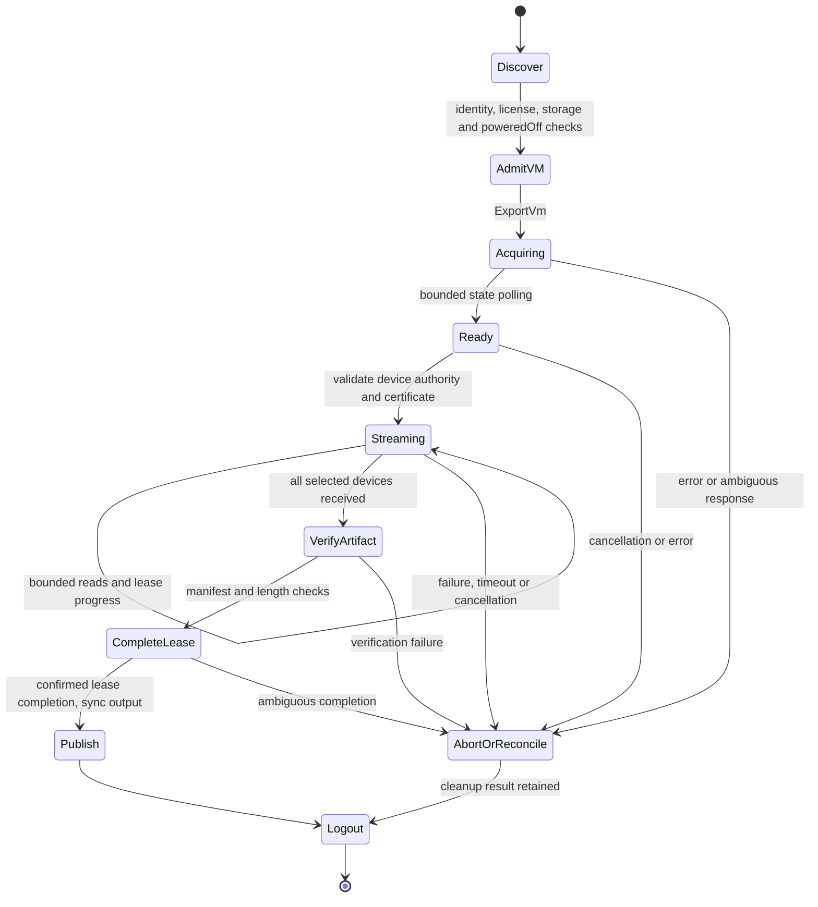

# Independent VMware access: V0.1 feasibility and lab plan

V0.1 selects **powered-off HTTP NFC export as the first candidate workflow**.
This is a sequential VMDK-container export proof. Random guest-block access,
online backup, CBT, restore and VDDK transport compatibility remain separate gates.
The local Rust data plane is unchanged. V0.2 now qualifies the independent
[Rust session/inventory crate](../crates/rvvdk-vsphere/README.md), including live
error cleanup and [matched connection-policy measurements](benchmark-results/2026-10-01-v02/README.md).
The earlier SDK-free Python probe remains V0.1 evidence. This establishes discovery only; no disk bytes or export lease have
been acquired. V0 remains open until the Rust proof and failure/cleanup evidence pass.

## Observed lab, 2026-10-01

[Sanitized observations and timings](benchmark-results/2026-10-01-v01/README.md)
retain three complete inventory sessions; each logged out successfully.

| Item | Observation |
|---|---|
| Server | ESXi 8.0.3, build 24677879; HostAgent API 8.0.3.0 |
| License inventory | `esx.hypervisor.cpuPackageCoreLimited`; no expiration returned |
| License uncertainty | Deprecated `licensedEdition` empty; available-license inventory does not establish active assignment or export eligibility |
| Storage | One accessible VMFS datastore, version 6.82, about 1 TiB |
| Test VM candidates | Two Fedora guests; 30 GiB and 60 GiB disks |
| Current state | Both powered on; VMware Tools running; no snapshots reported |
| Disks | `VirtualDiskFlatVer2BackingInfo`, persistent, thick, no backing parent or encryption key reported |
| Export state | Both list ExportVm as disabled in their current state; this is not an isolated licensing test |
| Changes made | Session login/logout only; no guest power, snapshots, files, leases or licensing changed |

The host address, account/password, license keys, session cookies, VM names,
managed references and disk paths are omitted from versioned evidence. Certificate
pinning used the fingerprint observed on first contact; that is trust on first use,
not out-of-band certificate validation. The password and cookie were process-memory
only. The repository contains a parameterized probe, not a credential file.

The available-license result is consistent with the free Hypervisor installation.
Broadcom documents restricted management APIs and no VADP backup support for that
license. Therefore **successful login/inventory does not qualify export or snapshot
operations**. Do not automatically change the license or assume this installation
can later start an evaluation. Confirm exact media, entitlement and active features
when the Rust export proof is ready. [Free-license policy](https://knowledge.broadcom.com/external/article/399823/vmware-esxi-80-update-3e-now-available-a.html),
[API write restriction](https://knowledge.broadcom.com/external/article/325053/vcenter-server-installation-gets-stuck-a.html),
[LicenseManager semantics](https://developer.broadcom.com/xapis/vsphere-web-services-api/latest/vim.LicenseManager.html).

## Capability and workflow matrix

| Operation | Documented interface / prerequisites | Current evidence and decision |
|---|---|---|
| Discover and authenticate | SOAP `/sdk`, ServiceInstance, SessionManager; TLS and valid account | Passed in independent Rust (V0.2), with exact certificate pin and bounded session |
| Read inventory | PropertyCollector, object visibility/System.View | Passed in Rust for this lab account, including bounded failure/Logout; least-privilege role still unqualified |
| Discover active license | QueryAssignedLicenses when assignment manager is available; account visibility | Available-license metadata read only; active assignment/evaluation expiry still needs confirmation |
| Shut down selected guest | ShutdownGuest; VirtualMachine.Interact.PowerOff; running Tools | Tools running; no call made. Select only one VM when shutdown is necessary |
| Export powered-off VM | ExportVm, VApp.Export, powered-off VM, eligible licensing | First candidate; method and data access not exercised |
| Maintain/release export | HttpNfcLease state, progress, complete/abort | Design only; test normal, cancellation, timeout and cleanup failure paths |
| Package export | Lease device URLs, optional OVF descriptor and manifest | Treat contents as VMDK containers; no random-read guarantee |
| Online snapshot export | CreateSnapshotEx_Task + ExportSnapshot; snapshot/export/remove privileges and eligible licensing | Later phase; snapshot consistency and owned-resource cleanup need their own proof |
| Random guest-block reads / CBT | Separate transport and consistency contracts | Unproven; ordinary NBD interoperability is not VMware NBDSSL/NFC compatibility |
| vCenter-managed access | vCenter inventory/session/permissions and selected host data endpoints | Later lab; vCenter is not required for the first direct-host proof |
| Restore/import | Import lease, writes, ownership and recovery | Out of initial scope |

The [SessionManager API](https://developer.broadcom.com/xapis/vsphere-web-services-api/latest/vim.SessionManager.html)
and [PropertyCollector API](https://developer.broadcom.com/xapis/vsphere-web-services-api/latest/vmodl.query.PropertyCollector.html)
define session and one-time discovery operations. License assignment lookup is
specified by [LicenseAssignmentManager](https://developer.broadcom.com/xapis/vsphere-web-services-api/latest/vim.LicenseAssignmentManager.html).
[VirtualMachine operations](https://developer.broadcom.com/xapis/vsphere-web-services-api/latest/vim.VirtualMachine.html)
define shutdown, power-state/export requirements and privileges. A guest shutdown
request returns before shutdown finishes, so a future caller must observe poweredOff.
[Snapshot operations](https://developer.broadcom.com/xapis/vsphere-web-services-api/latest/vim.vm.Snapshot.html)
provide an export alternative for a snapshot, which is not selected for the first proof.

The [VDDK advanced transport documentation](https://developer.broadcom.com/xapis/virtual-disk-api/latest/vddkFunctions.6.11.html)
describes library APIs and transports, including NFC/NBDSSL. It does not establish
that implementing the generic NBD protocol supplies the required VMware session,
ticket, snapshot or wire semantics. **Design inference:** start with a documented
export API, while retaining independent random-block transport research as open.
No VDDK FFI, VMware SDK implementation or producer implementation is incorporated.

## Data representation is a separate gate

Broadcom describes OVF/OVA export VMDKs as compressed, stream-optimized containers.
Expect a transformation rather than a copy of the host's flat backing file, and
inspect actual headers/content types during the proof. Source backing capacity,
HTTP bytes, exported container size and decoded logical bytes are different counters.
[Export representation](https://knowledge.broadcom.com/external/article/412923/vmdk-file-in-ovfova-appear-smaller-than.html),
[export performance factors](https://knowledge.broadcom.com/external/article/389737/understanding-the-factors-that-affect-th.html).

Current rvddk supports clean version-1 hosted sparse and documented FLAT/ZERO
layouts; compressed streamOptimized, VMFS sparse and seSparse remain unsupported.
An API backing type alone does not admit a container into that parser. Do not wire
an HTTP export stream into `BlockDevice::read_at` or claim RAW output yet.

The first Rust proof may produce a verified export artifact and use an independent
reference decoder solely for lab validation. Production logical conversion must
wait for a separately specified, bounded Rust streamOptimized decoder. No automatic
SDK/QEMU production fallback is authorized by this design. If disk decoding fails,
retain the bytes and diagnostics without declaring the migration successful.

## Rust implementation boundaries

V0.2 adds the `rvvdk-vsphere` control-plane crate, keeping network dependencies
out of portable `rvvdk-core`, the local format parsers and the DataMover. Start with
an internal qualification example, then define a user-facing command only after
contracts stabilize. Pinned reqwest/Rustls/roxmltree/Tokio dependencies supply
infrastructure; they are not VMware SDKs. The Python discovery probe is a
retained V0.1 qualification artifact, not a production dependency. Subsequent
VMware implementation and live qualification move to Rust; Python may continue
to generate benchmark plots.

| Component | Responsibility |
|---|---|
| `ConnectionPolicy` | Exact endpoint authority, CA or explicit fingerprint trust, bounded timeouts, no implicit redirect/proxy or cross-host credential forwarding |
| `SoapSession` | Escaped requests, typed method allowlist and bounded response parsing; secret-safe errors; cookie in memory; explicit logout result |
| `Inventory` | API-version admission, typed object references, explicit property paths, bounded pagination/object counts, stable selected VM identity |
| `ExportLease` | Own only the lease created by this invocation; typed state transitions, progress deadline, explicit complete/abort and observable cleanup errors |
| `ExportStream` | Sequential HTTPS response, fixed buffer/backpressure, incremental digest, output admission and progress; no fake seek or logical-block API |
| `ArtifactWriter` | Private files, bounded total bytes/disk-space preflight, sync, verified manifest and no-replace publication |

For the Rust foundation, target SOAP API 8.0 against the observed HostAgent 8.0.3.0;
reject unsupported server families/versions explicitly until qualified. Set proposed
initial limits of 2 MiB control responses, 128 inventory objects, bounded XML depth/
text and 16 disks per selected VM. Separate connect, inactivity and whole-operation
deadlines. Reuse authenticated HTTPS connections where appropriate; the discovery
probe's fresh TLS per request is deliberately not a production performance model.

Plan one sequential data stream with a reusable 1 MiB buffer initially. Make byte
limits and disk-space requirements explicit before acquisition, including a chosen
upper bound for unexpected stream growth. Keep metadata, XML and payload budgets
separate. Measure before introducing multiple streams, retries or async pipelines.
On an ambiguous lease acquisition, do not blindly repeat a resource-creating call.
Record uncertainty and recover the owned task/session or wait for confirmed expiry.

## Lease, TLS and cleanup design

The [lease API](https://developer.broadcom.com/xapis/vsphere-web-services-api/latest/vim.HttpNfcLease.html)
blocks conflicting VM operations while held and requires progress renewal.
Its ready-state [information](https://developer.broadcom.com/xapis/vsphere-web-services-api/latest/vim.HttpNfcLease.Info.html)
provides a timeout and device URLs. Complete only after successful transfer;
abort on cancellation/failure and confirm release. Our design keeps primary and
cleanup errors separate and refuses a success report when cleanup is uncertain.
A process crash needs explicit recovery/expiry evidence; Rust Drop alone cannot
prove remote cleanup.

[Device URL rules](https://developer.broadcom.com/xapis/vsphere-web-services-api/latest/vim.HttpNfcLease.DeviceUrl.html)
permit a wildcard host and report a TLS thumbprint. Substitute wildcard authority
only with the admitted connection host. Reject unexpected authorities, schemes
and redirects. Validate the data endpoint's certificate independently; do not
forward an API password to it. ESXi 8 proof must not depend on the newer 9.0-only
PEM-certificate field. Treat URL tickets, cookies and full URLs as credentials.

If a [lease manifest](https://developer.broadcom.com/xapis/vsphere-web-services-api/latest/vim.HttpNfcLease.ManifestEntry.html)
is available, verify its declared checksum algorithm rather than assuming SHA-256.
Always compute a local SHA-256 for provenance. Server checksums and identical
export hashes alone are not an independent logical-byte oracle; use known guest
content/reference decoding for the byte-equivalence gate.

## Disposable-lab acceptance checklist

### V0.2 — Rust session and discovery foundation

- [x] Build typed, bounded session/inventory APIs with no VMware SDK dependency.
- [x] Unit-test XML escaping/limits, SOAP faults, redacted errors, authority/pin mismatch,
  forbidden redirects, response truncation, pagination bounds and cleanup failures.
- [x] Match this lab's version, inventory, backing and power-state observations in Rust.
- [x] Confirm active license/capabilities or record explicit unresolved status.
- [x] Exercise a local mocked authentication failure; avoid repeated bad-password
  attempts against the real host. Demonstrate logout on normal and failed discovery.
- [x] Record control-plane request counts, timings and memory separately from copy benchmarks.

Completed with [V0.2 evidence](benchmark-results/2026-10-01-v02/README.md).
Active license assignment remains explicitly unresolved; available-license metadata
is not export permission. No trial or VM power change was needed.

### V0.3 — Powered-off export and cleanup proof

- [ ] Resolve licensing with supported evaluation/commercial access if needed. Request
  trial activation only when the executable proof and fixtures are ready; never bypass
  server checks or assume switching the free key starts a fresh evaluation.
- [ ] Choose the 30 GiB VM by stable private identity; recheck it immediately before
  any power operation. Keep the 60 GiB VM untouched. User authorized shutdown if needed.
- [ ] Put known deterministic files in the selected guest or agree a reference oracle.
  Gracefully shut down through Tools, observe poweredOff, and record the final state.
  Stop on shutdown failure; do not silently escalate to a hard power cut.
- [ ] Acquire one export lease, observe ready, renew within its advertised deadline,
  and download admitted disk URLs to private output with bounded buffers/bytes.
- [ ] Identify the actual VMDK format and compare decoded logical bytes/known guest
  content with an independent oracle. Retain format incompatibility as a visible gate.
- [ ] Test cancellation and an interrupted transfer; confirm abort/release and no
  published partial artifact. Simulate cleanup failure before provoking it remotely.
- [ ] Confirm successful completion releases the lease, then publish only complete
  verified artifacts. No owned snapshots exist in this first workflow.
- [ ] Report source VM state, logout, lease cleanup, input identities and independent
  validation. Preserve observations of the unselected VM and unchanged disk topology.
- [ ] Capture repeated transfer measurements with equal verification/sync boundaries,
  encoded versus logical byte counts, CPU, RSS, and storage/network conditions.

V0 passes for **export only** after V0.2 and V0.3 supply reproducible independent Rust
access, bytes and cleanup evidence. R6 can then integrate that workflow while
online backup/random-block access remains explicitly unproven. vCenter qualification
comes later. The historical QEMU partial second-extent producer discrepancy and
all prior performance follow-ups remain open.
